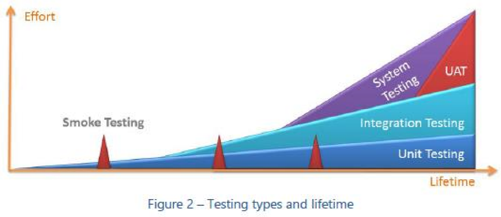
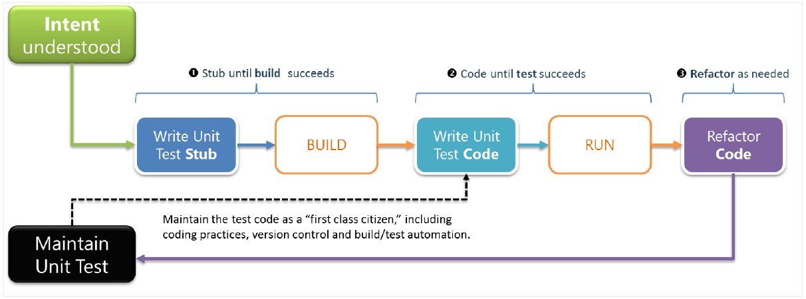

#Capítulo 1: Breve teoría sobre Testing Unitario

Traducción por Juan María Laó Ramos

    

Twitter: @juanlao

Linkedin: <http://es.linkedin.com/in/juanlao/>

Blog: <http://speakingin.net/>

Antes de entrar en los detalles técnicos de Microsoft Fakes, veremos un
poco de teoría para recordar cosas a los lectores experimentados y para
hacer que los nuevos aprendan las nociones básicas y necesarias sobre
Testing Unitario. Hay dos grandes corrientes de pensamiento entre los
que se dedican al Testing Unitario:

¿Debería o no debería cambiar el diseño del código existente para que
sea más testable?

La respuesta a esta pregunta tiene un impacto directo sobre cómo un
framework de aislamiento como Microsoft Fakes es usado por el equipo,
todo gira en cómo se aísla el código que se va a testear de sus
dependencias. Unos dicen que cambiar el diseño para que el código sea
más testable es bueno ya que ayuda a conseguir un diseño más desacoplado
y cohesivo. En este caso, se usan técnicas para sustituir clases
concretas para testear código heredado (legacy code) que no fue diseñado
para que fuese testable (en Microsoft Fakes esto se hace a través de
Shims). Otros dicen que los tests no deben comprometer el diseño. En
este caso, el código nuevo tiende a hacer uso de clases más concretas;
para testarlo se requieren técnicas especiales para sustituir las clases
concretas en los test unitarios.

La vertiente que elijas es cosa tuya y está fuera del alcance de esta
guía. Por lo tanto, no vamos a valorar ni recomendar ninguna de las dos.
Independientemente de tu elección, está generalmente aceptado que los
tests unitarios deben ser pequeños y rápidos.

Testing de software 
--------------------

El testing de software es el arte de medir y mantener la calidad del
software para asegurar que las expectativas y requerimientos del
usuario, el valor de negocio, los requisitos no funcionales como la
seguridad, confiabilidad y tolerancia a fallos, y las políticas
operacionales se cumplan. El testing es un esfuerzo del equipo para
conseguir un mínimo de calidad y tener una “definición de hecho”
entendida y aceptada por todos.

>NOTA Definición de hecho – es una definición del equipo y un compromiso de calidad que se aplicará a la solución en cada iteración (también se puede definir en el nivel de Tareas o de Historias de Usuario). Ten en cuenta el diseño, las revisiones de código, refactorización y testing cuando discutáis y defináis vuestra “definición de hecho”.
  
Estrategias de testing 
-----------------------

Las estrategias de testing se dividen tradicionalmente en testing de
caja negra, blanca y gris.

|  Estrategia   | Descripción|
| ------------- |---------------------|
|  Caja Negra   | El contenido de la caja (la implementación de la solución) es oscura. Los testers sólo se centran en la entrada y en la salida, normalmente cuando se realizan test de sistema o de aceptación de usuario.|
|  Caja Blanca  | El contenido de la caja es visible y se puede analizar como parte del testing.|
|  Caja Gris   |  Es una combinación de caja blanca y negra que se usa normalmente en casos especiales, en los que se requiere una comprensión de cómo funciona por dentro y cómo debe comportarse.|

Tipos de tests 
---------------

No hay una bala de plata cuando hablamos de testing (ver **Figura 2**).
Hay veces que se necesita de interacción humana y feedback, otras es
necesario automatizar la ejecución de estos test y otras hay que
ejecutarlos manualmente.

    

| Estrategia    |                  Descripción  |    Herramienta de Visual Studio|
|----------------|--------------|----------------------|
|  Test exploratorio    |           El tester imagina posibles escenarios que no se hayan cubierto por otros test. Es muy útil cuando se observa al usuario usando el sistema. NO hay test predefinidos|      Testing exploratorio con Microsoft Test Manager (MTM)|
|  Test de integración  |           Testear diferentes componentes de la solución trabajando como si fueran uno    |   Visual Studio Unit Test|
| Test de carga    |               Testear cómo se comporta el sistema con cargas de trabajo en un entorno controlado     |    Visual Studio Load Test Agent|
|Test de Regresión  |    Asegura que el sistema mantiene los mínimos de calidad después de hacer cambios como corregir bugs. Usa una  mezcla de tests unitarios y de sistema  |   Testing automático con MTM|
| Smoke Test    |    Se usa para testear una nueva característica o idea antes de subir al repositorio de código los cambios | |
|Test de sistema  |   Testea el sistema completo con características fijas y comprueba los requerimientos no funcionales    | Visual Studio Lab Management|
|  Test unitario  |   Un test de la unidad más pequeña de código (método, clase, etc.) que puede ser testeada de manera aislada del sistema. Ve[r *Verifying Code By Using Unit Test* y](http://msdn.microsoft.com/en-us/library/dd264975.aspx) *La delgada línea entre buen y mal test unitario* en esta guía para más información  | Visual Studio Test Explorer.  Frameworks de test unitarios|
 | Test de aceptación de usuario   |Cuando se acerca el final de los ciclos del producto, se invita a los usuarios a que realicen test de aceptación en escenarios reales, normalmente basados en casos de tests |   Test automático con MTM|
  
La delgada línea entre buen y mal test unitario 
------------------------------------------------

En lugar de centrarnos en los defectos de los test unitarios, hemos
decidido presentar una lista muy concisa con los puntos clave que te
ayudarán a diseñar, desarrollar e implementar buenos test unitarios.

AVISO

>Advertencia: El testeo unitario se basa en pequeñas porciones de código, de manera que sólo usando test unitarios es probable que no se incremente la calidad del producto. Recomendamos su uso junto a otras técnicas de tests descritas en esta guía. En otras palabras, los test unitarios no son una bala de plata, pero es un ingrediente muy importante en una estrategia de test completa.

Porqué son importantes los test unitarios 
------------------------------------------

Cuando alguien pregunta por qué son importantes los tests unitarios, le
solemos preguntar si creen que es importante que un avión comercial que
usan habitualmente para cruzar océanos sea testeado meticulosamente
antes de cada vuelo. ¿Es importante que el avión sea testeado? Si, ok,
ahora, ¿es importante que el altímetro sea testeado aparte? Por
supuesto. Eso es el test unitario… testear el altímetro. No garantiza
que el avión vaya a volar, pero no puede volar de forma segura sin él.

La importancia de los test unitarios, empieza con el proyecto y continúa
durante todo el ciclo de vida de la aplicación, también depende de si
estamos buscando:

- Código de calidad desde el principio

- Menos bugs

- Código auto explicativo

- Reducir el coste de corregir errores encontrándolos lo antes posible

- Sentido de responsabilidad del código, estar orgullosos de nuestro
código

NOTA

  
>El valor principal del desarrollo guiado por test y de los test unitarios es asegurarse de que el equipo piensa e incluso sueña con el código, estudia los requerimientos, y evitan posibles problemas proactivamente. 
 Automatiza tus tests: 
 Plantéate automatizar tus test. Esto te permitirá testear rápida y automáticamente cambios de código incluso a medida que se escribe. Sin embargo, la automatización de los tests tiene sus desafíos y te recomendamos que investigues sobre el tema ([*http://blogs.msdn.com/b/steverowe/archive/2008/02/26/when-to-test-manually-and*http://blogs.msdn.com/b/steverowe/archive/2008/02/26/when-to-test-manually-and-when-to-automate.aspx*when-to-automate.aspx*)](http://blogs.msdn.com/b/steverowe/archive/2008/02/26/when-to-test-manually-and-when-to-automate.aspx)

Define un paradigma de desarrollo guiado por tests unitarios 
-------------------------------------------------------------

Recomendamos una estrategia de tests unitarios conocida como **RED**
(fallo) – **GREEN (éxito),** es especialmente útil en equipos de
desarrollo ágil.

Una vez que entendamos la lógica y la intención de un test unitario, hay
que seguir estos pasos:

    

Escribe el código del test (**Stub**) para que compile (pase de **RED**
a **GREEN**)

1. Inicialmente la compilación fallará **RED** debido a que falta código

2.  Implementa sólo el código necesario para que compile **GREEN** (aún no hay implementación real).

Escribe el código del test para que se **ejecute** (pase de **RED** a
**GREEN**)

1. Inicialmente el test fallará **RED** ya que no existe funcionalidad.

2.  Implementa la funcionalidad que va a probar el test hasta que se ejecute adecuadamente **GREEN.**
 

**Refactoriza** el test y el código una vez que este todo **GREEN** y la
solución vaya evolucionando.

NOTA

>Echad un vistazo a Guidelines for Test-Driven Development([*http://msdn.microsoft.com/en*http://msdn.microsoft.com/en-us/library/aa730844(v=vs.80).aspx*us/library/aa730844(v=vs.80).aspx*)](http://msdn.microsoft.com/en-us/library/aa730844(v=vs.80).aspx) y Testing for Countinous Delivery with Visual Studio [(*http://msdn.microsoft.com/en-us/library/jj159345.aspx*)](http://msdn.microsoft.com/en-us/library/jj159345.aspx) para conocer más buenas prácticas a la hora de escribir tests unitarios
  
Checklist de un test unitario 
------------------------------

|  Check     |  Descripción     |    Check|
|------------|------------------|---------|
|  Convención de nombres descriptivos    |        Establece una convención de nombres descriptivos como ClassName\_Purpose\_ExpectedResult, consiguiendo un estilo de tests consistente y con una intención clara. Ejemplos:       Credentials\_UserNameLength\_Succeed()  Credentials\_UserNameLength\_Fail()  |  |  
|  Documenta los tests   |    Los test unitarios prueban y validan características de negocio. El propio código es una documentación viva del sistema. Recomendamos el uso combinado de código conciso y documentación mínima, para conseguir un test unitario entendible, mantenible y autodescriptivo.        |             |
| Errores y aserciones descriptivas   |          Usa mensajes descriptivos para mejorar la **lectura del código** y el log de compilación.  Ejemplos: Content submission failed due to too many spelling errors. |      |              
|  Adopta el desarrollo contra interfaces   |     **La interfaz define el contrato**, permitiendo el uso de stubs y tests de caja negra.  |       |
| Mantenlo simple    |     El test unitario debe ser tan simple, limpio y conciso como sea posible. Los **tests simples son un valor añadido**, si no, se ignorarán y no se mantendrán |          |
|  Mantenlo centrado   |  Un test unitario está **centrado** en la **mínima unidad de código (método, clase, etc.)** que puede ser probada de manera aislada, no a nivel de sistema o de integración. Para mantener un test y su infraestructura asociada centrada, evita probar cosas entre los diferentes niveles de aplicación o de sistema.    |       |
|Tiene una sola aserción lógica |     Cada test debe tener **sólo una aserción** lógica. Debe validar el test, como se indica en su nombre. Una aserción lógica puede contener una o varias sentencias de assert.  |               | 
|Organiza y mantén los tests    |               El código debe ser organizado y mantenido como si fuese una clase de primer nivel, al igual que el resto de la solución. Su código debe basarse en los mismos requisitos de buenas prácticas, calidad y estilo de código de la compañía. |           |
| Testea los casos buenos, malos y los límite  | El test unitario debe cubrir todos los posibles escenarios y busca siempre una amplia cobertura de código. Testear los casos límites y las excepciones es responsabilidad del testador, ¡no del usuario final! |                          | 

-----------------------

La información contenida en este documento representa la visión
Microsoft Corporation sobre los asuntos analizados a la fecha de
publicación. Dado que Microsoft debe responder a las condiciones
cambiantes del mercado, no debe interpretarse como un compromiso por
parte de Microsoft, y Microsoft no puede garantizar la exactitud de la
información presentada después de la fecha de publicación.

Este documento es sólo para fines informativos. MICROSOFT NO OFRECE
NINGUNA GARANTÍA, EXPRESA, IMPLÍCITA O LEGAL, EN CUANTO A LA INFORMACIÓN
CONTENIDA EN ESTE DOCUMENTO.

Microsoft publica este documento bajo los términos de la licencia
Creative Commons Attribution 3.0 License. Todos los demás derechos están
reservados.

*© 2013 Microsoft Corporation. *

Microsoft, Active Directory, Excel, Internet Explorer, SQL Server,
Visual Studio, and Windows son marcas comerciales del grupo de compañías
de Microsoft.

Todas las demás marcas son propiedad de sus respectivos dueños

The information contained in this document represents the current view
of Microsoft Corporation on the issues discussed as of the date of
publication. Because Microsoft must respond to changing market
conditions, it should not be interpreted to be a commitment on the part
of Microsoft, and Microsoft cannot guarantee the accuracy of any
information presented after the date of publication.

This document is for informational purposes only. MICROSOFT MAKES NO
WARRANTIES, EXPRESS, IMPLIED OR STATUTORY, AS TO THE INFORMATION IN THIS
DOCUMENT.

Microsoft grants you a license to this document under the terms of the
Creative Commons Attribution 3.0 License**.** All other rights are
reserved.

*© 2013 Microsoft Corporation. *

Microsoft, Active Directory, Excel, Internet Explorer, SQL Server,
Visual Studio, and Windows are trademarks of the Microsoft group of
companies.

All other trademarks are property of their respective owners.

