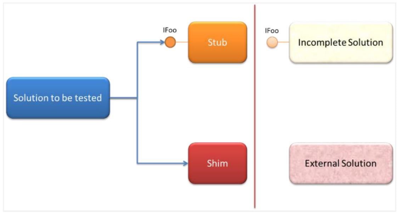
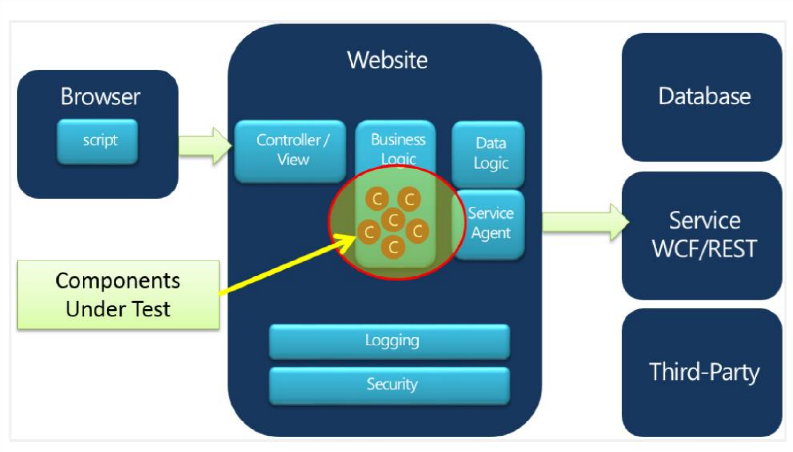
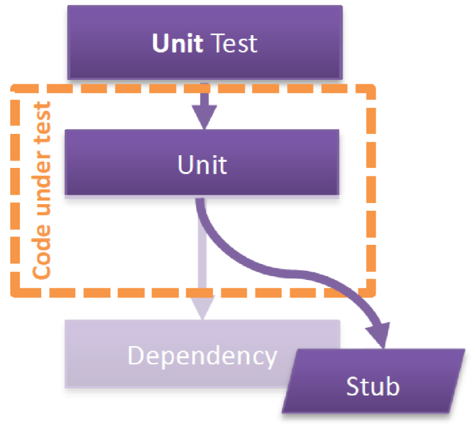
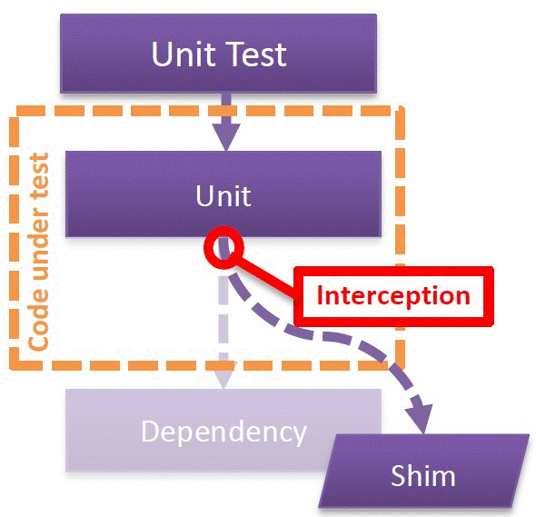

#Capítulo 2: Introducción a Microsoft Fakes

Traducción por Juan María Laó Ramos

    

Twitter: @juanlao

Linkedin: <http://es.linkedin.com/in/juanlao/>

Blog: <http://speakingin.net/>

Microsoft Fakes es un nuevo framework de aislamiento que nos permite
aislar el código a testear reemplazando otras partes de la aplicación
con stubs o shims. Nos permite testear partes de nuestra solución
incluso si otras partes de nuestra aplicación no han sido implementadas
o aún no funcionan.

Microsoft Fakes viene con dos sabores:

- **Stubs…** reemplaza una clase con un sustituto (“stub”) que implementa
la misma interfaz.

- **Shims…** modifica el código compilado en tiempo de ejecución, para
inyectar y ejecutar un sustituto (“shim”).

Como vemos en la figura, los **stubs** son usados normalmente para
llamadas en nuestro sistema que podemos desacoplar usando interfaces;
los **shims** se usan para llamadas a assemblies que no están bajo
nuestro control:

    

Stubs 
------

Vamos a ver más detenidamente a los Stubs para poder empezar a
integrarlo en nuestro ciclo de vida.

¿Qué testeamos? 
----------------

En la siguiente figura, tenemos un ejemplo típico de una aplicación en
N-capas. La complejidad de cualquier solución depende del nivel de
características que dicha solución ofrece, y para nuestro ejemplo, lo
vamos a simplificar. Vamos a centrarnos en el aislamiento – dentro de lo
razonable – de los componentes que forman la base de nuestro sistema:

    

Para el aislamiento, vamos a los componentes individuales que se
ejecutan en la capa de lógica de negocio (puede que tu terminología
varíe). Nuestra estrategia de testeo no es testear la lógica en la base
de datos, ni la lógica de los servicios WCF/Rest, ni el navegador, etc.

Test dobles 
------------

Los tests dobles nos permiten aislar el código bajo test de sus
dependencias. Juegan un papel muy importante en la evolución de la
calidad de nuestro código y aumenta su testabilidad. Los stubs, un tipo
de test doble, requieren que el código que se va a probar esté diseñado
de manera que permita separar y desacoplar dependencias.

Es importante diferenciar qué es un Stub de qué no lo es. El artículo de
Martin Fowler “Moks aren’t Stubs”
[(*http://martinfowler.com/articles/mocksArentStubs.html*)](http://martinfowler.com/articles/mocksArentStubs.html)
compara y contrasta los principios que hay debajo de los stubs y los
mocks. Como se entiende del artículo, un stub conserva un estado
estático que permite la verificación de estados
[(*http://xunitpatterns.com/State%20Verification.html*](http://xunitpatterns.com/State%20Verification.html)
) del sistema en prueba, mientras que un mock ofrece una verificación de
comportamiento
[(*http://xunitpatterns.com/Behavior%20Verification.html*)](http://xunitpatterns.com/Behavior%20Verification.html)
del sistema en prueba.

En esta sección, nos centraremos en los stubs y veremos el valor que
aportan a nuestro proceso de desarrollo. Podéis leer el artículo de
Martin Fowler para conocer más detalles de los principios y contrastar
las dos aproximaciones.

Con stubs, podemos aislar el código que se quiere probar junto a unos
casos de pruebas que validarán nuestro código de negocio – esto es,
objetos con un estado específico que podemos reproducir bajo unas
condiciones que podemos controlar y ejecutar. Es importante saber que
Microsoft Fakes no ofrece herramientas de verificación de estado como
otros frameworks de mocking como NMoq o Rhino Mocks.

¿Por qué usar Stubs? 
---------------------

Los procesos de desarrollo y pruebas que incorpora el testing unitario
junto al análisis de cobertura de código nos permite mitigar problemas
derivados de la falta de cobertura en otros escenarios de testing más
“integrados”. Una integración completa y tests de caja blanca pueden
dejar partes significantes del código sin probar, incrementando así las
posibilidades de introducir defectos funcionales.

Aumentando la cobertura de código 
----------------------------------

Con stubs identificamos condiciones específicas a nivel de unidad e
incorporamos este “estado” en un test o conjunto de test simples.
Incrementando así la cobertura de nuestro código. Los problemas y los
errores son detectados con los test de integración, errores de
producción, etc. Estas áreas son partes del código que no están
cubiertas por los test unitarios necesarios. En este punto, añadir stubs
que simulen estas condiciones o áreas de código, ayuda tanto a la
cobertura como a la calidad de la cobertura del sistema en test. Además,
estos stubs se convierten en parte de los test unitarios, con la idea de
“así no volverá a pasar”.

Durante el desarrollo guiado por pruebas (TDD), los problemas se suelen
detectar muy pronto, cuando se escriben los primeros tests (test de
sistema o aceptación, o incluso de producción). Los stubs hacen más
fácil crear test unitarios que aseguren la cobertura de ciertas
condiciones aislándolas de sus dependencias. Además, una buena
aproximación TDD es no escribir el cambio en el código funcional
inmediatamente. En lugar de ello, primero se escribe un test unitario
que sea capaz de reproducir el estado de los componentes aislados.
Primero se incluye dicho test que representa las condiciones de error.
El test falla, y luego es el desarrollador, no el tester, el que corrige
el defecto en el código funcional que hace que el test pase.

Aislamiento y granularidad 
---------------------------

Como vimos en la sección *¿Qué testeamos?*, el aislamiento nos permite
centrarnos en una parte del sistema que se está probando sin ninguna
dependencia externa. En el diagrama anterior, esto eran los componentes
de la capa de la Lógica de Negocio (BLL). El aislamiento reduce la
cantidad de código en el que el test se tiene que centrar. Esto reduce,
en muchos casos, el código necesario para configurar el test también.
Son necesarios también componentes o entornos aislados si queremos
desacoplarnos de estados físicos y condiciones especiales para
reproducir el error, por ejemplo, una base de datos con datos o un
archivo con datos de ejemplo.

Mejores componentes hacen mejores sistemas 
-------------------------------------------

El principio que se esconde detrás del aislamiento y los stubs en el
testing unitario está directamente relacionado con el desarrollo de
componentes. En muchas ocasiones, creamos aplicaciones y soluciones
dividiéndolas en componentes. A medida que descomponemos la solución en
partes más granulares, y si nos preocupamos en aumentar la calidad de
esas partes, podemos incrementar considerablemente la calidad de nuestro
sistema. Vamos a suponer que estamos de acuerdo en que si creamos algo
con componentes de poca calidad reducimos las posibilidades de conseguir
una solución de calidad; y el corolario de que si creamos algo con
componentes de calidad aumentamos las posibilidades de conseguir una
solución de calidad. Fijaos que hemos dicho “posibilidades”. Una
solución de éxito no implica que sus componentes sean buenos; lo que
estamos intentando decir es que podemos mitigar los riesgos de fallos
(que puede traducirse como mala calidad a ojos del cliente) aplicando
estas técnicas.

Shims 
------

Los Shims son una característica de Microsoft Fakes que permiten crear
tests unitarios para código que de otra manera no puede ser probado de
manera aislada. Al contrario que los Stubs, los Shims no requieren que
el código a testear sea diseñado de ninguna manera. Para poder usar
Stubs, tienen que ser inyectados^\*^ en el código que se prueba de
alguna manera, así las llamadas a las dependencias no las manejaran
componentes reales (código de producción), sino que será el Stub. De
esta manera, los valores y objetos de test se les pueden pasar al código
que se está probando:

Insert Caption

<!-- -->

    

Pero hay ocasiones en las que el código que se quiere probar no está
diseñado de manera que permita cambiar sus dependencias, por ejemplo,
cuando se llaman a métodos estáticos o cuando se basa en frameworks de
terceros. En estos casos, los Shims ofrecen la posibilidad de reemplazar
las dependencias interceptando las llamadas a las dependencias en tiempo
de ejecución desviándolas a un código especial con los valores de prueba
deseados para el test.

NOTA

>La técnica de Inyección de Dependencias (DI) se usa en la programación orientada a objetos para desacoplar clases de sus dependencias o al menos de la implementación concreta a través de interfaces. Esta técnica se puede usar para inyectar stubs para motivos de testing. Esta inyección se puede realizar a través de frameworks (como Spring.NET o Unity) o manualmente inyectando implementaciones concretas con clases. Por ejemplo, creando una instancia de la clase dependiente y pasarla como parámetro en el constructor de la clase que queremos testar (Inyección por Constructor). Para que la inyección por constructor funcione, el componente dependiente debe tener un constructor apropiado. Para una clase que oculte completamente sus dependencias, DI no funcionará y no se podrán inyectar stubs tampoco
  

    

Elegir entre un stub o un shim 
-------------------------------

Como ya hemos visto, los **Stubs** ofrecen implementaciones de
**interfaces** y clases, y son más efectivos cuando el código a probar
está diseñado pensando en tests. Los **Shims** también soportan aquellas
situaciones en las que el código dependiente, por ejemplo código
heredado o externo, no puede cambiarse ofreciendo una forma de
interceptar y desviar las llamadas consiguiendo que se ejecute el código
que queramos.

NOTA

>Cuando sea posible, usad **Stubs**. Vuestros tests se ejecutarán más rápido.
  

|  Objetivo / Consideración |Stub |Shim|
|  ------------------------------------ |--- |--------------|
|  ¿Buscas el mejor rendimiento?| X |X(mas lento)|
| Métodos abstractos y virtuales|X| |
|  Interfaces| X | |
|  Tipos internos | X | X |
|  Métodos estáticos|  | X |
|  Tipos sellados |  |X |
|  Métodos privados|  | X |

Leed Isolating Code under Test with Microsoft
Fakes([*http://msdn.microsoft.com/en-us/library/hh549175.aspx*)](http://msdn.microsoft.com/en-us/library/hh549175.aspx)
en MSDN para más información.

-------------------------------

La información contenida en este documento representa la visión
Microsoft Corporation sobre los asuntos analizados a la fecha de
publicación. Dado que Microsoft debe responder a las condiciones
cambiantes del mercado, no debe interpretarse como un compromiso por
parte de Microsoft, y Microsoft no puede garantizar la exactitud de la
información presentada después de la fecha de publicación.

Este documento es sólo para fines informativos. MICROSOFT NO OFRECE
NINGUNA GARANTÍA, EXPRESA, IMPLÍCITA O LEGAL, EN CUANTO A LA INFORMACIÓN
CONTENIDA EN ESTE DOCUMENTO.

Microsoft publica este documento bajo los términos de la licencia
Creative Commons Attribution 3.0 License. Todos los demás derechos están
reservados.

*© 2013 Microsoft Corporation. *

Microsoft, Active Directory, Excel, Internet Explorer, SQL Server,
Visual Studio, and Windows son marcas comerciales del grupo de compañías
de Microsoft.

Todas las demás marcas son propiedad de sus respectivos dueños

--------------------------

The information contained in this document represents the current view
of Microsoft Corporation on the issues discussed as of the date of
publication. Because Microsoft must respond to changing market
conditions, it should not be interpreted to be a commitment on the part
of Microsoft, and Microsoft cannot guarantee the accuracy of any
information presented after the date of publication.

This document is for informational purposes only. MICROSOFT MAKES NO
WARRANTIES, EXPRESS, IMPLIED OR STATUTORY, AS TO THE INFORMATION IN THIS
DOCUMENT.

Microsoft grants you a license to this document under the terms of the
Creative Commons Attribution 3.0 License**.** All other rights are
reserved.

*© 2013 Microsoft Corporation. *

Microsoft, Active Directory, Excel, Internet Explorer, SQL Server,
Visual Studio, and Windows are trademarks of the Microsoft group of
companies.

All other trademarks are property of their respective owners.

