---
redirect_url: https://docs.microsoft.com/
title: Capítulo 4- FAQ Microsoft Fakes
description: Capítulo 4- FAQ Microsoft Fakes
author: MSCommunityPubService
ms.author: andygon
ms.date: 06/01/2016
ms.topic: article
ms.service: ALM
ms.prod: 
ms.technology:
ms.custom: CommunityDocs
---

#Capítulo 4: FAQ Microsoft Fakes


Traducción por Juan María Laó Ramos


    

Twitter: @juanlao

Linkedin: <http://es.linkedin.com/in/juanlao/>

Blog: <http://speakingin.net/>

En este capítulo, veremos algunas preguntas frecuentes, algunas creemos
que son avanzadas, - algunos casos extremos – aunque creemos que son lo
suficientemente importantes como para cubrirlos en esta guía.

Trabajando con .NET Framework 4 
--------------------------------

Sólo porque Microsoft Fakes sea una nueva característica no quiere decir
que esté restringido a .NET 4.5. Podemos usar Microsoft Fakes con
cualquier versión de .NET que sea soportada por Visual Studio 2012. Por
ejemplo, podemos usar los tipos Shims para hacer test de legacy code
escrito en .NET 2.0.

Adoptando Microsoft Fakes en un equipo 
---------------------------------------

Para ejecutar un test unitario o para compilar un proyecto que use
Microsoft Fakes se requiere una versión [*soportada*
d](http://www.microsoft.com/visualstudio/eng/products/compare)e Visual
Studio. Esto aplica tanto a otros desarrolladores que ejecuten sus test
como a cualquier agente de Team Foundation Build. Esto es así ya que
cuando se usa Microsoft Fakes se crea una referencia a la dll
*Microsoft.QualityTools.Testing.Fakes.dll*. Este archivo no se incluye
en las versiones de Visual Studio que no soportan Microsoft Fakes.

Si añadimos el assembly *Microsoft.QualityTools.Testing.Fakes.dll* a
nuestro propio proyecto y hacemos check in, los demás podrán compilarlo.
Sin embargo, se lanzará la excepción *NotSupportedException* si están
ejecutando una edición de Visual Studio que no soporte Microsoft Fakes.

Para evitar estas excepciones deberemos colocar a los test en una
categoría de test que no se ejecute cuando los desarrolladores o los
servidores de builds no estén ejecutando una versión adecuada de Visual
Studio. Por ejemplo:

``` C#
[TestCategory("FakesRequired"), TestMethod()] 
public void DebitTest()
{
}
```

Si optamos por no añadir la dll
*Microsoft.QualityTools.Testing.Fakes.dll* de manera local, podemos
aislar el uso de Fakes añadiéndolos a un proyecto a parte y compilar ese
proyecto sólo en con una configuración de build específica.

Es importante ver que si nuestros servidores de builds están ejecutando
una versión adecuada de Visual Studio debemos tener también Team
Foundation Server 2012 para que esos tests se ejecuten de la misma
manera en una build. Si estamos usando Team Foundation Server 2010,
tendremos que editar nuestra plantilla de build para que ejecute los
test que usen Fakes con *vstest.console.exe*. Si estamos usando la
versión RTM de Visual Studio 2012, tendremos que generar y publicar
nuestro archivo TRX. Visual Studio 2012 Update 1 incluye una
actualización de *vstest.console.exe* que soporta la publicación como
parte de la llamada.

¡No se pueden hacer fakes de todo! 
-----------------------------------

Por defecto, a la mayoría de las clases de System o no se les hacen
fakes o no se puede debido a decisiones de diseño. Las clases de System
se tratan de una forma especial ya que son usadas por el propio motor, y
conllevaría a un comportamiento impredecible. Por ejemplo, los
siguientes namespaces no están soportados en proyectos para .NET 4:

System.Globalization

System.IO

System.Security.Principal

System.Threading


No hay una lista definitiva de los tipos que no se soportan ya que
depende de las diferentes combinaciones posibles de versión del
Framework, del proyecto de test y de las versiones de .NET. La lista de
tipos no soportados será diferente entre alguien que esté creando un
proyecto para .NET 3.0 con el framework 3.5 instalado que otro que esté
creando un proyecto para .NET 3.0 con el framework 3.0 instalado.

>AVISO - Cuidado con hacer un fake de una llamada que use el motor. Puede derivar en comportamientos impredecibles

Podemos sobrescribir el comportamiento de algunas clases de System como
cualquier otro assembly confikgurando la generación de los tipos de stub
y filtrarlo en un archivo xml con la extensión .fakes:

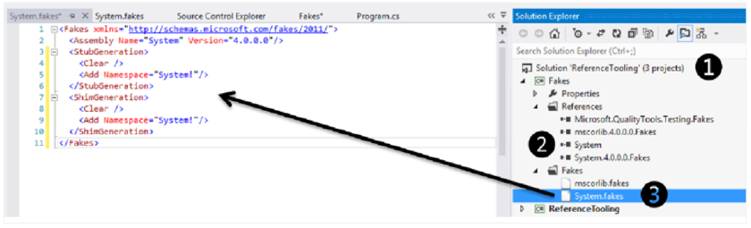
    

>NOTA - Para eliminar los tipos que Microsoft Fakes no soporta, como CancellationToken y CancellationTokenSource, tendremos que refactorizar nuestro código para cambiar las interfaces y las dependencias de los componentes que queramos testear. Cuando se haya hecho un fake de un tipo no soportado al compilar el .fakes se verá en el resultado de compilación como un Warning.

Pásate por [*Code generation, compilation, and naming conventions in
Microsoft Fakes*](http://msdn.microsoft.com/en-us/library/hh708916.aspx)
para más información

Logging detallado 
------------------

Debido a varias razones, Fakes puede decidir saltarse una clase cuando
genera los shims. Con Visual Studio 2012 Update 1, podemos obtener más
información sobre el porqué de esa decisión cambiando el atributo
Diagnostic de Fakes a true; esto hará que Fakes nos muestre las clases
que se ha saltado como warnings. Cuando Fakes decide saltarse un
elemento de un tipo, escribe mensajes de diagnóstico en el log de
MSBuild. Podemos habilitarlo seteando la propiedad *Verbosity* del
elemento .fakes e incrementar el nivel de detalle de MSBuild:

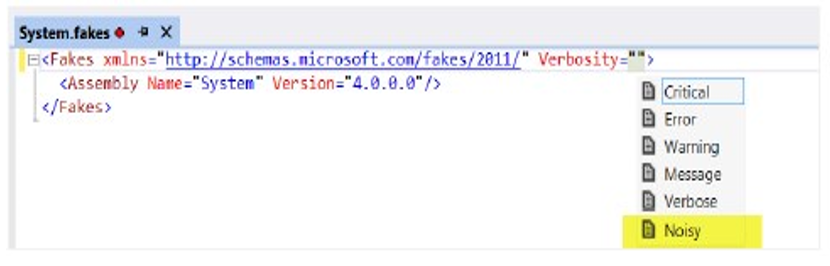
    

Trabajando con assemblies con strong names 
-------------------------------------------

Cuando generamos Fakes para assemblies con nombres fuertes (strong
names), el nombrado de los assemblies fakes los administra el propio
Framework por nosotros. Por defecto, el framework usará la misma clave
que para el assembly “shimeado”. Podemos especificar una clave pública
diferente para el assembly de Fakes, una que hayamos creado nosotros
para el assembly de Fakes, indicando el path completo al archivo .snk
que contiene la clave en la propiedad KeyFile en el elemento
Fakes\\Compilation del archivo .fakes:


``` XML
<Fakes xmlns="http://schemas.microsoft.com/fakes/2011/">
    <Assembly Name="ClassLibrary1" Version="1.0.0.0"/>
    <Compilation KeyFile="MyKeyFile.snk" />
</Fakes>
```

Si tenemos acceso al código del assembly al que estamos haciendo el
fake, podemos exponer los tipos internos usando la propiedad
*InternalsVisibleTo*. Cuando hacemos esto en un assembly con nombre
fuerte, tendremos que indicar el nombre y la clave pública tanto para el
assembly fake como para el assembly de test. Por ejemplo:

    [assembly: System.Runtime.CompilerServices.InternalsVisibleTo("SimpleLibrary.Test, PublicKey=002…8b")]
    [assembly: System.Runtime.CompilerServices.InternalsVisibleTo("SimpleLibrary.Fakes, PublicKey=002…8b")]

Fijaos que necesitaremos la clave pública y no el key token público del
assembly, que es lo que normalmente vemos. Para obtener la clave pública
de un assembly firmado, necesitaremos la herramienta “sn.exe” que está
incluida en Visual Studio. Por ejemplo:


    C:\sn -Tp ClassLibrary1.Fakes.dll
    Microsoft (R) .NET Framework Strong Name Utility Version 4.0.30319.17929
    Copyright (c) Microsoft Corporation. All rights reserved.

    Public key (hash algorithm: sha1):
    0024000004800000940000000602000000240000525341310004000001000100172b76875201e1
    5855757bb1d6cbbf8e943367d5d94eb7f2b5e229e90677c649758c6a24186f6a0c79ba23f2221a
    6ae7139b8ae3a6e09cb1fde7ce90d1a303a325719c2033e4097fd1aa49bb6e25768fa37bee3954
    29883062ab47270f78828d2d2dbe00ae137604808713a28fce85dd7426fded78e1d1675ee3a1e8
    0cdcd3be

    Public key token is 28030c10971c279e

Para ello, el atributo *InternalsVisibleTo* debería ser:


    [assembly: InternalsVisibleTo("ClassLibrary1.Fakes,
    PublicKey=0024000004800000940000000602000000240000525341310004000001000100e92decb949446f688ab9f6973436c53
    5bf50acd1fd580495aae3f875aa4e4f663ca77908c63b7f0996977cb98fcfdb35e05aa2c842002703cad835473caac5ef14107e3a
    7fae01120a96558785f48319f66daabc862872b2c53f5ac11fa335c0165e202b4c011334c7bc8f4c4e570cf255190f4e3e2cbc913
    7ca57cb687947bc")]

Optimizando la generación de Fakes 
-----------------------------------

Por defecto, cuando añadimos un Fakes assembly, el framework de Fakes
crea un archivo XML que intenta generar Stubs y Shims, incluso genera
tipos que es posible que nunca usemos en nuestros tests unitarios y que
afectan negativamente a los tiempos de compilación.

Si tenemos un código base testable y no necesitamos Shims, desactívalos.
Si sólo necesitas que se incluya un subconjunto de las clases de tu
solución, identifícalos con el filtrado de Tipos. (Pasate por [*Code
generation,* *compilation, and naming conventions in Microsoft
Fakes*)](http://msdn.microsoft.com/en-us/library/hh708916.aspx).

>NOTA <br/>Antes de que indiques los filtros de tipo, pon siempre un <Clear/> <br/> Deshabilita la generación con un solo <Clear/> o con el atributo Disable=”true” en el elemento *StubGeneration* o <br/> *ShimGeneration*
 

En el siguiente código se desactiva el **ShimGeneration**, y genera
Stubs sólo para los tipos que contengan **Contoso.MainWeb.Repository**
en el nombre:


    <Fakes xmlns="http://schemas.microsoft.com/fakes/2011/">
        <Assembly Name=" Contoso.MainWeb"/>
        <StubGeneration>
            <Clear/>
            <Add Namespace="Contoso.MainWeb.Repository" />
        </StubGeneration>
        <ShimGeneration Disable="true"/>
    </Fakes>

Tenemos que saber que la generación restringida tiene un efecto en el
tiempo de compilación y que la mejor optimización que podemos hacer es
evitar la re-generación de los fakes. Si estás haciendo un fake de un
assembly que no suele cambiar deberías compilar los assemblies fakes una
sola vez en un proyecto a parte y añadir esos assemblies como
referencias al control de código. Y referenciar desde ahí tus proyectos
de test unitarios.

Mirando bajo las sábanas 
-------------------------

Vamos a ver qué ocurre si modificamos la configuración del archivo
.fakes. En el ejemplo vamos a hacer un fake de System.dll. Esta dll es
un candidato perfecto para generarlo una vez y añadirlo a nuestros
“assemblies referenciados” en el control de versiones, ya que no va a
cambiar. En este ejemplo, usamos ILSpy para desensamblar el assembly que
se ha generado y vamos a ver qué tipos se han generado:

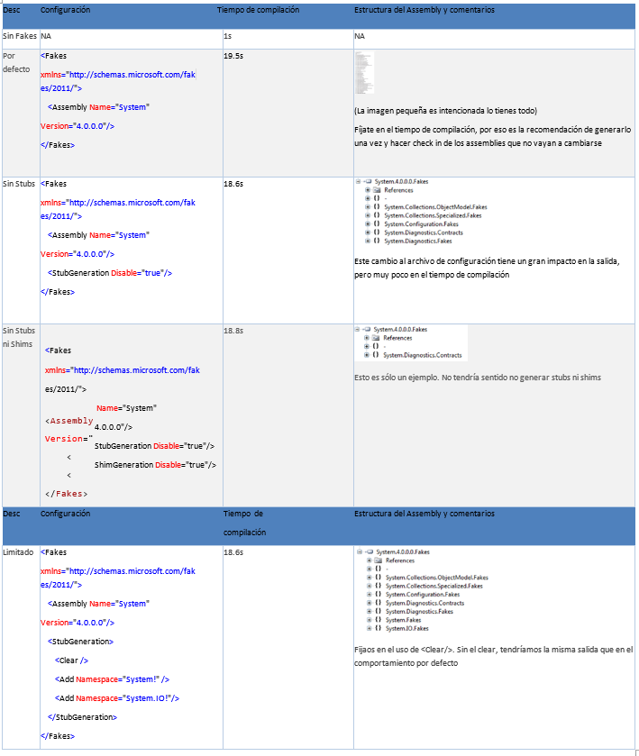
    

Refactorizando código bajo test 
--------------------------------

Las convenciones de nombrado usados en Microsoft Fakes puede hacer que
el refactoring del código que se testea sea algo parecido a una
aventura. Los prefijos de las clases Shim “Fakes.Shim” al nombre
original. Por ejemplo, si vamos a hacer un fake de la clase
System.DateTime, el Shim sería System.Fakes.ShimDateTime. El nombre de
una clase stub se deriva del nombre de la interfaz, con el prefijo
“Fakes.Stub”, y añadiéndole el nombre del tipo. El nombre del tipo stub
se deriva de los nombres del método y los parámetros.

Si refactorizamos el código bajo test, el test unitario que hemos
escrito usando Shims y Stubs de la versión generada con Fakes assemblies
no compilará. Ahora mismo, no hay una solución fácil a este problema a
parte de la de crear una expresión regular a medida para actualizar
nuestros test unitarios. Ten esto en cuenta cuando estimes cualquier
refactorización del código que ha sido testeado unitariamente. Puede
suponer un coste alto.

Eliminar Fakes de un proyecto 
------------------------------

Añadir y, especialmente, eliminar los Fakes de tu solución puede que no
sea trivial. Te pedimos que evalúes y hagas pruebas funcionales y
pruebas de concepto antes de introducir Fakes o cualquier otra
herramienta de este tipo. Para eliminar Fakes de tu proyecto, haz lo
siguiente:

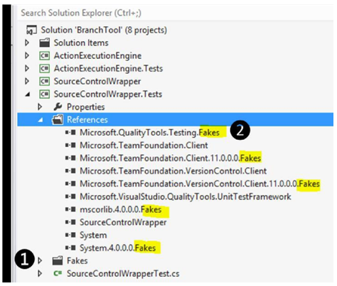
    

1. Borra el directorio **Fakes** y los archivos asociados de tu
    proyecto

2.  Borra las referencias a los assemblies **.Fakes** de tu proyecto
3.  Borra el directorio **FakesAssemblies** del directorio de tu proyecto.


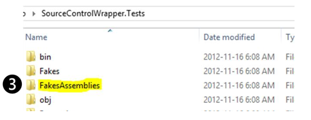
    


1. Edita manualmente el archivo de tu proyecto de test. Busca los warnings para eliminar los using que hacían referencia a los Fakes:


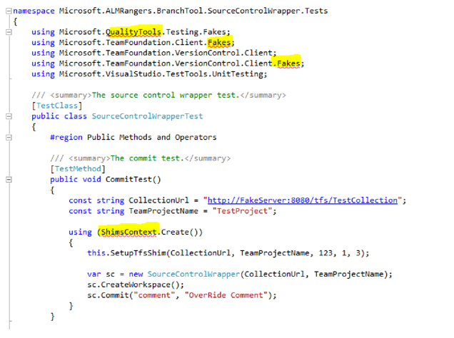
    

Uso de Fakes con el control de versiones de Team Foundation 
------------------------------------------------------------

Cuando añadimos Fakes, nos daremos cuenta de que se crean los
directorios **1 Fakes** y **2 FakesAssemblies**.

Contienen una serie de archivos de configuración y assemblies:

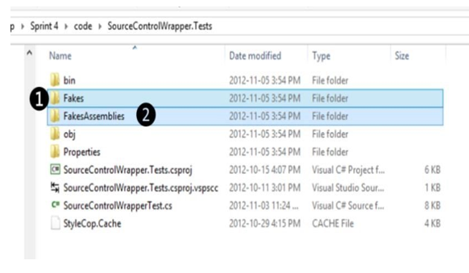
    

Team Explorer nos indica estos cambios cuando trabajamos en local:

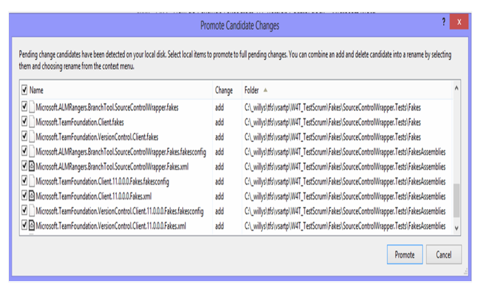
    

Los assemblies Fakes son auto-generados y están en el directorio
‘FakesAssemblies’ bajo el proyecto que los referencia. Estos archivos se
crean en cada compilación. Por lo que no deberían ser considerados como
elementos configurables ni deberían añadirse al control de código. Sin
embargo, los archivos de configuración de Fakes del tipo
‘assemblyName.fakes’ que se crean en el directorio ‘Fakes’ en el
proyecto **son** elementos configurables y deberían incluirse en el
control de código.

1\. Selecciona los cambios del directorio Fakes


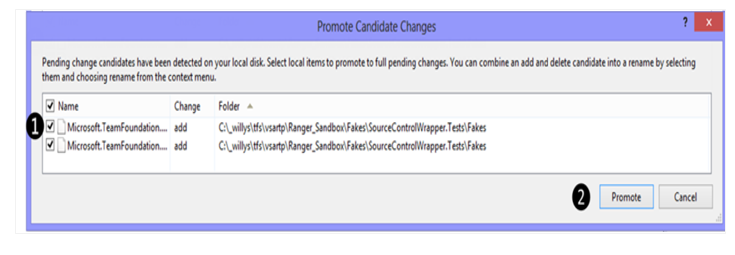
    

Excluir Fakes – usando Team Explorer 
-------------------------------------

Para excluir Fakes:

1. Selecciona los cambios del directorio Fakes y haz clic derecho. 


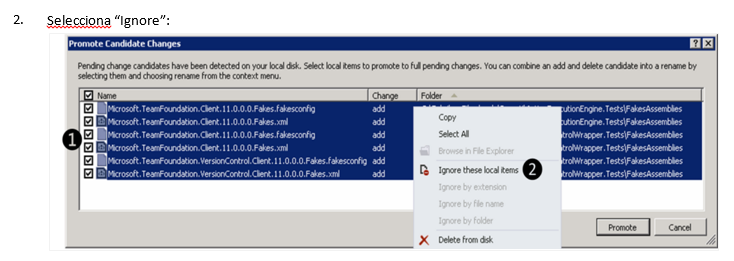
    

Otra forma sería seleccionar cada cambio de manera separada, lo que
permite más opciones para ignorarlo (como por extensión, nombre de
archivo o directorio).

Excluir Fakes – con .tfignore 
------------------------------

Con Team Explorer, estamos actualizando indirectamente el archivo
.tfignore, que nos asegura que los archivos que cumplan las reglas
definidas no se incluirán en el control de código:

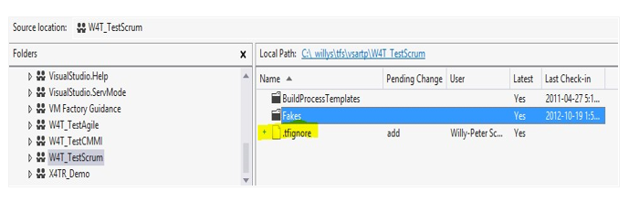
    

\# para indicar que una línea es un comentario.

Se soportan los caracteres especiales \* y ?

Una definición es recursiva a menos que se prefije con el carácter
\\

El símbolo de exclamación, !, niega una definición (los archivos que
cumplan el patrón NO son ignorados). El archivo .tfignore puede
editarse con cualquier editor e texto y debe añadirse al control
de código.


Podemos configurar qué tipos de archivos se ignorarán poniendo un
archivo llamado **.tfignore** en el directorio que queremos que se
apliquen las reglas. Los efectos del .tfignore son recursivos. Sin
embargo, podemos crear .tfignore en los subdirectorios para sobrescribir
los efectos de un .tfignore que haya en un directorio padre. -
[*http://msdn.microsoft.com/en-us/library/ms245454.aspx\#tfignore*
](http://msdn.microsoft.com/en-us/library/ms245454.aspx#tfignore)

Uso de Microsoft Fakes con ASP.NET MVC 
---------------------------------------

ASP.NET MVC se creó encima de ASP.NET, que tiene muchas clases muy
acopladas y algunas veces son difíciles de testear. Microsoft Fakes nos
puede ayudar a aislar el SUT (System Under Test) de los otros
componentes de ASP.NET MVC. La idea principal es centrarnos en testear
lo que realmente importa sin que las dependencias nos estorben.

Uso de Stubs con ASP.NET MVC 
-----------------------------

Con Microsoft Fakes, podemos aislar el controlador MVC de la aplicación
y testear sólo la funcionalidad que es parte del controlador. Para ello,
tenemos que inyectarle la dependencia al controlador, normalmente por el
constructor a través de interfaces:


``` C#

public class CustomersController : Controller

{   private readonly ICustomerRepository customerRepository;
    public CustomersController(ICustomerRepository customerRepository)
    {   this.customerRepository = customerRepository;
    }
    [HttpPost] public ActionResult Create(Customer customer)
    {   if (ModelState.IsValid)
        { this.customerRepository.InsertOrUpdate(customer);
        this.customerRepository.Save();
        return RedirectToAction("Index");
        } return this.View();
    }
}
```

Es posible crear stubs con Microsoft Fakes para aislar esa dependencia.
En el siguiente código vemos cómo crear un stub para inyectárselo al
constructor del controlador:

``` C#
[TestClass] public class CustomersControllerTest
{
    private StubICustomerRepository stubCustomerRepository;
    private CustomersController controller;

    [TestInitialize]
    public void SetupController()
    {
        stubCustomerRepository = new StubICustomerRepository();
        controller = new CustomersController(stubCustomerRepository);
    }

    [TestMethod]
    public void CreateInsertsCustomerAndSaves()
    {
        // arrange
        bool isInsertOrUpdateCalled = false;
        bool isSaveCalled = false;
        stubCustomerRepository.InsertOrUpdateCustomer = customer => isInsertOrUpdateCalled = true;
        stubCustomerRepository.Save = () => isSaveCalled = true;
        // act
        controller.Create(new Customer());
        // assert
        Assert.IsTrue(isInsertOrUpdateCalled);
        Assert.IsTrue(isSaveCalled);
    }
}
```

Usando Shims con ASP.NET MVC 
-----------------------------

Algunas veces no podemos inyectar interfaces o crear una nueva para
hacer que los tests sean más fáciles. Para ese escenario, podemos usar
Shims. Con Shims, podemos cambiar el comportamiento de un objeto,
configurando el resultado esperado en un método o propiedad. En este
código vemos cómo se puede hacer con shims:


``` C#
public class AccountController : Controller
{
    [HttpPost] public ActionResult Login(LogOnModel model, string returnUrl)
    {   if (ModelState.IsValid)
        {   if (Membership.ValidateUser(model.UserName, model.Password))
            {
                FormsAuthentication.SetAuthCookie(model.UserName, model.RememberMe);
                return Redirect(returnUrl);
            }
            ModelState.AddModelError("", "The user name or password incorrect.");
        } return View(model);
    } 
}
```

Para testear esta acción, tenemos que usar tipos Shim para aislar las
clases Membership y FormsAuthentication:

``` C#
[TestMethod] public void Login_with_valid_model_and_valid_user_authenticate_and_redirect()
    {
        // arrange var model=new LogOnModel{Password = "123", UserName = "usrtest", RememberMe = true};
        var returnUrl = "/home/index";
        bool isAuthenticationCalled = false;
        bool isValidateUserCalled = false;
        RedirectResult redirectResult;
        using (ShimsContext.Create())
        {
            ShimMembership.ValidateUserStringString = (usr, pwd) => isValidateUserCalled = true;
        ShimFormsAuthentication.SetAuthCookieStringBoolean = (username, rememberme) => 
            {
                Assert.AreEqual(model.UserName, username);
                Assert.AreEqual(model.RememberMe, rememberme);
                isAuthenticationCalled = true;
            };

            // act
            redirectResult = controller.Login(model, returnUrl) as RedirectResult;
        }

        // assert
        Assert.IsTrue(isValidateUserCalled, "Membership.ValidateUser not invoked");
        Assert.IsTrue(isAuthenticationCalled, "FormsAuthentication.SetAuthCookie not invoked");
        Assert.AreEqual(returnUrl, redirectResult.Url);
    }
```

-----------------

La información contenida en este documento representa la visión
Microsoft Corporation sobre los asuntos analizados a la fecha de
publicación. Dado que Microsoft debe responder a las condiciones
cambiantes del mercado, no debe interpretarse como un compromiso por
parte de Microsoft, y Microsoft no puede garantizar la exactitud de la
información presentada después de la fecha de publicación.

Este documento es sólo para fines informativos. MICROSOFT NO OFRECE
NINGUNA GARANTÍA, EXPRESA, IMPLÍCITA O LEGAL, EN CUANTO A LA INFORMACIÓN
CONTENIDA EN ESTE DOCUMENTO.

Microsoft publica este documento bajo los términos de la licencia
Creative Commons Attribution 3.0 License. Todos los demás derechos están
reservados.

*© 2013 Microsoft Corporation. *

Microsoft, Active Directory, Excel, Internet Explorer, SQL Server,
Visual Studio, and Windows son marcas comerciales del grupo de compañías
de Microsoft.

Todas las demás marcas son propiedad de sus respectivos dueños

---------------------

The information contained in this document represents the current view
of Microsoft Corporation on the issues discussed as of the date of
publication. Because Microsoft must respond to changing market
conditions, it should not be interpreted to be a commitment on the part
of Microsoft, and Microsoft cannot guarantee the accuracy of any
information presented after the date of publication.

This document is for informational purposes only. MICROSOFT MAKES NO
WARRANTIES, EXPRESS, IMPLIED OR STATUTORY, AS TO THE INFORMATION IN THIS
DOCUMENT.

Microsoft grants you a license to this document under the terms of the
Creative Commons Attribution 3.0 License**.** All other rights are
reserved.

*© 2013 Microsoft Corporation. *

Microsoft, Active Directory, Excel, Internet Explorer, SQL Server,
Visual Studio, and Windows are trademarks of the Microsoft group of
companies.

All other trademarks are property of their respective owners.


