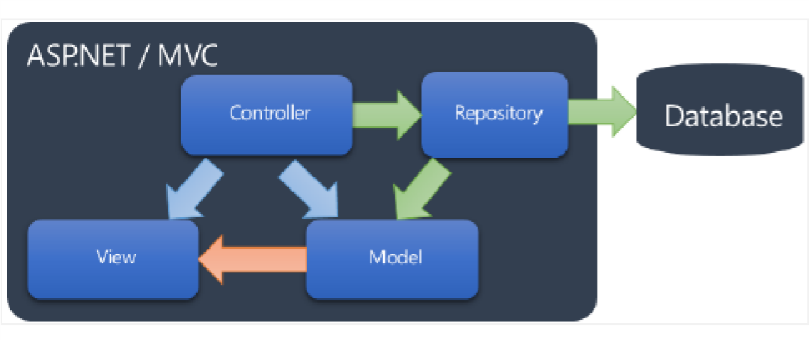
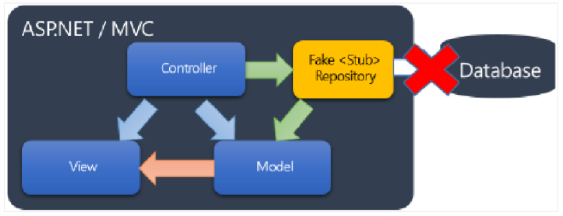
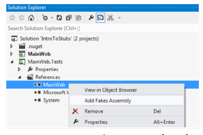
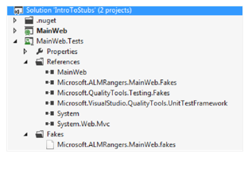

#Capítulo 6: Hands-on Lab 1


Traducción por Juan María Laó Ramos


    

Twitter: @juanlao

Linkedin: <http://es.linkedin.com/in/juanlao/>

Blog: <http://speakingin.net/>

Ejercicio 1: Usando Stubs para aislarnos del acceso a la base de datos (20 – 30 min)
------------------------------------------------------------------------------------

Dependencias del entorno

Patrón de implementación

Pasos a realizar

Paso 1 – Revisar la solución de inicio

Paso 2 – Prepara el proyecto de test para Microsoft Fakes Stubs

Paso 3 – Añade el assembly de Fake al proyecto de test

Paso 4 – Revisa y actualiza el archivo xml de Fakes

Paso 5 – Revisa las clases del modelo y del controlador del MainWeb

Paso 6 – Crear un método de test unitario

Paso 7 – Ordena el método y crea un Stub para la interfaz Repository

Paso 8 – Llama al método de acción del controlador y comprueba los
resultados

Paso 9 – Completar la implementación de la acción del controlador

Paso 10 – Ejectuar el test unitario


>NOTA - Pásate por la sección *Uso del código fuente, erratas y soporte* antes de comenzar este laboratorio.
  

Para este ejercicio vamos a usar una aplicación ASP.NET MVC 4 muy
simple. La solución IntroToStubs.sln en el directorio **Hands-on
Lab\\Excercies 1\\start** tenemos sólo la clase Controller. No contiene
vistas (está configurado para que use Razor), y, para este ejercicio, no
requeriremos ninguna vista. Nuestro trabajo consistirá en implementar un
aspecto funcional: Obtener un resumen de compra y un cálculo del precio
total de esa orden de compra.

Es importante ver que no hay definida ninguna base de datos, ni siquiera
necesitamos crearnos una para empezar a hacer tests unitarios y validar
nuestros componentes. Sin Stubs, la primera aproximación que tendríamos
se nos ocurriría sería:

1. Crear una base de datos de ejemplo

2.  Rellenarla con datos de ejemplo.

3.  Crear los test – añadiendo los datos de ejemplo que requieran
    para ejecutarse.


OBJETIVO

>  En este ejercicio, veremos cómo con Microsoft Fakes podemos aislar la dependencia existente entre la base de datos y nuestra clase controladora para testear la implementación funcional.
  

Dependencias del entorno 
-------------------------

¿Qué es lo que está mal en esta primera aproximación? Bueno, ¿qué pasa
si la base de datos es una base de datos relacional? Recordad, los test
unitarios tienen que ser pequeños y rápidos. Además, para que todo el
equipo de desarrollo pueda ejecutar estos test en sus máquinas habría
que hacer algo para que esa base de datos de ejemplo esté disponible
para ellos.

Otra cosa que agrava el problema es que los equipos de desarrollo
maduros usan Servidores de Builds (máquinas o instancias configuradas
con componentes conocidos, librerías, compiladores, scripts.) Estas
máquinas puede que no tengan acceso a todas las dependencias externas
–como una base de datos o un servicio web.

Las dependencias de los entornos pueden suponer un componente bloqueante
para el desarrollo. Esta es una de las razones por las que el
aislamiento, junto con lo de centrarnos en lo que queremos testear,
Microsoft Fakes aporta valor.

Patrón de implementación 
-------------------------

En la siguiente figura podemos ver la interacción normal entre varias
clases. Además, podemos ver que el acoplamiento entre el Repositorio y
la base de datos es lo que queremos aislar. Nuestra intención es centrar
nuestros test en la lógica de negocio que, para este ejemplo, estará en
los métodos Action de la clase Controller.


    

Cuando aislamos, desacoplamos nuestra implementación del repositorio con
la base de datos, al mismo tiempo, ofrecemos un estado conocido al test
y el comportamiento que se usará luego por los componentes que se
testan.

En la siguiente figura, se usa el **Fake Stub** en lugar del repositorio
real, y el código del propio test indicará cuáles son los valores
necesarios para testear:



>NOTA - El ejemplo es una solución común que aprovecha el constructor con parámetros de la clase Controller, junto al patrón Repository

Pasos a realizar 
-----------------

1. Añadir un assembly fake por cada assembly del que queramos un fake

2.  Revisar y ajustar la configuración de los archivos Fakes
    \[[*avanzado*\]](http://msdn.microsoft.com/en-us/library/hh708916.aspx)

3.  Ajustar los usings (C\#) o los Import (VB) a los namespaces de los
    Stubs necesarios.

4.  Añadir la implementación necesaria para los stubs en aquellas clases
    y métodos necesarios para los tests que se vayan a hacer.

5.  Dar el código para el Act del objeto o método que se va a testear.

6.  Poner los Assert necesarios con los datos esperados.


Paso 1 – Revisar la solución de inicio 
---------------------------------------

Primero, échale un vistazo a la solución con la que empezamos,
IntroToStubs.sln, que se compone de dos proyectos:

1. MainWeb – proyecto principal de MVC4

2.  MainWeb.Tests – Proyecto del tipo Microsoft Unit Testing


Aún no tenemos ninguna clase de test definida. En MainWeb, trabajaremos
con las siguientes clases:

1. Controller -&gt; OrderController

2.  Model -&gt; IOrderRepository

3.  Model -&gt; Order

4.  Model -&gt; OrderRepositoriy (implementación de IOrderRepository)


>NOTA - Para este ejemplo, **OrderRepository** representa la implementación concreta con la responsabilidad de obtener datos de una base de datos física; sin embargo, en este ejemplo, hemos dejado cada método como “Not Implemented” – ya que haremos Stubs para aquellas implementaciones que necesiten los tests.

Paso 2 – Prepara el proyecto de test para Microsoft Fakes Stubs 
----------------------------------------------------------------

Empezaremos configurando nuestro proyecto de tests.

1. Seleciona el proyecto **MainWeb.Tests** y hacemos **Add a Project
    Reference** a Main Web

2.  En este momento, nos aseguramos de que la solución compila. Pulsa F6
    para compilar la solución. Con esto el proyecto de test actualiza la
    referencia y todos los tipos del assembly **MainWeb** para cuando
    generemos el Fake.


Paso 3 – Añade el assembly de Fake al proyecto de test 
-------------------------------------------------------

1\. Ahora que el proyecto compila y que tenemos la referencia, podemos
    generar el assembly Fake para nuestro SUT (System Under Test) – que
    son las clases Controllers de **MainWeb.**

2\.  En el **Solution Explorer**, navega hasta el proyecto
    **MainWeb.Tests** y abre el nodo **References**. 3. Haz clic con el
    botón derecho en **MainWeb** y selecciona la opción **Add Fakes
    Assembly**

<!-- -->



<!-- -->

3\. En este punto, revisa el proyecto **MainWeb.Test** y la estructura
    de directorio con el Solution Explorer; deberías ver el siguiente
    nodo adicional **Fakes** añadido a la estructura del proyecto
    **MainWeb.Tests** con el nombre completo del assembly **MainWeb** y
    un “.**fakes”** como extensión de archivo:

<!-- -->


    

>NOTA - El framework de Fakes ha generado Stubs y Shims para nuestro Assembly y aquellos tipos están en el Microsoft.ALMRangers.MainWeb.Fakes.

Paso 4 – Revisa y actualiza el archivo xml de Fakes 
----------------------------------------------------

Vamos a ver un poco el archivo XML que ha sido generado cuando hemos
añadido el assembly de Fakes al proyecto de tests. El contenido es
escaso pero pronto lo cambiaremos un poco.

1\. Abre y revisa el archivo Microsoft.ALMRangers.MainWeb.fakes. Muestra
    el contenido por defecto:

``` XML
<Fakes xmlns="http://schemas.microsoft.com/fakes/2011/">
    <Assembly Name="Microsoft.ALMRangers.FakesGuide.MainWeb"/>
</Fakes>

```

2\. El Solution Explorer, selecciona el archivo
    Microsoft.ALMRangers.MainWeb.fakes y mira las propiedades (F4)
    del archivo. Verás que el **Build Action** es *Fakes.*

3\.  **Opcional:** Modifica el archivo generado de la siguiente manera
    para sólo crear Stubs (no Shims) y para filtrar los tipos que vamos
    a necesitar:

``` XML
<Fakes xmlns="http://schemas.microsoft.com/fakes/2011/">
    <Assembly Name="Microsoft.ALMRangers.FakesGuide.MainWeb"/>
    <StubGeneration>
    <Clear/>
    <Add Namespace="Microsoft.ALMRangers.FakesGuide.MainWeb.Models"
    />
    </StubGeneration>
    <ShimGeneration Disable="true"/>
</Fakes>
```
>NOTA - Estas opciones muestran cómo podemos adelgazar el assembly generado filtrando por tipos específicos. Cuando compilamos, el framework de Microsoft Fkes generará un assembly para nuestro proyecto basándose en estas opciones. Lo hacemos aquí para mostrar los valores reducidos que aparecen en el IntelliSense cuando estemos en el editor de código.


Paso 5 – Revisa las clases del modelo y del controlador del MainWeb 
--------------------------------------------------------------------

1\. Revisa las clases del modelo del directorio Model del proyecto
    **MainWeb**. Fijate que hemos usado una implementación *Testable*, en el
    que la clase **OrderController** usa una interfaz
    (**IOrderRepository)**; esta interfaz nos permite ofrecer tanto un stub
    del **IOrderRepository** al **OrderController** como un comportamiento
    específico a nuestras necesidades de testeo. Además de eso, hay algunas
    clases básicas que representan objetos de negocio que van a ser usados
    por los componentes de negocio durante los tests:


``` C\#
public interface IOrderRepository
{
    IQueryable <Order > All { get; }
    IQueryable <OrderLines > OrderLines(int id);
    Order Find(int id);
} 
public class Order
{ 
    public Order()
    { 
        this.OrderLines = new HashSet <OrderLines >();
    } 
    public int Id { get; set; } 
    public string CustomerName { get;
    set; } 
    public double TaxRate { get; set; }
    public ICollection <OrderLines > OrderLines { get; set; } 
}

public class OrderLines
{ 
    public int Id { get; set; } 
    public string ProductName { get;
    set; } 
    public double UnitCost { get; set; }
    public bool IsTaxable { get; set; }
    public int Quantity { get; set; }

} 

public class OrderSummaryViewModel
{
    public Order Order { get; set; }
    public List <OrderLines > OrderLines { get; set; } 
    public double Total { get; set; }
} 
public class OrderRepository : IOrderRepository
{ 
    public IQueryable <Order > All 
    {   get { throw new NotImplementedException(); }
    } 
    public IQueryable <OrderLines > OrderLines(int id)
    {   throw new NotImplementedException();
    } 
    public Order Find(int id)
    {   throw new NotImplementedException();
    }
}
```

Paso 6 – Crear un método de test unitario 
------------------------------------------

Ya estamos listos para crear nuestros tests unitarios. En este paso,
vamos a implementar un listado de artículos que simplemente resumirá la
cantidad total de la orden.

1. Crea una clase de Test. Selecciona el proyecto de test, en el menú
    **Project**, elige la opción **Add, Unit Test**

2.  En el Solution Explorer, renombra el archivo de la clase. Selecciona
    el archivo **OrderControllerTest.cs**, pulsa F2 y escribe
    **OrderControllerTests**. Esto nos preguntara si queremos renombrar
    también la clase. Elige **Si.**

3.  En el editor, renombra el **TestMethod1** a
    *OrderController\_orderSumaryTotalCheck\_equalSum()*

4.  La clase de test debería ser algo parecido a esto:

``` C#
using System; using Microsoft.VisualStudio.TestTools.UnitTesting;
namespace Microsoft.ALMRangers.MainWeb.Tests
{
    [TestClass] public class OrderControllerTests {
        [TestMethod] public void OrderController_orderSummaryTotalCheck_equalsSum()
        {
        }
    }
}
```

Paso 7 – Ordena el método y crea un Stub para la interfaz Repository 
---------------------------------------------------------------------

Ya estamos listos para escribir nuestro test unitario. Recuerda que
estamos testeando el método de acción **OrderController** en el
controlador y que estamos aislando la lógica del **OrderController** de
la implementación del repositorio. Haremos un Stub del repositorio.

1. Reemplaza los usings que tengamos con los siguientes:

``` C#
using System.Collections.Generic; using System.Linq;
using System.Web.Mvc;
using Microsoft.ALMRangers.FakesGuide.MainWeb.Controllers; 
using Microsoft.ALMRangers.FakesGuide.MainWeb.Models; 
using Microsoft.VisualStudio.TestTools.UnitTesting;
using ModelFakes = Microsoft.ALMRangers.FakesGuide.MainWeb.Models.Fakes;
```
Estos usings incluyen el namespace
**Microsoft.ALMRangers.MainWeb.Models.Fakes**. En él están los tipos
(stubs y shims) generados por el framework de Fakes durante la
compilación presentes en el assembly. En la compilación, el objetivo de
la generación son los assemblies y los namespaces. Hemos añadido un
alias para **ModelFakes** para que sea más fácil leer el código. No es
necesario hacerlo, podemos usar el namespace completo si queremos.

>NOTA - El alias del **using** anterior simplemente es para una lectura más sencilla del código, no es necesario hacerlo.
  

1. Crear una instancia de **IOrderRepository.** Se seteará a una
    implementación Stub que podremos definir en el contexto de este
    test:

``` C#
[TestMethod] public void OrderController_orderSummaryTotalCheck_equalsSum()
    {
        // arrange const int TestOrderId = 10;
        IOrderRepository repository = new ModelFakes.StubIOrderRepository
        {
        // lambda code
        }
```
De esta manera configuramos una instancia de **IOrderRepository** que
será un Stub (Fake). No el objeto real. Aquí es donde, a medida que
nuestro test lo necesite, deberemos ofrecer una implementación para
cualquier método que haga falta. La implementación del Stub, generada
por el framework de Microsoft Fakes es un tipo estándar de CLR – sin
ningún comportamiento. Ahí es nosotros tenemos que inyectar el código
necesario para nuestro test.

1\. En este punto, hemos inicializado la instancia para nuestro Stub del
    repositorio – pero aún no hemos terminado. Tenemos que implementar
    dos métodos del Stub ya que nos va a hacer falta para nuestro test.

2\. Añade el siguiente código, en el que hemos tenido que añadir una
    expresión lambda para definir el método
    **IOrderRepository.Find(int):**

``` C#
FindInt32 = id =>
{
    Order testOrder = new Order
    {
        Id = 1,
        CustomerName = "smith",
        TaxRate = 5
    }; 
    return testOrder;
}

>NOTA - El nombre de la propiedad del tipo **StubIOrderRepository** tiene la signatura de **FakesDelegates.Func&lt;int, Order&gt; FindInt32**. El framework de Microsoft Fakes nombra a cada método añadiendo el tipo del parámetro como parte del nombre. Asi que como el método Find de **IOrderRepository** tiene un parámetro del tipo Int32, el nombre del stub es FindInt32.


3\. Haz un método de generación de datos estático para que nuestro test
    lo use:
``` C#
private static IQueryable<OrderLines&> GetOrderLines()
{   var OrderLines = new List<OrderLines>
    {
        new OrderLines { Id = 10, IsTaxable = true, ProductName = "widget1", Quantity = 10, UnitCost = 10 }, new OrderLines { Id = 10, IsTaxable = false, ProductName = "widget2", Quantity = 20, UnitCost = 20 }, new OrderLines { Id = 10, IsTaxable = true, ProductName = "widget3", Quantity = 30, UnitCost = 30 }, new OrderLines { Id = 10, IsTaxable = false, ProductName = "widget4", Quantity = 40, UnitCost = 40 }, new OrderLines { Id = 10, IsTaxable = true, ProductName = "widget5", Quantity = 50, UnitCost = 50 },
    }; 
    return OrderLines.AsQueryable();
}
```

4\. Añade el siguiente código para tener un stub del método
    **IOrderRepository.OrderLines(int)**. Usa el método estático
    **GetOrderLines**
``` C#
OrderLinesInt32 = id =>
    {   var OrderLines = GetOrderLines();
        return OrderLines.AsQueryable();
    }
```

5\. Justo después del “}” añade el siguiente código para crear la
    instancia del **OrderController** usando el constructor con
    parámetros:

``` C#
var controller = new OrderController(repository);
```

>NOTA - La testabilidad de la solución y sus componentes influyen a la hora de elegir Stubs o Shims. Nuestro ejemplo funciona bien con Stubs ya que usa interfaces. Las interfaces nos permiten inyectar objetos concretos diferentes para nuestros test, son nuestros Fakes. Las implementaciones testables usan interfaces, clases abstractas, y miembros virtuales que permiten la generación de Stubs con el framwork de Microsoft Fakes.<br/>Lee el ejercicio de Shims para testear lo “intesteable”.
  


Paso 8 – Llama al método de acción del controlador y comprueba los resultados 
------------------------------------------------------------------------------

1. Añade el siguiente código para completar el método
**OrderController\_orderSummaryTotalCheck\_equalSum:**

``` C#
// act var result = controller.OrderLines(TestOrderId) as ViewResult; var data = result.Model as OrderSummaryViewModel;

// assert
Assert.AreEqual(5675, data.Total, "Order summary total not correct");
```

Aquí tenéis el código completo del test
OrderController\_orerSummaryTotalCheck\_equalsSum:


``` C#
[TestMethod] public void OrderController_orderSummaryTotalCheck_equalsSum()
{
    // arrange const int TestOrderId = 10;
    IOrderRepository repository = new ModelFakes.StubIOrderRepository
    {
        FindInt32 = id = >
        {
            Order testOrder = new Order
            {
            Id = 1,
            CustomerName = "smith",
            TaxRate = 5
            };
            return testOrder;
        },
        OrderLinesInt32 = id = >
        {   var OrderLines = GetOrderLines();
            return OrderLines.AsQueryable();
        }
    }; 
    var controller = new OrderController(repository);

    // act var result = controller.OrderLines(TestOrderId) as ViewResult; var data = result.Model as OrderSummaryViewModel;

    // assert
    Assert.AreEqual(5675, data.Total, "Order summary total not correct");
}

private static IQueryable <OrderLines > GetOrderLines()

{   var orderLines = new List <OrderLines > { new OrderLines { Id = 10, IsTaxable = true, ProductName = "widget1", Quantity = 10, UnitCost = 10 }, new OrderLines { Id = 10, IsTaxable = false, ProductName =
    "widget2", Quantity = 20, UnitCost = 20 }, new OrderLines { Id = 10, IsTaxable = true, ProductName = "widget3", Quantity = 30, UnitCost = 30 }, new OrderLines { Id = 10, IsTaxable = false, ProductName = "widget4", Quantity = 40, UnitCost = 40 }, new OrderLines { Id = 10, IsTaxable = true, ProductName = "widget5", Quantity = 50, UnitCost = 50 },
    }; 
    return orderLines.AsQueryable();
}
```
>NOTA - En este punto, ya podemos ejecutar el test desde el Test Explorer y veremos que falla. La próxima tarea es modificar la lógica del método para hacer que funcione.
  

Paso 9 – Completar la implementación de la acción del controlador 
------------------------------------------------------------------

1. Añade el siguiente using a la clase OrderController: using
    System.Linq;

2.  Podemos copiar este código en el método de acción OrderLines del
    controlador:

``` C#
public ActionResult OrderLines(int id)
{
    // locate the order by ID via repository 
    var order = this.repository.Find(id);
    // get the corresponding orderlines 
    var orderLines = this.repository.OrderLines(order.Id);
    // initialize the calculation values 
    double total = 0d; 
    double taxRate = order.TaxRate / 100; 
    double taxMultiplier = 1 + taxRate;

    // run through the list and just summarize conditionally if taxable or not 
    foreach (var lineItem in orderLines)
    { if (lineItem.IsTaxable)
        { total += lineItem.Quantity * lineItem.UnitCost * taxMultiplier;
        } else { total += lineItem.Quantity * lineItem.UnitCost;
        }
    }

    // make the view model and set its properties 
    var viewModel = new OrderSummaryViewModel();
    viewModel.Order = order;
    viewModel.OrderLines = orderLines.ToList();
    viewModel.Total = total;

    return this.View(viewModel); 
}
```

Paso 10 – Ejectuar el test unitario 
------------------------------------

1. Abre el Test Explorer y compila la solución (F6)

2.  Una vez que se haya compilado, el Test Explorer debería mostrar un
    solo test en la solución:
    **OrderController\_orderSummaryTotalCheck\_equalsSum** bajo la
    categoría **Not Run Tests**

3.  Haz click en **Run All** para ejecutar todos los test (en esta
    solución solo hay 1).

4.  Después de compilar, y ejecutar los test, veremos el indicador de
    que el test ha pasado en el Test Explorer.


En este punto, hemos validado que el método de acción del
**OrderController (OrderLines)** devuelve un modelo con una propiedad
**Total** que se corresponde con nuestros datos de test, basados en el
cálculo de tasas.

>Revisión<br/>En este ejercicio, hemos eliminado la dependencia de la base de datos y hemos visto cómo Microsoft Fakes Stubs se puede usar para testear componentes a través del aislamiento de dependencias. Podéis ver el código final en Handson Lab\\Excercise 1\\end.
 
 
------------------ 

La información contenida en este documento representa la visión
Microsoft Corporation sobre los asuntos analizados a la fecha de
publicación. Dado que Microsoft debe responder a las condiciones
cambiantes del mercado, no debe interpretarse como un compromiso por
parte de Microsoft, y Microsoft no puede garantizar la exactitud de la
información presentada después de la fecha de publicación.

Este documento es sólo para fines informativos. MICROSOFT NO OFRECE
NINGUNA GARANTÍA, EXPRESA, IMPLÍCITA O LEGAL, EN CUANTO A LA INFORMACIÓN
CONTENIDA EN ESTE DOCUMENTO.

Microsoft publica este documento bajo los términos de la licencia
Creative Commons Attribution 3.0 License. Todos los demás derechos están
reservados.

*© 2013 Microsoft Corporation. *

Microsoft, Active Directory, Excel, Internet Explorer, SQL Server,
Visual Studio, and Windows son marcas comerciales del grupo de compañías
de Microsoft.

Todas las demás marcas son propiedad de sus respectivos dueños

-------------------

The information contained in this document represents the current view
of Microsoft Corporation on the issues discussed as of the date of
publication. Because Microsoft must respond to changing market
conditions, it should not be interpreted to be a commitment on the part
of Microsoft, and Microsoft cannot guarantee the accuracy of any
information presented after the date of publication.

This document is for informational purposes only. MICROSOFT MAKES NO
WARRANTIES, EXPRESS, IMPLIED OR STATUTORY, AS TO THE INFORMATION IN THIS
DOCUMENT.

Microsoft grants you a license to this document under the terms of the
Creative Commons Attribution 3.0 License**.** All other rights are
reserved.

*© 2013 Microsoft Corporation. *

Microsoft, Active Directory, Excel, Internet Explorer, SQL Server,
Visual Studio, and Windows are trademarks of the Microsoft group of
companies.

All other trademarks are property of their respective owners.


