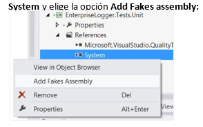
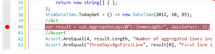
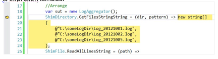

#Capítulo 6: Hands-on Lab 2


Traducción por Juan María Laó Ramos


    

Twitter: @juanlao

Linkedin: <http://es.linkedin.com/in/juanlao/>

Blog: <http://speakingin.net/>


Ejercicio 2: Usando Shims para aislarnos del sistema de archivos y de la fecha (20 – 30 min)

Escenario

Paso 1 – Revisar la clase LogAggregator

Paso 2 – Crea un proyecto de test

Paso 3 – Crea el primer test

Paso 4 – Añadir shims como fake del sistema de archivos

Paso 5 – Añadir un Shim para aislarnos de la fecha del sistema

Paso 6 – (Opcional) Ejectua el test con el debugger para entender el
flujo de ejecución


>OBJETIVO<br/>En este ejercicio, veremos cómo usar Shims para aislarnos el código que queremos testear de las dependencias del sistema de archivos y de la fecha del sistema.

Escenario 
----------

Eres uno de los desarrolladores de una empresa de software. Tu equipo
está a cargo del mantenimiento de un assembly de log que se usa en todas
las aplicaciones del departamento.

Te han asignado la tarea de añadir una nueva característica a la clase
central del sistema: el LogAggregator. Esta clase puede añadir archivos
de log a un directorio y filtrar los archivos a sólo unos días.

No hay test unitarios para ese componente por ahora. Antes de cambiar
nada en esa parte del código, quieres asegurarte de que no rompes nada.
Desafortunadamente, la clase LogAggregator no ha sido diseñada para que
se fácil asilarla ni del sistema de archivos ni de la hora del sistema a
base de pasarle los valores necesarios. El código no ofrece ninguna
forma de inyectarle un stub, está ocultando su implementación.

Por lo tanto, vamos a crear nuestro primer Shim para poder testear la
clase LogAggregator.

Paso 1 – Revisar la clase LogAggregator 
----------------------------------------

1\. Abre la solución **EnterpriseLoger.sln** en **Hands-on Lab\\Excercies
    2\\start** y abre el archivo **LogAggergator.cs.** Deberíamos ver el
    siguiente código en el editor:


``` C#
namespace Microsoft.ALMRangers.FakesGuide.EnterpriseLogger
{
    using System; 
    using System.Collections.Generic; 
    using System.Globalization; 
    using System.IO;

    public class LogAggregator
    {   public string[] AggregateLogs(string logDirPath, int daysInPast)
        {   var mergedLines = new List<string>(); 
            var filePaths = Directory.GetFiles(logDirPath, "*.log"); 
            foreach (var filePath in filePaths)
            {   if (this.IsInDateRange(filePath, daysInPast))
                {   mergedLines.AddRange(File.ReadAllLines(filePath));
                }
            }
            return mergedLines.ToArray();
        }

        private bool IsInDateRange(string filePath, int daysInPast)
        {   string logName = Path.GetFileNameWithoutExtension(filePath); 
            if (logName.Length > 8)
            {   return false;
            }
            string logDayString = logName.Substring(logName.Length - 8, 8);
            DateTime logDay;
            DateTime today = DateTime.Today;
            if (DateTime.TryParseExact(logDayString, "yyyyMMdd", CultureInfo.InvariantCulture, DateTimeStyles.None, out logDay))
            {   return logDay.AddDays(daysInPast) >= today;
            }
            return false;
        }
    }
}
```

>NOTA<br/>El código que vemos aquí es una clase para para centrarnos. Puedes hacer todos los pasos de este laboratorio basándote en esta clase. Si no tienes acceso a la solución que tenemos preparada, puedes generarlo creando una class library y copiando y pegando el código en él.


Paso 2 – Crea un proyecto de test 
----------------------------------

1.  Añade un proyecto del tipo **Visual C\# Unit Test Proyect** a la
    solución llamado “EnterpriseLogger.Tests.Unit”

2.  En el proyecto “EnterpriseLogger.Tests.Unit” añade una referencia al
    proyecto “EnterpriseLogger”


Paso 3 – Crea el primer test 
-----------------------------

1\. Renombra “UnitTetst1.cs” a “LogAggregatorTests.cs” 2. Abre
    “LogAggergatorTests.cs” y añade el siguiente using:


``` C#
using Microsoft.ALMRangers.FakesGuide.EnterpriseLogger;
```


2\. Reemplaza el método “TestMethod1” por el siguiente:
``` C#
[TestMethod] public void AggregateLogs_PastThreeDays_ReturnsAllLinesFromPastThreeDaysAndToday()
{
    // Arrange var sut = new LogAggregator();
    // Act var result = sut.AggregateLogs(@"C:\SomeLogDir", daysInPast: 3);
    // Assert
    Assert.AreEqual(4, result.Length, "Number of aggregated lines incorrect.");
    Assert.AreEqual("ThreeDaysAgoFirstLine", result[0], "First line incorrect.");
    Assert.AreEqual("TodayLastLine", result[3], "Last line incorrect.");
}
```


3\.  Haz clic derecho en el método y selecciona la opción **Run Tests**.
    El test empezará a ejecutarse y fallará.


Este test que hemos creado testea el método “AggregateLogs” y dice lo
que prueba en su propio nombre, que es comprobar que la función
“AggregateLogs” – cuando se llama con el path de un directorio que
contiene archivos de logs y un 3 en la variable daysInPast – debería
devolver todas las líneas de aquellos logs desde hace tres días hasta
ahora.

Sin embargo, este test sólo funcionaría si el directorio
“C:\\SomeLogDir” existe y mágicamente contiene archivos con los datos
necesarios para este test. Esto se puede hacer escribiendo algún código
de configuración. Sin embargo, el test resultante sería más un test de
integración más que un test unitario real, ya que estaría usando el
sistema de archivos.

Para hacer que sea un test unitario de verdad, vamos a aislar el test de
los métodos estáticos que llama para acceder a la fecha del sistema y al
sistema de archivos. Vamos a revisar el código que queremos testear:

``` C#
public string[] AggregateLogs(string logDirPath, int daysInPast)
{   var mergedLines = new List&lt;string&gt;(); var filePaths = Directory.GetFiles(logDirPath, "*.log"); 
    foreach (var filePath in filePaths)
    {   if (this.IsInDateRange(filePath, daysInPast))
        {   mergedLines.AddRange(File.ReadAllLines(filePath));
        }
    } 
    return mergedLines.ToArray();
}
```

El método estático que vemos representa un patrón bastante adecuado para
las clases File y Directory del namespace System.IO. Puede haber razones
para usar el sistema de archivos de manera diferente, ya lo veremos más
adelante en este ejercicio. Ahora vamos a hacer un shim para las
funciones Directory.GetFiles() y File.ReadAllLines().

Paso 4 – Añadir shims como fake del sistema de archivos 
--------------------------------------------------------

1.  Primero, debemos decirle a Visual Studio para qué dependencias
    queremos generar Fakes. En el Solution

Explorer, en el proyecto “EnterpriseLogger.Tests.Unit” expande el nodo
**References**, clic derecho en


    

>NOTA - Visual Studio ha creado un nuevo directorio llamado “Fakes” que contiene dos archivos XML y ha añadido referencias a dos assemblies recién generados.
  
Los archivos del directorio “Fakes” le dicen a Visual Studio para qué
tipos hay que generar los shims. Puedes usar estos archivos para
personalizar para qué tipos generar un shims o un stub. La razón por la
que hay dos archivos es porque el namespace System genera más de un
assembly. Como mscorlib.dll no se puede referenciar directamente, para
seguir usando Fakes, siempre se añade un assembly fake de mscorlib.dll
cuando se hace un Fake de System.dll.

2\.  Por convención, los tipos Fakes para el namespace System.IO están en
    el namespaces System.IO.Fakes. Para usarlos, trabajaremos con una
    sentencia using. En el Solution Explorer haz doble clic en
    “LogAggregatorTests.cs” y añade el siguiente using al principio el
    archivo: using System.IO.Fakes;

3\.  Cambia el método de test en “LogAggregatorTests.cs” de la
    siguiente forma. Los cambios están en **negrita**:
``` C#
// Arrange
var sut = new LogAggregator();
ShimDirectory.GetFilesStringString = (dir, pattern) => new string[]
{
@"C:\someLogDir\Log_20121001.log",
@"C:\someLogDir\Log_20121002.log",
@"C:\someLogDir\Log_20121005.log",
};
ShimFile.ReadAllLinesString = (path) =>
{   switch (path)
    {   case @"C:\someLogDir\Log_20121001.log":
            return new string[] {"OctFirstLine1", "OctFirstLine2"};
        case @"C:\someLogDir\Log_20121002.log":
            return new string[] {"ThreeDaysAgoFirstLine","OctSecondLine2"};
        case @"C:\someLogDir\Log_20121005.log":
            return new string[] {"OctFifthLine1", "TodayLastLine"};
    } return new string[] {};
};
// Act var result = sut.AggregateLogs(@"C:\SomeLogDir", daysInPast: 3);
// Assert
Assert.AreEqual(4, result.Length, "Number of aggregated lines incorrect.");
CollectionAssert.Contains(result, "ThreeDaysAgoFirstLine", "Expected line missing from aggregate d log.");
CollectionAssert.Contains(result, "TodayLastLine", "Expected line missing from aggregated log.") ;
```

Vamos a revisar el código. Hemos añadido dos sentencias:
``` C#
ShimDirectory.GetFilesStringString = [some delegate];
ShimFile.ReadAllLinesString = [some delegate];
```

Estas sentencias le dicen al framework de Microsoft Fakes qué métodos de
deben ser interceptados y qué código se debe ejecutar. Los nombres están
puestos por convención. El nombre de la clase que se usa para acceder al
Shim de un tipo concreto es el nombre del tipo, con el prefijo de
“Shim”. El nombre de la propiedad usada para setear el delegado de la
interceptación de la llamada es el nombre del método con el sufijo de
los nombres de los tipos de sus parámetros. Esta convención nos permite
setear diferentes delegados para diferentes sobrecargas de un método.

El código que hemos asignado a estas propiedades en el código anterior
hace que el método

GetFiles(string,string) devuelva tres paths
(C:\\someLogDir\\Log\_20121001.log, C:\\someLogDir\\Log\_20121002.log, y
C:\\someLogDir\\Log\_20121005.log) que tienen fechas codificadas en su
nombre. (No nos importa el patrón que se use en el nombrado de los
directorios). Y ahora, el método ReadAllLines(string) devuelve arrays de
strings que representan las líneas de los archivos de logs imaginario,
basándose en el parámetro del path.

4\.  Click derecho en el cuerpo del método de test y seleccionamos **Run
    Tests**. El test falla.

En el **Test Explorer** bajo **Failed Tests,** seleccionamos el test
“AggregateLogs …” y vemos la descripción del error.

El mensaje de error nos dice que usemos un ShimsContext. Esto es
necesario para indicar el contexto en el que se usarán los shims. Los
shims sólo se usaran en ese contexto. Sin ese contexto, los shims
podrían provocar efectos secundarios en el resto de test. Así que vamos
a hacerlo

>NOTA - La configuración de un ShimsContext debería hacerse siempre en una sentencia using, y nunca en un método setup/initialize o en un teardown/cleanup. Esto podría dejar que los shims estén definidos en otras partes de los test que no deberían afectando y alterando los test.
  
5\.  En el bloque de usings al principio del “LogAggregatorTests.cs”
    añade el siguiente using:
``` C#
using Microsoft.QualityTools.Testing.Fakes;
```

6\.  Cambia el método de test de la siguiente manera.
``` C#
using (ShimsContext.Create())
{
    // Arrange
    …
    // Act
    …
    // Assert
    …
}
```

7\.  En el Test Explorer haz clic en **Run … Hay test que no pasan.**


Los test fallan esta vez con el mensaje “Assert.AreEqual failed.
Expected: &lt;4&gt;, Actual &lt;0&gt;. Number of aggregated lines
incorrect”. Esto es debido a que las fechas codificadas en los nombres
de los archivos que pusimos el método shim GetFiles(string,string) son
de más de tres días de antiguiedad y ninguna de ellas entran en el
filtro. Vamos a revisar el método
LogAggregator.IsInDateRange(string,int) que es el responsable del
filtrado de fechas:

``` C#
private bool IsInDateRange(string filePath, int daysInPast)
{
    string logName = Path.GetFileNameWithoutExtension(filePath); 
    if (logName.Length < 8)
    {
        return false;
    } 
    string logDayString = logName.Substring(logName.Length - 8, 8);
    DateTime logDay;
    DateTime today = DateTime.Today;
    if (DateTime.TryParseExact(logDayString, "yyyyMMdd", CultureInfo.InvariantCulture, DateTimeStyles.None, out logDay))
    {
        return logDay.AddDays(daysInPast) >= today;
    }
    return false;
}
```
Este método se basa en una llamada a la propiedad estática “Today” de la
clase DateTime. Esto es lo que hace que el test falle cuando se ejecuta
en un día que no es el 5 de Octubre de 2012. Para hacer que este test
pase, vamos a hacer un shim de esa propiedad

Paso 5 – Añadir un Shim para aislarnos de la fecha del sistema 
---------------------------------------------------------------

1\.  En la sección de usings de “LogAggregatorTests.cs” añade la línea:

``` C#
using System.Fakes;
```
2\. Añade la siguiente línea debajo del comentario //Act
``` C#
ShimDateTime.TodayGet = () => new DateTime(2012, 10, 05);
```
3\. En el Test Explorer, haz clic en **Run … Failed Test. …** Ya pasa
    el test.


Paso 6 – (Opcional) Ejectua el test con el debugger para entender el flujo de ejecución. 
-----------------------------------------------------------------------------------------

1\.  Pon el cursor en la primera línea del código, debajo del comentario
    //Act

2\.  En el menú principal, ve Debug, Toggle Breakpoint para añadir punto
    de ruptura


3\.  Haz clic derecho en cualquier parte del test y selecciona la opción
    Debug Tests.

4\.  Después de que lleguemos al breakpoint, pulsa F11.

5\.  Continúa paso a paso la ejecución del código (usando F11) hasta que
    llegamos a la primera ejecución de


    

>NOTA - Cuando usamos un Shim, todo el dominio de la aplicación es enrutado a través del contexto del shim; así que si hacemos una llamada al objeto shim cuando debugeamos, veremos los resultados del shim en lugar de los valores reales.
  
  
  Continúa la ejecución hasta que pases por todas las expresiones lambda, y en el menú principal elige

  Debug, Continue.

>Revisión<br/>  Hemos conseguido aislar el código de producción del LogAggregator de sus dependencias con el sistema de archivos y de la fecha del sistema – sin tener que cambiarlo. Puedes ver el código final en **Hands-on **<br/>**Lab\\Exercies2\\end**
  
--------------------

La información contenida en este documento representa la visión
Microsoft Corporation sobre los asuntos analizados a la fecha de
publicación. Dado que Microsoft debe responder a las condiciones
cambiantes del mercado, no debe interpretarse como un compromiso por
parte de Microsoft, y Microsoft no puede garantizar la exactitud de la
información presentada después de la fecha de publicación.

Este documento es sólo para fines informativos. MICROSOFT NO OFRECE
NINGUNA GARANTÍA, EXPRESA, IMPLÍCITA O LEGAL, EN CUANTO A LA INFORMACIÓN
CONTENIDA EN ESTE DOCUMENTO.

Microsoft publica este documento bajo los términos de la licencia
Creative Commons Attribution 3.0 License. Todos los demás derechos están
reservados.

*© 2013 Microsoft Corporation. *

Microsoft, Active Directory, Excel, Internet Explorer, SQL Server,
Visual Studio, and Windows son marcas comerciales del grupo de compañías
de Microsoft.

Todas las demás marcas son propiedad de sus respectivos dueños

----------------------

The information contained in this document represents the current view
of Microsoft Corporation on the issues discussed as of the date of
publication. Because Microsoft must respond to changing market
conditions, it should not be interpreted to be a commitment on the part
of Microsoft, and Microsoft cannot guarantee the accuracy of any
information presented after the date of publication.

This document is for informational purposes only. MICROSOFT MAKES NO
WARRANTIES, EXPRESS, IMPLIED OR STATUTORY, AS TO THE INFORMATION IN THIS
DOCUMENT.

Microsoft grants you a license to this document under the terms of the
Creative Commons Attribution 3.0 License**.** All other rights are
reserved.

*© 2013 Microsoft Corporation. *

Microsoft, Active Directory, Excel, Internet Explorer, SQL Server,
Visual Studio, and Windows are trademarks of the Microsoft group of
companies.

All other trademarks are property of their respective owners.


