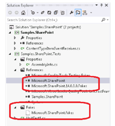

#Capítulo 6: Hands-on Lab 3


Traducción por Juan María Laó Ramos


    

Twitter: @juanlao

Linkedin: <http://es.linkedin.com/in/juanlao/>

Blog: <http://speakingin.net/>


##Ejercicio 3: Usando Microsoft Fakes con SharePoint (20 – 30 min) 

Escenario

Preparación

Paso 1 – Crear una característica de ejemplo de SharePoint

Paso 2 – Crear un test

--------------------

Escenario 
----------

SharePoint usa muchas clases privadas y selladas, lo que significa que
no tiene constructores que nos permitan escribir tests. La falta de
interfaces públicas y clases virtuales hace que no sea posible usar
Stub.

Esto es algo común en cualquier tecnología que ofrezca un “framework”
para resolver cierto tipo de problemas. También suele ser habitual en
sistemas heredados que no siguieron las conocidas “buenas prácticas” –
diseña tu sistema para que sea fácilmente testable. Estos sistemas
heredados no usan el patrón de inyección de dependencias.

Eso deja al desarrollador con dos opciones si quiere escribir tests.

1.  No hacer testing unitario. Confiar en los test de integración
    basados en UI dejando el subsistema de SharePoint como una
    caja negra.

2.  Hacer un wrapper de todo el subsistema que llama a los objetos de
    SharePoint a través de un interfaz y una implementación. Esto puede
    ser una buena solución en muchos proyectos. Ya que los detalles de
    implementación del código de SharePoint se ocultan tras la interfaz,
    se puede testear unitariamente todo el código que no sea
    de SharePoint. Los detalles de implementación de las características
    de SharePoint se terminan tratando como una caja negra, así que
    estamos como en el caso 1. Estas cajas negras, sin embargo, pueden
    ser testadas usando las técnicas de Shim que vimos ántes.


Sin embargo, en el caso de SharePoint, la técnica del warpper no siempre
es posible ya que el desarrollador de SharePoint suele crear elementos
como recibidores de eventos y web parts que necesitan una
infraestructura dentro de SharePoint, no encima. Esto hace que no sea
práctico usar este tipo de encapsulación.

Ninguna de esas dos opciones soluciona el problema principal. Tenemos
que ser capaces de sustituir las instancias de los objetos de
SharePoint. Así que necesitamos usar la funcionalidad que los Shims nos
ofrecen.

>OBJETIVO <br/>En este ejercicio, veremos cómo usar Shims para testear que un recibidor de eventos de SharePoint funciona correctamente.

Preparación 
------------

Este ejercicio requiere que el PC tenga una versión soportada de Visual
Studio y SharePoint 2010 Foundation (aunque cualquier SKU posterior de
SharePoint también se puede usar). La instalación de SharePoint no se
ejecutará directamente durante este ejercicio, pero los assemblies que
se instalarán en el GAC y en Program Files los usaremos para el proceso
e Faking. Otra opción, si no tenemos estas herramientas disponibles en
nuestro PC, es usar la máquina virtual de la demo de Brian Keller de
VS2012 ALM con Hyper-V

[(*http://blogs.msdn.com/b/briankel/archive/2011/09/16/visual-studio-11-application-lifecycle-management*http://blogs.msdn.com/b/briankel/archive/2011/09/16/visual-studio-11-application-lifecycle-management-virtual-machine-and-hands-on-labs-demo-scripts.aspx*virtual-machine-and-hands-on-labs-demo-scripts.aspx*)](http://blogs.msdn.com/b/briankel/archive/2011/09/16/visual-studio-11-application-lifecycle-management-virtual-machine-and-hands-on-labs-demo-scripts.aspx)
ya que tiene todos los componentes necesarios.

>AVISO <br/>SharePoint debe estar instalado en la máquina de desarrollo, no sólo una copia de las dll’s, para que todos los assemblies necesarios para crear los fakes estén disponibles  


Paso 1 – Crear una característica de ejemplo de SharePoint 
-----------------------------------------------------------

1\. En Visual Studio, añade una class library para .NET 3.5 llamada
    **Samples.SharePoint**

>NOTA <br/> En código de producción, podemos usar cualquier plantilla de SharePoint para la característica que vamos a desarrollar, de este modo se seleccionará la versión correcta de .NET. Sin embargo, para que este HOL sea lo más simple posible, vamos a usar una Class Library báscia. No es necesario crear un sitio de SharePoint.<br/>.NET 3.5 debe ser seleccionado como target del proyecto ya que SharePoint 2010 usa .NET 3.5
  

2\.  Añade una referencia a la dll **Microsoft.SharePoint.dll.**
    Normalmente, este archivo se instala como parte del servidor de
    SharePoint en **c:\\Program Files\\Common Files\\Microsoft Shared\\
    Web Server Extension\\T4\\ISAPI.**

3\.  Renombra el archivo **Class1.cs** a
    **ContentTypeItemEventReceiver.cs**

4\.  En el archivo **ContentTypeItemEventReceiver.cs** reemplaza el
    cuerpo de la clase con el siguiente código:  

``` C#
using Microsoft.SharePoint;
public class ContentTypeItemEventReceiver : SPItemEventReceiver
{   public void UpdateTitle(SPItemEventProperties properties)
    {   using (SPWeb web = new SPSite(properties.WebUrl).OpenWeb())
        {
            SPList list = web.Lists[properties.ListId];
            SPListItem item = list.GetItemById(properties.ListItemId);
            item["Title"] = item["ContentType"];
            item.SystemUpdate(false);
        }

    } 
    public override void ItemAdded(SPItemEventProperties properties)
    {   this.EventFiringEnabled = false;
        this.UpdateTitle(properties);
        this.EventFiringEnabled = true;
    }
}
```

Esta será nuestra aplicación de ejemplo. Hemos añadido un recibidor de
eventos que se llamará cada vez que se añade un elemento a la lista de
SharePoint. Este recibidor edita el título del nuevo elemento con lo que
haya en la propiedad “ContentType”.

1.  Compila el proyecto. Debería compilar sin errores. Si hay algún
    problema, comprueba los errores.


Paso 2 – Crear un test 
-----------------------

1\.  Añade un Unit Test Proyect para **.NET 4** a la solución con el
    nombre **Samples.SharePoint.Tests**

>NOTA<br />En este ejercicio, usamos MSTest como framework de testing unitario. Sin embargo, podríamos usar otro como nUnit o xUnit gracias a Visual Studio Extension Test Adaptors. Microsoft Fakes no tiene ninguna dependencia con MSTest.<br/>Al contrario del proyecto que contiene el código de SharePoint, que necesita el framework 3.5, el proyecto que contiene los test puede usar versiones nuevas del framework. Para el testing de SharePoint se recomienda usar .NET<br />4.0 para evitar problemas cuando se generen los Fakes.
  
2\.  Añade una referencia al proyecto **Samples.SharePoint**

3\.  Añade una referencia a la dll **Microsoft.SharePoint.**dll, como
    hiciste en el proyecto de ejemplo.

4\.  En la sección de referencias del proyecto de test selecciona la
    referencia **Microsoft.SharePoint** y haz clic derecho. Selecciona
    la opción **Add Fake Assembly**. Esto puede tardar unos segundos
    (incluso algunos minutos). Cuando termine, deberías poder ver los
    archivos que se han creado en el directorio de fakes y añade una
    referencia a la dll **Microsoft.SharePoint.Fakes.dll:**


    

>AVISO<br/>Si por alguna razón la creación de los fakes falla y tienes que repetir el proceso, asegúrate de borrar el archivo del directorio de Fakes. Si no, aparecerá un error cuando repitamos el proceso.<br />La razón más común para que ocurra un error es que el proyecto de test esté configurado para usar .NET 4.5. En este caso, Visual Studio no podrá generar los fakes para SharePoint. Tenemos que seleccionar .NET 3.5 o 4 como target del proyecto de test


1\.  Renombra el archivo UnitTest1.cs a SharePointEventTests.cs

2\.  Renombra el método **TestMethod1** con un nombre significativo como

    Contributor_AddsNewItem_EventFires

3\.  Añade las referencias necesarias para el assembly fake de SharePoint
    y a la librería de faking

El código listado al final de esta sección muestra el test completo. Los
siguientes pasos muestran la jerarquía de shims que se han creado:

4\.  Alrededor de todo el contenido del test, crea un bloque **using**
    para el **ShimContext**. Esto administra el contexto de las
    operaciones de “shimming”. Los shims funcionarán dentro de
    ese bloque.

5\.  Añade dos variables locales, **systemUpdateHasBeenCalled** y
    **itemTitleValue**. Serán usadas como flags para indicar que se ha
    llamado al código correcto.

6\.  Crea un shim para un objeto **SPItemEventProperties** y configura su
    comportamiento para las tres propiedades que serán llamadas.

7\.  Crea un shim para interceptar la llamada al constructor **SPSite**


>NOTA<br/>En el código de ejemplo, los parámetros del constructor “shimeado” comienzan con el símbolo ‘@’. Esto permite el uso de palabras reservadas para el nombre de las variables que, en este caso, hace más fácil su comprensión.

1.  Dentro del bloque **SimSPSite** configura el método **OpenWeb**.
    Esto crea un nuevo objeto shim de **SPWeb**

2.  Dentro del bloque, configura la propieda**d List** para que devuelva
    un **SPListCollection.**

3.  Dentro del bloque, configura la propiedad **Item** para que devuelva
    un shim de un **SPList**, el parámetro **GUID** no se usa.

4.  Dentro del bloque, configura el método **GetItemById** para que
    devuelva un **SPListItem**, el parámetro **Int** no se usa.

5.  Dentro del boque, configura la propiedad **Item** (get y set) y el
    método **SystemUpdate**. Fíjate que estamos definiendo el valor de
    la variable local que creamos en lo alto del test para comprobar que
    se han realizado ciertas llamadas.

6.  Finalmente, después de la creación de shim anidados, crea una
    instancia de la clase a testear.

7.  Añade una llamada al recibidor de eventos que queremos testear.

8.  Añade dos asserts para comprobar que se han hecho las llamadas que
    esperamos que se hagan.

9.  Compila el proyecto. Debería compilar sin errores. Si hay alguno,
    comprueba los mensajes (comprueba el código al final de
    esta sección).

10. Abre el Test Explorer (en el menú **Test\\Windows\\Test Explorer)**.
    Deberías ver el nuevo test en la lista, si no lo ves, recompila
    la solución.

11. Elige la opción **Run All.**

12. El test debería ejecutarse y pasar.


El código completo del test sería este:

``` C#
namespace Microsoft.ALMRangers.FakesGuide.Sharepoint.Tests
{
    using System;
    using Microsoft.QualityTools.Testing.Fakes; 
    using Microsoft.SharePoint.Fakes;
    using Microsoft.VisualStudio.TestTools.UnitTesting;

    [TestClass]
    public class SharePointEventTests
    {
        [TestMethod]
        public void The_item_title_is_set_to_the_content_type_when_event_fires()
        {
            using (ShimsContext.Create())
            {
                // arrange
                // create the local variables we will write into to check that the correct methods are called
                var systemUpdateHasBeenCalled = false;
                var itemTitleValue = string.Empty;

                // create the fake properties
                var fakeProperties = new ShimSPItemEventProperties()
                {
                    WebUrlGet = () => "http://fake.url",
                    ListIdGet = () => Guid.NewGuid(),
                    ListItemIdGet = () => 1234
                };
                // create the fake site
                ShimSPSite.ConstructorString = (@this, @string) =>
                {
                    new ShimSPSite(@this)
                    {
                        OpenWeb = () => new ShimSPWeb()
                        {
                            ListsGet = () => new ShimSPListCollection()
                            {
                                ItemGetGuid = (guid) => new ShimSPList() 
                                {
                                    GetItemByIdInt32 = (id) => new ShimSPListItem()
                                    {
                                        ItemGetString = (name) => string.Format("Field is {0}", name),
                                        SystemUpdateBoolean = (update) => systemUpdateHasBeenCalled = true, ItemSetStringObject = (name, value) => itemTitleValue = value.ToString()
                                    }
                                }
                            }
                        }
                    };
                };
                // create the instance of the class under test var cut = new ContentTypeItemEventReceiver();
                // act
                cut.ItemAdded(fakeProperties);
                // assert
                Assert.AreEqual(true, systemUpdateHasBeenCalled);
                Assert.AreEqual("Field is ContentType", itemTitleValue);
            }
        }
    }
}
```
>NOTA<br/>Microsoft ha publicado SharePoint Emulator, que son una versión de los comportamientos de Moles SharePoint. Muchas de las implementaciones de shim para el core de SharePoint se han empaquetado y se ofrecen como parte de los emuladores de SharePoint. Estos SharePoint Emulator se ven en el blog [*Introducing SharePoint*](http://blogs.msdn.com/b/visualstudioalm/archive/2012/11/26/introducing-sharepoint-emulators.aspx) [^1]Emulators y están disponibles como un paquete Nuget

>Revisión<br/> En este ejercicio, hemos visto cómo los Shims de Microsoft Fakes se pueden usar para testear las características e SharePoint. Puedes ver el código final en **Hands-on Lab\\Exercise 3\\end**

-----------------

La información contenida en este documento representa la visión
Microsoft Corporation sobre los asuntos analizados a la fecha de
publicación. Dado que Microsoft debe responder a las condiciones
cambiantes del mercado, no debe interpretarse como un compromiso por
parte de Microsoft, y Microsoft no puede garantizar la exactitud de la
información presentada después de la fecha de publicación.

Este documento es sólo para fines informativos. MICROSOFT NO OFRECE
NINGUNA GARANTÍA, EXPRESA, IMPLÍCITA O LEGAL, EN CUANTO A LA INFORMACIÓN
CONTENIDA EN ESTE DOCUMENTO.

Microsoft publica este documento bajo los términos de la licencia
Creative Commons Attribution 3.0 License. Todos los demás derechos están
reservados.

*© 2013 Microsoft Corporation. *

Microsoft, Active Directory, Excel, Internet Explorer, SQL Server,
Visual Studio, and Windows son marcas comerciales del grupo de compañías
de Microsoft.

Todas las demás marcas son propiedad de sus respectivos dueños

The information contained in this document represents the current view
of Microsoft Corporation on the issues discussed as of the date of
publication. Because Microsoft must respond to changing market
conditions, it should not be interpreted to be a commitment on the part
of Microsoft, and Microsoft cannot guarantee the accuracy of any
information presented after the date of publication.

-------------------

This document is for informational purposes only. MICROSOFT MAKES NO
WARRANTIES, EXPRESS, IMPLIED OR STATUTORY, AS TO THE INFORMATION IN THIS
DOCUMENT.

Microsoft grants you a license to this document under the terms of the
Creative Commons Attribution 3.0 License**.** All other rights are
reserved.

*© 2013 Microsoft Corporation. *

Microsoft, Active Directory, Excel, Internet Explorer, SQL Server,
Visual Studio, and Windows are trademarks of the Microsoft group of
companies.

All other trademarks are property of their respective owners.

[^1]: http://blogs.msdn.com/b/visualstudioalm/archive/2012/11/26/introducing-sharepoint-emulators.aspx


