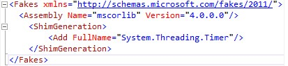

#Capítulo 6: Hands-on Lab 4


Traducción por Juan María Laó Ramos


    

Twitter: @juanlao

Linkedin: <http://es.linkedin.com/in/juanlao/>

Blog: <http://speakingin.net/>


Ejercicio 4: Haciendo testable código heredado (20 – 30 min) 
-------------------------------------------------------------

Escenario

Paso 1 – Crear un proyecto de test para el componente Traffic.Core

Paso 2 – Crear un test para la propiedad City.Run

Paso 3 – Añadir las referencias de Fakes al assembly Traffic.Core

Paso 4 – Modificar el test unitario para la propiedad Run

Paso 5 – Añadir una referencia Fake de la clase System.Timer

Paso 6 – Crear un test unitario para el constructor de Car

Paso 7 – Añade un test para la propiedad Car.ShouldMove

Paso 8 – Intentando hacer un shim de la clase DiscoveredRoutes

 

El código heredado puede plantear problemas para refactorizarlo,
especialmente cuando es código altamente acoplado o que hace poco uso de
interfaces. Para refactorizar el código, es preferible tener tests
unitarios que aseguren el comportamiento del código antes de cambiarlo.

>OBJETIVO<br />En este ejercicio, usaremos Shims y Stubs para conseguir que el código heredado esté testado

Escenario 
----------

En este escenario usaremos la aplicación Traffic Simulator del
directorio **Excercise 4.** En el componente **Traffic Core**, hay un
conjunto de clases que hacen de Modelo del componente Traffic UI.
Comenzaremos el proceso de crear tests para las clases City y Car para
asegurar su comportamiento actual. La clase **City** expone la
disposición de la ciudad para el simulador Traffic. Esta clase consume
el servicio WFC **Traffic.RoadworkService** a través de una clase proxy
que se invoca desde un método privado. Ese método privado se invoca
desde un callback a una instancia de **System.Thread.Timer** que se crea
en el setter de la propiedad llamada **Run**. Usaremos Shims para
producir los test de la clase City que nos permitirá “shimear” las
referencias al servicio WCF y a la instancia del Timer. La clase Car
representa un vehículo en el simulador. Esta clase consume un conjunto
de objetos del componente Traffic Core a través de la propiedad
**ShouldMove**. Usaremos una combinación de Stubs y Shims para poder
testear esta propiedad

Paso 1 – Crear un proyecto de test para el componente Traffic.Core 
-------------------------------------------------------------------

1\.  En la solución **ComplexDependencies**, añade un nuevo proyecto con
    la plantilla Visual C\# Unit Test y llámalo **Traffic.Core.Tests**

2\.  Añade una clase llamada **CityTests.cs**

3\.  En el nuevo proyecto de test, añade una referencia al proyecto
    **Traffic.Core**

Después de haber visto el código a testear, podemos añadir un test
unitario para testear la propiedad Run de la clase City.

4\.  Abre la clase **City.cs** el directorio **Model** del proyecto
    **Traffic.Core**

5\.  Busca la propiedad **Run** y mira el código. Fíjate que el setter de
    la propiedad tiene una dependencia con una instancia de
    **System.Threading.Timer**, que invoca al método **OnTimer**

6\.  Ve a ese método haciendo clic derecho en la llamada **OnTimer** y
    selecciona la opción **Go To Definition.**
 

Verás que este método llama al método **UpdateRoadwork()**, que contiene
una referencia al proxy cliente del servicio. Por lo que, cualquier test
que ejecute la propiedad Run tendrá una dependencia tando del **Timer**
como del **RoadwordServiceClient **

Paso 2 – Crear un test para la propiedad City.Run 
--------------------------------------------------

Antes de usar Fakes, intentaremos generar un test unitario que asegure
que la propiedad Run se puede setear a true.

1\.  En el archivo CityTests.cs renombra el método TestMethod1()
    a City\_CanSetRunProperty\_True().

2\.  Actualiza tus referencias para incluir System.Threading y
    Traffic.Core.Models y añade los usings necesarios:

``` C#
using System; 
using System.Threading; 
using Microsoft.VisualStudio.TestTools.UnitTesting;
using Microsoft.ALMRangers.FakesGuide.ComplexDependencies.Traffic.Core.Models;
```

3\.  Añade el siguiente código al método:

``` C#
[TestMethod] public void City_CanSetRunProperty_True()
{
    City cityUnderTest = new City(); bool expected = true;
    cityUnderTest.Run = expected; Thread.Sleep(TimeSpan.FromSeconds(5));
    Assert.AreEqual<bool>(expected, cityUnderTest.Run, "City.Run property should be set to true.");
}
```

Si intentas ejecutar este código, el test fallará ya que las llamadas
que hay por debajo al servicio Roadwork no serán invocadas. Además,
podemos decir que este test es frágil ya que es necesaria una llamada a
Thread.Sleep para darle tiempo a la propiedad Run para que cree el
Timer, registre el evento, e invoque al servicio Roadwork. Ahora vamos a
intentar testar esta propiedad usando Shims para aislarla de sus
dependencias externas.

Paso 3 – Añadir las referencias de Fakes al assembly Traffic.Core 
------------------------------------------------------------------

1.  Expande el nodo **References** del proyecto **Traffic.Core.Tests,**
    haz clic derecho en **Traffic.Core** y selecciona la opción **Add
    Fakes Assembly**

Esto crea los Stubs y Shims necesarios para el componente
**Traffic.Core**. Ahora queremos asegurarnos de que cuando llamamos al
servicio Roadwork, nuestra implementación de Shim se invocará en lugar
del servicio actual y que devolveremos un Stub como resultado. Para
asegurarnos de que nuestra implementación ha sido invocada, usaremos una
variable privada booleana que pondremos a true en el método. Además,
también queremos ofrecer una implementación alternativa al constructor
del RoadworkServiceClient. Esto asegura que una clase proxy muy básica
se ha habilitado.

Paso 4 – Modificar el test unitario para la propiedad Run 
----------------------------------------------------------

1\.  Añade las siguientes referencias al proyecto Traffic.Core.Tests:

    System.Runtime.Serialization
    System.ServiceModel

2\.  En la clase CitiTests añade estos usings:

    using System.Collections.Generic; 
    using System.Linq;
    using Microsoft.QualityTools.Testing.Fakes; using
    Microsoft.ALMRangers.FakesGuide.ComplexDependencies.Traffic.Core.RoadworkServiceReference.Fakes

3\.  Para usar los métodos del Shim, tenemos que envolver las llamadas
    donde invocamos a la propiedad Run en un ShimsContext. Esto
    asegurará que las llamadas se sustituirán sólo en el código que se
    está testeando. Envuelve el contenido del método con este código:

    using (ShimsContext.Create())
    { }


4\.  Bajo la línea en la que se declara el booleano *expected*, añade
    otra variable local booleana llamada *hasServiceBeenInvoked* e
    inicialízala a *false.*

5\.  No queremos que se invoque al constructor actual del
    RoadworkServiceClient así que usaremos Shims para crear una
    implementación alternativa. Justo después de la variable booleana
    que acabamos de declarar añade el siguiente código:

    ShimRoadworkServiceClient.Constructor = (x) => { };


6\.  Ahora, añadamos la implementación para la operación
    RetrieveCurrentBlock a través de la clase ShimRoadworkServiceClient.
    Este método devuelve un array de Block; usaremos nuestra propia
    implementación para setear nuestra variable local
    *hasServiceBeenInvoked* a true y devolveremos un Stub. Justo después
    del código que hemos añadido en el paso 4, añade el siguiente
    código:

``` C#
ShimRoadworkServiceClient.AllInstances.RetrieveCurrentBlockArray = (instance, blocks) => 
    {   hasServiceBeenInvoked = true; 
        return new List<StubImpediment>
        {   new StubImpediment
            {   description = string.Empty, location = blocks.FirstOrDefault(), relativeSpeed = double.MinValue
            }
        }.ToArray();
    };
```

7\. Añade otro assert para asegurarnos de que la variable
    *hasServiceBeenInvoked* vale lo que debe valer:


``` C#
Assert.IsTrue(hasServiceBeenInvoked, "City.Run should invoke the Roadwork service"); 
// Aquí tenemos el código completo de la clase CityRun:

[TestMethod] public void City_CanSetRunProperty_True()
{   using (ShimsContext.Create())
    {
        City cityUnderTest = new City(); 
        bool expected = true; 
        bool hasServiceBeenInvoked = false;
        ShimRoadworkServiceClient.Constructor = (x) => { };
    ShimRoadworkServiceClient.AllInstances.RetrieveCurrentBlockArray = (instance, blocks) =>
        {   hasServiceBeenInvoked = true; 
            return new List<StubImpediment>
            {   new StubImpediment
                {   description = string.Empty, location = blocks.FirstOrDefault(), relativeSpeed = double.MinValue
                }
            }.ToArray();
        };
        cityUnderTest.Run = expected; Thread.Sleep(TimeSpan.FromSeconds(5));
        Assert.AreEqual&lt;bool&gt;(expected, cityUnderTest.Run, "City.Run property should be set to true.");
        Assert.IsTrue(hasServiceBeenInvoked, "City.Run should invoke the Roadwork service");
    }
}
```

Ahora podemos ejecutar este test desde el Test Explorer y el test
pasará. Hemos usado Shims para aislarnos de la clase
RoadworkSericeClient. Nuestro test unitario sigue siendo frágil ya que
sigue necesitando la llamada al método Thread.Sleep para que le dé
tiempo a la propiedad Run a inicializar la clase Timer.

Paso 5 – Añadir una referencia Fake de la clase System.Timer 
-------------------------------------------------------------

En este momento, queremos eliminar la llamada a Thread.Sleep de nuestro
test de la propiedad Run de la clase City para que no sea dependiente
del tiempo de inicialización de la propiedad Run. Para ello,
eliminaremos la dependencia del constructor Timer ofreciendo una
alternativa a través de la clase ShimTimer.

1\.  Expande el nodo **References** del proyecto **Traffic.Core.Tests**,
    clic derecho en **System** y selecciona la opción **Add Fakes
    Assembly**

Fíjate que se han creado las referencias a System.4.0.0.0.Fakes y
mscorlib.4.0.0.0.Fakes. Esto es debido a que el namespace System existe
también en el assembly mscorlib. Expande el directorio **Fakes** en el
proyecto de Test y veremos que se han generado dos archivos
correspondientes a las nuevas referencias que se han añadido –
**mscrolib.fakes y System.fakes. **

2\.  Este paso es necesario ya que Shims por defecto no creará un
    namespace para System.Threading. Abre el archivo mscorelib.fakes y
    corrígelo para que sea así:



    

3\. Ahora vamos a modificar el test para reemplazar la llamada al
constructor de Timer con nuestra propia implementación. El constructor
de Timer usado es uno que recibe algunos parámetros para inicializar;
tenemos que encontrar el que se corresponde con la signatura de nuestra
clase ShimTimer. De nuevo, usaremos una variable local que nos permita
comprobar que se ha llamado a nuestra implementación.

4\. Renombra la variable local *hasServiceBeenInvoked* a
    *hastimerBeenInvoked* y asegúrate de que la referencia de esta variable
    también ha sido renombrada. Borra el código que configura el shim del
    constructor de RoadworkServiceClient y las llamadas
    a RetrieveCurrentBlockArray. Ahora, añade la implementación para el
    constructor del Timer que tiene cuatro parámetros – un callback, un
    object, y dos TimeSpan. En esta implementación pon la variable
    *hasTimerBeenInvoked* a *true*. El código debería ser algo así:


``` C#
ShimTimer.ConstructorTimerCallbackObjectTimeSpanTimeSpan = (timer, callback, state, dueTime, per iod) =>
    {
        // Do nothing else but confirm that our implementation was called
        hasTimerBeenInvoked = true; 
    };
```

Nuestro test refactorizado de City.Run debería ser algo así:
``` C#
/// <summary>
/// Test to ensure that the City Run property can be set to true.
/// </summary> 
[TestMethod] public void City_CanSetRunProperty_True()
{
    using (ShimsContext.Create())
    {
        City cityUnderTest = new City(); 
        bool expected = true; 
        bool hasTimerBeenInvoked = false;
       ShimTimer.ConstructorTimerCallbackObjectTimeSpanTimeSpan = (timer, callback, state, dueTime, period) => 
        {
        // Do nothing else but confirm that our implementation was called here. 
            hasTimerBeenInvoked = true;
        }; 
        cityUnderTest.Run = expected;
        Assert.AreEqual<bool>(expected, cityUnderTest.Run, "City.Run property should be set to true.");
        Assert.IsTrue(hasTimerBeenInvoked,"City.Run should invoke instantiate Timer instance.");
    }
}
```

Ejecuta el test desde el Test Explorer y debería pasar. Ya podemos decir
que la propiedad City.Run está testada.

Paso 6 – Crear un test unitario para el constructor de Car 
-----------------------------------------------------------

Abre la clase **Car.cs** del directorio **Model** del proyecto
**Traffic.Core**. Fíjate que el constructor recibe dos parámetros – una
instancia de **Traffic.Core.Algorithms.RoutingAlgorithm** y una
implementación de **System.Windows.Media.Bursh**. Ambos parámetros se
usan para inicializar el estado de la instancia de **Car** setenado el
estado de las propiedades **Car.VehicleColor** y **Car.Routing**.
Además, también se inicializa una propiedad pública del tipo
**System.Random** llamada **RandomGenerator** que tiene un setter
privado. El primer test unitario que hay que crear es uno que compruebe
el comportamiento del actual del constructor de Car

1\.  Añade una nueva clase de test llamada **CarTests.cs** al proyecto
    **Traffic.Core.Tests**

2\.  Añade los siguientes usings:

``` C#
using System.Windows.Media;
using Microsoft.ALMRangers.FakesGuide.ComplexDependencies.Traffic.Core.Algorithms.Fakes;
using Microsoft.ALMRangers.FakesGuide.ComplexDependencies.Traffic.Core.Models;
using Microsoft.ALMRangers.FakesGuide.ComplexDependencies.Traffic.Core.Models.Fakes;
using Microsoft.QualityTools.Testing.Fakes;
using Microsoft.VisualStudio.TestTools.UnitTesting;
```

3\.  Renombra el TestMethod1()
    a Car\_Constructor\_ShouldInitializeDependentPropertiesSuccessfully()

En lugar de una instancia de
**Traffic.Core.Algorithms.RoutingAlgorithm** usaremos un

**StubRoutingAlgorithm** para crear una variable local llamada
*expectedAlgorithm* y seleccionamos un valor
**System.Windows.Media.Brushes** para asignarla a una variable local
llamada *expectedColor. *

4\. En el método de test, añade las siguientes líneas de código:

    var expectedAlgorithm = new StubRoutingAlgorithm();
    var expectedColor = Brushes.Aqua;


5\. Ahora, crea la instancia del Car usando las dos variables locales
    como parámetros de entrada del constructor:

    Car codeUnderTest = new Car(expectedAlgorithm, expectedColor);

6\.  Finalmente, comprueba que el estado de la instancia de Car es el que
    debe ser:

``` C#
Assert.AreSame(expectedAlgorithm, codeUnderTest.Routing, "The Car constructor should initialize the routing algorithm correctly.");
Assert.AreEqual<Brush>(expectedColor, codeUnderTest.VehicleColor, "The Car constructor should in itialize the vehicle color correctly.");
Assert.IsNotNull(codeUnderTest.RandomGenerator, "The Car constructor should initialize the random generator correctly.");
```

7\.  Ejecuta todos los test unitarios con el Test Explorer para
    asegurarnos de que todos pasan.


Paso 7 – Añade un test para la propiedad Car.ShouldMove 
--------------------------------------------------------

Revisa la propiedad **ShouldMove** de la clase **Car.cs**. El getter de
la propiedad tiene varias sentencias condicionales para determinar qué
valor booleano devolver, dependiendo del estado de la propiedad llamada
**Location**. Esta propiedad no se inicializa por el constructor y en el
getter de **ShouldMove**, hay varias comprobaciones de null tanto para
**Location** como para las propiedades hijas. La lógica del bloque
actual depende de una llamada al método **Location.Road.IsFree** si
devuelve *true*. Esto hace una llamada al método
**DiscoveredRoutes.ToRoutePart** e interactúa con la propiedad local
**System.Random**. Continuando con el ejercicio de testear este código,
produciremos algunos test unitarios simples para comprobar el estado de
esta propiedad. Le primer test que haremos será testear la condición
cuando la propiedad **Location** sea null.

1\.  Añade un nuevo test llamado
    **Car\_ShouldMoveProperty\_ReturnsFalseIFLocationIsNull** a la clase
    **CarTests.cs.** Debe ser decorado con el atributo *TestMethod*.

2\.  En el cuerpo del método, repite los puntos 4 y 5 del Paso 6 para
    obtener los datos para el test.

3\.  Ahora setea la propiedad **Location** de la variable *codeUnderTest*
    a null.

4\.  Ahora comprueba que la propiedad *codeunderTest.ShouldMove* es
    *false.* Añade un mensaje de error para indicar al desarrollador qué
    hacer si el valor de la propiedad no es válido.

El test unitario completo será:

``` C#
/// <summary>
/// Test to ensure that the Car.ShouldMove property returns false where Location is null.
/// </summary> 
[TestMethod] public void Car_ShouldMoveProperty_ReturnsFalseIfLocationIsNull()
{   var stubAlgorithm = new StubRoutingAlgorithm(); var testBrush = Brushes.AliceBlue;
    Car codeUnderTest = new Car(stubAlgorithm, testBrush);
    codeUnderTest.Location = null;
    Assert.IsFalse(codeUnderTest.ShouldMove, "The Car.ShouldMove property should return false where Car.Location is null.");
}
```

El siguiente test unitario que haremos será testear el getter de
**ShouldMove**, cuando la propiedad **Loation.Road** sea null

5\.  Añade un nuevo método de test llamado

Car\_ShouldMoveProperty\_ReturnsFalseIfLocationRoadIsNull y repite los puntos 4 y 5 del Paso 6.

6\.  Usa una instancia del tipo **StubElementLocation** con la propiedad
    **Road** a *null**.*** Asígnala a la propiedad
    *codeUnderTest.Location* de la siguiente manera:
    codeUnderTest.Location = new StubElementLocation { Road = null };

7\.  Ahora añade un assert para comprobar que la propiedad
    *codeUnderTest.ShouldMove* es *false*. De nuevo, añade un mensaje de
    error adecuado.

El código completo del test será algo así:

``` C#
/// <summary>
/// Test to ensure that the Car.ShouldMove property returns false
where Location is null.
/// </summary>
[TestMethod] public void Car_ShouldMoveProperty_ReturnsFalseIfLocationRoadPropertyIsNull()
{   var stubAlgorithm = new StubRoutingAlgorithm(); var testBrush = Brushes.AliceBlue;
    Car codeUnderTest = new Car(stubAlgorithm, testBrush);
    codeUnderTest.Location = new StubElementLocation { Road = null };
    Assert.IsFalse(codeUnderTest.ShouldMove, "The Car.ShouldMove property should return false where Car.Location.Road is null.");
}
```

Ahora somos dependientes del resultado del método
**Location.Result.IsFree**. Como la implementación de la propiedad
ShouldMove depende de que esta llamada devuelva true, haremos un test
unitario que comprueba el estado cuando esta propiedad devuelva *false*.
Como la propiedad **Location.Result** es del tipo **Block,** tendremos
que usar una instancia de **ShimBlock **

8\.  Añade un nuevo test llamado Car\_ShouldMoveProperty\_ReturnsFalseIfLocationRoadsIsFreeReturnsFalse a la clase CarTests.cs

9\.  En el cuerpo del método, crea las variables locales *stubAlgorithm*
    y *testBrush* como en el test unitario anterior.

10\.  Añade una sentencia *using ShimsContext.Create()* para aislar las
    llamadas de la clase **Block**.

11\.  Usando la clase ShimBlock, ofrece una implementación para
    asegurarnos de que cualquier llamada al método IsFree devolverá
    *false*. Aquí está el código:

    ShimBlock.AllInstances.IsFreeInt32 = (block, position) => { return false; };

Crea una instancia de **Car** usando las variables *StubAlgorithm* y
*testBrush*

12\.  Crea una instancia de la clase **StubElementLocation** (mira el
    paso 6) pero en lugar de asignar un *null* a la propiedad **Road**,
    usa una instancia de un **StubBlock.**

13\.  Por último, añade un assert para asegurarnos de que la propiedad
    *codeUnderTest.ShouldMove* devuelve *false.*


El código completo del test unitario es:

``` C#
/// <summary>
/// Test to ensure that the Car.ShouldMove property returns false where Location.Road.IsFree ret urns false. 
/// </summary>
[TestMethod] public
void Car_ShouldMoveProperty_ReturnsFalseIfLocationRoadIsFreeReturnsFalse()
{   var stubAlgorithm = new StubRoutingAlgorithm(); var testBrush = Brushes.AliceBlue; 
    using (ShimsContext.Create())
    {
        // Ensure any calls to Block.IsFree return false.
        ShimBlock.AllInstances.IsFreeInt32 = (block, position) => { return false; };ì
        Car codeUnderTest = new Car(stubAlgorithm, testBrush);
        codeUnderTest.Location = new StubElementLocation
        {
            Road = new StubBlock()
        };
        Assert.IsFalse(codeUnderTest.ShouldMove, "The Car.ShouldMove property should return false where Car.Location.Road is null.");
    }
}
```
Paso 8 – Intentando hacer un shim de la clase DiscoveredRoutes 
---------------------------------------------------------------

El método ShouldMove hace una llamada a la clase DiscoveredRoutes como
vemos aquí:

``` C#
if (this.Location.Road.IsFree(this.Location.Position + 1))
{
    var routePart = DiscoveredRoutes.ToRoutePart(this.Location.Road); 
    if (routePart == null)
    {
        return false;
    }
    var probability = routePart.Probability;
    return this.RandomGenerator.NextDouble() < probability; 
}
```

Para tener esta parte del método testeado, deberíamos hacer un Shim de
la clase **DiscoveredRoutes**. Sin embargo, viendo esta clase, veremos
que es internal. Para este ejercicio, hemos decidido que el código bajo
test es inmutable; es decir, que no podemos añadir un atributo
InternalsVisibleTo para el assembly Traffic.Core. *¿Esto significa que
los intentos de tener un código testeado no han valido para nada?* No
necesariamente. Hemos ampliado la cobertura de nuestro código desde cero
hasta algo más, esto añade valor a nuestro sistema.

En este punto podemos optar por tener un cierto nivel de test de
integración para mitigar aquellas áreas en las que el sistema no puede
ser cubierto por tests unitarios.

>Revisión<br/>  En este ejercicio, hemos visto cómo podemos empezar a tener un sistema complejo testeado incrementando la cobertura de código


--------------------

La información contenida en este documento representa la visión
Microsoft Corporation sobre los asuntos analizados a la fecha de
publicación. Dado que Microsoft debe responder a las condiciones
cambiantes del mercado, no debe interpretarse como un compromiso por
parte de Microsoft, y Microsoft no puede garantizar la exactitud de la
información presentada después de la fecha de publicación.

Este documento es sólo para fines informativos. MICROSOFT NO OFRECE
NINGUNA GARANTÍA, EXPRESA, IMPLÍCITA O LEGAL, EN CUANTO A LA INFORMACIÓN
CONTENIDA EN ESTE DOCUMENTO.

Microsoft publica este documento bajo los términos de la licencia
Creative Commons Attribution 3.0 License. Todos los demás derechos están
reservados.

*© 2013 Microsoft Corporation. *

Microsoft, Active Directory, Excel, Internet Explorer, SQL Server,
Visual Studio, and Windows son marcas comerciales del grupo de compañías
de Microsoft.

Todas las demás marcas son propiedad de sus respectivos dueños

--------------------

The information contained in this document represents the current view
of Microsoft Corporation on the issues discussed as of the date of
publication. Because Microsoft must respond to changing market
conditions, it should not be interpreted to be a commitment on the part
of Microsoft, and Microsoft cannot guarantee the accuracy of any
information presented after the date of publication.

This document is for informational purposes only. MICROSOFT MAKES NO
WARRANTIES, EXPRESS, IMPLIED OR STATUTORY, AS TO THE INFORMATION IN THIS
DOCUMENT.

Microsoft grants you a license to this document under the terms of the
Creative Commons Attribution 3.0 License**.** All other rights are
reserved.

*© 2013 Microsoft Corporation. *

Microsoft, Active Directory, Excel, Internet Explorer, SQL Server,
Visual Studio, and Windows are trademarks of the Microsoft group of
companies.

All other trademarks are property of their respective owners


