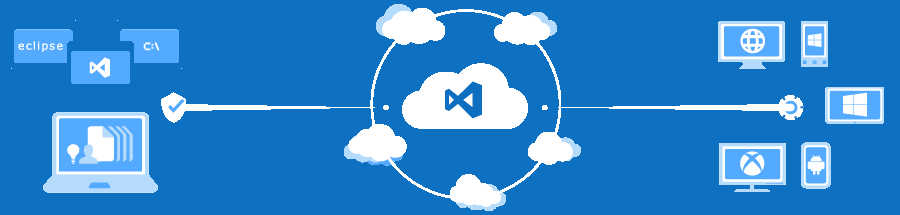
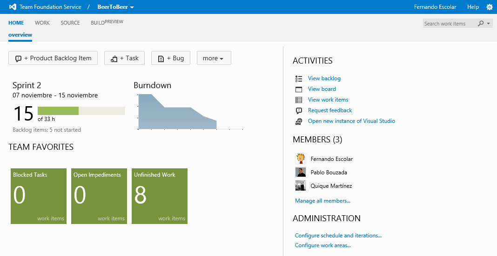
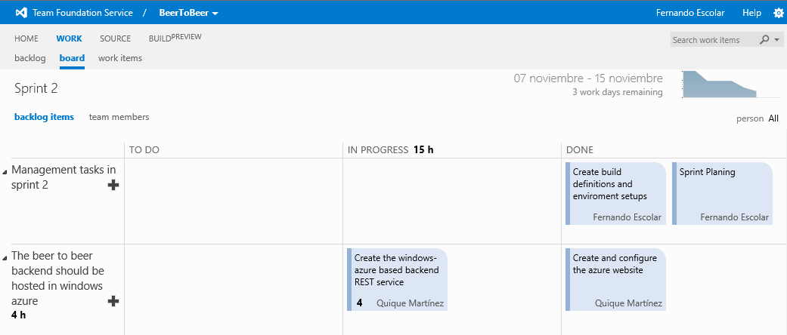
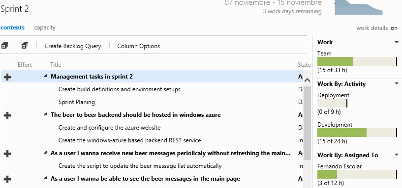
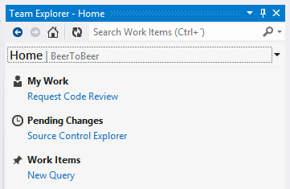
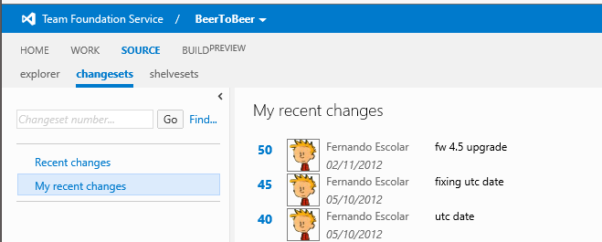
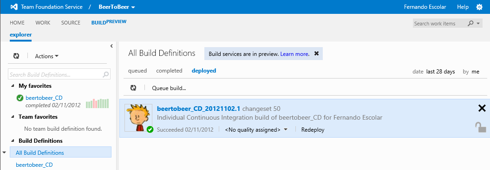

<properties
	pageTitle="Team Foundation Service, tu herramienta ALM en la nube"
	description="Team Foundation Service, tu herramienta ALM en la nube"
	services="ALM"
	documentationCenter=""
	authors="andygonusa"
	manager=""
	editor="andygonusa"/>

<tags
	ms.service="ALM"
	ms.workload="TFS"
	ms.tgt_pltfrm="na"
	ms.devlang="na"
	ms.topic="how-to-article"
	ms.date="05/16/2016"
	ms.author="andygonusa"/>

#Team Foundation Service, tu herramienta ALM en la nube

<http://www.dnmplus.net>

Fernando Escolar Martínez-Berganza (Pasiona)

En la BUILD Conference del año pasado, Microsoft presentó, y puso a
disposición de algunos afortunados, la unión de dos de sus productos
estrella: Team Foundation Server (TFS) y Windows Azure. Este nuevo
producto pasaría a conocerse como Team Foundation Server on Azure o,
simplemente, TFS Preview. Ahora, un año más tarde, y volviendo a
aprovechar el mismo evento, Microsoft presentó la versión definitiva,
con el nombre final de **Team Foundation Service**.

Team Foundation Service es un nuevo servicio de Microsoft en el que se
nos proporciona la herramienta de gestión de ciclo de vida de
aplicaciones TFS bajo la modalidad de SaaS (*Software as a Service*),
como muestra la figura 1. Esto quiere decir que, para poder
beneficiarnos de las ventajas de usar esta herramienta, no tendremos que
pagar por diferentes licencias, ni montar nuestra propia pequeña granja
de servidores o pasar por una serie de tediosos procesos de instalación.
Bastará con darnos de alta en una página web, y tendremos a nuestro
alcance los beneficios de esta gran herramienta de gestión del ciclo de
vida de las aplicaciones.

Figura 1

<!-- -->

    

Preview vs. RTM
---------------

Aparte de los usuarios invitados hace un año, durante este verano se
abrió el acceso a TFS Preview sin necesidad de una invitación previa.
Aquellos que ya conocieran el servicio y también los que estén usándolo
en este momento, lo primero que tendrán que tener en cuenta es que ha
cambiado la dirección de acceso al mismo. En lugar de usar
**www.tfspreview.com**, ahora debemos acceder a la página principal en
la dirección **tfs.visualstudio.com**. Asimismo, si antes teníamos
nuestro sitio de TFS en una dirección tipo **X.tfspreview.com**,
deberemos saber que ahora lo encontraremos en **X.visualstudio.com**. En
cualquier caso, debemos señalar que las direcciones antiguas se
conservarán unos meses para dar un margen a que los usuarios puedan
cambiar sus configuraciones.

La mayor ventaja de que el servicio se encuentre en producción es que
pasa a tener soporte a largo plazo. Los datos que almacenemos en el
mismo están seguros, y el personal de Microsoft ha sido formado para
poder prestar ayuda a los clientes que lo precisen. Es decir, que se
haya publicado la versión RTM significa que el servicio está 100% listo
para su uso en entornos de producción.

Pero la última consecuencia de esta liberación no hará feliz a todo el
mundo; y es que Team Foundation Service dejará de ser completamente
gratuito. La buena noticia al respecto es que, por ahora solo se tendrá
que pagar cuando sea utilizado por equipos de más de 5 componentes.
Además, los suscriptores de MSDN con licencias Premium, Ultimate o
TestPro podrán disfrutar del producto completo sin límites. Team
Foundation Service permanecerá gratuito para equipos de hasta 5 miembros
con todas las características actuales disponibles.

Un tema a tratar aparte es la ejecución de procesos de *build*, todavía
en versión *preview*. Actualmente encontraremos este servicio disponible
para todos los usuarios sin ningún tipo de límite; pero, de cara al
futuro, se espera que solo esté disponible una cantidad limitada de
horas de proceso al mes para estas actividades. Evidentemente, las
cuentas de suscriptores MSDN tendrán a su disposición un mayor número de
horas que las de los usuarios en modalidad gratuita. Que se pretenda
poner un límite o un precio a esta característica es consecuencia
directa del gasto que puede suponer una elevada cantidad de horas de
proceso, por lo que podemos imaginar que será una acción más temprana
que tardía, antes de que pueda ser demasiado elevado el gasto. Por
último, las personas que no tengan a su disposición una suscripción de
MSDN, pero quieran disfrutar de este servicio sin límites, no tienen por
qué preocuparse. Se espera que el año que viene aparezca una modalidad
de pago, de la que aún no tenemos detalles.

Potenciado por Windows Azure
----------------------------

Al estar hospedado el servicio en Windows Azure, podremos aprovecharnos
de las ventajas que nos ofrece esta plataforma. Ello nos garantizará una
alta disponibilidad de los datos, su seguridad e integridad, además de
las copias de seguridad periódicas, de las que no tendremos que
preocuparnos. El escalado, cuando se nos “quede pequeña” la
configuración inicial de TFS, no será un problema nunca más.

Inicialmente, el uso de Team Foundation Service implicará un menor
gasto, además de un menor riesgo, al no tener que comprar e instalar
hardware y licencias de sistemas operativos. Y eso, sin contar con el
software adicional que podamos necesitar. Además, las actualizaciones
serán gratuitas e inmediatas, sin tener que preocuparnos del
mantenimiento ni la integración.

De esta forma, la empresa se podrá centrar en la creación del software y
la metodología; no tendremos que invertir tiempo alguno en las
herramientas y entornos.

Características principales
---------------------------

Team Foundation Service, al igual que Team Foundation Server 2012, tiene
como arma fundamental para poder enfrentarse a la competencia un sólido
tridente, formado por:

- Gestión del equipo y su trabajo

- Control de código fuente

- Automatización de *builds*, pruebas y despliegues

Gestión del trabajo
-------------------

El campo en el que encontraremos más mejoras es en la gestión del
trabajo en equipo, sobre todo cuando apliquemos metodologías ágiles, y
en especial Scrum. Se ha rediseñado todo el portal web (figura 2), que
ahora es compatible con los navegadores más modernos, sacando el mayor
partido posible de las últimas tecnologías web, como HTML5.

Figura 2

<!-- -->

    

Una vez hemos creado un proyecto de equipo, en la nueva página de cuadro
de mandos podremos visualizar una visión general del estado del
proyecto, incluyendo una gráfica del *burndown*, que nos acompañará en
gran parte de las vistas. Además, podremos añadir a los elementos
favoritos consultas de *work items* almacenadas, que se nos mostrarán de
forma numérica.

Para gestionar el trabajo, encontraremos tres agrupaciones con una
multitud de opciones nuevas y diferentes que nos permitirán una gran
variedad de actividades:

- **Gestión del *backlog***. Se trata de un conjunto de vistas que nos
permitirán organizar los requerimientos e ir asignándolos en cada
iteración. Además, nos servirá también como herramienta para organizar
el plan de un *sprint*. Como herramientas destacadas, encontraremos las
diferentes gráficas de velocidad del equipo y la de trabajo acumulado,
junto con un *backlog board* (figura 3), que dará una visión global al
*Product Owner* y el *Scrum Master* del estado de los requerimientos.

- ***Sprint* actual**. Para que el equipo también saque partido de la
nueva plataforma, se pone a su disposición un *task board* (figura 4)
donde se pueden gestionar las tareas de la iteración actual y gestionar
los *post-it* virtuales, para marcar el trabajo como en progreso o
terminado. Desde luego, una forma mucho más ecológica, aunque menos
personalizable y vistosa.

- **Gestión de los elementos de trabajo**. Una nueva herramienta para
crear y gestionar, desde el portal web, consultas sobre todos los
elementos de trabajo como tareas, requerimientos, bugs, impedimentos…
Estas consultas pueden anclarse al *dashboard* principal añadiéndolas en
la lista de favoritos del equipo.

<!-- -->

Figura 3

<!-- -->

    

<!-- -->

Figura 4

<!-- -->

    

La mayor ventaja de todo esto es que, aunque las herramientas estén
basadas en metodologías ágiles, no es necesario aplicarlas en el día a
día para sacarles partido, y son útiles y fáciles de manejar en
cualquier ámbito. Actualmente podremos gestionar todo lo anterior usando
cualquiera de las tres plantillas de procesos: Scrum, Agile o CMMI.

Aparte de ver pantallas muy intuitivas, podremos utilizar operaciones de
*drag & drop* para arrastrar diferentes elementos de pantalla,
organizando y priorizando el trabajo.

Control de código fuente
------------------------

Dentro del control de código fuente, podremos manejar cualquier lenguaje
de programación: desde C\# a C++, pasando por Java o Python. Gracias a
la extensión Team Explorer (figura 5), disponible para los IDE más
usados (concretamente, Visual Studio y Eclipse), podremos tener un
control total, tanto *online* como en modo local, del código fuente de
nuestros proyectos.

Figura 5

<!-- -->

    

Desde el portal web también tendremos acceso a una visión de todos los
archivos almacenados en el control del código fuente, además de poder
obtener informes suplementarios, como un listado de *changesets* y otro
de *shelvesets* (figura 6).

FIgura 6

<!-- -->

    

A todo lo anterior deberemos añadir dos nuevas funcionalidades para
versiones de Visual Studio Premium o superiores:

- La posibilidad de lanzar un *workflow* de revisión de código, donde el
resto del equipo nos podrá dar *feedback* en tiempo real.

- La nueva vista **My Work** dentro de Team Explorer, que nos permitirá
tener en una sola pantalla la información de nuestro trabajo actual, las
revisiones de código, los *shelvesets* y *work items* que tenemos
asignados.

Automatización de builds, pruebas y despliegues
-----------------------------------------------

La gestión de *builds* y el estudio de sus resultados se pueden realizar
directamente desde el portal web (figura 7), o bien desde Team Explorer.
Podremos beneficiarnos de una máquina en la nube para realizar estas
operaciones de forma automática (al realizar un *check-in* o todas las
noches, por ejemplo) o bajo demanda.

Figura 7

<!-- -->

    

Dentro de estos procesos, podremos incluir acciones como que se evalúen
automáticamente pruebas unitarias, o incluso realizar despliegue
continuo en servicios de Windows Azure.

Por último, gracias a unas plantillas predefinidas, podemos integrar las
*builds* para que utilicen herramientas de terceros, como el compilador
de Java, Apache Maven o Ant, para gestionar nuestro código fuente de
otras plataformas que no sean .NET.

Limitaciones
------------

Actualmente Microsoft está gestionando Team Foundation Server y Team
Foundation Service como dos proyectos diferentes que, con el tiempo,
deberían converger en un mismo producto. Es por esta razón que, al mismo
tiempo que citamos las características que Team Foundation Service
ofrece, no podemos obviar sus limitaciones con respecto la versión
*on-premises*:

- La que consideremos más importante es el hecho de que no podremos crear
plantillas de procesos propias; tendremos que usar alguna de las que
vienen configuradas por defecto: Scrum, Agile o CMMI. Esta carencia con
respecto al TFS tradicional hará que algunas empresas, antes de adaptar
sus procesos, no opten directamente por esta opción.

- Otro problema que podemos encontrar a la hora de migrar o decidirnos
acerca del uso de esta plataforma es que no se puede integrar con otros
servicios empresariales, como pueden ser SharePoint, Project Server o
incluso System Center. Dentro de estos servicios, tampoco se puede
integrar con servicios de federación, razón por la cual, para poder usar
este producto, es imprescindible disponer de una cuenta de Microsoft
Account (anteriormente conocida como Windows Live ID).

- La última de las carencias que pueden hacer poco atractiva esta versión
de Team Foundation Service es el sistema de informes. Aunque se han
añadido muchas plantillas por defecto (que son muy útiles), no se
soportan las funciones de generar informes que encontramos en el
producto *on-premises*.

Pero, como hemos dicho anteriormente, la idea es que ambos productos
converjan en uno solo, por lo que se espera que, con el tiempo, todas
las características que hoy podemos encontrar en TFS 2012 estén
virtualizadas y disponibles dentro del servicio en la nube. Hasta
entonces, es importante medir cuidadosamente los requerimientos que
tenemos antes de decidirnos a utilizarlo.

Conclusiones
------------

Después de un tiempo utilizando la nueva versión de Team Foundation
Service, podemos concluir con que estamos muy satisfechos con la
herramienta. Aparte de las grandes mejoras con respecto a la versión
anterior, nos ha facilitado mucho la creación y configuración del
entorno de trabajo. Simplemente entrando en una página web, dándose de
alta y añadiendo a los componentes del equipo, ya teníamos lista la
herramienta de ALM; después, con unas pequeñas configuraciones más, ya
contábamos con un sistema de *continuous integration and delivery* en
Windows Azure. Y eso, sin contar con lo que nos ha facilitado la
creación de diferentes *sprints* y la gestión de requerimientos y
tareas. Además, hemos probado satisfactoriamente el servicio en otros
entornos, como MacOS, usando Eclipse como IDE y Apache Maven para la
integración continua.

Como hemos comentado antes, el mayor problema que podemos verle por
ahora a Team Foundation Service es la imposibilidad de crear una
plantilla de proceso propia y de usar los usuarios del Active Directory
corporativo. Pero si somos capaces de adaptarnos a los estándares y
usamos servicios como Office 365, esto no tendría por qué constituir un
problema.

Lo que sí recomendamos sin duda alguna a todo el mundo es que, al menos,
prueben este servicio.
