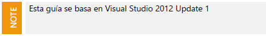
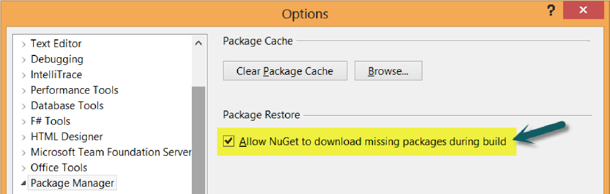

---
redirect_url: https://docs.microsoft.com/
title: Testing Unitario con Microsoft Fakes
description: Testing Unitario con Microsoft Fakes
author: MSCommunityPubService
ms.author: andygon
ms.date: 06/01/2016
ms.topic: article
ms.service: ALM
ms.prod: 
ms.technology:
ms.custom: CommunityDocs
---

#Testing Unitario con Microsoft Fakes

Traducción por Juan María Laó Ramos

    

Twitter: @juanlao

Linkedin: <http://es.linkedin.com/in/juanlao/>

Blog: <http://speakingin.net/>

Prólogo 
--------

En equipos de desarrollo

modernos, el valor de un testeo unitario efectivo y eficiente es algo en
lo que están todos de acuerdo. Tests rápidos, seguros y automáticos que
permiten a los desarrolladores comprobar que su código hace lo que ellos
piensan que debe hacer, incrementan significativamente la calidad
general del código. Sin embargo, crear test unitarios buenos y efectivos
es más difícil de lo que parece. Un buen test unitario es como un buen
experimento científico: aísla tantas variables como sea posible
(llamadas variables de control) y valida o rechaza una hipótesis sobre
lo que ocurre cuando una variable (la independiente) cambia.

Para poder crear código con este tipo de aislamiento hay que prestar
especial atención al diseño y a los patrones que usan los
desarrolladores. En algunos casos, el código está diseñado de manera que
aislar un componente de otro es fácil. Sin embargo, en la mayoría de los
casos, conseguir este nivel de aislamiento es muy difícil. De hecho, es
tan difícil que para algunos desarrolladores es algo imposible.

Incluido por primera vez en Visual Studio 2012, Microsoft Fakes nos
ayuda a mitigar esta dificultad. Hace más fácil y rápido crear test
unitarios bien aislados cuando ya tenemos sistemas que son “testables”,
permite centrarnos en escribir los test adecuados sin escribir test
acoplados. También nos permite aislar y testear código que
tradicionalmente no es fácil de testear, usando la tecnología conocida
como Shims. Shims permite eliminar las dependencias complejas y
reemplazarlas por algo que podemos controlar. Como ya hemos comentado,
ser capaz de crear estas variables de control es muy importante cuando
creamos test unitarios rápidos y de calidad.

Shims ofrece una forma de evitar muchas de las dificultades que nos
encontramos cuando queremos hacer tests unitarios de nuestro código.
Como con todas las herramientas de este tipo, hay algunos patrones,
técnicas y conceptos que pueden llevar tiempo aprender. Este documento
no es más que un empujón para adquirir ese conocimiento compartiendo
numerosos ejemplos y técnicas que permitan usar de manera adecuada
Microsoft Fakes en vuestros proyectos.

Nos alegra escribir el prólogo de esta guía producida por los Visual
Studio ALM Rangers. Estamos seguros de que os ayudará a entender el
poder y las capacidades que Microsoft Fakes ofrece a la hora de crear
mejores test unitarios y mejor código.

**Peter Provost-** Program Manager Lead, Visual Studio ALM Tools

**Joshua Weber –**Program Manager, Visual Studio ALM Tools

Introducción 
-------------

Bienvenidos a Mejor Unit Testing con Microsoft Fakes [^1] en el que, los
ALM Rangers, os acompañaremos en un viaje fascinante para descubrir una
nueva, excitante y poderosa característica introducida en Visual Studio
2012.

    

Audiencia 
----------

**Developers! Developers! Developers!** Esperamos que nuestra audiencia
sean mayoritariamente desarrolladores. Veremos algunos conceptos básicos
sobre tests unitarios pero esperamos que la mayoría de nuestros lectores
ya tengan alguna experiencia en escribir tests unitarios. Sin duda,
cierta experiencia previa con algún otro framework de mocking sería muy
positiva. Sin embargo, si estás valorando adoptar Microsoft Fakes como
tu primera solución de mocking, creemos que esta guía te ayudará a
implementar una solución de mocking con Microsoft Fakes de manera
adecuada. Si es la primera vez que oyes términos como test unitarios y
mocking, esta guía también es muy buena para introducirte en estos
conceptos que todos los desarrolladores necesitan en su caja de
herramientas.

¿Qué necesitas?

Las siguientes ediciones de Visual Studio soportan Microsoft Fakes y son
las que se han usado en esta guía:

- Visual Studio Ultimate 2012

- Visual Studio Premium 2012 (Es necesario Visual Studio 2012 Update 2)

Para escribir test unitarios con Microsoft Fakes necesitarás una edición
soportada de Visual Studio. La ejecución de estos test en un servidor de
builds también requiere una edición soportada. Es posible ejecutar los
test con Team Foundation Server 2010 y quizás con versiones anteriores.
Sin embargo, para una buena experiencia, recomendamos usar Team
Foundation Server 2012. Los test de Microsoft Fakes se pueden compartir
y enseñar a otros miembros del equipo que no estén usando una edición
soportada de Visual Studio, pero no podrán ejecutarlos.

Visual Studio ALM Rangers 
--------------------------

Los Visual Studio ALM Rangers son un grupo especial compuesto por
miembros del grupo de producto de Visual Studio, de Microsoft Services,
de Microsoft Most Valuable Professionals (MVP) y de Visual Studio
Community Leads. Su misión es ayudar a la comunidad. La lista de Rangers
está creciendo y la podéis ver online [^2].

Autores 
--------

Brian Blackman, Carsten Duellmann, Dan Marzolini, Darren Rich, David V.
Corbin, Hamid Shahid, Hosam Kamel, Jakob Ehn,

Joshua Weber, Mehmet Aras, Mike Fourie, Patricia Wagner, Richard
Albrecht, Richard Fennell, Rob Jarratt, Shawn Cicoria, Waldyr Felix,
Willy-Peter Schaub

Uso del código fuente, erratas y soporte 
-----------------------------------------

Todo el código fuente de la guía está disponible en la página de Visual
Studio Test Tooling Guidance [^3] con las últimas correcciones y
actualizaciones.

Los Hands-on Labs usan la propiedad Nuget Package Restore [^4]. Tendréis
que habilitarlo en las opciones de Visual Studio si aún no lo habéis
hecho:

    

Expresiones Lambda 
-------------------

Una expresión lambda es una forma concisa de escribir funciones anónimas
que podemos usar para crear delegados o expresiones arbóreas. Con las
expresiones lambda, podemos escribir funciones locales que se pueden
pasar como parámetros o que se pueden devolver como valor de retorno de
una función. Haremos un uso extenso de estas expresiones en el código de
ejemplo. Si eres nuevo en el tema de las expresiones lambda, te
recomendamos que leas la sección de MSDN dedicada a ello *Lambda
Expresions (C\# Programming Guide)* [^5]

-------------------------------
La información contenida en este documento representa la visión
Microsoft Corporation sobre los asuntos analizados a la fecha de
publicación. Dado que Microsoft debe responder a las condiciones
cambiantes del mercado, no debe interpretarse como un compromiso por
parte de Microsoft, y Microsoft no puede garantizar la exactitud de la
información presentada después de la fecha de publicación.

Este documento es sólo para fines informativos. MICROSOFT NO OFRECE
NINGUNA GARANTÍA, EXPRESA, IMPLÍCITA O LEGAL, EN CUANTO A LA INFORMACIÓN
CONTENIDA EN ESTE DOCUMENTO.

Microsoft publica este documento bajo los términos de la licencia
Creative Commons Attribution 3.0 License. Todos los demás derechos están
reservados.

*© 2013 Microsoft Corporation. *

Microsoft, Active Directory, Excel, Internet Explorer, SQL Server,
Visual Studio, and Windows son marcas comerciales del grupo de compañías
de Microsoft.

Todas las demás marcas son propiedad de sus respectivos dueños

The information contained in this document represents the current view
of Microsoft Corporation on the issues discussed as of the date of
publication. Because Microsoft must respond to changing market
conditions, it should not be interpreted to be a commitment on the part
of Microsoft, and Microsoft cannot guarantee the accuracy of any
information presented after the date of publication.

This document is for informational purposes only. MICROSOFT MAKES NO
WARRANTIES, EXPRESS, IMPLIED OR STATUTORY, AS TO THE INFORMATION IN THIS
DOCUMENT.

Microsoft grants you a license to this document under the terms of the
Creative Commons Attribution 3.0 License**.** All other rights are
reserved.

*© 2013 Microsoft Corporation. *

Microsoft, Active Directory, Excel, Internet Explorer, SQL Server,
Visual Studio, and Windows are trademarks of the Microsoft group of
companies.

All other trademarks are property of their respective owners.

[^1]: http://msdn.microsoft.com/en-us/library/hh549175.aspx

[^2]: http://blogs.msdn.com/b/willy-peter\_schaub/archive/2012/06/22/introducing-the-visual-studio-alm-rangers.aspx

[^3]: http://vsartesttoolingguide.codeplex.com

[^4]: http://blog.nuget.org/20120518/package-restore-and-consent.html

[^5]: http://msdn.microsoft.com/en-us/library/bb397687.aspx

