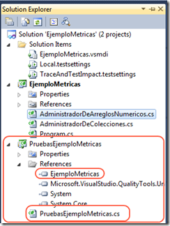
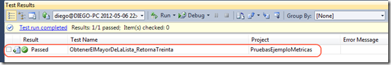
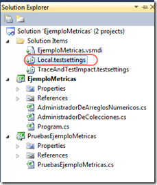
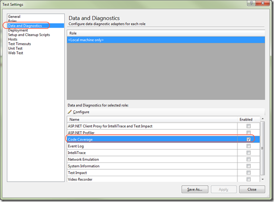
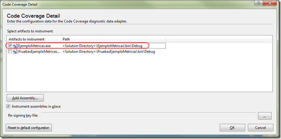
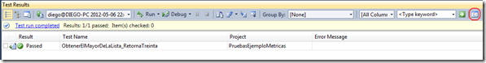
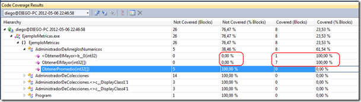
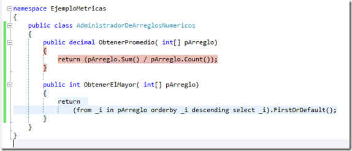
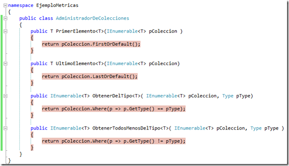

<properties
	pageTitle="Métricas en Visual Studio: Cobertura de las pruebas unitarias"
	description="Métricas en Visual Studio: Cobertura de las pruebas unitarias"
	services="ALM"
	documentationCenter=""
	authors="andygonusa"
	manager=""
	editor="andygonusa"/>

<tags
	ms.service="ALM"
	ms.workload="Metrics"
	ms.tgt_pltfrm="na"
	ms.devlang="na"
	ms.topic="how-to-article"
	ms.date="05/16/2016"
	ms.author="andygonusa"/>

#Métricas en Visual Studio: Cobertura de las pruebas unitarias


##**Diego Rojas**                                      
**MCTS WCF 3.5 - MCTS Biztalk - MCTS Data Access** 
Junio 2012

[Blog](http://icomparable.blogspot.com/)


En lo que respecta a las pruebas unitarias, siempre existirá el factor
humano a la hora de garantizar la calidad estructural del software a
partir de estas pruebas, y normalmente cuando se trata de enseñar el
tema a los desarrolladores de software surgen las mismas preguntas:

-  ¿Cómo saber si las pruebas están bien hechas?

-    ¿Qué debo probar y que no debo probar?

-   ¿Cómo se cuanto código es verificado con nuestros unit test?

Esta y muchas otras preguntas pueden responderse de muchas formas; sin
embargo, con la ayuda de las métricas de visual studio podemos obtener
información para responder estas y muchas otras preguntas. En este post
nos vamos a enfocar en como determinar la cantidad de código cubierto
por nuestras pruebas unitarias utilizando Visual Studio 2010.

### Proyecto Ejemplo

Nuestro proyecto será una simple aplicación de consola con dos clases
con diferentes propósitos. Una que nos permitirá manipular colecciones
de objetos y otra que nos permita manipular arreglos de enteros.

La clase que nos permite manipular colecciones de objetos es la
siguiente:

``` C#

<!-- -->
public class AdministradorDeColecciones
{
    public T PrimerElemento<T>(IEnumerable<T> pColeccion )
    {
        return pColeccion.FirstOrDefault();
    }
    public T UltimoElemento<T>(IEnumerable<T> pColeccion)
    {
        return pColeccion.LastOrDefault();
    }
    public IEnumerable<T> ObtenerDelTipo<T>(IEnumerable<T> pColeccion, Type pType)
    {
        return pColeccion.Where(p => p.GetType() == pType);
    }
    public IEnumerable<T> ObtenerTodosMenosDelTipo<T>(IEnumerable<T> pColeccion, Type pType )
    {
        return pColeccion.Where(p => p.GetType() != pType);
    }
}
```

La clase que nos permite manipular arreglos de enteros es la siguiente:

``` C#
public class AdministradorDeArreglosNumericos
{
    public decimal ObtenerPromedio( int[] pArreglo)
    {
        return (pArreglo.Sum() / pArreglo.Count());
    }

    public int ObtenerElMayor( int[] pArreglo)
    {
        return (from _i in pArreglo orderby _i descending select _i).FirstOrDefault();
    }
}
```

Ahora procedemos a crear un proyecto para realizar nuestras pruebas
unitarias a la clase anterior. Para esto creamos en la misma solución un
proyecto de Test en WCF. La solución se ve ahora de la siguiente forma:



En la figura anterior se pueden ver dos cosas relevantes: 1. se agregó
una referencia al proyecto donde están las clases a probar. 2. Se creó
un archivo del tipo “unit test” básico. Ahora vamos a crear un test para
probar el método ObtenerElMayor de la clase
AdministradorDeArreglosNumericos.

``` C#

[TestClass]
public class PruebasEjemploMetricas
{
    [TestMethod]
    public void ObtenerElMayorDeLaLista_RetornaTreinta()
    {
        int[] _lista = {11, 4, 8, 6, 30, 7};
        var _administrador = new AdministradorDeArreglosNumericos();
        int _resultado = _administrador.ObtenerElMayor(_lista);
        Assert.AreEqual(30, _resultado, "Retorno del mayor de la lista incorrecto");
    }
}
```

Esta prueba al ser ejecutada pasa sin ningún problema.


    

Ahora, queremos ver cuanto código esta cubierto por nuestras pruebas
unitarias –&gt; en este caso, un método con una prueba. Este dato es
relevante sobre todo cuando la cantidad de código escrito es abundante y
las pruebas unitarias aparentan tener todo cubierto.

### Test Coverage en Visual Studio

En Visual Studio 2010 podemos calcular la cantidad de código que está
cubierta por las pruebas unitarias cambiando la configuración en el
archivo Local.testsettings.


    

Al darle doble click al archivo nos aparecerá un diálogo de
configuración. En esta pantalla procedemos seleccionar “Data and
Diagnostics” y marcamos la opción “Code Coverge” tal y como se muestra
en la figura.


    

El siguiente paso es configurar el “Code Coverage” por lo que procedemos
a dar click sobre el botón “configure” justo arriba de la lista de
roles. Ahí nos aparecerá la siguiente pantalla.


    

Aquí procedemos a seleccionar el assembly sobre el cual queremos aplicar
la métrica. Ahora procedemos a ejecutar la prueba unitaria de nuevo y
seleccionamos la opción de ver los resultados de la cobertura de las
pruebas.


    

En esta pantalla si expandimos los resultados podemos ver el código
cubierto por nuestra prueba unitaria. Como podemos ver en los resultados
todos los métodos tienen 0% de cobertura excepto el método
ObtenerElMayor.


    

Por último, en Visual Studio todos los métodos que no estén cubiertos
por las pruebas unitarias estarán marcados por un fondo rojo, y los que
si estén cubiertos por al menos una prueba unitaria estarán con el fondo
celeste. Esto se puede ver en la siguiente figura.


    

Igualmente, la clase AdministradorDeColecciones al no tener una prueba
unitaria tendrá todos sus métodos marcados con fondo rojo.


    


