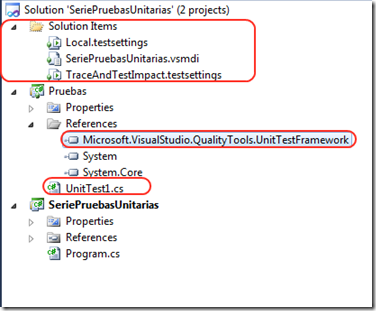
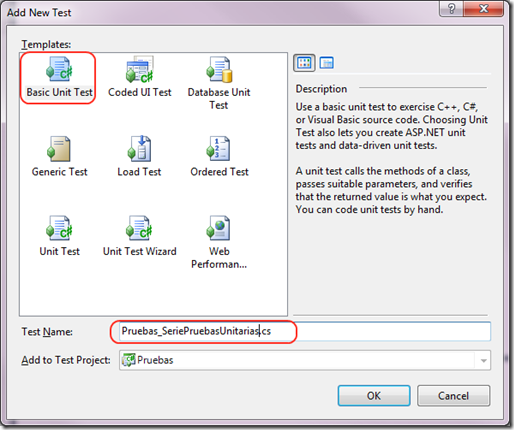

  Diego Rojas, MCTS WCF 3.5 - MCTS Biztalk - MCTS Data Access   Mayo 2012
  ------------------------------------------------------------- -----------
  [Blog](http://icomparable.blogspot.mx/)

Existen muchas definiciones acerca de lo que realmente es una prueba
unitaria – unit test – sin embargo algunas son ambiguas y otras tienen
un enfoque determinado de acuerdo a la situación en que se utilizan o se
desarrollan. En este post vamos a tratar de caracterizar más que definir
que es una prueba unitaria.

Identificar un Unit Test
------------------------

Un unit test es un método que prueba una unidad de código. Al hablar de
una unidad de código nos referimos a un requerimiento. Muchos
desarrolladores tienen su propio concepto de lo que es una prueba
unitaria; sin embargo, la gran mayoría coincide en que una prueba
unitaria tiene las siguientes características:

1.  Prueba solamente pequeñas cantidades de código: Solamente prueba el
    código del requerimiento específico.

    Se aísla de otro código y de otros desarrolladores: El unit test
    prueba exclusivamente el código relacionado con el requerimiento y
    no interfiere con el trabajo hecho por otros desarrolladores.

    Solamente se prueban los endpoints públicos: Esto principalmente
    porque los disparadores de los métodos privados son métodos públicos
    por lo tanto se abarca el código de los métodos privados dentro de
    las pruebas.

    Los resultados son automatizados: Cuando ejecutamos las pruebas lo
    podemos hacer de forma individual o de forma grupal. Estas pruebas
    las hace el motor de prueba y los resultados de los mismos deben de
    ser precisos con respecto a cada prueba unitaria desarrollada

    Repetible y predecible: No importa el orden y las veces que se
    repita la prueba, el resultado siempre debe de ser el mismo.

    Son rápidos de desarrollar: Contrariamente a lo que piensan los
    desarrolladores –&gt; que el desarrollo de pruebas unitarias quita
    tiempo – los unit test por lo general deben de ser simples y rápidos
    de desarrollar. Difícilmente una prueba unitaria deba de tomar más
    de cinco minutos en su desarrollo.

Ejemplo
-------

Para entender mejor que es una prueba unitaria vamos a proceder a hacer
un ejemplo. Supongamos que tenemos un método que nos indica si en un
arreglo de strings existe al menos un string que sea igual a la palabra
que estamos pasando por parámetro. El código del método es el siguiente:

1.  C\#

<!-- -->

1.  public class AdministradorDeArreglos

    {

    public bool ExisteEnArreglo(string\[\] pArreglo, string pPalabra)

    {

    return pArreglo.Any(p =&gt; p.ToUpper() == pPalabra.ToUpper());

    }

    }

Para probar el Código escribimos lo siguiente

1.  C\#

<!-- -->

1.  static void Main(string\[\] args)

    {

    var \_administradorDeArreglos = new AdministradorDeArreglos();

    string\[\] \_arreglo = {"Manaza", "Papaya", "Melón", "Sandía",
    "Piña", "Banano"};

    Console.WriteLine(
    \_administradorDeArreglos.ExisteEnArreglo(\_arreglo, "Banano") );

    }

Y el resultado final será:

1.  {width="5.2312806211723535in"
    height="2.657323928258968in"}

Ahora vamos a proceder a probar el código creando una prueba unitaria.
El primer paso es agregar un proyecto a la solución del tipo Test –&gt;
vamos a utilizar MSTest para hacer las pruebas unitarias en este ejemplo
\[Observación: Yo utilizo Visual Studio Ultimate por lo tanto algunas
opciones de testing pueden no aparecer en otras versiones menores o
pueden estar en otro orden\].

1.  {width="5.491803368328959in"
    height="3.814041994750656in"}

Como vemos en la siguiente figura, se va a crear un proyecto de testing
que tiene una referencia directa al componente – dll – en donde están
todas las librerías para hacer pruebas unitarias con el MSTest. Además,
se crea un archivo inicial de testing y un grupo de tres “Solution
Items” desde donde vamos a poder configurar y administrar las
funcionalidades de nuestros tests.

1.  {width="3.9182502187226596in"
    height="3.2408934820647417in"}

Ahora procedemos a borrar el archivo UnitTest1.cs y vamos a crear uno
desde cero. Luego de borrar el archivo, procedemos a agregar una
referencia al proyecto que queremos probar. Luego damos botón derecho
sobre el proyecto de testing y seleccionamos agregar nuevo test.

1.  {width="5.1374934383202095in"
    height="2.542694663167104in"}

Ahora procedemos a seleccionar el tipo de prueba de unidad que vamos a
crear, en nuestro caso una prueba de unidad básica.

1.  {width="5.3563320209973755in"
    height="4.4809776902887135in"}

Este paso nos va a generar un archivo de pruebas básico con un método de
pruebas de ejemplo que cual vamos a proceder a eliminar.

1.  C\#

<!-- -->

1.  using Microsoft.VisualStudio.TestTools.UnitTesting;

    namespace Pruebas

    {

    \[TestClass\]

    public class Pruebas\_SeriePruebasUnitarias

    {

    \[TestMethod\]

    public void TestMethod1()

    {

    }

    }

    }

En el código anterior vemos que la clase generada esta marcada con el
atributo TestClass, esto le indica al motor de pruebas de visual studio
que dentro de esta clase existen pruebas de unidad que debe ejecutar.
Los métodos de prueba son métodos públicos de tipo void que están
marcados por el atributo \[TestMethod\] como se ve en la figura
anterior.

Ahora procedemos a crear nuestra primera prueba unitaria. El código de
la prueba unitaria es el siguiente:

1.  C\#

<!-- -->

1.  \[TestClass\]

    public class Pruebas\_SeriePruebasUnitarias

    {

    \[TestMethod\]

    public void ExisteArreglo\_RetornaTrue()

    {

    var \_administradorDeArreglos = new AdministradorDeArreglos();

    var \_resultado =

    \_administradorDeArreglos.ExisteEnArreglo(new\[\] { "Argentina",
    "Brasil", "Perú" }, "Brasil");

    Assert.IsTrue(\_resultado);

    }

    }

La prueba unitaria anterior prueba específicamente la unidad de código
“ExisteEnArreglo” de la clase AdministradorDeArreglos.

Al Ejecutar el unit test el resultado será el siguiente:

1.  {width="5.554328521434821in"
    height="0.9170374015748032in"}

Como podemos ver, el test pasó y el panel de resultados de VS así me lo
hace saber.

**Estructura del Unit Test**

Para terminar, es importante notar que los unit test tienen por lo
general una estructura compuesta de tres partes:

Arrange: Es la parte del unit test en donde se configura todo el código
para ejecutar la prueba unitaria. En nuestro caso, el “arrange” es la
creación de la instancia de la clase AdministradorDeArreglos.

Act: Esta es la fase del unit test en donde se ejecuta el código a
probar. En nuestro caso es la invocación del método de instancia
ExisteEnArreglo.

Assert: Es la sección de la prueba unitaria en donde se prueba el
resultado del mismo. En este caso y por lo general, lo hacemos con la
clase Assert –&gt; en MSTest –&gt; y es donde verificamos que la
variable \_resultado == true;
