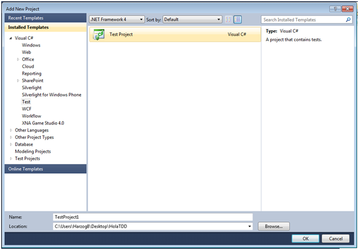
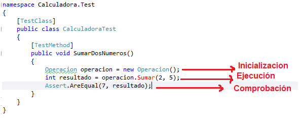
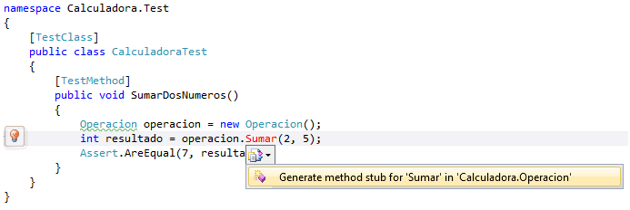
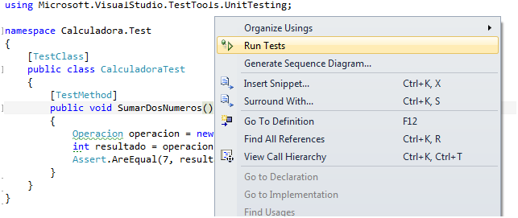
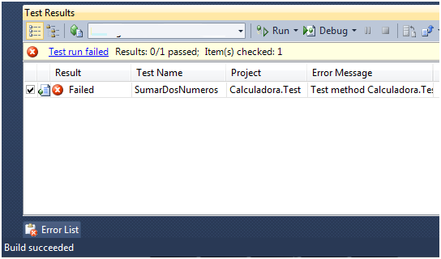
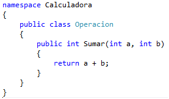
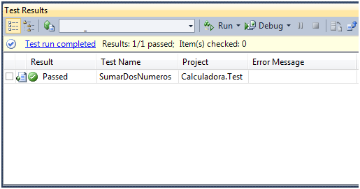
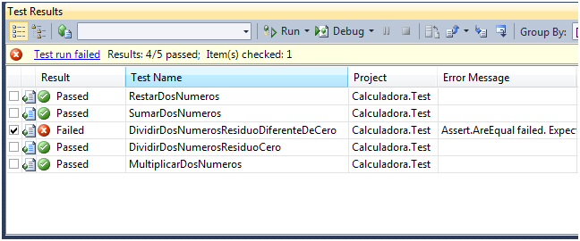
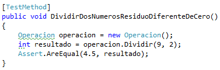
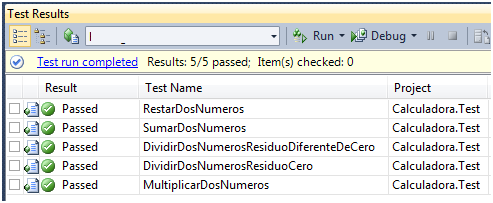

  --------------------------------------------------------------------------------------------------------
  Nicolás Herrera                                                                             Julio 2012
                                                                                              
  MVP, miembro Gold del grupo de Microsoft Community Specialist Colombia, blogger y speaker   
  ------------------------------------------------------------------------------------------- ------------
  [Blog](http://nicolocodev.wordpress.com/)
  --------------------------------------------------------------------------------------------------------

En nuestro diario vivir como desarrolladores siempre debemos cumplir con
tareas que demandan tiempo como pueden ser realizar cambios en el
código, hacer mantenimiento a un software o simplemente querer
desarrollar más rápido y mejor. Pero ¿cómo se podrían lograr estas
metas? Bien, pues aplicando unos conceptos claves a la hora del
desarrollo, como lo son **Refactoring** y *Pruebas Unitarias. *

El *refactoring* es una técnica para reestructurar un código fuente,
alterando su estructura interna sin cambiar su comportamiento externo,
esto es, la capacidad de mejorar el código sin perder la funcionalidad
del mismo y lo aplicamos siempre que veamos acoplamiento, complejidad
innecesaria y en general siempre que veamos algo que puede ser mejorado,
y para poder aplicar el *refactoring* debemos apoyarnos de las pruebas
unitarias, ¿por qué? Porque es difícil pensar en cambiar algo que
creemos que funciona perfectamente. Las pruebas unitarias son código que
prueba otro código, con Visual Studio por ejemplo, tenemos herramientas
que nos permiten hacer este tipo de pruebas a nuestro código
persiguiendo el objetivo de verificar que estamos cumpliendo con los
requerimientos del cliente, esto nos permite trabajar de la mano del
cliente mostrando resultados inmediatos y corregir en tiempo record, no
solo nuestros errores si nos los mismos errores del cliente, pues como
sabemos NI SIQUIERA LOS CLIENTES SABEN LO QUE QUIEREN y si no lo sabías,
no esperes a comprobarlo. Ahora bien, ¿sobre qué aplicamos nuestras
pruebas unitarias? Estas se deben aplicar sobre las partes más pequeñas
y comprobables de una aplicación, esto es, en los métodos de las clases.

### 

### Características de las pruebas unitarias:

1.  **Automatizable**: no debería requerirse una intervención manual.

    **Completas**: deben cubrir la mayor cantidad de código.

    **Repetibles o Reutilizables**: no se deben crear pruebas que sólo
    puedan ser ejecutadas una sola vez.

    **Independientes**: la ejecución de una prueba no debe afectar a la
    ejecución de otra.

Las pruebas unitarias están conformadas por una estructura triple A,
estas son:

1.  **Arrange (Inicialización)**: donde se prepara el contexto de la
    prueba y se inicializan variables y demás.

    **Act (Ejecución)**: Ejecutas la funcionalidad que se desea probar.

    **Assert (Comprobación)**: se comprueba que lo que se ejecuto hace
    lo que se desea.

### ¿Y todo esto para qué?

Las dos practicas que se mencionaron anteriormente constituyen al TDD,
el test driven development es toda una forma de construir software y se
basa en que las pruebas son las que deben regir el desarrollo, esto es,
antes de tener empezar a escribir código funcional escribimos primero la
prueba y luego si nos preocuparemos de su implementación. Para hacer TDD
aplicamos el semáforo de las TDD, esto es, Rojo, Verde Refactoring, es
decir, primero escribimos las prueba, probamos que falle, escribimos el
código necesario para que funcione y comprobamos si algo puede ser
mejorado y refactorizamos

### Ejemplo:

Para este ejemplo, supondremos que nuestro cliente nos ha pedido una
calculadora que dado dos números enteros haga las operaciones básicas,
estas son Suma, resta, multiplicación y división.

Empezamos por crear un proyecto de librería de clases donde tendremos el
código y para realizar las pruebas a este código, agregaremos un nuevo
proyecto de tipo test, eliminamos las clases que nos genera Visual
Studio automáticamente:

1.  {width="6.198781714785651in"
    height="4.313102580927384in"}

Agregamos una clase llamada Operacion al proyecto calculadora, y sobre
el proyecto de test añadimos un test llamado CalculadoraTest, sobre este
agregamos una referencia al proyecto Calculadora.

Lo siguiente será realizar la prueba más simple (en este caso todas son
igualmente simples) pero empezaremos por poder sumar dos números.
Nuestra primera prueba unitaria luciría de esta forma:

1.  {width="6.146691819772529in"
    height="2.427422353455818in"}

Vemos que Visual Studio nos informa que el método Sumar(int, int ) no
existe en la clase operación, entonces le pedimos a este que nos cree el
método en esta clase:

1.  {width="6.5in"
    height="2.1756944444444444in"}

Compilamos, comprobamos que compila, ejecutamos la prueba unitaria
haciendo click derecho en el método y comprobamos que falle:

1.  {width="6.5in"
    height="2.738888888888889in"}

    {width="5.667458442694663in"
    height="3.333799212598425in"}

Lo que sigue es intentar ponerla en verde, para esto realizamos los
cambios necesarios en el método Sumar:

1.  {width="2.8858191163604547in"
    height="1.698153980752406in"}

Volvemos a ejecutar la prueba y comprobamos que funcione:

1.  {width="5.365332458442695in"
    height="2.8233103674540683in"}

El siguiente paso es hacer *refactoring*, pero simplificar o arreglar la
implementación de este método es innecesario porque es muy simple.

Seguimos escribiendo las pruebas para cada uno de los requerimientos que
tenemos, implementamos, comprobamos que fallen, hacemos solo lo
necesario para que funcionen y hacemos refactoring, el resultado de mis
pruebas es:

1.  {width="6.5in"
    height="2.7083333333333335in"}

Sí, me falla una prueba, y es una prueba un poco rara, pero es que este
es uno de los principios de TDD, no solo podemos probar lo que estamos
seguros funcionara, debemos probar también lo mas poco común y que es lo
que siempre falla en producción, pues si hay algo para lo que es bueno
un usuario final, es para reventar programas no se ofendan. El código de
esta prueba es:

1.  {width="3.9276312335958004in"
    height="1.250174978127734in"}

Hacemos lo necesario para que esta prueba funcione, y volvemos a correr
todas las pruebas:

1.  {width="5.136134076990376in"
    height="2.1148786089238847in"}

Bien con esto llegamos al final de esta introducción a las TDD con
Visual Studio, en próximos post veremos más a detalle esta herramienta y
otras más, espero además poder presentarles unos casos más empresariales
y cómo podemos afrontarlos desde el punto de vista de las TDD.

[*Descarga el
ejemplo.*](https://skydrive.live.com/redir.aspx?cid=73aa1b824471902b&resid=73AA1B824471902B!573&parid=73AA1B824471902B!372)

Hasta el próximo post.
