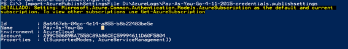
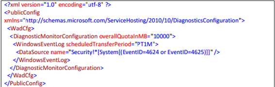
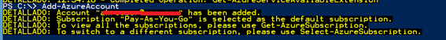

Por [Juan José Diaz
Antuña](http://mvp.microsoft.com/en-us/mvp/Juan%20Jose%20Diaz%20Antu%c3%b1a-5000260),
@diazantuna 

Microsoft MVP

Windows Expert-IT Pro

En este post os explico cómo hacer para habilitar la captura de los
diferentes logs del visor de eventos de una máquina virtual en Azure.
Pasos a dar:

Obtener fichero de publicación de Azure

1.  {width="4.853559711286089in"
    height="0.39578412073490815in"}

Descargamos el fichero

Importamos el fichero

1.  {width="5.905511811023622in"
    height="0.8436450131233596in"}

Preparamos los eventos que queremos capturar con el fichero XML

1.  {width="5.905511811023622in"
    height="1.8643503937007875in"}

Descargamos el fichero WAD para validar nuestro XML

1.  {width="5.905511811023622in"
    height="0.36453740157480313in"}

Si queremos validar nuestro archivo debemos de utilizar Visual Studio,
en mi caso no lo he realizado

Añado la cuenta de Azure

1.  {width="5.905511811023622in"
    height="0.5415988626421697in"}

Creo el script

1.  Script

\$storage\_name =* *“Nombre del almacenamiento en Azure”*\
*

\$key = “Clave almacenamiento en Azure”*\
*

\$config\_path=”Path fichero configuración configurado anteriormente”*\
*

\$service\_name=”Nombre del servicio”*\
*

\$vm\_name=”Nombre VM”*\
*

\$storageContext = New-AzureStorageContext -StorageAccountName
\$storage\_name -StorageAccountKey \$key*\
*

\$VM1 = Get-AzureVM -ServiceName \$service\_name -Name \$vm\_name*\
*

\$VM2 = Set-AzureVMDiagnosticsExtension -DiagnosticsConfigurationPath
\$config\_path -Version “1.\*” -VM \$VM1 -StorageContext
\$storageContext*\
*

1.  \$VM3 = Update-AzureVM -ServiceName \$service\_name -Name \$vm\_name
    -VM \$VM2.VM*\
    *

Ejecuto el script

1.  {width="5.905511811023622in"
    height="0.4061996937882765in"}

Ya está configurada la captura de logs, para verlos utilizo el Azure
Storage Explorer.
