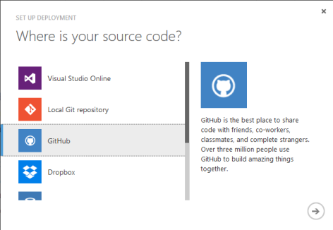
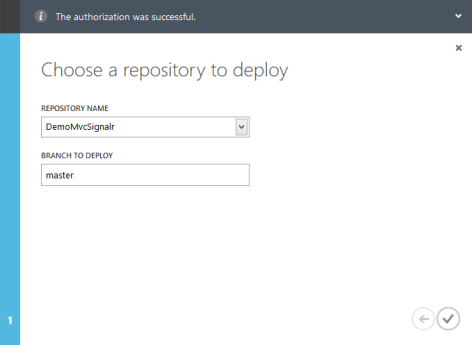
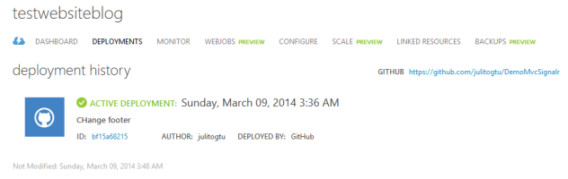
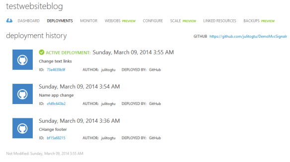
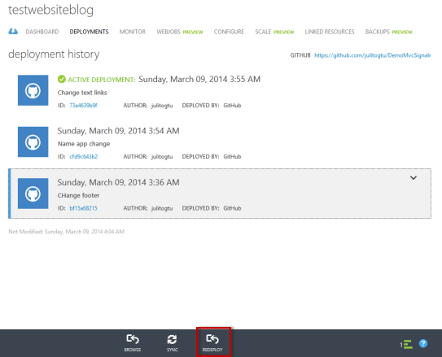

Por [Julio Cesar
Avellaneda](http://mvp.microsoft.com/en-us/MVP/Julio%20Cesar%20Avellaneda-4038198)

Microsoft MVP ASP.NET\
MCT | MCSD | MCTS\
Core Group BDotNet\
[http://julitogtu.com](http://julitogtu.com/)\
[@julito](https://twitter.com/julitogtu)

Hola, últimamente he visto varias personas que ven los [Azure Web
Sites](http://www.windowsazure.com/en-us/services/web-sites/) como
simples “hosting”, creyendo que para lo único que sirven es para
publicar tu sitio Web y… listo, así que pienso hacer una pequeña serie
de post para mostrar algunas características que permiten a los [Azure
Web Sites](http://www.windowsazure.com/en-us/services/web-sites/) ser un
componente robusto e interesante.

En este post vamos a revisar cómo es posible enlazar el Azure Web Site
con algún tipo de repositorio (Visual Studio Online, Git Local, GitHub,
Dropbox, Bitbucket, CodePlex o alguno externo) para automatizar los
despliegues, en ese caso vamos a relacionarlo con un repositorio en
[GitHub](https://github.com/), para ello vamos al dashboard del Web Site
y seleccionamos **Set up deployment from source control**, luego se abre
una ventana modal para elegir el tipo de repositorio, por lo que para
este ejemplo escogemos [GitHub](https://github.com/):

1.  {width="4.917352362204724in"
    height="3.3963068678915134in"}

Luego nos pide autenticarnos con nuestra en GitHub, una vez confirmada
la autenticación, escogemos el repositorio y el branch:

1.  {width="4.917352362204724in"
    height="3.594251968503937in"}

Una vez finalizada la integración, Windows Azure se encarga de realizar
el despliegue y nos informa del mismo:

1.  {width="6.5in"
    height="2.0569444444444445in"}

Uno de los puntos interesantes de esta integración, es que cada vez que
se haga commit al repositorio el **GitHub**, Azure realizará el
despliegue de los cambios y vamos a ver el historial de todos ellos:

1.  {width="6.084181977252843in"
    height="3.406725721784777in"}

Si por alguna razón, necesitamos volver a un deploy anterior, lo podemos
hacer sin problema, basta con seleccionar el deploy y en la parte
inferior seleccionar **Redeploy** para hacer el rollback a una versión
anterior:

1.  {width="5.6570395888014in"
    height="4.573555336832896in"}

Espero les sea de utilidad, en próximos post seguiremos hablando de los
**Azure Web Sites.**

¡Saludos!
