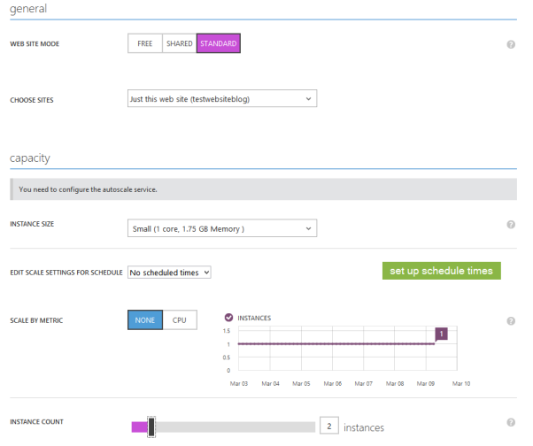
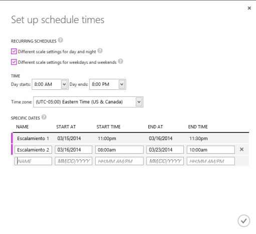

---
redirect_url: https://docs.microsoft.com/
title: Azure Web Sites – Escalamiento
description: Escalar un sitio Web Azure
author: MSCommunityPubService
ms.author: andygon
ms.date: 06/01/2016
ms.topic: article
ms.service: cloud
ms.prod: 
ms.technology:
ms.custom: CommunityDocs
---

#Azure Web Sites – Escalamiento

Por [Julio Cesar Avellaneda](http://mvp.microsoft.com/en-us/MVP/Julio%20Cesar%20Avellaneda-4038198)

Microsoft MVP ASP.NET

MCT | MCSD | MCTS
Core Group BDotNet

[http://julitogtu.com](http://julitogtu.com/)

[@julito](https://twitter.com/julitogtu)

Hola, en el post anterior hablamos de cómo podemos [integrar un Azure
Web Site con un
repositorio](http://julitogtu.wordpress.com/2014/03/10/azure-azure-web-sites-integracion-con-repositorios/),
para así automatizar el proceso de despliegues y tener la posibilidad de
realizar rollbacks en cualquier momento; hoy vamos a ver cómo es posible
escalar dicho Web Site, bastante útil cuando ya lo que viene por default
no es suficiente.

Para comenzar a escalar el Web Site, seleccionamos la opción **SCALE**,
por defecto nuestro Web Site corre en el modo **FREE** con 1 sola
instancia:

Bien, para este ejemplo vamos a escalar a **STANDARD**, y
automáticamente tenemos nuevas opciones disponibles como:

Escoger Web Site: Permite seleccionar el Web Site.

Tamaño de instancia: Permite escoger entre Small, Medium y Large, lo
cual se verá reflejado en el tamaño de la máquina virtual.

Número de instancias: Permite seleccionar el número de instancias
asociadas al Web Site.

Escalamiento: Permite escalar el Web Site en una hora determinada, o por
algún consumo de CPU específico.

Ahora hagamos énfasis en la parte de escalamiento, si escogemos en la
métrica que escale por CPU, dos opciones nuevas se habilitan, la
cantidad de instancias y el consumo de CPU (rango de uso de CPU), allí
entonces definimos el número de instancias (mínimo y máximo) cuando el
consumo de CPU este en un rango determinado:

La otra opción es configurar el escalamiento para una hora determinada,
esto es bastante útil cuando conoces con anterioridad los picos de
tráfico del Web Site, para ello damos clic en Set up schedule times, y
en el modal que se muestra configuramos el escalamiento, allí
inicialmente podemos escoger entre escalamiento diferente para el día y
la noche y/o para días entre semana y fines de semana, y luego
establecemos los horarios:

Al confirmar ya tenemos disponible los escalamientos creados, solo resta
decirle que número de instancias vamos a usar:

Espero el post les sea interesante, ¡hasta la próxima!

Saludos

