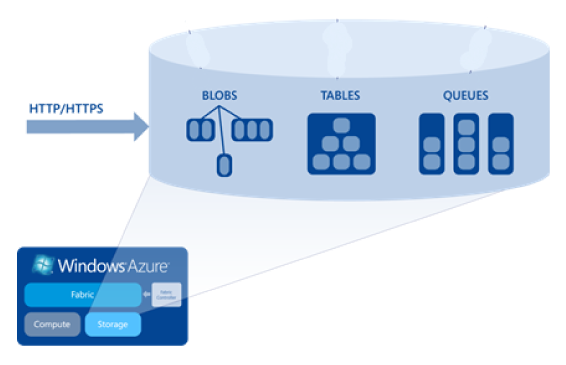
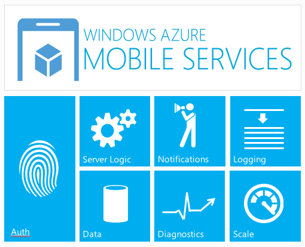

---
redirect_url: https://docs.microsoft.com/
title: Azure como backend de storage para Windows Apps y el poder de los Mobile Services
description: Azure como backend de storage para Windows Apps y el poder de los Mobile Services
author: MSCommunityPubService
ms.author: andygon
ms.date: 06/01/2016
ms.topic: article
ms.service: cloud
ms.prod: 
ms.technology:
ms.custom: CommunityDocs
---

# Azure como backend de storage para Windows Apps y el poder de los Mobile Services

Por Walter Novoa, **Microsoft Developer Evangelist**

Twitter: @warnov

Sitio personal: [http://warnov.com](http://warnov.com/)

Con Windows Apps, me refiero a apps para el Windows Store y para el
Windows Phone Store.

El conocimiento promedio que tenemos hoy en día de Azure y de Cloud
Computing, nos indica que una gran alternativa para las necesidades de
storage que tienen las apps, efectivamente es el storage de Azure. Y uno
va y mira y sí… efectivamente así es. Pero hay que tener en cuenta
ciertos detallitos en los que podemos pecar por ir muy a la ligera.

Si queremos ofrecer almacenamiento en nuestra app a través de una cuenta
de Azure, lo primero que se nos vendría a la mente es: fácil, uso el API
de Storage y la accedo desde mi app. Pero esto tiene dos implicaciones:

El soporte que se le da a la API desde las plataformas de desarrollo de
WP y de WinRT: En este caso, lamento informar que el
Microsoft.WindowsAzure.StorageClient.dll aún no está disponible para
estas plataformas, pese a que en Web, WinForms, WPF, WCF y demás sí es
completamente accesible. Esto nos deja con una sola alternativa y es la
de usar REST puro y duro para acceder al storage de Azure. Es decir,
crear clientes HTTP dentro de del código de la app y configurarlos para
hacer un request REST sobre la API del storage (recordemos que esta API
es nativa REST y por ende se puede acceder de esta manera). Tanto en WP
como en WinRT es completamente viable esto, ya que tenemos las clases
adecuadas. Sin embargo, configurar estos clientes no es fácil ni
amigable. Algunos acercamientos como la librería Windows Azure Storage
Client para Windows Phone disponible a través de NuGet, pueden ayudar a
alivianar la tarea, encapsulando todos estos llamados.
Desafortunadamente hoy no tenemos una equivalencia para WinRT. Tal vez
mediante agunos hacks, uno pudiera usar esta de phone con Windows 8.
Pero entonces viene el 2do. Punto a tener en cuenta:

Independientemente de que hagamos los llamados a través de REST puro o
usando una librería como la citada en phone, siempre debemos incluir la
información de la cuenta para poder tener acceso a Azure.
Tradicionalmente esto no es un gran problema, y digo tradicionalmente
refiriéndome al hecho de que si estamos acostumbrados a crear
aplicaciones de servidor que acceden a Azure, sabemos que los datos de
la cuenta (nombre y clave) están “seguros” en nuestros servidores que
están detrás de unos balanceadores de carga y unos proxies que lo
protegen. Pero en el caso de las apps…. ¿Te sentirías seguro sabiendo
que el nombre y clave de tu cuenta de Azure está “quemado” en una app
que probablemente hayan bajado cientos o miles de usuarios? Cualquier
usuario malicioso, podría hacer ingeniería inversa de la app para
extraer los datos de la cuenta (y aunque es complicado, no es
imposible).

Entonces, no hay una API oficial y tampoco es seguro embeber los datos
de la cuenta en los clientes. Así que entonces la solución que se viene
a la cabeza es: ¡Hagamos servicios web!

De esa manera, dado que WinRT y WP, tienen completo soporte a servicios
web se podrán subir los archivos al servidor web y éste, que sí tiene el
poder de usar la API de Storage de Azure, tendrá muy cómodo pasar estos
archivos a la nube. Además, los datos de cuenta estarán seguros dentro
del server, pues los clientes solo necesitan saber la dirección del
servicio web.

Pero realmente ¿es esto lo que queremos? Tener un servidor Web, tiene
costos asociados. Además tendríamos una sobrecarga sobre esos servidores
recibiendo imágenes de Raimundo y todo el mundo. Por lo tanto
requeriríamos varios servidores y los costos se elevarían enormemente.
Sumémosle además el hecho de que el storage de Azure se puede acceder
directamente y nos ahorraríamos todos esos costos.

Entonces… ¿cuál sería la solución apropiada?

Se imaginan un mecanismo en el cual cada app pudiera tener un permisito
que dure solo el tiempo requerido para ejecutar la acción necesaria
sobre el storage y ¿que luego ya no sea válida? En ese caso, por más que
el hacker obtenga la clave, cuando lo haga, ya no le servirá de mucho.

Pues para sus cuentas, les informo que Azure soporta el acceso al
storage a través de este mecanismo, que particularmente se llama “Shared
Access Signature” o SAS.

Obviamente, para poder generar una SAS, se requiere tener los datos de
la cuenta. Y volvemos al mismo sitio: no queremos exponer esos datos.
¡Pero hay algo bueno! Si creamos un servicio web que nos retorne esa SAS
(menos de 1K de tamaño), tendremos mucha menos sobrecarga que cuando
usamos web services para transferir imágenes. En este caso, solo
requeriremos una pequeña respuesta del server con la SAS y ésta la
usaremos para que a través de un llamado HTTP (ésta vez mucho más
sencillo que cuando se desea usar los datos de la cuenta nativa, ya que
este requiere ser asegurado) en el que referenciamos dicha SAS podamos
ejecutar la acción requerida sobre el storage (por ejemplo subir o bajar
un archivo de los blobs, o consultar un registro de las tablas) sin
necesidad de suministrar al cliente los datos de la cuenta.

Entonces se podría decir ¡que hallamos la solución! Ponemos un servicio
Web a repartir SAS a las apps. Tal vez el servicio web haga alguna
validación para decidir si responde positivamente al llamado. Y listo.
¡La logramos!

Esta situación la podríamos optimizar aún más. Dado que ahora la carga
no será tan fuerte, podríamos entrar a analizar la posibilidad de usar
web servers compartidos, disminuyendo enormemente los costos. Pero aquí
tendremos que entrar a balancear costo contra disponibilidad.

No sería mejor entonces tener un servicio pre-construido en la nube que
ya nos proveyera la capacidad de emitir las SAS a las apps? ¿Qué nos
quitara la necesidad de crear todo un web server para este fin?

Sí, ¡existe! Son los Windows Azure Mobile Services. Sevidores
configurados para que clientes con una clave definida puedan entrar a
escribir en unas tablas que quedan disponibles para este fin.
Adicionalmente, también ofrecen servicios de Push Notifications y sobre
ambos se pueden establecer estrategias para que solo usuarios
autenticados puedan acceder a estos servicios.

Subyacentemente, los Mobile Services tienen servidores web compartidos o
dedicados que cuestan menos que los Web Sites de Azure. De hecho, hoy en
día, se pueden tener hasta 10 Mobile Services gratuitamente. Estos
servidores subyacentes, se pueden escalar a discreción. Aunque entonces
parece que es lo mismo que tener los Web Servers tradicionales, la
ventaja es que no tenemos que desplegar ningún código para que
funcionen. La funcionalidad ya está en producción.

No obstante, en las funcionalidades que mencioné, en ninguna está la del
suministro de la SAS. Pero aquí es donde la imaginación u el ingenio
juegan parte importante. Lo que sí mencioné es que se puede acceder a
unas tablas a leerlas o modificarlas. Para ello se han dispuesto unas
APIs especialmente diseñadas para WP y WinRT; hasta para iOS hay
versión. Y en las tres plataformas pueden ser incluidas y usadas sin
ningún problema de funcionamiento ni certificación cuando la app se sube
al store. Pues bien, las operaciones CRUD que hacemos sobre estas tablas
(que se pueden diseñar desde el portal de administración de Azure sin
código alguno), están sujetas a que se ejecuten triggers que se disparan
cuando nosotros lo especifiquemos. Por ejemplo, cuando haya una
inserción. En últimas esto se puede tomar como un servicio web
asíncrono, en el cual insertamos un request en la tabla y luego la
volvemos a consultar para ver la respuesta obtenida, que obviamente se
encontrará en otra columna.

De esta manera, imaginen entonces que queremos subir una imagen al blob
storage de Azure. Así que a modo de request, insertamos el nombre de esa
imagen en una tabla de un Mobile Service previamente configurado, a
través de las APIs mencionadas.

El servicio tiene un trigger sobre las inserciones. Y ese trigger
detecta que hubo una inserción. Entonces ejecuta un código de servidor
basado en Node.js (Javascript en el Server). Este código es suministrado
por nosotros. Lo escribimos en el portal de administración de Azure; en
la sección de configuración del servicio. Es así como podemos escribir
un código que nos inserte en el mismo registro de la tabla la SAS que
requerimos para acceder al container en el que queremos poner el
archivo. Entonces cuando ordenamos la inserción asíncrona, pasamos el
ítem a insertar y cuando termina esa inserción, podemos observar que el
ítem ya traerá la SAS que hemos generado.

Luego usando esa SAS subimos el blob con tres líneas de código y ¡ya
está!

En síntesis:

Para poder acceder al storage de Azure desde apps sobre las cuales no
tenemos control una vez han sido descargadas de las distintas tiendas de
aplicaciones, la mejor alternativas es usar las SAS de Azure. La
alternativa más cómoda y económica para obtener esas SAS, viene siendo
los Mobile Services de Azure a través de las tablas de datos, ya que se
proveen APIs de acceso a esas tablas que funcionan muy bien en WP7, Win8
y iOS. Con la SAS accedemos de manera segura para todos al storage.

Una vez comprendido esto, continuemos con un paso a paso de cómo
desplegar una solución de este tipo, en este post:

[Como añadir archivos al Blob Storage de Windows Azure desde Windows
Apps, a través de Mobile
Services](http://blogs.msdn.com/b/warnov/archive/2012/11/10/adicionando-archivos-al-storage-de-azure-apps-con-mobile-services.aspx).

