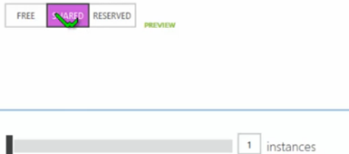
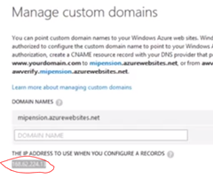
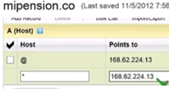
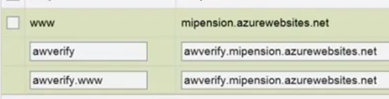
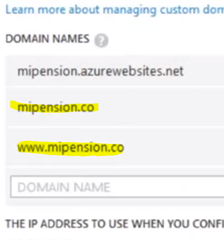

---
redirect_url: https://docs.microsoft.com/
title: Azure Websites- Dominios Personalizados
description: Azure Websites- Dominios Personalizados
author: MSCommunityPubService
ms.author: andygon
ms.date: 06/01/2016
ms.topic: article
ms.service: cloud
ms.prod: 
ms.technology:
ms.custom: CommunityDocs
---

# Azure Websites: Dominios Personalizados

Por Walter Novoa, **Microsoft Developer Evangelist**

Twitter: @warnov

Sitio personal: [http://warnov.com](http://warnov.com/)

En general los sitios de Azure Websites vienen con nombres del estilo:
[*http://warnov.azurewebsites.net*](http://warnov.azurewebsites.net/).

Afortunadamente Azure ofrece una metodología muy sencilla para asignar
un nombre de dominio personalizado para que tu sitio tenga por ejemplo
el nombre: [*http://warnov.com*](http://warnov.com/).

Básicamente lo que tenemos que hacer:

**Verificar que nuestro Azure WebSite esté en Shared o Reserved (los
free no pueden tener dominio propio)\
\
**

**Configurar en el proveedor de dominio los nombre tipo A.**

Uno para el @ y otro para el \*

Ambos van con la IP que ofrece Azure:

**Configurar en el proveedor de dominio los CNAMEs:**

**awverify** debe corresponder con awverify.warnov.azurewebsites.net
(para acceder a [*warnov.com*](http://warnov.com/))

**awverify.www** debe corresponder con
[*www.awverify.warnov.azurewebsites.net*](http://www.awverify.warnov.azurewebsites.net/)
(para acceder a [*www.warnov.com*](http://www.warnov.com/))

**www** debe corresponder a
[*warnov.azurewebsites.net*](http://warnov.azurewebsites.net/)

    

**Grabar los cambios en el proveedor y volver a** **Azure para agregar
los dominios recientemente configurados:**

[*warnov.com*](http://warnov.com/)

[*www.warnov.com*](http://www.warnov.com/)

 

Los detalles de esta operación los podemos ver en este video de solo 6
minutos, usando como ejemplo a GoDaddy

Las instrucciones mostradas en este video, podrían aplicarse fácilmente
a la configuración en cualquier otro proveedor de dominios:

<http://www.youtube.com/watch?feature=player_embedded&v=bz6c96hBBbA#t=0>

