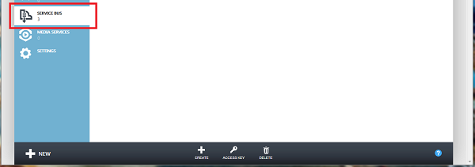
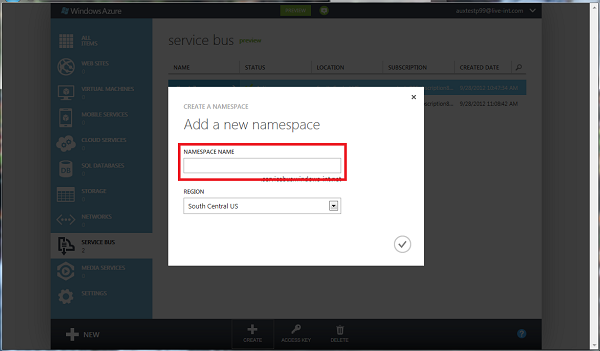
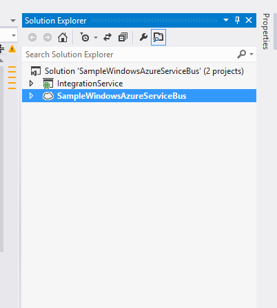
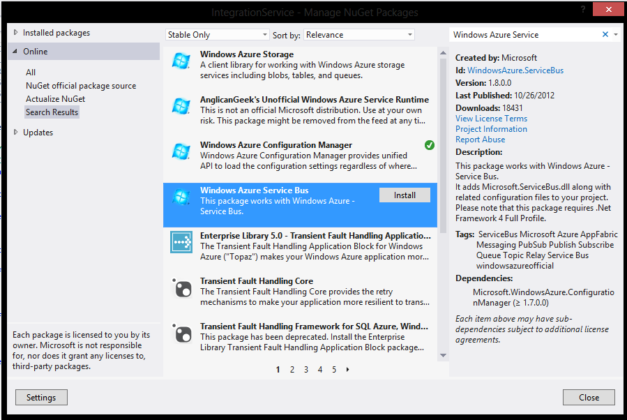
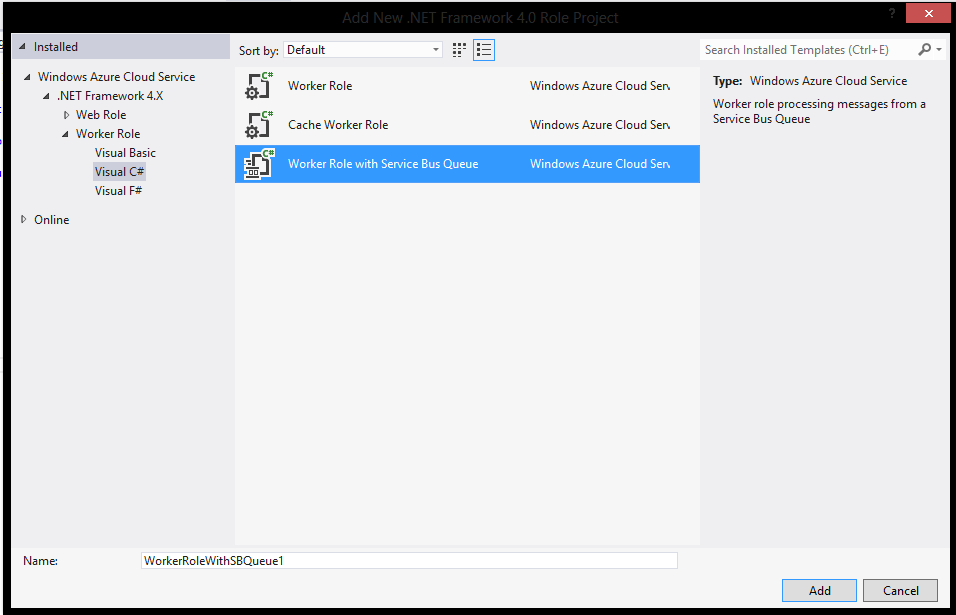

# Introducción a Azure Service Bus


    

<http://www.dnmplus.net>

Quique Martínez (Pasiona)

En este artículo presentamos Azure Service Bus, otro de los servicios
que nos proporciona la plataforma de *Cloud Computing* de Microsoft.

Azure Service Bus (SB) proporciona una infraestructura en modo SaaS,
protegida y ampliamente disponible para una comunicación extendida, una
distribución de eventos a gran escala, asignación de nombres y
publicación de servicios. SB nos proporciona opciones de conectividad
entre los diferentes sistemas/servicios de una arquitectura distribuida,
así como capacidades de mensajería tanto *relayed* (retransmitida) como
*brokered* (con confianza establecida). Con el patrón de mensajería
retransmitida, SB nos permite la mensajería unidireccional directa,
mensajería tipo solicitud/respuesta y mensajería punto a punto. Por otra
parte, la mensajería con confianza establecida proporciona componentes
de mensajería duraderos y asíncronos, tales como colas y suscripciones;
es decir, con características que admiten publicación-suscripción y
desacoplamiento.

Configuración de Azure Service Bus
----------------------------------

Lo primero que vamos a hacer es configurar el servicio dentro del portal
de Azure. Para ello, vamos al portal
(**https://manage.windowsazure.com**), y una vez allí seleccionamos la
opción de SB (figura 1). Pulsando el botón de crear, nos aparecerá una
ventana emergente como la que se muestra en la figura 2. En ella solo
tenemos que introducir un nombre y seleccionar en que región queremos
que nuestro bus se publique.

Una vez tenemos configurado nuestro SB, en el portal sólo nos queda una
cosa que hacer: guardar las dos claves secretas que nos permitirán
utilizar el servicio desde nuestras *apps*.

Figura 1

<!-- -->




Figura 2

<!-- -->


    

Programando un ejemplo
----------------------

Con el servicio configurado, vamos ahora a realizar una pequeña prueba
de concepto, que nos ayudará a entender cómo funciona SB y cómo tenemos
que utilizarlo.

Para nuestro ejemplo, imaginemos que estamos desarrollando una capa de
servicios que integra muchos desarrollos que hemos ido realizando con
nuestro ERP. Tras crear un servicio WCF que expone una serie de métodos
que integran nuestras aplicaciones con el ERP, nos hemos dado cuenta de
que el sistema tarda mucho en responder cuando llega el final del mes y
los *n* usuarios lanzan los procesos de integración. Además, en algún
caso hemos perdido información, ya que los procesos de integración
pueden hacerse de forma masiva.

Los cambios que vamos a realizar son para no tener que procesar las
nóminas. En lugar de procesarlas directamente, vamos a encolar las
peticiones y hacer que un Walker Role las vaya procesando en otro
servidor.

El servicio WCF
---------------

La estructura de la solución se muestra en la figura 3, y un fragmento
del código del servicio WCF que vamos a utilizar para nuestro ejemplo
puede verse en el listado 1 (el código completo puede descargarse desde
el sitio web de **dNM**). Como podéis ver, ya tenemos nuestro servicio
WCF desarrollado para Azure, y ahora solo tenemos que mejorar su
“arquitectura”.

Figura 3

<!-- -->


    

Listado 1
``` C# 
public string
ContabilizarNominas(IEnumerable<Nomina> nominaList)
{
// Lógica...

return "Se ha procesado todo!";
}
```

Lo primero que vamos a hacer es instalar el paquete de SB desde NuGet
(figura 4). Una vez hecho esto, podremos ver que se nos ha agregado una
nueva opción de configuración a los ficheros de configuración del
servicio de Azure (listado 2). Aquí es donde deberemos poner en uso las
dos claves secretas que hemos comentado al principio.

Listado 2

    <Setting name="Microsoft.ServiceBus.ConnectionString"
    value="Endpoint=sb://[your namespace].servicebus.windows.net;
    SharedSecretIssuer=owner;SharedSecretValue=[your secret]" />


Figura 4


    

Añadiendo los datos al Service Bus
----------------------------------

El listado 3 muestra los cambios necesarios a nivel de código para hacer
uso de SB. Como podemos ver, los cambios en nuestro método
**ContabilizarNominas** han sido pocos. Lo único que hemos hecho ha sido
coger todas las nóminas a contabilizar y añadirlas a nuestra cola de SB.
Además, hemos ido trazando por donde pasamos para poder tener un poco
más de información en caso de error (este código se puede optimizar, se
ha dejado así para el ejemplo).

Listado 3
``` C# 
public class IntegrationService : IServiceIntegration
    {
        const string NominaQueueName = "NominasQueueName";

        public string
        ContabilizarNominas(IEnumerable<Nomina> nominaList)
        {
            // Trazamos que vamos a guardar en cola las nóminas
            System.Diagnostics.Trace.TraceInformation("Added nominaList to IntegrationService");

            // Creamos la conexión en base los datos de configuración

            var connectionString = CloudConfigurationManager.GetSetting("Microsoft.ServiceBus.ConnectionString");

            var namespaceManager = NamespaceManager.CreateFromConnectionString(connectionString);

            // Comprobamos si existe la cola y si no, la creamos
            if (!namespaceManager.QueueExists(NominaQueueName))
            {
                namespaceManager.CreateQueue(NominaQueueName);
            }

            var client = QueueClient.CreateFromConnectionString(connectionString, NominaQueueName);

            // Creamos un BrokeredMessage por cada elemento
            foreach (var nomina in nominaList)
            {
                client.Send(new BrokeredMessage(nomina));
            System.Diagnostics.Trace.TraceInformation(string.Format("{0}{1}",

                "Queued message to process ", Nomina.NIF));
            }

            return "Las nóminas se han añadido a la cola...";
        }
    }
```

Procesando los datos del Service Bus
------------------------------------

Ahora vamos a procesar los datos que hemos ido añadiendo a nuestro SB.
Para ello, lo primero que vamos a hacer es agregar un nuevo proyecto a
la solución. En esta ocasión es un Worker Role de Azure, pero uno
especial (figura 5). Se trata de un **Worker Role with Service Bus
Queue**, y al agregarlo podremos ver que nos ofrece parte de la lógica
en la gestión de las colas. Por defecto, el Worker Role with Service Bus
Queue nos da los tres métodos que se presentan en el listado 4.

Los cambios requeridos para poder procesar los mensajes que hemos
añadido desde nuestro servicio WCF pueden verse en el listado 5. Además
de cambiar el nombre de la cola, que tiene que ser el mismo que le hemos
dado en nuestro servicio WCF, los cambios se concentran en el método
**Run**, y tienen lugar una vez recibimos el mensaje, donde lo recogemos
y lo procesamos con la lógica que ya teníamos programada anteriormente:

1. Recogemos el mensaje:

    BrokeredMessage receivedMessage = Client.Receive();

2.  En caso de no ser nulo, recuperamos el cuerpo del mensaje:

    var message = receivedMessage.GetBody&lt;Nomina&gt;();

3.  Procesamos el mensaje:

    var result = ContabilizarNomina(message);

4.  También deberemos añadir el código de gestión de errores que
    estimemos necesario.

Figura 5




Listado 4
```C# 
public class WorkerRole : RoleEntryPoint
{
    // The name of your queue
    const string QueueName = "ProcessingQueue";

    // QueueClient is thread-safe. Recommended that you cache
    // rather than recreating it on every request
    QueueClient Client;
    bool IsStopped;

    public override void Run()
    {
        while (!IsStopped)
        {
            try
            {

                // Receive the message
                BrokeredMessage receivedMessage = null;
                receivedMessage = Client.Receive();

                if (receivedMessage != null)
                {
                // Process the message
                Trace.WriteLine("Processing",
                receivedMessage.SequenceNumber.ToString());
                receivedMessage.Complete();
                }
            }
            catch (MessagingException e)
            {
                if (!e.IsTransient)
                {
                    Trace.WriteLine(e.Message);
                    throw;
                }
                Thread.Sleep(10000);
            }
            catch (OperationCanceledException e)
            {
                if (!IsStopped)
                {
                    Trace.WriteLine(e.Message);
                    throw;
                }
            }
        }
    }

    public override bool OnStart()
    {
        // Set the maximum number of concurrent connections
        ServicePointManager.DefaultConnectionLimit = 12;

        // Create the queue if it does not exist already
        string connectionString = CloudConfigurationManager.GetSetting("Microsoft.ServiceBus.ConnectionString");

        var namespaceManager = NamespaceManager.CreateFromConnectionString(connectionString);

        if (!namespaceManager.QueueExists(QueueName))
        {
            namespaceManager.CreateQueue(QueueName);
        }

        // Initialize the connection to Service Bus Queue
        Client = QueueClient.CreateFromConnectionString(connectionString, QueueName);
        IsStopped = false;
        return base.OnStart();
    }

    public override void OnStop()
    {
        // Close the connection to Service Bus Queue
        IsStopped = true;
        Client.Close();
        base.OnStop();
    }

}
```
<!-- -->
Listado 5
```C# 
public class WorkerRole : RoleEntryPoint
{
    // The name of your queue
    const string QueueName = "ProcessingQueue";
    // ...
    public override void Run()
    {
        while (!IsStopped)
        {
            try
            {
                // Receive the message
                BrokeredMessage receivedMessage = Client.Receive();
                if (receivedMessage != null)
                {
                    // Process the message 
                    Trace.WriteLine("Processing", receivedMessage.SequenceNumber.ToString());

                    var message = receivedMessage.GetBody&lt;Nomina&gt;();
                    var result = ContabilizarNomina(message);

                    if (result) 
                        receivedMessage.Complete();
                    else
                    {
                        // Gestión de errores
                    }
                }

            }
            catch (MessagingException e)
            {
                if (!e.IsTransient)
                {
                    Trace.WriteLine(e.Message);
                    throw;
                }
                Thread.Sleep(10000);
            }
            catch (OperationCanceledException e)
            {
                if (!IsStopped)
                {
                    Trace.WriteLine(e.Message);
                    throw;
                }
            }
        }
    }
}
```

Conclusiones
------------

Desde mi punto de vista, utilizar Azure Service Bus no presenta ningún
aspecto negativo. Todo es positivo: nos ayuda a gestionar los sistemas
distribuidos, no perdemos datos y optimiza nuestros sistemas delegando
responsabilidades. Todo ello utilizando este servicio sin tener que
preocuparnos del hardware, red y demás aspectos que nos ahorramos
utilizando SaaS.

Referencias
-----------

\[1\] Portal de Microsoft Azure:
[**http://www.windowsazure.com**](http://www.windowsazure.com)


