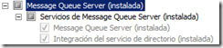
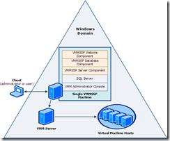
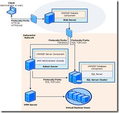
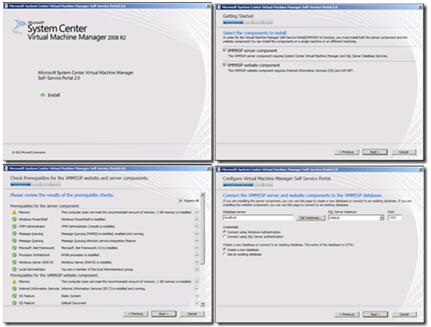
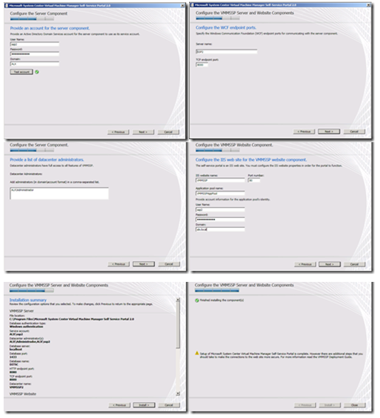
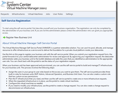

1.  

  ----------------------------------------------------------------
  Pablo Campos                                         Mayo 2012
                                                       
  MVP                                                  
  ---------------------------------------------------- -----------
  [Blog](http://geeks.ms/blogs/pcampos/default.aspx)
  ----------------------------------------------------------------

Ya esta claro que la tendencia es la nube, es por esto que Microsoft
lanza un producto llamado Self Service Portal 2.0, que lo pueden
descargar desde
[*acá*](http://www.microsoft.com/downloads/en/details.aspx?FamilyID=fef38539-ae5a-462b-b1c9-9a02238bb8a7&displaylang=es),
el cual nos permitirá confeccionar nuestra propia nube privada, para así
poder ofrecer servicios de datacenter en la nube.

1.  Serie de artículos “Creando mi nube privada”

    Parte 1: Instalación

    Parte 2: Configuración Inicial

    Parte 3: Creación de Plantillas de VM

    1.  

Cuales son los requisitos para esta nube privada

1.  Windows Server 2008 R2 Enterprise o Datacenter Edition

    SQL Server 2008 (r2) Enterprise o Standard Edition …. NO EXPRESS

    System Center Virtual Machine Manager 2008 R2

    1.  

Este SSP 2.0 no remplaza para nada al SSP que ya tiene el SCVMM y pueden
trabajar los dos juntos sin ningún problema

La arquitectura que desarrollaremos en este demo es simple:\
Un Servidor llamado **2008R2Sp1.alx.local** que desempeñara las labores
de:

1.  Hyper-v Server

    Active Directory

    SCVMM 2008 R2 Server

    1.  

Un Servidor llamado **SSP2.alx.local** que desempeñara las labores de:

1.  SQL Server

    Servidor web front end de SSP2

    Servidor de base de datos de SSP2

    Servidor de SSP2

    1.  

Antes de comenzar crearemos una cuenta llamada **ssp2** en nuestro
Active Directory que será la encargada de levantar los servicios mas
adelante.

Instalación
===========

Primero que todo los prerrequisitos

1.  **IIS 7 (**Static Content, Default Document,ASP.NET,.NET
    Extensibility, ISAPI Extensions, ISAPI Filters, Request Filtering,
    Windows Authentication, IIS 6 Metabase Compatibility)

    **SQL Server 2008 “*en mi caso instalado por defecto*”**

    **Windows PowerShell 2.0 **

    **Microsoft .NET Framework 3.5 SP1 **

    **Message Queuing** “con la integración de active directory”

    1.  

    <!-- -->

    1.  

    <!-- -->

    1.  {width="2.542694663167104in"
        height="0.5523064304461942in"}

        Instalar solo la consola de administración de SCVMM 2008 R2 en
        el servidor SSP2

Existen varios tipos de instalación, hay una bastante sencilla, donde
todos los componentes del SSP, se instalan en un solo servidor “Ese en
mi caso”, existe otra que podemos instalar los componentes por separados
en distintos servidores.

Todo en uno

Componentes separados

1.  

<!-- -->

1.  {width="2.5420220909886266in"
    height="2.1148786089238847in"}

    {width="2.5420220909886266in"
    height="2.417004593175853in"}

    Ahora comenzamos el proceso de instalación del Self Service portal
    2.0

    {width="5.158780621172354in"
    height="3.9170067804024495in"}

En este paso usamos nuestra cuenta previamente creada, para que lance el
servicio del ssp

1.  {width="5.208784995625547in"
    height="5.733830927384077in"}

    Eso es toda la instalación, la configuración y primeros pasos, los
    veremos en el próximo post.

    {width="2.542694663167104in"
    height="2.0112292213473317in"}

