#Windows Intune - Gestión de actualizaciones I

©Jaime Peña Tresancos, 2013

Profesional independiente en el sector Servicios y tecnología de la
información

Microsoft MVP

Twitter: @jpt219

LinkedIn:
[http://es.linkedin.com/pub/jaime-peña-tresancos/28/677/696](http://es.linkedin.com/pub/jaime-pe%c3%b1a-tresancos/28/677/696)

Veremos uno de los aspectos más importantes de Windows Intune, la
gestión de las actualizaciones de los equipos. Aprenderemos a mantener
nuestro equipo al día de manera eficiente, bien con una intervención
atendida siguiendo las alertas dadas por el propio Windows Intune, bien
dictando normas de automatización para aquellas actualizaciones que
queramos sean aplicadas de forma inmediata.

Es el propio Windows Intune quien, de forma totalmente transparente, se
encargará de buscar las actualizaciones disponibles para nuestros
equipos, organizarlas para su distribución y llevar un registro exacto
de todas aquellas ya instaladas y de las que, por un motivo u otro, no
se han podido instalar adecuadamente. Será la labor del *Administrador*
tomar las decisiones pertinentes con toda esa cantidad de información ya
recabada.

En el presente artículo trataremos:

Aprobación manual de actualizaciones

Actualizaciones de equipo por equipo

Configurar actualizaciones de aprobación automática

Cómo llevar a cabo las actualizaciones

Aprobación de nuevas actualizaciones
------------------------------------

Si no estuviéramos ya en la pestaña **Actualizaciones**, en su entrada
de **Información general**, hagamos las correspondientes selecciones
para ir hasta allí.

De haber actualizaciones para aprobar, en el apartado **Estado de
actualización** deberá haber una entrada correspondiente a **Nuevas
actualizaciones para aprobar**. Haga clic sobre el hipervínculo y se le
mostrarán las actualizaciones pendientes de aprobación.

En la nueva ventana, para aprobar una o varias actualizaciones,
selecciónese –o selecciónense- en la lista y posteriormente hágase clic
sobre el botón **Aprobar**.

Se habrá aprobado esa instalación para todos los equipos en los que
estuviera pendiente de aprobación.

Conforme se vayan aprobando, irán desapareciendo de la lista de
actualizaciones pendientes.

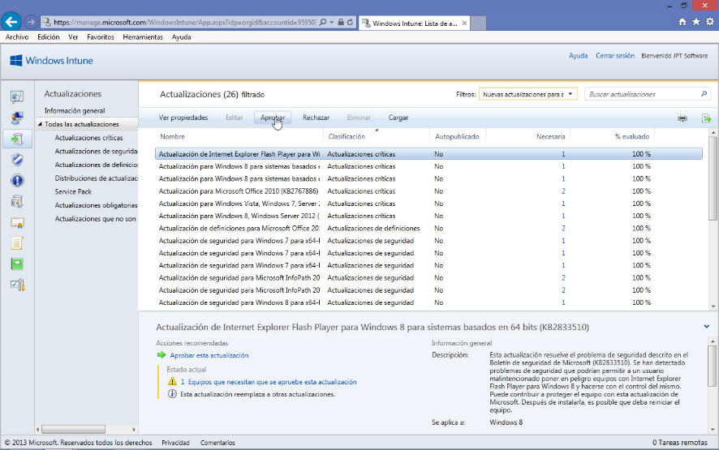

Para la aprobación en bloque, selecciónense todas las actualizaciones y
posteriormente hágase clic sobre **Aprobar**.

Continúese en el apartado Actualizaciones con instalación pendiente.

Aprobación de nuevas actualizaciones, equipo por equipo
-------------------------------------------------------

Deberemos ir a la pestaña **Grupos** y allí seleccionar **Todos los
dispositivos**.

De haber actualizaciones para aprobar, en el apartado **Actualizar** –en
la parte inferior central de la ventana- deberá haber una entrada
correspondiente a **Nuevas actualizaciones que necesitan aprobación**.
Haga clic sobre el hipervínculo y se le mostrarán las actualizaciones
pendientes de aprobación.

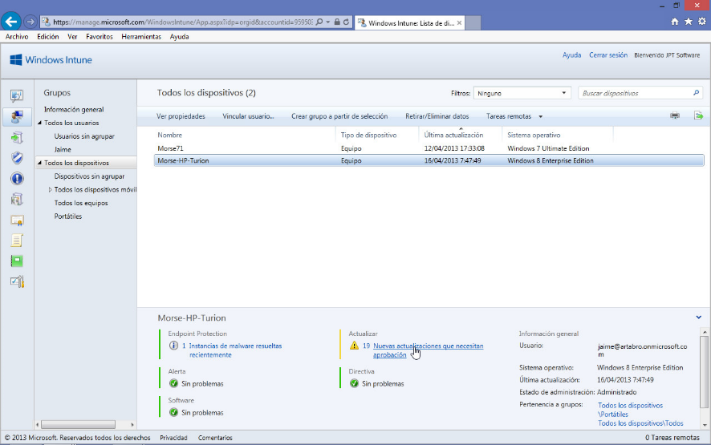

En la nueva ventana, para aprobar una o varias actualizaciones,
selecciónese –o selecciónense- en la lista y posteriormente hágase clic
sobre el botón **Aprobar**.

Nótese que, a diferencia del apartado anterior, aquí habremos aprobado
la instalación de esa –o esas- actualización para ese equipo concreto
solamente.

Conforme se vayan aprobando, irán desapareciendo de la lista de
actualizaciones pendientes.

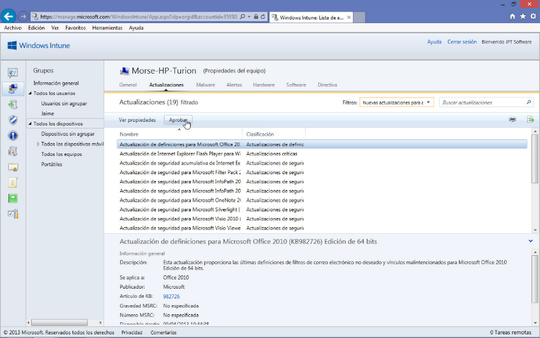

Para la aprobación en bloque, selecciónense todas las actualizaciones y
posteriormente hágase clic sobre **Aprobar**.

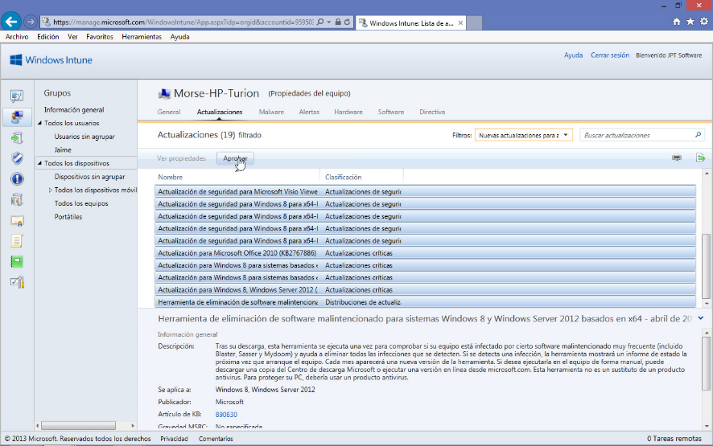

Continúese en el apartado Actualizaciones con instalación pendiente.

Configurar valores de aprobación automática
-------------------------------------------

Si no estuviéramos ya en la pestaña **Actualizaciones**, en su entrada
de **Información general**, hagamos las correspondientes selecciones
para ir hasta allí.

Observe el hipervínculo **Configurar valores de aprobación automática**,
en la parte de la derecha de la ventana.

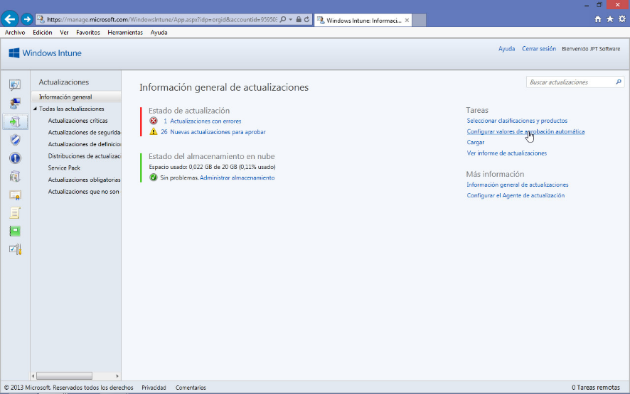

Hagamos clic sobre él y se mostrará la ventana de **Configuración del
servicio de actualizaciones**, que se muestra en la figura.

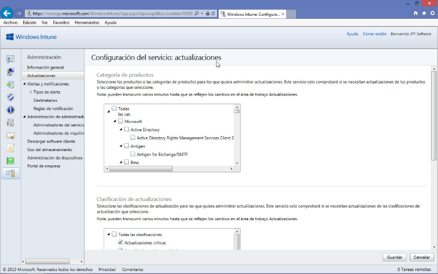

Nos desplazamos a su parte inferior y hacemos clic sobre el botón
**Nuevo…**

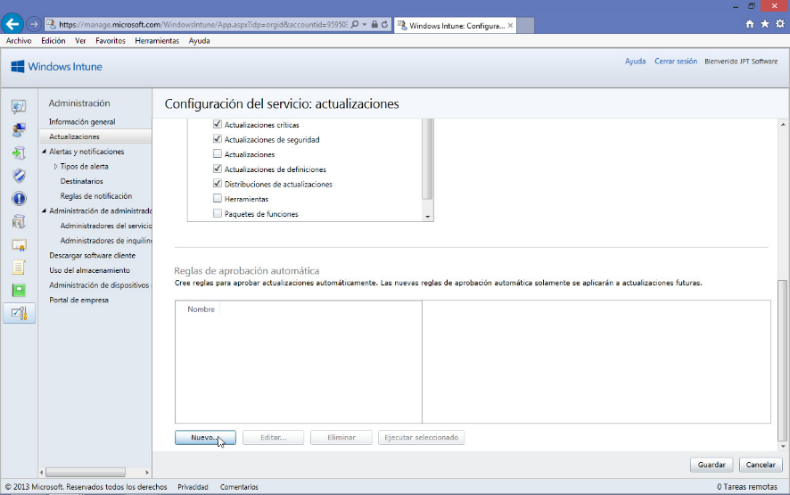

Se abrirá el asistente **Crear regla de aprobación automática**, que en
su primera ventana deberemos:

Darle un nombre significativo, ya que será por lo que posteriormente lo
identificaremos

Una breve descripción de la regla de actualización

Terminado, hacemos clic sobre el botón **Siguiente&gt;**

En la segunda ventana del asistente se nos pide que se Especifique los
productos afectados por esta regla de aprobación.

Se nos muestra todo una lista ordenada de productos contemplados por
Windows Intune y sobre los que es capaz de hacer un seguimiento de
actualizaciones.

Marcaremos con un clic –dejando seleccionada la casilla de verificación
correspondiente- aquel o aquellos productos que se verán afectados. En
nuestro ejemplo *Ofiice 2010*.

Continuaremos haciendo clic sobre el botón **Siguiente**&gt;

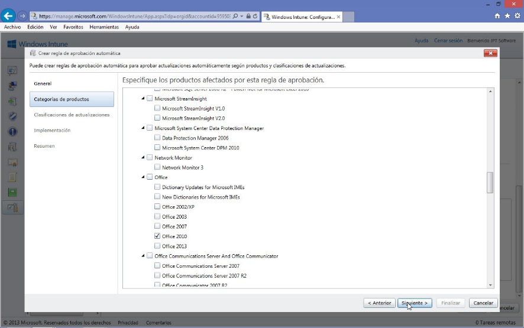

En la tercera ventana del asistente tendremos que escoger que tipo de
actualizaciones serán las aprobadas automáticamente.

Eso se hace conforme a un patrón de *clasificaciones*, como se puede
apreciar en la figura que sigue.

Realizada nuestra selección de *clasificaciones* continuamos con el
proceso haciendo clic sobre el botón **Siguiente&gt;**

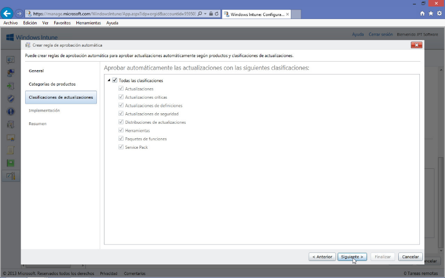

En la cuarta y última ventana de selección de opciones del asistente se
nos pide que se **Especifique los grupos que recibirán estas
actualizaciones una vez aprobadas**.

Se nos muestra una ventana con dos áreas, a la izquierda los diversos
grupos de dispositivos o usuarios disponibles; a la derecha los grupos
seleccionados para recibir las actualizaciones.

Iremos seleccionando los grupos de la izquierda y haciendo clic sobre el
botón **Agregar** para incluirlos a la derecha.

Una vez finalizado, el proceso de definición de criterios ha
virtualmente ha acabado, hagamos clic sobre el botón **Siguiente&gt;**

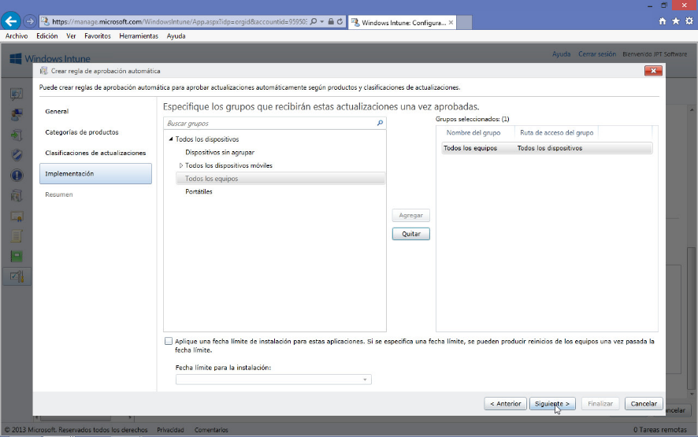

Finalmente se nos mostrará el resumen de la regla de actualización
automática que se creará, si estamos conformes, concluiremos haciendo
clic sobre el botón **Finalizar**.

Insert Caption

<!-- -->

Ya de vuelta en la ventana **Configuración del servicio de
actualizaciones**, podemos ver en el apartado **Reglas de aprobación
automática** la nueva regla creada, para concluir todo el proceso,
hágase clic sobre el botón **Guardar**.

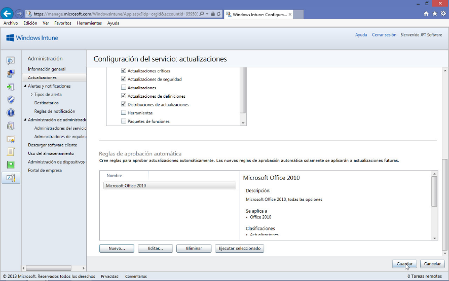

Para aplicar una regla, sea por ejemplo ésta última creada, bastará
seleccionarla en la lista de **Reglas de aprobación automática** y
posteriormente hacer clic sobre el botón **Ejecutar seleccionada**.

De igual manera se puede **Editar** o **Eliminar** una regla de
aprobación automática.

Si se ha escogido **Ejecutar seleccionada**, comenzará el procesamiento
de la solicitud de aplicación de la regla de aplicación de
actualización.

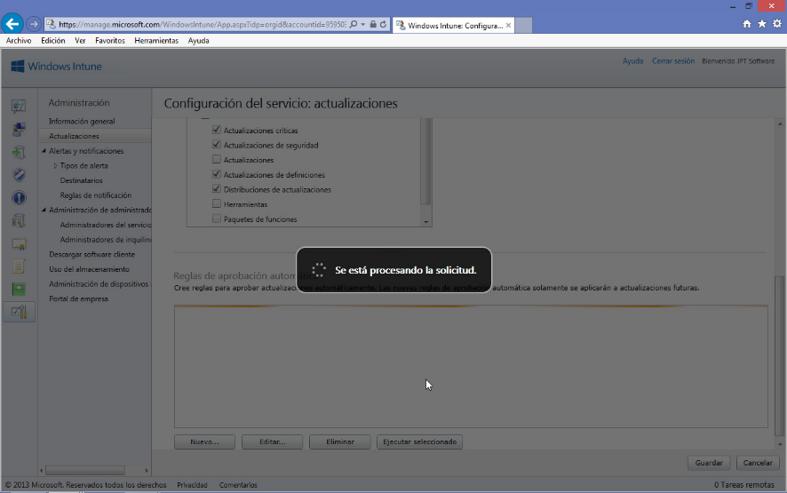

Actualizaciones con instalación pendiente
-----------------------------------------

Finalizado el procedimiento, si ahora vamos a la pestaña
**Actualizaciones**, en su entrada inicial **Información general de
actualizaciones**, veremos que constan actualizaciones pendientes de
instalación, que deben ser cargadas desde cada dispositivo como
trataremos en el apartado siguiente –**Llevar a cabo las
actualizaciones**-.

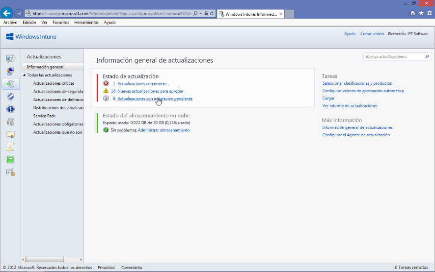

Al hacer clic sobre **Actualizaciones con instalación pendiente**, se
nos mostrarán cuales son dichas actualizaciones ya aprobadas y
pendientes de instalación por parte del usuario final.

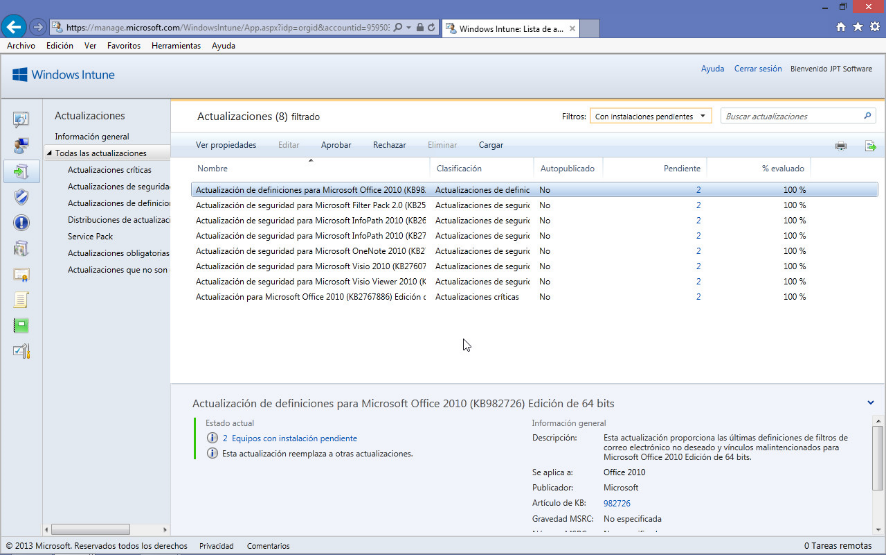

Llevar a cabo las actualizaciones
---------------------------------

Deberemos acceder a **Windows Intune Center**, en él seleccionaremos
**Buscar actualizaciones**.

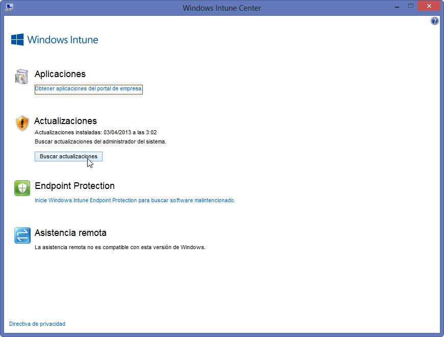

Si hay actualizaciones aprobadas por el *Administrador* de Windows
Intune, se nos informará de ello, indicándonos cuantas están
disponibles, como se observa en la figura adjunta.

Para instalarlas, proseguiremos haciendo clic sobre **Instalar
actualizaciones**.

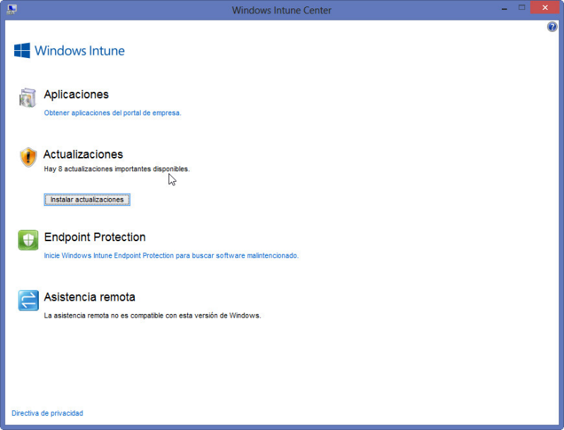

Se abrirá una caja de diálogo dándonos la opción de **Instalas ahora
(recomendado)**, con lo cual se instalarían todas las pendientes, o
**Revisar e instalar**, que nos permite revisar las instalaciones
pendientes y seleccionar cual o cuales se instalarían ahora.

Su pongamos que optamos por lo recomendado, proseguiríamos haciendo clic
sobre el botón **Instalar**.

Comenzaría el proceso de descarga de las actualizaciones y su posterior
instalación en el equipo, tal como se muestra en las figuras adjuntas.

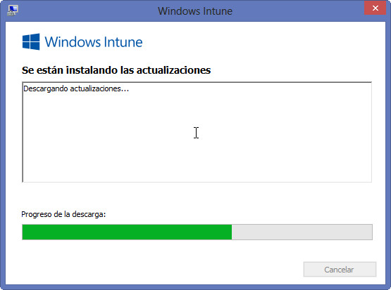

    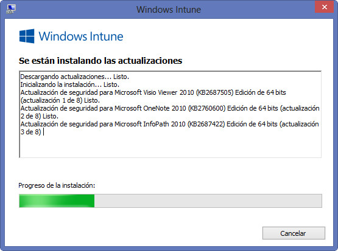

Finalizado el proceso, se nos informará de ello y de si es preciso
reiniciar el equipo.

Conclusiones
------------

A lo largo del presente artículo hemos visto cómo gestionar las
actualizaciones en Windows Intune, bien manualmente, bien automatizando
en todo o en parte su distribución. También hemos tratado el cómo
implementarlas en nuestro sistema desde el **Windows Intune Center**,
que es, en todos los casos, el paso final del proceso.

Esperamos que lo aquí expuesto les haya servido de ayuda en su trabajo y
no dejen de preguntar cualquier duda que les pudiese surgir. Hasta la
próxima, tengan unas provechosas sesiones de computación.

**©Jaime Peña Tresancos, 2013**

**Twitter: @jpt219**

**LinkedIn:**
[*es.linkedin.com/pub/jaime-peña-tresancos/28/677/696*](http://es.linkedin.com/pub/jaime-pe%C3%B1a-tresancos/28/677/696)

