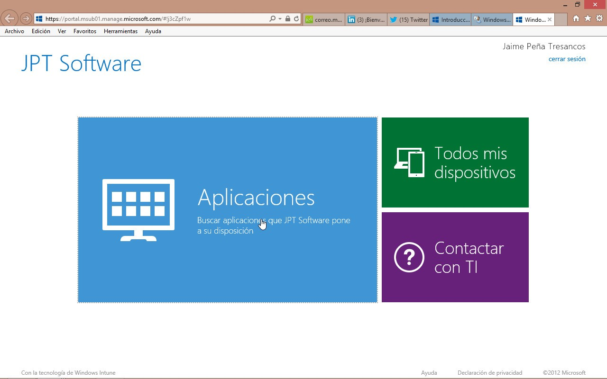

#Windows Intune - Portal de empresa de Windows 8

©Jaime Peña Tresancos, 2013

Profesional independiente en el sector Servicios y tecnología de la
información

Microsoft MVP

Twitter: @jpt219

LinkedIn:
[http://es.linkedin.com/pub/jaime-peña-tresancos/28/677/696](http://es.linkedin.com/pub/jaime-pe%c3%b1a-tresancos/28/677/696)

Una de las funciones más avanzadas e interesantes de Windows Intune es
la capacidad de poner a disposición de los usuarios del software que el
*Administrador* crea conveniente, algo que puede realizar de diversas
formas. Entre otras, para ello se dispone del **Portal de empresa**.

En el presente artículo veremos:

- De qué se trata el **Portal de empresa**

- La instalación –puesta a punto- del **Portal de empresa** en Windows 8

- Cómo implementar software en el **Portal de empresa**

- Cómo acceder y trabajar con el **Portal de empresa** de Windows 8
 

Software administrado y software implementado
---------------------------------------------

En el **Almacenamiento en la nube** de Windows Intune nos podremos
encontrar con software en diferentes estados:

Software simplemente almacenado

Es el software que simplemente ha sido cargado, véase el artículo:

[***Windows Intune (Ed. Dic-2012). Agregar
software***](http://msdn.microsoft.com/es-es/library/dn194481.aspx)

Software disponible en el **Portal de empresa**

Aquel que está disponible para su descarga e instalación a través del
**Portal de empresa** de Windows Intune, ha sido previamente cargado y
posteriormente puesto a disposición de los usuarios. Será de lo que nos
ocuparemos en el presente artículo

Software **Implementado** con **Instalación requerida**

Aquel que ha sido previamente cargado y dispuesto para su instalación
bajo ciertas condiciones, véase el artículo:

[***Windows Intune (Ed. Dic-2012). Administrar implementación con
instalación
requerida***](http://msdn.microsoft.com/es-es/library/dn194480.aspx)

¿Qué es el Portal de empresa?

Funciona, a vista de pájaro, de la siguiente manera:

Se almacena software en la nube de Windows Intune por diversos motivos.
En principio, como apuntamos arriba, es un software no accesible

Se implementa de tal forma que:

Queda visible para los usuarios de Windows Intune

Su ámbito de visibilidad y posibilidad de instalación es controlada por
el *Administrador*

La instalación o no instalación es, en principio, opcional –podría haber
una sugerencia, pero no se impone como en el caso de una
**Implementación** del estilo **Instalación requerida**-

Actúa, por tanto, como un repositorio de software al estilo de lo que
podría ser la **Tienda** en Windows 8, pero restringida a aquello que el
*Administrador* controla de primera mano y para quien permita
explícitamente

Puesta a punto del Portal de empresa de Windows 8
-------------------------------------------------

El **Portal de empresa** de Windows 8 inicialmente no se encuentra
instalado, de manera que la primera vez que deseemos acceder a él
deberemos previamente instalarlo.

Para comenzar localizaremos el *Tile* de **Windows Intune Center** y
hacemos clic sobre él.

Se mostrará la ventana de **Windows Intune Center**.

En ella haremos clic sobre la entrada **Obtener aplicaciones del portal
de empresa**, que se encuentra bajo el epígrafe **Aplicaciones**.

Tras los pasos pertinentes, veremos la pantalla que se muestra
seguidamente, en la que procederemos a intentar acceder a
**Aplicaciones**, haciendo el correspondiente clic sobre la entrada.

Dado que se accede a las aplicaciones a través del **Portal de empresa**
y –estamos suponiendo- todavía no está instalado, se nos indica que
deberemos acceder a la **Tienda Windows**.

Hagamos clic sobre el correspondiente botón **Ir a la Tienda Windows**.

Eso nos lleva ya al sitio de la **Tienda Windows** de instalación.

Bastará hacer clic sobre el botón **Aceptar**.

Se procederá a la instalación de la aplicación de gestión del **Portal
de empresa**.

Finalizadas las operaciones, se nos informa de ello en la parte superior
derecha de la pantalla.

Salgamos de la **Tienda Windows**, como es habitual en Windows 8.

Cerremos también la ventana de **Windows Intune Center** en el
*Escritorio* de Windows 8.

El procedimiento de instalación ha sido completado y ahora se habrá
creado un nuevo *Tile* etiquetado **Portal de empresa**, que será desde
donde deberemos acceder a ella en Windows 8 –véase más adelante en el
apartado **Instalación de software desde el Portal de empresa**-

Implementación de software en el Portal de empresa
--------------------------------------------------

Una vez iniciada sesión en la **Consola de administración** de Windows
Intune, vamos a la pestaña **Software** y allí seleccionamos **Software
administrado**, veremos la lista de programas que ya han sido cargados
–si los hubiera-; para cargar otros nuevos, hacemos clic sobre el botón
**Agregar software**, en la barra de herramientas inmediatamente encima
del área de la lista de programas cargados.

Hacemos clic sobre el software a implementar y posteriormente sobre el
botón **Administrar implementación**, en la barra de herramientas
inmediatamente encima del área de la lista de programas cargados.

Se desplegará el asistente de implementación del software que estaba
seleccionado anteriormente.

En el panel de la izquierda deberemos escoger el usuario o grupo de
usuarios sobre los cuales deseamos crear la implementación, haciendo
clic y dejándolo seleccionado.

Posteriormente hacemos clic en el botón **Agregar**. Se deberá mostrar
lo escogido anteriormente en el panel de la derecha.

Repetimos la operación sobre todos los usuarios y grupos que deseemos.
Una vez finalizada nuestra elección, hacemos clic sobre el botón
**Siguiente&gt;**

En la segunda ventana del asistente desplegamos la lista que se
encuentra inmediatamente debajo de la etiqueta **Implementación** y
escogemos la opción **Instalación disponible**

Con ello indicamos que ese software estará disponible para los usuarios
anteriormente seleccionados para su instalación opcional a demanda.
Nótese la diferencia de haberlo **Implementado** como expusimos en
nuestro artículo [**Windows Intune (Ed. Dic-2012). Administrar
implementación con instalación
requerida**](http://msdn.microsoft.com/es-es/library/dn194480.aspx).

Terminaremos haciendo clic sobre el botón **Finalizar**

A partir de estos momentos este software almacenado en la nube de
Windows Intune ha pasado a estar a disposición de los usuarios, que el
*Administrador* ha seleccionado, en el **Portal de empresa** de Windows
Intune.

Instalación de software desde el Portal de empresa
--------------------------------------------------

Desde Windows 8 podemos acceder al **Portal de empresa** haciendo clic
sobre el *Tile* correspondiente, una vez instalado como se ha descrito
en el anterior apartado denominado **Puesta a punto del Portal de
empresa de Windows 8**

Una vez hecho clic sobre él. Se mostrará la ventana de propuesta de
inicio de sesión. Deberemos hacer clic sobre el botón **Iniciar sesión**

Entraremos con las credenciales de Windows Intune de nuestra suscripción
correspondiente a *Microsoft Online Services* y hacer clic en **Iniciar
sesión**

De entrada se nos muestra la ventana que aparece en la figura que sigue,
en la que se muestran los apartados:

**Todas las apl.**: que da acceso a la totalidad de las aplicaciones
contenidas en el **Portal de empresa** –sin clasificación alguna-

**Todas las categorías**: nos llevará a una ventana con *Tiles* que dan
acceso a las aplicaciones del **Portal de empresa** agrupadas por
categorías; aquellas en que las hemos clasificado a la hora de
implementarlas –véase el apartado anterior-

*Tiles* con accesos directos a algunas de las aplicaciones implementadas

*Tiles* con accesos directos a terminales cliente –**Dispositivos**- que
nos llevan a ventanas con información de dichos terminales

Si hacemos clic sobre **Todas las apl.**, se desplegará la ventana
siguiente, en que se nos mostrarán todas las aplicaciones disponibles en
el **Portal de empresa**, que han sido anteriormente dispuestas para
ello, implementadas en el **Portal de empresa** -véase el apartado
**Implementación de software en el Portal de empresa**-.

Para conocer las características de cada una de ellas y para instalarlas
si lo deseamos posteriormente –o acto seguido-, hagamos clic sobre su
*Tile*.

Se abrirá una ventana con la información correspondiente, que contiene:

- La lista de terminales en los cuales estará disponible para su
instalación a demanda

- Una breve descripción

- Los detalles del programa

Si deseamos instar el programa, deberemos seleccionar la casilla de
verificación correspondiente del terminal correspondiente y hacer clic
sobre el botón **Instalar**

Si es el terminal sobre el cual estamos trabajando, la instalación
comenzará inmediatamente, se volverá a la ventana principal del **Portal
de empresa** y en la parte superior derecha de la ventana se nos
informará del proceso, caso de que no se requiera intervención por
nuestra parte.

En caso de que se comience un programa de instalación en el
*Escritorio*, el proceso seguirá con la bajada de la aplicación y la
ejecución en el *Escritorio* de las labores de instalación, como sería
habitual trabajando en local.

Una vez finalizado el procedimiento, ciérrese el **Portal de empresa**,
como es habitual en Windows 8.

Conclusiones
------------

Hemos visto cómo instalar el **Portal de empresa** de Windows Intune en
Windows 8, como implementar software en él y cómo trabajar con él en
Windows 8, realizando una instalación. Todas estas tareas se reducen a
sencillos paso a paso bien dirigidos mediante asistentes o con entornos
de trabajo muy intuitivos.

El repositorio de software en la nube de Windows Intune alcanza un
enorme valor con el **Portal de empresa**, dado que no sólo sirve al
*Administrador* como un lugar de almacenamiento de software estándar de
trabajo, sino que también le dota de una gran versatilidad a la hora de
conceder un cierto grado de autonomía a los usuarios, poniendo a su
disposición, controladamente, un moderno **Portal de empresa** de
aplicaciones.

Esperamos que lo aquí expuesto les haya servido de ayuda en su trabajo y
no dejen de preguntar cualquier duda que les pudiese surgir. Hasta la
próxima, tengan unas provechosas sesiones de computación.

**©Jaime Peña Tresancos, 2013**

**Twitter: @jpt219**

**LinkedIn:**
[*es.linkedin.com/pub/jaime-peña-tresancos/28/677/696*](http://es.linkedin.com/pub/jaime-pe%C3%B1a-tresancos/28/677/696)

