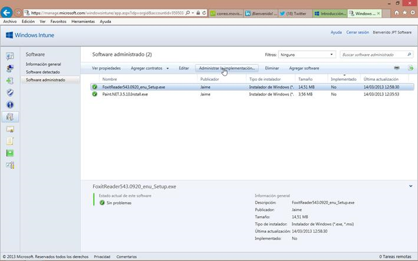
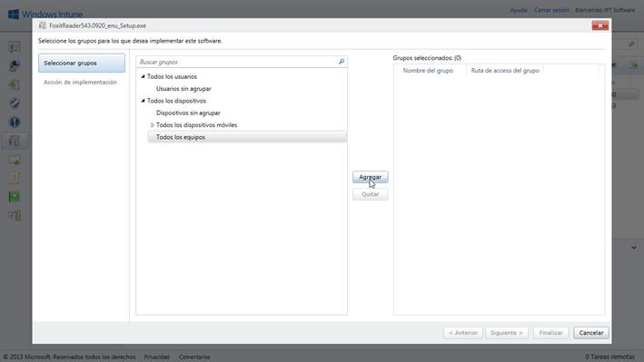
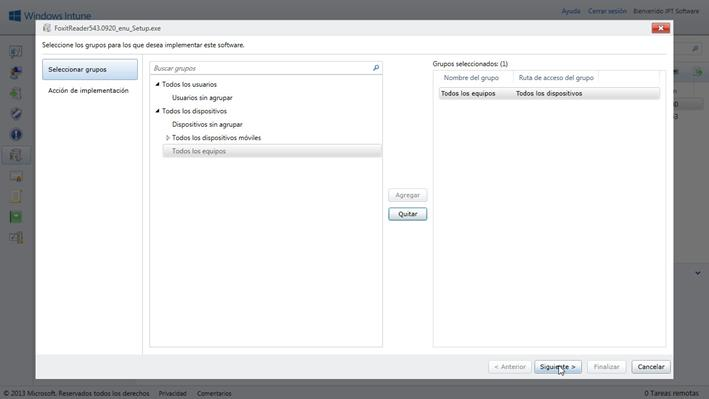
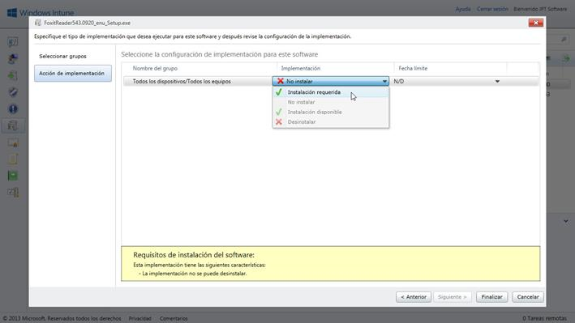
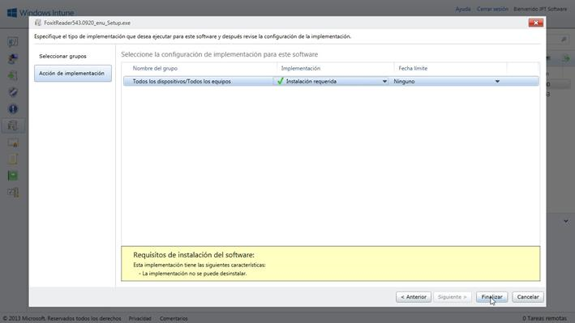
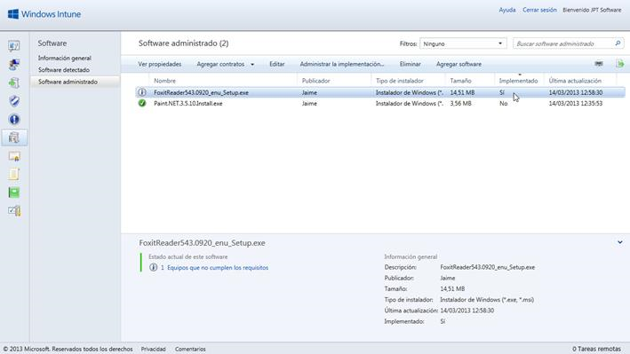
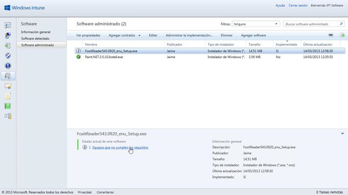
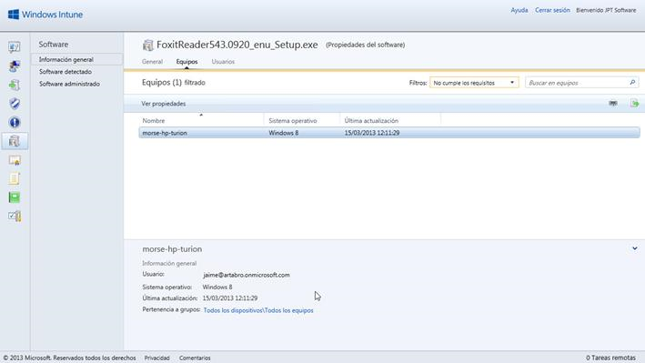

#Windows Intune (Ed. Dic-2012). Administrar implementación con Instalación requerida

©Jaime Peña Tresancos, 2013

Profesional independiente en el sector Servicios y tecnología de la
información

Microsoft MVP

Twitter: @jpt219

LinkedIn:
[http://es.linkedin.com/pub/jaime-peña-tresancos/28/677/696](http://es.linkedin.com/pub/jaime-pe%c3%b1a-tresancos/28/677/696)

Una de las funciones más interesantes de Windows Intune es la capacidad
de poner a disposición de los usuarios del software que el
*Administrador* crea conveniente. Para ello se dispone del **Portal de
empresa**.

Otra no menos interesante y potente capacidad de que dispone el
administrador es la de implementar la instalación de software a
distancia y de forma automatizada en los ordenadores cliente,
seleccionando las condiciones en que dicha operación se llevará a cabo.

En el presente artículo veremos:

- Qué es exactamente la **Implementación de software** de Windows Intune

- Cómo se realiza, paso a paso, la **Implementación** en diferentes
*grupos*

- Qué características son implementables

- Cómo eliminar una **Implementación**

- Cómo modificar las opciones de una **Implementación**

- Interpretar los posibles estados de alerta de una **Implementación**

 

Software administrado y software implementado
---------------------------------------------

En el **Almacenamiento en la nube** de Windows Intune nos podremos
encontrar con software en diferentes estados:

Software simplemente almacenado

Es el software que simplemente ha sido cargado, véase el artículo:

Windows Intune (Ed. Dic-2012). Administrar implementación con Instalación requerida

Software disponible en el **Portal de empresa**

Aquel que está disponible para su descarga e instalación a través del
**Portal de empresa** de Windows Intune, ha sido previamente cargado y
posteriormente puesto a disposición de los usuarios

Software **Implementado** con **Instalación requerida**

Aquel que ha sido previamente cargado y dispuesto para su instalación
bajo ciertas condiciones. Será lo que tratemos en éste artículo

Administrar implementación con Instalación requerida
----------------------------------------------------

Una vez iniciada sesión en la **Consola de administración** de Windows
Intune, vamos a la pestaña **Software** y allí seleccionamos **Software
administrado**, veremos la lista de programas que ya han sido cargados
–si los hubiera-; para cargar otros nuevos, hacemos clic sobre el botón
**Agregar software**, en la barra de herramientas inmediatamente encima
del área de la lista de programas cargados.

Hacemos clic sobre el software a implementar y posteriormente sobre el
botón **Administrar implementación**, en la barra de herramientas
inmediatamente encima del área de la lista de programas cargados.

    

Se desplegará el asistente de implementación del software que estaba
seleccionado anteriormente.

En el panel de la izquierda deberemos escoger el grupo de dispositivos
sobre los cuales deseamos crear la implementación, haciendo clic y
dejándolo seleccionado.

Posteriormente hacemos clic en el botón **Agregar**.

Repetimos la operación sobre todos los grupos de dispositivos que
deseemos.

    

Una vez tengamos todos los deseados en el panel de la derecha, hacemos
clci en el botón **Siguiente&gt;**

    

En la segunda ventana del asistente desplegamos la lista que se
encuentra inmediatamente debajo de la etiqueta **Implementación** y
escogeremos el tipo de implementación que deseemos, por ejemplo
**Instalación requerida**.

Insert Caption

<!-- -->

    

También podremos fijar una **Fecha límite** para llevar a cabo la
implementación, por ejemplo **Ninguno**, **Lo antes posible**, **Una
semana**, …

Concluiremos la definición de la **Implementación** haciendo clic en el
botón **Finalizar**.

    

Finalmente, nos encontraremos nuevamente en el panel de **Software
administrado**.

Allí tendremos ahora, bajo la entrada **Implementación**, en la línea
correspondiente al programa con que acabamos de tratar la palabra
**Sí**, lo que nos confirma que ese software está implementado de alguna
forma, que podemos ver más abajo.

Si deseamos modificar el estatus de la **Implementación** o, simplemente
eliminarla, hágase clic sobre **Administrar la implementación** y
volveremos al asistente y allí cabe hacer las modificaciones oportunas:

- Para eliminar la **Implementación** selecciónese en el panel derecho del
asistente y luego hágase clic sobre el botón **Quitar**. Luego hágase
clic sobre **Siguiente&gt;**.

- Para cambiar la opción del tipo de **Implementación**, en la última de
las ventanas del asistente, antes de pulsar el botón **Finalizar**,
despliéguese la lista que se encuentra inmediatamente debajo de la
etiqueta **Implementación**.

    

Si observamos con detalle la imagen anterior, en la parte inferior
izquierda se nos mostrarán los posibles estados de error o alertas de la
**Implementación**, en nuestro ejemplo tenemos un mensaje de aviso:

### 1 Equipos que no cumplen los requisitos

    

Se trata de un hiperenlace que al hacer clic sobre él nos lleva a un
panel de información de dicho(s) equipo(s).

La información no es muy exhaustiva, sólo nos informa del nombre del
equipo y que no se llevará a cabo la implementación en él, pero no las
causas. Normalmente se trata de incompatibilidades conocidas entre el
software y el sistema operativo. Deberemos recabar información al
respecto del fabricante y de las bases de conocimiento de Microsoft.

    
 

Conclusiones
------------

Hemos visto cómo definir la **Implementación** de un programa alojado en
el almacenamiento en la nube de Windows Intune, la selección de los
grupos, cómo modificar las opciones y cómo dejarlo así preparado para su
instalación automática en ordenadores cliente.

Dado que la **Implementación de software** permite al *Administrador*
definir también, explícitamente, la no instalación de un determinado
software en un(os) determinado(s) grupo(s), se redobla la agilidad de su
uso y versatilidad de distribución.

Esperamos que lo aquí expuesto les haya servido de ayuda en su trabajo y
no dejen de preguntar cualquier duda que les pudiese surgir. Hasta la
próxima, tengan unas provechosas sesiones de computación.

