#Windows Intune (Ed. Dic-2012). Agregar software

©Jaime Peña Tresancos, 2013
Profesional independiente en el sector Servicios y tecnología de la
información

Microsoft MVP

Twitter: @jpt219

LinkedIn:
[http://es.linkedin.com/pub/jaime-peña-tresancos/28/677/696](http://es.linkedin.com/pub/jaime-pe%c3%b1a-tresancos/28/677/696)

Windows Intune pone a nuestra disposición una capacidad de
almacenamiento en la nube de 20 GB, en el cual podremos crear un portal
de empresa de aplicaciones a disponibilidad de los usuarios de nuestra
red Intune.

El primero de los pasos es la adición de aplicaciones –software- a dicho
almacenamiento; eso se lleva a cabo mediante un asistente para *agregar
software*, que consta de seis grandes pasos que describiremos
seguidamente de una forma detallada.

Una vez almacenado en la nube podemos realizar tareas tales como
adjuntarlo al *Portal de empresa* o *Administrar la implementación* para
su instalación automática en grupos de usuarios y/o equipos.

En el presente artículo veremos:

- La instalación del Editor de software de Windows Intune

- La utilización del Editor de software de Windows Intune

- La selección del tipo de paquete de instalación

- Las etapas de descripción y definición de requisitos del software a
instalar

- Las reglas de detección del software y las posibles opciones de línea de
comandos –argumentos- durante la instalación

- Cómo podremos personalizar los valores devueltos por el programa de
instalación

 

Agregar software
----------------

Una vez iniciada sesión en la **Consola de administración** de Windows
Intune, vamos a la pestaña **Software** y allí seleccionamos **Software
administrado**, veremos la lista de programas que ya han sido cargados
–si los hubiera-; para cargar otros nuevos, hacemos clic sobre el botón
**Agregar software**, en la barra de herramientas inmediatamente encima
del área de la lista de programas cargados.

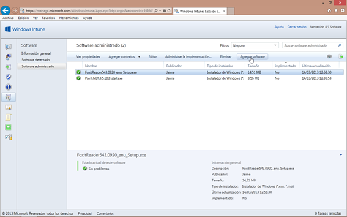

La primera vez que lo hagamos desde un determinado terminal, antes de
nada se instalará el **Editor de software de Windows Intune**,
mostrándose un asistente tal que lo que se ve en la figura adjunta.

Para proceder a la instalación hágase clic en **Ejecutar**.

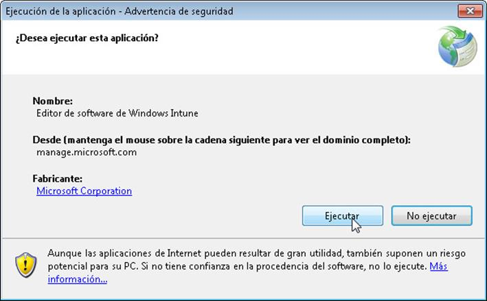

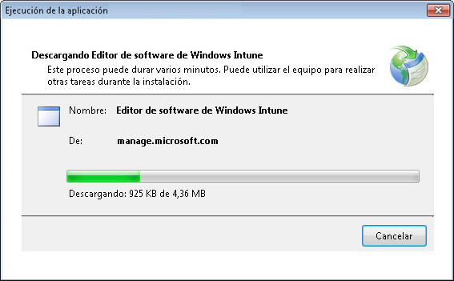

Todo el procedimiento es automático. Luego siguen las etapas habituales
de carga de software.

Ahora y en las sucesivas veces que deseemos agregar software, se nos
pedirá que iniciemos sesión en dicho editor/asistente para almacenar el
software en el espacio que Intune tiene a su disposición en la nube -20
GB-.

Hay que entrar con las mismas credenciales que para acceder al portal de
Intune.

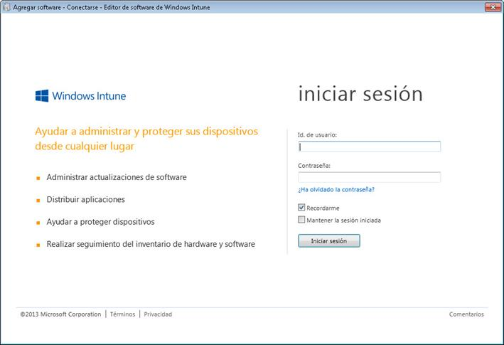

Dará comienzo el asistente denominado Agregar software – Editor de
software de Windows Intune.

Lo primero que se nos muestra es una ventana de información general, que
podremos obviar en sucesivas ocasiones haciendo clic y marcando la
casilla de verificación etiquetada No volver a mostrar esta página.

Prosigamos haciendo clic sobre el botón Siguiente&gt;

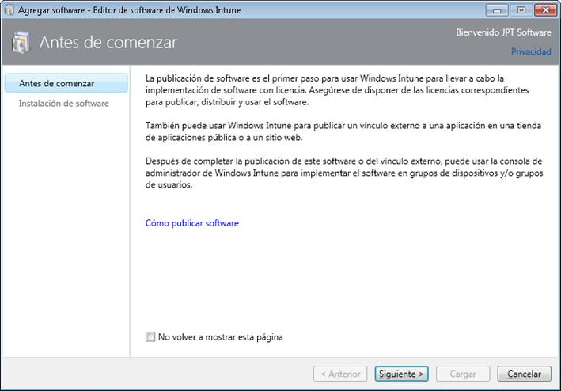

Las primeras opciones de **Instalación de software** en sí nos pedirán
los siguientes datos:

Cómo debe a ponerse a disposición de los dispositivos este software:

Un programa instalador estándar

Un vínculo externo, del que deberemos especificar su dirección URL

De qué tipo de archivo de instalación se trata, si es un instalador
puede ser del tipo EXE o paquete de instalación MSI, o bien un paquete
de aplicación de Windows del tipo APPX

Especificar el archivo de instalación a cargar en éstos últimos casos

Si se deben incluir archivos y subcarpetas adicionales durante la carga
para el caso de archivos EXE y paquetes de instalación MSI

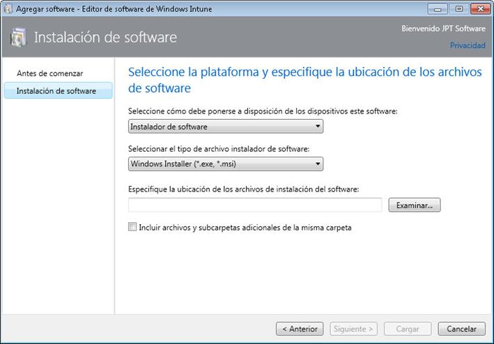

Una vez completada la información, hágase clic en el botón
**Siguiente&gt;**

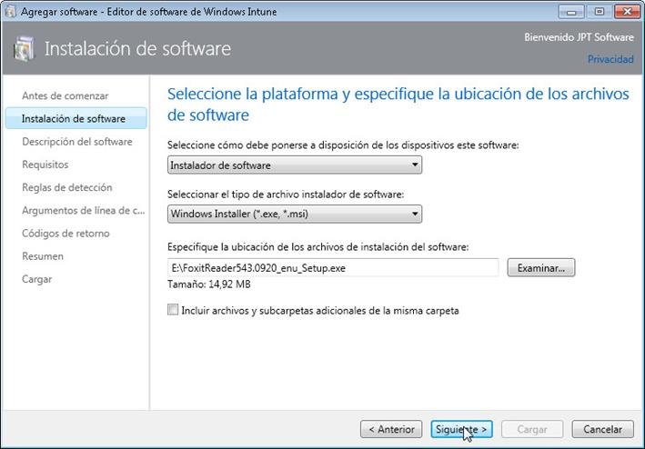

EL segundo paso de la configuración es la **Descripción del software**.

Deberemos al menos informar de:

- Quién es el publicador que ha subido el software

- El nombre del software, normalmente le daremos alguno suficientemente
descriptivo

- Una breve descripción de sus características

Opcionalmente también podremos incluir una dirección URL en dónde
obtener información acerca del programa y una **Categoría** en la que
clasificamos el software, dentro de algunas ya predeterminadas por
Windows Intune.

Si lo deseamos, también podremos incluir una imagen a modo de icono
representativo del programa y finalmente seguiríamos haciendo clic sobre
el botón **Siguiente&gt;**

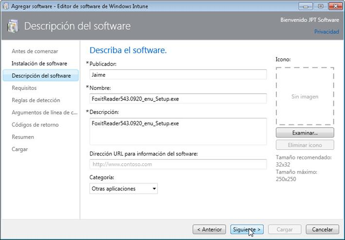

En el tercer paso fijaremos los **Requisitos** necesarios para la
instalación del software:

La arquitectura:

Cualquiera: Válido para 32 y 64 bits

- 32 bits exclusivamente

- 64 bits exclusivamente

El sistema operativo, ahí seleccionaremos el sistema operativo base
*mínimo* que debe tener instalado el ordenador –desde Windows XP hasta
Windows 8-

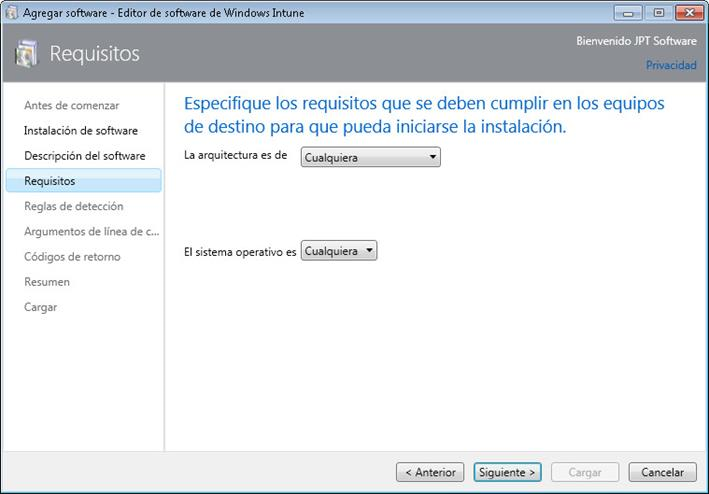

Fijados los **Requisitos**, proseguiremos haciendo clic en el botón
**Siguiente&gt;**

Insert Caption

<!-- -->

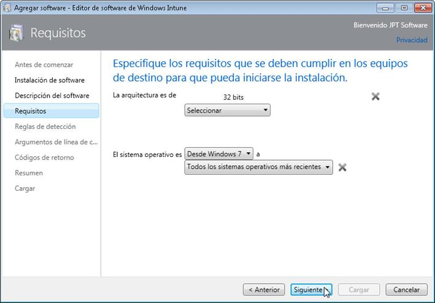

En el cuarto paso nos detendremos en las **Reglas de detección**.

Es decir, hablaremos de cómo detectar si el software que estamos
subiendo está ya instalado en una determinada máquina y eso puede
hacerse según:

Usando reglas de detección predeterminadas, que normalmente serán las
utilizadas ya por el propio agente de instalación del programa que
estamos cargando

Detectarlos según:

El archivo existe

Existe un código de producto MSI

Existe una determinada clave en el registro, que proporcionaríamos

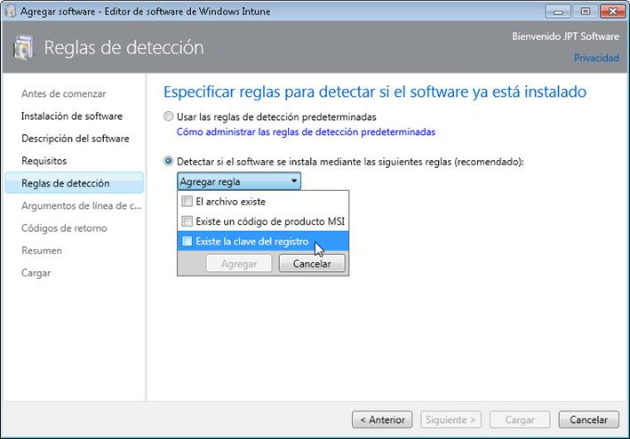

Concluidas nuestras reglas, continuaremos haciendo clic sobre el botón
**Siguiente&gt;** y pasamos al quinto paso, que trata de los posibles
**Argumentos de línea de comandos**.

Puede que cuando se ejecute el programa de instalación quepa pasarle
argumentos para personalizar su comportamiento. Eso dependerá de cada
programa.

En el área de textos **Argumentos de línea de comandos** podremos
especificar cuáles son los que desearíamos que fuesen pasados al
programa en el cliente, cuando aquel lo ejecutase.

Sea como fuere, seguiríamos haciendo clic sobre el botón
**Siguiente&gt;**

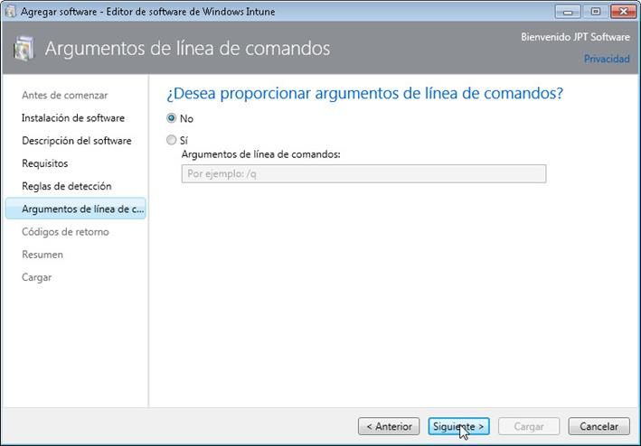

Ya en el sexto y último paso de la configuración, definiremos como se
interpretarán los **Códigos de retorno**, aquellos códigos que devolverá
el programa una vez ejecutado.

- No: Debería ser la opción escogida si desconocemos cómo hacerlo o si el
propio programa ya hace explícito lo acontecido al final

- Sí: Nos permite fijar los valores de cuando todo ha ido correcto,
incorrecto o si precisa reiniciarse el equipo. Por defecto, Windows
Intune proporciona dos valores estándar para correcto y correcto con
reinicio, para otros valores precisaríamos de la documentación precisa
de cada programa.

Insert Caption

<!-- -->

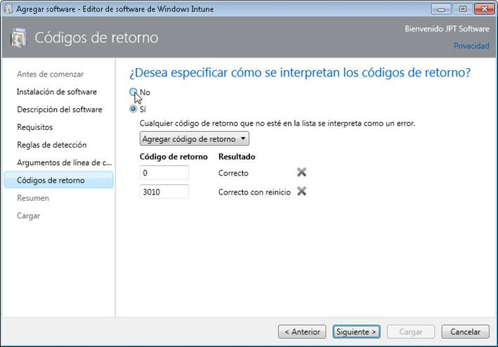

Al hacer clic en **Siguiente&gt;** ya habremos finalizado la
configuración.

Se nos mostrará **Revise el software que está agregando a Windows
Intune**.

Repásese detenidamente. Si se observa algo incorrecto, utilícese el
botón **&lt;Anterior** hasta llegar al lugar en que debamos procesar el
fallo.

Una vez dad nuestra conformidad, hagamos clic sobre el botón **Cargar**.

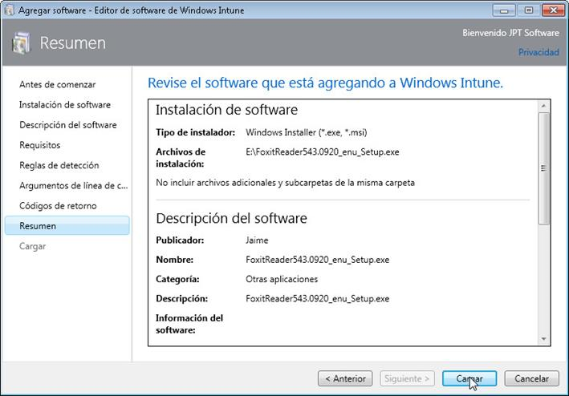

Primeramente el asistente realizará una serie de acciones de compresión
y preparación.

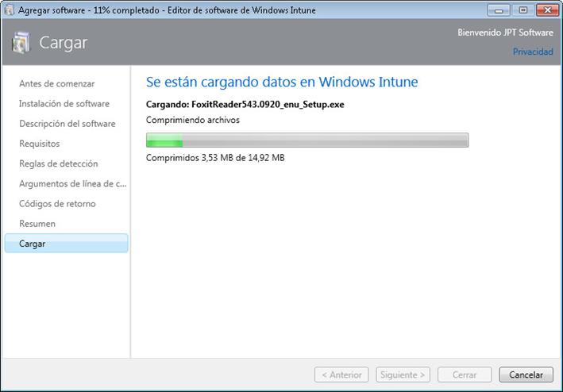

Para posteriormente subir –cargar- el software en Windows Intune.

El proceso le llevara desde algunos momentos hasta el nivel de horas, si
se trata de software de grandes dimensiones y una velocidad de subida
baja, sea paciente.

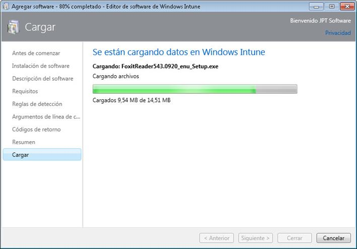

Una vez finalizada la carga, seremos convenientemente informados y
bastará hacer clic sobre el botón **Cerrar**, con lo que se cerrará el
asistente y la sesión.

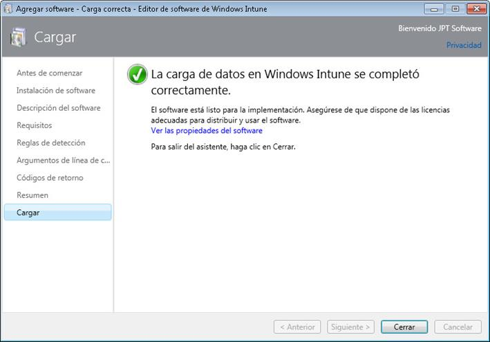

Si ahora acudimos al portal de administración de Windows Intune y vamos
a **Software administrado**, observaremos que aparece el recientemente
cargado, como cabria esperar.

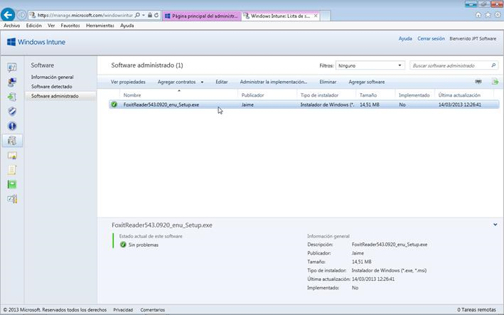

 

Conclusiones
------------

Ya con el software en el espacio en la nube de Windows Intune, como
comentábamos al comiendo del presente artículo, podemos realizar tareas
tales como adjuntarlo al *Portal de empresa* o *Administrar la
implementación* para su instalación automática en grupos de usuarios y/o
equipos.

Esperamos que lo aquí expuesto les haya servido de ayuda en su trabajo y
no dejen de preguntar cualquier duda que les pudiese surgir. Hasta la
próxima, tengan unas provechosas sesiones de computación.

