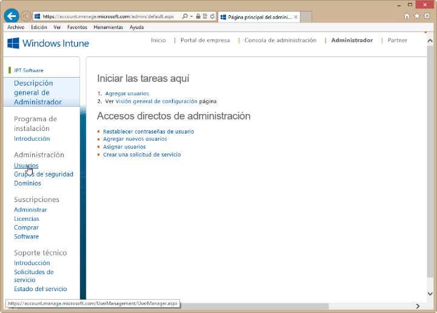
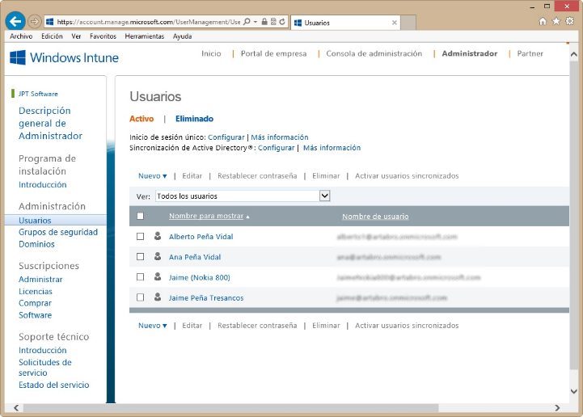
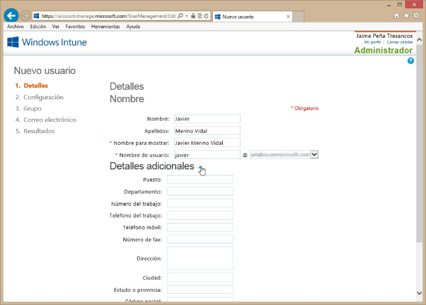

<properties
	pageTitle="Windows Intune - Administración de usuarios"
	description="Para acceder a los servicios de Windows Intune deberemos ser unos usuarios registrados activos. Es una labor del administrador de licencias el crear una cuenta de usuario, vamos a tratar el caso del acceso directo desde el Portal de cuentas de Windows Intune. A ello dedicaremos el presente artículo."
	services="ems"
	documentationCenter=""
	authors="andygonusa"
	manager=""
	editor="andygonusa"/>

<tags
	ms.service="ems"
	ms.workload="na"
	ms.tgt_pltfrm="na"
	ms.devlang="na"
	ms.topic="how-to-article"
	ms.date="05/12/2016"
	ms.author="andygonusa"/>

#Windows Intune - Administración de usuarios
©Jaime Peña Tresancos, 2013

Profesional independiente en el sector Servicios y tecnología de la
información

Microsoft MVP

Twitter: @jpt219

LinkedIn:
[http://es.linkedin.com/pub/jaime-peña-tresancos/28/677/696](http://es.linkedin.com/pub/jaime-pe%c3%b1a-tresancos/28/677/696)

Para acceder a los servicios de *Windows Intune* deberemos ser unos
usuarios registrados activos. Es una labor del administrador de
licencias el crear una cuenta de usuario, vamos a tratar el caso del
acceso directo desde el *Portal de cuentas de Windows Intune*. A ello
dedicaremos el presente artículo.

En ésta línea, trataremos:

El panel de administración de usuarios de *Windows Intune*

Crear nuevos usuarios

Las diversas tareas de edición de usuarios

Restaurar usuarios eliminados

Panel de administración de usuarios
-----------------------------------

Una vez nos hayamos identificado en *Portal de cuentas de* *Windows
Intune*, deberemos acceder a las tareas del **Administrador**, haciendo
clic sobre el hipervínculo correspondiente –véase la figura que sigue-.

**Nota**: Recuérdese que se puede acceder al *Portal de cuentas de
Windows Intune* bien directamente desde el enlace URL correspondiente,
bien desde la *Consola de administración*, yendo a la pestaña
**Administración**, allí seleccionando **Administradores de inquilinos**
y haciendo clic sobre el hipervínculo **Iniciar sesión en el portal de
cuentas de Windows Intune**.

Ya en la consola del **Administrador**, en el panel de la izquierda, en
el apartado **Administración**, hacemos clic sobre **Usuarios**.

Pasaremos a ver el panel de administración de **Usuarios** en el que
encontraremos los siguientes apartados:

**Inicio de sesión único**: Nos proporciona la vía de acceso a su
configuración -hipervínculo **Configurar**-. Para más información hágase
clic en el hipervínculo correspondiente, a la derecha.

**Sincronización de *Active Directory***: Nos proporciona la vía de
acceso a su configuración -hipervínculo **Configurar**-. Para más
información hágase clic en el hipervínculo correspondiente, a la
derecha.

Barra de hipervínculos de gestión de usuarios: A modo de menú para
tareas de edición y gestión de usuarios véase el resto del artículo-.

Listado de usuarios activos: Se nos muestran todos los usuarios
actualmente activos. Si se marca su casilla de verificación –a la
izquierda- para seleccionarlos, se activarán a su vez hipervínculos de
la barra de gestión de usuarios para realizar tareas de edición véase
más adelante-.

<!-- -->

Crear un nuevo usuario
----------------------

Si se despliega la lista que hay en la entrada **Nuevo**, en la barra
inmediatamente encima o debajo de la lista de usuarios, encontramos la
opción **Usuario**, que deberemos escoger.

**Nota**: También se puede acceder de modo rápido desde la vista de
**Descripción general del Administrador** –véase la segunda de las
figuras mostradas-, haciendo clic en el hiperenlace **Agregar
usuarios**, dentro del apartado **Iniciar las tareas aquí** en el panel
central.

Respecto a la opción **Agregar en masa**, se utiliza cuando queramos
añadir numerosos usuarios simultáneamente, para ello se debe crear
previamente un archivo CSV –de valores separados por comas- de unas
ciertas características que se detallan en el asistente que se
desplegará, por el resto, los pasos a seguir son similares.

Para más información acerca de éste último punto consúltese la dirección
URL:

[**http://onlinehelp.microsoft.com/es-es/office365-enterprises/ff637601.aspx**](http://onlinehelp.microsoft.com/es-es/office365-enterprises/ff637601.aspx)

Pasaremos a la primera de las ventanas, referente a los **Detalles**,
del asistente de crear un nuevo usuario.

Los campos a rellenar son:

**Nombre**: Se trata de un campo opcional.

**Apellidos**: Se trata de un campo opcional.

**Nombre para mostrar**: El que se mostrará en el listado de usuarios en
el panel correspondiente de *Windows Intune* que acabamos de comentar.
Se trata de un campo obligatorio.

**Nombre de usuario**: Tiene el formato de una dirección de correo
electrónico, nosotros asignamos la parte del nombre, la parte de la
derecha se corresponde con *dominio* que tengamos asignado; si
disponemos de varios, podemos desplegar la lista y seleccionar a cuál de
ellos asignaremos el nuevo usuario. Se trata de un campo obligatorio.

Además, si desplegamos la opción **Detalles adicionales**, encontraremos
una colección de campos complementarios –véase la figura adjunta-. Todos
ellos son opcionales.

Finalizado el procedimiento, prosígase haciendo clic sobre el botón
**Siguiente**.

La segunda de las ventanas del asistente se refiere a la
**Configuración** de las tareas y permisos del nuevo usuario.

Los campos a rellenar son:

**Asignar acceso administrativo a su compañía**: Sobre los posibles
roles de administrador, consúltese las direcciones URL:

[**http://technet.microsoft.com/library/hh967622.aspx**](http://technet.microsoft.com/library/hh967622.aspx)

[**http://onlinehelp.microsoft.com/es-es/office365-enterprises/ff637584.aspx**](http://onlinehelp.microsoft.com/es-es/office365-enterprises/ff637584.aspx)

**Establecer ubicación del usuario**: Se debe seleccionar la ubicación
nacional del usuario país de residencia-.

**Asignar acceso administrativo a las compañías a las que suministra
soporte técnico**: Se trata de otorgar permisos para acceso
administrativo a terceras empresas que hayan contratado administración
delegada. Sobre los posibles roles administrativos en éste ámbito, se
sugiere consultar la nota del punto 7 de la segunda dirección URL antes
dada.

Finalizado el procedimiento, prosígase haciendo clic sobre el botón
**Siguiente**.

La tercera ventana del asistente se refiere a la selección de **Grupo**,
normalmente habrá un único grupo disponible, el de **Windows Intune**,
para usuarios no administrativos.

Finalizado el procedimiento, prosígase haciendo clic sobre el botón
**Siguiente**.

Ya en la cuarta ventana del asistente se trata de **Enviar resultados en
correo electrónico**.

Se debe proporcionar el listado de direcciones de correo electrónico
–hasta 5-, separadas por punto y coma a quienes se les enviarán los
datos necesarios para la conexión.

Finalizado el procedimiento, prosígase haciendo clic sobre el botón
**Crear**.

La quinta y última ventana se nos muestran los **Resultados** de los
parámetros del nuevo usuario:

**Nombre de usuario**: Aquel con el que deberá acceder a los servicios
de *Windows Intune*.

**Contraseña temporal**: La contraseña correspondiente, que debería
cambiar nada más conectarse la primera vez y establecer una nueva
personal.

Prosígase haciendo clic sobre el botón **Finalizar**.

Finalizado el proceso de creación, el nuevo usuario nos aparecerá ya en
el listado de **Usuarios** del panel de su administración, como puede
apreciarse en la figura adjunta.

Tareas de edición de usuarios
-----------------------------

Sobre un usuario activo tenemos la posibilidad de editar todas las
opciones anteriormente comentadas durante su creación y alguna más.

Deberemos volver al panel de usuarios como describimos al comienzo del
artículo y seleccionarlo –haciendo clic sobre la casilla de verificación
que hay a su izquierda-. Si deseamos realizar una misma tarea sobre
varios usuarios, seleccionaríamos todo aquel sobre los que estemos
interesados.

Inmediatamente veremos que se activarán diversos hipervínculos de las
barras que se encuentran por encima y por debajo de la lista de usuarios
y que dan acceso a:

**Editar**: Nos permite cambiar los datos de las opciones del usuario,
se abrirá un panel con tres posibles entradas:

**Detalles**: Todos los comentados con anterioridad. Incluido el
**Nombre de usuario** y el **Nombre para mostrar**

**Configuración**: Para restablecimiento de roles administrativos y
ubicación nacional

**Grupo**: Para cambio de grupo de pertenencia si hubiese más de uno
disponible-

**Restablecer contraseña**: Se creará una nueva contraseña temporal y se
remitirá por correo electrónico, como se ha explicado en el apartado de
crear un nuevo usuario.

**Eliminar**: Se eliminará(n) él (o los) usuario(s) seleccionado(s) del
grupo de usuarios activos. Realmente las cuentas pasan a inactivas
temporalmente durante 30 días, luego se eliminan definitivamente.

<!-- -->

Restauración de usuarios eliminados
-----------------------------------

De nuevo deberemos volver al panel de usuarios como describimos al
comienzo del artículo y hacer clic sobre **Eliminado**, de manera que
tengamos la vista de los usuarios recientemente eliminados

Ahora deberemos:

Seleccionar aquel o aquellos que deseemos restaurar

Hacer clic sobre **Restaurar**

Cuando se nos informe del resultado, cerrar la caja de diálogo

<!-- -->

**Nota**: Recuérdese, una cuenta de usuario no puede recuperarse pasados
30 días desde su eliminación.

Para más información acerca de restaurar usuarios y posibles problemas
que se puedan plantear, consúltese la siguiente dirección URL:

[**http://technet.microsoft.com/library/hh967646.aspx**](http://technet.microsoft.com/library/hh967646.aspx)

Conclusiones
------------

Hemos visto cómo gestionar las tareas comunes de administración de
usuarios; cómo crearlos, editarlos, eliminarlos y, en su caso,
recuperarlos. También le hemos echado un vistazo al entorno de gestión
administrativa de los usuarios de *Windows Intune* y sugerimos fuentes
directas de información de Microsoft acerca de aquellos tópicos más
concretos.

Esperamos que lo aquí expuesto les haya servido de ayuda en su trabajo y
no dejen de preguntar cualquier duda que les pudiese surgir. Hasta la
próxima, tengan unas provechosas sesiones de computación.

**©Jaime Peña Tresancos, 2013**

**Twitter: @jpt219**

**LinkedIn:**
[*es.linkedin.com/pub/jaime-peña-tresancos/28/677/696*](http://es.linkedin.com/pub/jaime-pe%C3%B1a-tresancos/28/677/696)
