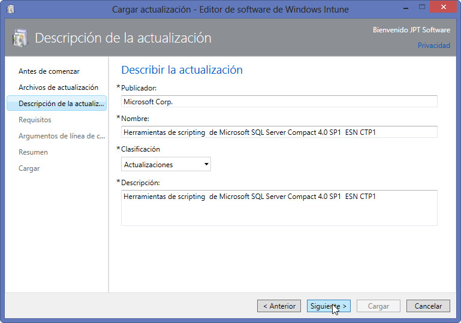
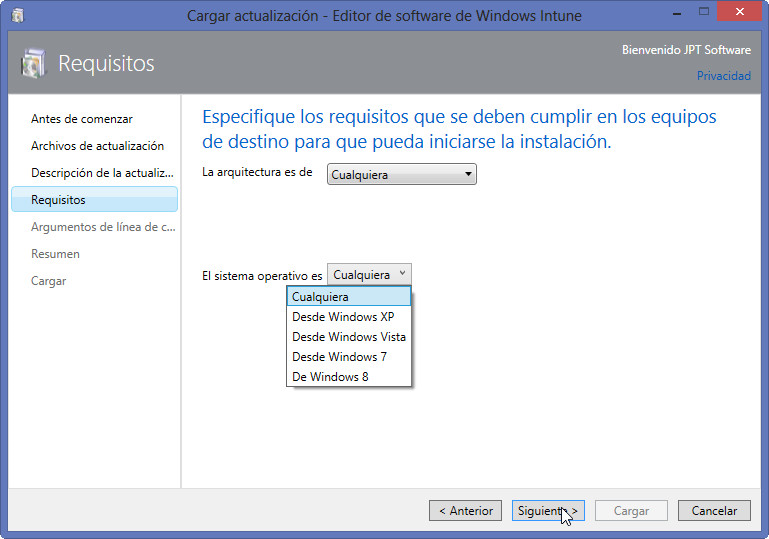
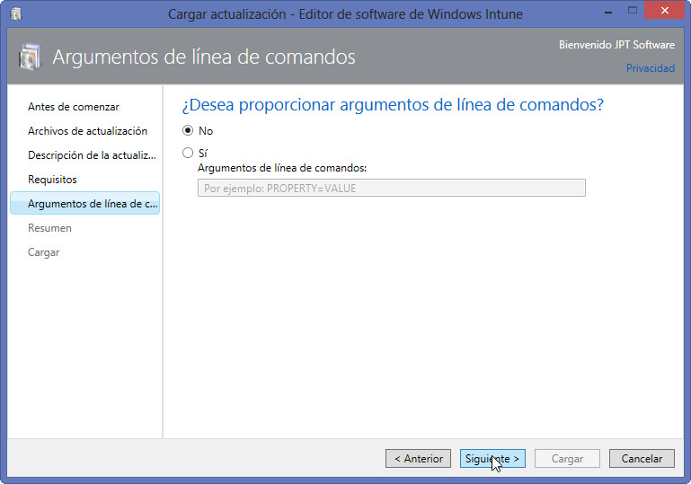
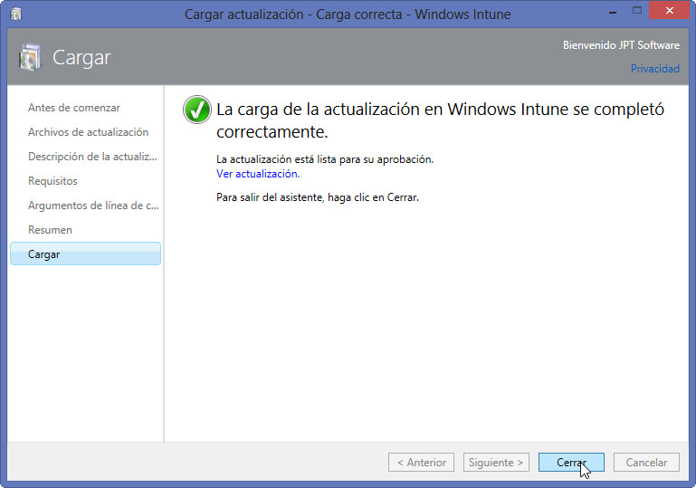
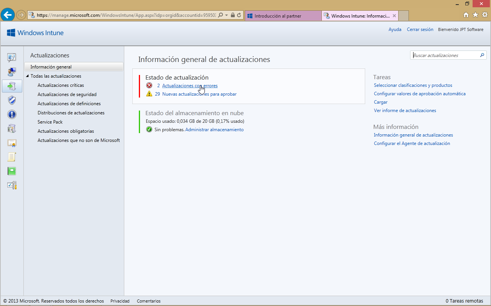

#Windows Intune (Ed. Dic-2012). Gestión de actualizaciones II

©Jaime Peña Tresancos, 2013

Profesional independiente en el sector Servicios y tecnología de la
información

Microsoft MVP

Twitter: @jpt219

LinkedIn:
[http://es.linkedin.com/pub/jaime-peña-tresancos/28/677/696](http://es.linkedin.com/pub/jaime-pe%c3%b1a-tresancos/28/677/696)

La mayor parte de las tareas de actualización las llevará a cabo Windows
Intune de una manera muy versátil y automatizada. Sin embargo hay una
serie de circunstancias en las que se requiere un cierto trabajo
adicional de definición de qué actualizar y cuando. A ello dedicaremos
el presente artículo.

En ésta línea, trataremos:

* Cómo cargar manualmente una actualización

* Cómo gestionar actualizaciones con errores

* Cómo trata los errores de instalación del cliente de Windows Intune

* Qué hacer con actualizaciones que no son contempladas por Microsoft

Cargar una actualización
------------------------

En ocasiones el *Administrador* deseará implementar una actualización no
contemplada por Windows Intune, por ejemplo una corrección o revisión de
un software no directamente soportado por él.

En tales casos se ha de cargar manualmente la actualización y
distribuirla posteriormente. Veamos cómo.

Si no estuviéramos ya en la pestaña **Actualizaciones**, en su entrada
de **Información general**, hagamos las correspondientes selecciones
para ir hasta allí.

Observe el hipervínculo **Cargar**, en la parte de la derecha de la
ventana.

{width="4.03in" height="2.52in"}

Hagamos clic sobre él y se mostrará la ventana de Cargar actualización –
Conectarse – Editor de software de Windows Intune.

Para poder proseguir deberemos en primera instancia iniciar sesión con
nuestras credenciales de Windows Intune.

Una vez iniciada la sesión correctamente, entraremos en el asistente de
**Cargar actualización – Editor de software de Windows Intune**.

En la primera ventana simplemente se nos informa de lo esencial del
asistente, leído, proseguiremos haciendo clic sobre el botón
**Siguiente&gt;**

En la segunda ventana del asistente entraremos en el apartado
**Especificar archivos de actualización**.

Aquí:

1.  Haremos clic sobre el botón **Examinar…** para localizar el archivo
    de actualización en nuestro ordenador –previamente debería haber
    sido descargado en local-

2.  Puede que debiéramos hacer clic sobre **Incluir archivos y
    subcarpetas adicionales de la misma carpeta**, si es que así fuese
    pertinente

Finalizado el proceso de carga, haremos clic sobre el botón
**Siguiente&gt;**.

Ya en la tercera ventana del asistente, nos encontramos en el momento de
**Describir la actualización**.

Los apartados a cubrir son:

**Publicador**: de la actualización

**Nombre**: descripción significativa de la actualización

**Clasificación**: desplegaremos la lista y seleccionaremos lo que más
se acomode, normalmente será **Actualización**

**Descripción**: otro campo con una descripción complementaria, tal vez
con detalles más concretos

Finalizado, haremos clic sobre el botón **Siguiente&gt;**.

Ahora, ya en la cuarta ventana del asistente, hemos de definir los
**Requisitos** que se deben cumplir en los equipos destino para que se
pueda iniciar la instalación:

La arquitectura: desplegaremos la lista y seleccionaremos si es
específica para x86, x64 o cualquiera de las arquitecturas

El sistema operativo mínimo: puede ser cualquiera o uno partiendo desde
Windows XP en adelante

Finalizado, haremos clic sobre el botón **Siguiente&gt;**.

En la quinta ventana del asistente tenemos la oportunidad de establecer
**Argumentos de línea de comandos**, todo dependerá de la documentación
propia de la actualización en cada caso.

Finalizado, haremos clic sobre el botón **Siguiente&gt;**.

Finalmente se nos mostrará un **Resumen**, para revisar los aspectos
generales de la actualización que se cargará en Windows Intune,
tendremos una última oportunidad de revisarlos y, en su caso, ir hacia
atrás y modificarlos.

Si todo está conforme, para salir del asistente, haremos clic sobre el
botón **Finalizar**.

Se procederá a la carga de la actualización –en el almacenamiento en la
nube disponible con Windows Intune, inicialmente 20 GB-.

Una vez finalizada la carga, se nos informará de ello, el proceso habrá
concluido.

Saldremos del asistente haciendo clic sobre el botón **Cerrar**.

Ya de vuelta a la administración de Windows Intune, podremos localizar
esa nueva actualización en el apartado de **Actualizaciones que no son
de Microsoft**, en la pestaña **Actualizaciones**.

Para que se incluyan en actualizaciones activas, han de ser aprobadas,
bastará hacer clic sobre el botón **Aprobar**, una vez seleccionada(s).

Gestión de actualizaciones con errores
--------------------------------------

Son varios los lugares en los que Windows Intune informa de errores de
instalación de las actualizaciones, pero el mejor lugar para obtener
todo tipo de información es la ficha **Actualizaciones**, concretamente
dentro de ella en **Estado de actualización** se recoge la lista de
errores y actualizaciones pendientes.

Una solución pasa por cargar manualmente la actualización e
implementarla.

Los pasos serán obtener la información pertinente acerca de ella y
descargarla en local:

1.  Hágase clic sobre la advertencia de errores

2.  Selecciónese la actualización a reinstalar y hágase clic sobre ella
    para mostrar la información completa que nos da Windows Intune

3.  Para obtener información de Microsoft acerca del error hágase clic
    sobre el hipervínculo **Artículo de KB**, en la parte inferior
    izquierda de la pantalla

4.  Allí podremos conocer qué actualización ha fallado y, en su caso,
    dónde podremos obtener datos adicionales para obtenerla o buscarla
    en Internet

5.  Si la encontramos podremos forzar su reinstalación, localizando el
    correspondiente archivo de instalación

6.  Descargándolo en local, por parte del administrador

7.  Y realizar una carga como la descrita en el apartado **Cargar una
    actualización**

¿Cómo solucionar errores de instalación del cliente de Windows Intune?
----------------------------------------------------------------------

Ya en la pantalla de **Información general del sistema** y concretamente
en el apartado **Actualizaciones** se nos mostrará si hay de errores de
la instalación del propio cliente de Windows Intune en alguno de los
dispositivos de trabajo.

Los pasos a seguir son:

1.  Hágase clic sobre el equipo que tenga el error de instalación del
    cliente de Windows Intune

2.  O bien, pasaremos a la ficha **Grupos** y en ella en **Estado de
    actualización** haremos clic sobre el dispositivo con el error de
    actualización

3.  Se nos mostrará la ficha de **Todos los dispositivos**, seleccionado
    el que tiene el error de instalación correspondiente

4.  Hágase clic en el botón **Retirar/Eliminar datos**, en la barra
    inmediatamente encima de la lista de dispositivos

5.  Se nos pedirá confirmación para eliminar ese dispositivo de Windows
    Intune

6.  Deberemos aprobar todas las peticiones al respecto y encender el
    dispositivo para que se lleven a cabo las operaciones de eliminación
    correspondientes

7.  Pasará un cierto tiempo hasta que el dispositivo desaparezca de la
    lista de dispositivos en el panel de Windows Intune –sea paciente-

8.  Cuando haya ocurrido, vuelva a instalar desde cero Windows Intune en
    el dispositivo

<!-- -->

Actualizaciones que no son contempladas por Microsoft
-----------------------------------------------------

Han de ser cargadas manualmente, dado que Windows Intune no tiene
control predefinido sobre ellas. El método general a seguir será:

1.  Localizar el archivo de actualización en Internet

2.  Descargarlo en local, por parte del administrador

3.  Realizar una carga como la descrita en el apartado **Cargar una
    actualización**

Conclusiones
------------

A lo largo del presente artículo hemos visto todo lo relativo a la
gestión manual de actualizaciones. Esencialmente se basa en la carga de
actualizaciones desde el panel de **Actualizaciones**. Se tratará de
tareas complementarias a las muy versátiles opciones automatizadas de
Windows Intune, pero imprescindibles para el software no contemplado por
él o cuando se haya producido algún tipo de error.

Esperamos que lo aquí expuesto les haya servido de ayuda en su trabajo y
no dejen de preguntar cualquier duda que les pudiese surgir. Hasta la
próxima, tengan unas provechosas sesiones de computación.

**©Jaime Peña Tresancos, 2013**

**Twitter: @jpt219**

**LinkedIn:**
[*es.linkedin.com/pub/jaime-peña-tresancos/28/677/696*](http://es.linkedin.com/pub/jaime-pe%C3%B1a-tresancos/28/677/696)
