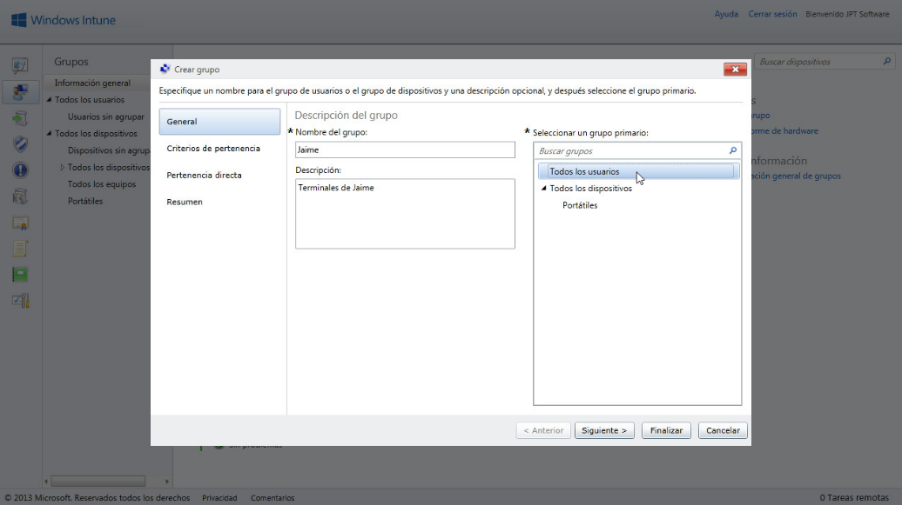
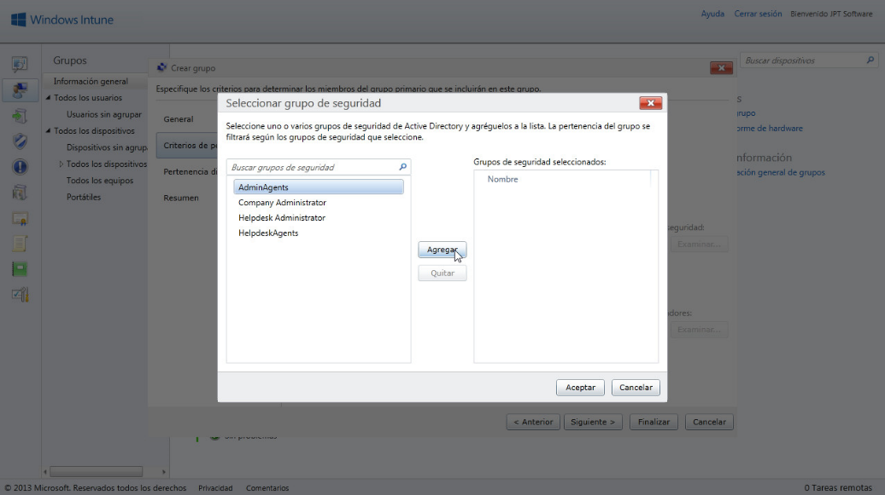
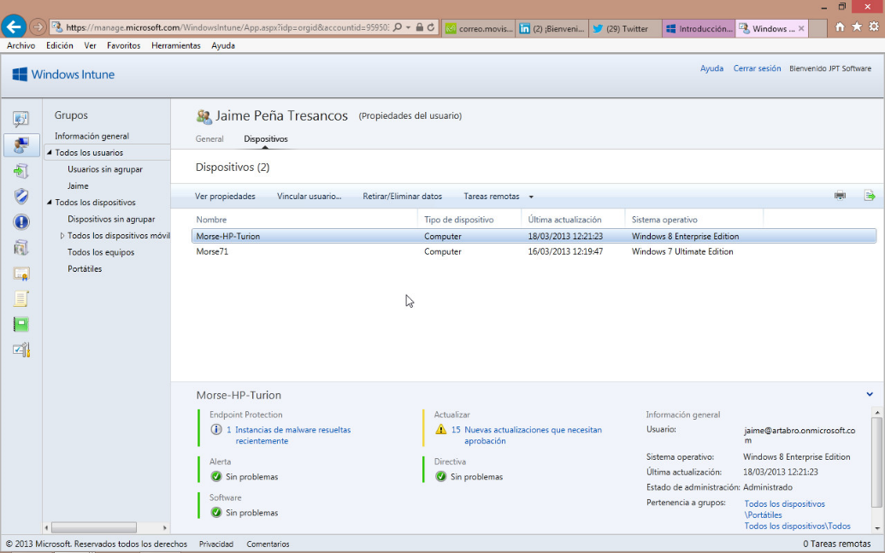

<properties
	pageTitle="Windows Intune - Organización en Grupos II"
	description="En nuestro anterior artículo Windows Intune (Ed. Dic-2012). Organización
en Grupos I habíamos hablado de cómo crear un grupo a partir de una
selección de dispositivos –lo mismo se realizaría con una selección de
usuarios-, allí partíamos de vista de Todos los dispositivos dentro de
la pestaña Grupos."
	services="ems"
	documentationCenter=""
	authors="andygonusa"
	manager=""
	editor="andygonusa"/>

<tags
	ms.service="ems"
	ms.workload="na"
	ms.tgt_pltfrm="na"
	ms.devlang="na"
	ms.topic="how-to-article"
	ms.date="05/12/2016"
	ms.author="andygonusa"/>

#Windows Intune - Organización en Grupos II

©Jaime Peña Tresancos, 2013

Profesional independiente en el sector Servicios y tecnología de la
información

Microsoft MVP

Twitter: @jpt219

LinkedIn:
[http://es.linkedin.com/pub/jaime-peña-tresancos/28/677/696](http://es.linkedin.com/pub/jaime-pe%c3%b1a-tresancos/28/677/696)

En nuestro anterior artículo Windows Intune (Ed. Dic-2012). Organización
en Grupos I habíamos hablado de cómo crear un grupo a partir de una
selección de dispositivos –lo mismo se realizaría con una selección de
usuarios-, allí partíamos de vista de Todos los dispositivos dentro de
la pestaña Grupos.

En el presente trataremos el cómo crear un grupo partiendo de cero, es
decir, sin selección inicial alguna de usuario(s) o dispositivo(s)

Para ello utilizaremos el asistente Crear grupo de forma directa, al que
se accede desde la pestaña de Información general de la Consola de
administración de Windows Intune.

En el presente artículo veremos:

* Qué es un grupo, qué propiedades tiene y cuáles son sus finalidades

* Cómo acceder al asistente **Crear grupo**

* Cómo crear grupos de usuarios o de dispositivos

* Las opciones de definición de pertenencia dinámica –criterios por
aplicación de reglas-

* La integración directa de usuarios o dispositivos en grupos determinados

* Las correspondientes opciones de exclusión de pertenencia –criterios-
tanto dinámicas como directas –estáticas-

**NOTA:** En el apartado siguiente hablaremos de **¿Qué es un grupo?**,
si Usted ya ha visto nuestro anterior artículo [**Windows Intune (Ed.
Dic-2012). Organización en Grupos
I**](http://msdn.microsoft.com/es-es/library/dn133099.aspx), pase
directamente al apartado posterior.

¿Qué es un Grupo?
-----------------

Un grupo es el sistema de organización sobre el cual podremos gestionar
las tareas de Windows Intune, como políticas de implementación de
software, actualizaciones, accesos al **Portal de empresa**, …

Para una referencia directa de cómo funcionan los dispositivos y grupos
de usuarios, acúdase a:

[**http://technet.microsoft.com/es-es/library/jj676619.aspx**](http://technet.microsoft.com/es-es/library/jj676619.aspx)

En Windows Intune la idea de grupo trabaja, a modo de esquema, de la
siguiente manera:

-   Un grupo puede constar de usuarios o dispositivos, pero no de una
    mezcla de ambos

-   Inicialmente se definen cuatro, que no se pueden eliminar:

    -   Todos los usuarios

    -   Usuarios no agrupados

    -   Todos los dispositivos

    -   Dispositivos no agrupados

-   Los componentes pueden ser *estáticos* y *dinámicos*; los primeros
    son aquellos directamente definidos como tales, los segundos se
    incorporan y retiran según reglas de pertenencia que Windows Intune
    gestiona

-   Un miembro puede pertenecer a diferentes grupos

-   Los grupos tienen una estructura de árbol, al pertenecer a un grupo
    secundario, automáticamente se pertenece a toda la rama primaria

-   Siendo así, es posible dictar directivas que sean aplicables sólo a
    partes de una rama primaria –sólo a ciertos grupos secundarios-

    

Grupos a partir del asistente Crear grupo
-----------------------------------------

Una vez iniciada sesión en la **Consola de administración** de Windows
Intune, vamos a la pestaña **Grupos** y allí seleccionamos **Información
general** –si no estamos ya en esa vista-, veremos la información
general y la lista de todos los grupos integrados en nuestra red Windows
Intune.

En el borde de la derecha, en el área **Tareas**, hacemos clic sobre
**Crear grupo…**

Se desplegará la primera ventana del asistente de **Crear grupo**.

En el apartado **Descripción del grupo** tenemos dos campos:

**Nombre del grupo**: daremos un nombre significativo al grupo, por
ejemplo ‘portátiles’

**Descripción**: es un campo optativo, con una breve descripción del
contenido del grupo

Seguidamente en el apartado **Seleccionar un grupo primario**, tenemos
las siguientes opciones:

Hacemos clic y dejamos escogido **Todos los dispositivos**. Con lo cual
comenzaremos la creación de un grupo de dispositivos partiendo de todos
los dispositivos existentes

Hacemos clic y dejamos escogido **Todos los usuarios**. Con lo cual
comenzaremos la creación de un grupo de usuarios partiendo de todos los
usuarios existentes

Hacemos clic y dejamos escogido algún otro grupo de usuarios o
dispositivos. Con lo cual comenzaremos la creación de un grupo de
usuarios o dispositivos partiendo del grupo primarios de usuarios o
dispositivos seleccionados

Posteriormente hacemos clic en el botón **Siguiente&gt;**.

En la segunda parte del asistente se especificaran los criterios de
pertenencia al grupo. Se trata de criterios de pertenencia *dinámica*,
es decir, aquellos que controlará automáticamente Windows Intune para
incluir/excluir equipos o usuarios –según sea el grupo-

Los apartados con que nos encontraremos son:

**Iniciar pertenencia a grupos con**: Escogeremos en la lista
desplegable de que grupo se iniciará e criterio dinámico de selección –a
que grupo se aplicarán las reglas dictadas más abajo-

Según las selecciones anteriores, se muestran más abajo áreas de
búsqueda de criterios dinámicos para inclusión y exclusión de
integrantes, haciendo clic sobre los correspondientes botones
**Examinar…\

Se nos abrirán cajas de diálogo para inclusión de, por ejemplo, tipos de
usuarios a **Agregar** o **Quitar**.

Hechas las selecciones, sálgase haciendo clic sobre el botón
**Aceptar**.

Volveremos al asistente con nuestros criterios de pertenencia dinámica
establecidos.

Cuando los hayamos perfilado todos, salimos de este paso haciendo clic
sobre el botón **Siguiente&gt;**

En el tercer paso del asistente se trata de definir criterios de
permanencia directa, es decir, definir equipos o usuarios –según el tipo
de grupo- que pertenecerán de forma fija al grupo que estamos
definiendo.

Ahora cabe:

En el área de la izquierda, pulsamos el botón **Examinar** y se
desplegará una caja de diálogo en la que podremos seleccionar *miembros*
concretos para su pertenencia al grupo

En el área de la derecha, pulsamos el botón **Examinar** y se desplegará
una caja de diálogo en la que podremos seleccionar *miembros* concretos
para su exclusión del grupo

<!-- -->

Al finalizar nuestras selecciones particulares y cerrada(s) la(s)
caja(s) de diálogo abierta(s) haciendo clic sobre **Aceptar**,
retornaremos a la segunda ventana del asistente con nuestras
modificaciones realizadas y terminaremos con un clic sobre el botón
**Siguiente&gt;**

Finalmente se nos muestra el resumen de la creación del grupo, si todo
es correcto, hacemos clic en **Finalizar**.

Se cerrará la ventana del asistente **Crear grupo** y volveremos a la
consola de administración de Windows Intune.

Ahora se nos mostrará la entrada del nuevo grupo, podremos navegar en
sus fichas:

-   **General**: con la información global del grupo

-   Según hayamos creado un grupo de dispositivos o usuarios, las
    fichas:

    -   **Dispositivos**: que nos dará un listado de los equipos que se
        incluyen en el grupo. Haciendo doble clic sobre cualquiera de
        ellos, nos llevará a la vista de detalle del equipo

    -   **Usuarios**: que nos dará un listado de los usuarios que se
        incluyen en el grupo. Haciendo doble clic sobre cualquiera de
        ellos, nos llevará a la vista de detalle del usuarios

    

De cada usuario, si se trataba de un grupo de usuarios, podremos conocer
sus características, haciendo doble clic sobre su entrada y así
sucesivamente.

Conclusiones
------------

A lo largo del presente artículo hemos repasado lo que representa un
grupo, cómo crear a partir de cero uno de tipo usuarios o uno de tipo
dispositivos y como establecer criterios de pertenencia a dicho grupo
–reglas, en el primer caso.

Sabemos ahora que la pertenencia o exclusión puede ser *dinámica* o
*estática*, en función de que sea debida a la aplicación, por parte de
Windows Intune, de una reglas predefinidas por nosotros, o que lo sea
porque hayamos incluido componentes de forma directa.

Esperamos que lo aquí expuesto les haya servido de ayuda en su trabajo y
no dejen de preguntar cualquier duda que les pudiese surgir. Hasta la
próxima, tengan unas provechosas sesiones de computación.

**©Jaime Peña Tresancos, 2013**

**Twitter: @jpt219**

**LinkedIn:**
[*es.linkedin.com/pub/jaime-peña-tresancos/28/677/696*](http://es.linkedin.com/pub/jaime-pe%C3%B1a-tresancos/28/677/696)
