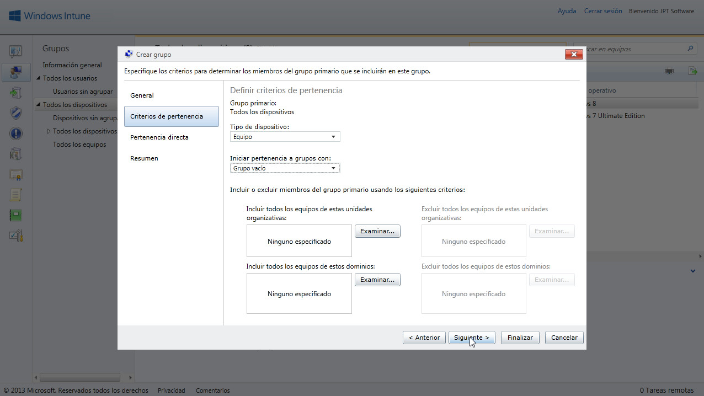
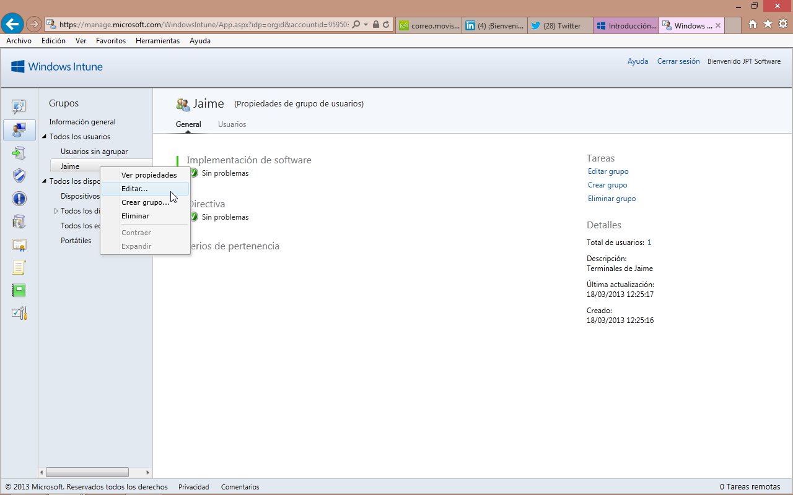
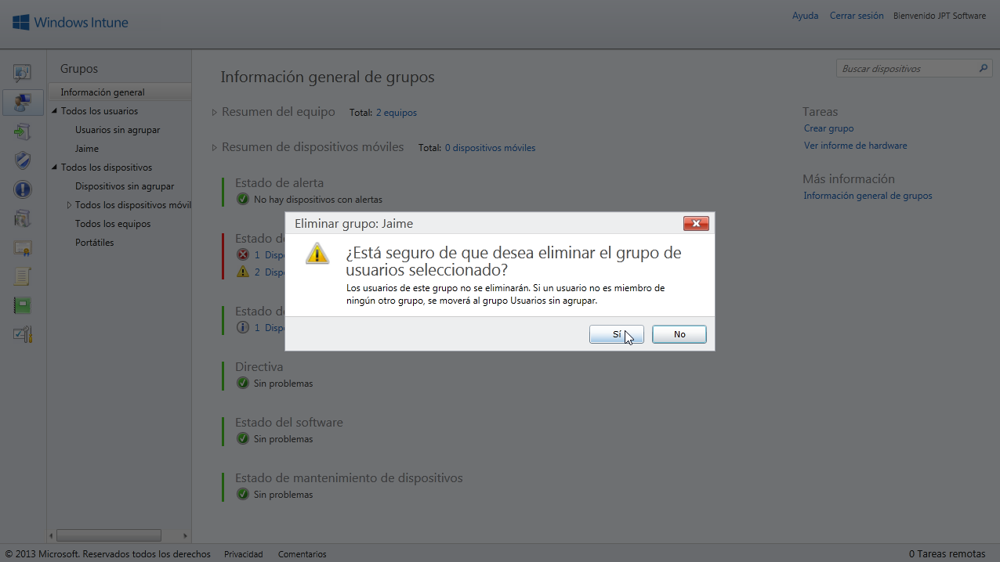

<properties
	pageTitle="Windows Intune - Organización en Grupos"
	description="Windows Intune está enfocado al trabajo con usuarios y equipos. Bien es
cierto que cabe la posibilidad de tratarlos individualmente, pero esa
labor se vuelve poco factible a nada que crezca nuestra red."
	services="ems"
	documentationCenter=""
	authors="andygonusa"
	manager=""
	editor="andygonusa"/>

<tags
	ms.service="ems"
	ms.workload="na"
	ms.tgt_pltfrm="na"
	ms.devlang="na"
	ms.topic="how-to-article"
	ms.date="05/12/2016"
	ms.author="andygonusa"/>

#Windows Intune - Organización en Grupos

©Jaime Peña Tresancos, 2013

Profesional independiente en el sector Servicios y tecnología de la
información

Microsoft MVP

Twitter: @jpt219

LinkedIn:
[http://es.linkedin.com/pub/jaime-peña-tresancos/28/677/696](http://es.linkedin.com/pub/jaime-pe%c3%b1a-tresancos/28/677/696)

Windows Intune está enfocado al trabajo con usuarios y equipos. Bien es
cierto que cabe la posibilidad de tratarlos individualmente, pero esa
labor se vuelve poco factible a nada que crezca nuestra red.

Ya de entrada el propio Windows Intune se organiza en grupos –unos
genéricos y predefinidos- que indican el enfoque que el propio programa
trata de dar a su labor organizativa. El grupo es, de manera natural, el
núcleo de gestión de las labores eficientes del trabajo con Windows
Intune y el modo de sacarle el máximo partido.

En este artículo nos introduciremos en la dinámica del trabajo y gestión
de grupos.

En el presente artículo veremos:

* Qué es un grupo, qué propiedades tiene y cuáles son sus finalidades

* Aprenderemos a crear un grupo a partir de una selección de equipos

* Los criterios *estáticos* y *dinámicos* de pertenencia

* Como dictar las reglas de pertenencia

* Cómo editar y modificar propiedades de los grupos

* Cómo eliminar un grupo

 

¿Qué es un Grupo?
-----------------

Un grupo es el sistema de organización sobre el cual podremos gestionar
las tareas de Windows Intune, como políticas de implementación de
software, actualizaciones, accesos al **Portal de empresa**, …

Para una referencia directa de cómo funcionan los dispositivos y grupos
de usuarios, acúdase

[***http://technet.microsoft.com/es-es/library/jj676619.aspx***](http://technet.microsoft.com/es-es/library/jj676619.aspx)

En Windows Intune la idea de grupo trabaja, a modo de esquema, de la
siguiente manera:

*  Un grupo puede constar de usuarios o dispositivos, pero no de una
    mezcla de ambos

*   Inicialmente se definen cuatro, que no se pueden eliminar:

    > Todos los usuarios

    > Usuarios no agrupados

    > Todos los dispositivos

    > Dispositivos no agrupados

*   Los componentes pueden ser *estáticos* y *dinámicos*; los primeros
    son aquellos directamente definidos como tales, los segundos se
    incorporan y retiran según reglas de pertenencia que Windows Intune
    gestiona

*   Un miembro puede pertenecer a diferentes grupos

*   Los grupos tienen una estructura de árbol, al pertenecer a un grupo
    secundario, automáticamente se pertenece a toda la rama primaria

*   Siendo así, es posible dictar directivas que sean aplicables sólo a
    partes de una rama primaria –sólo a ciertos grupos secundarios-

Grupos a partir de una selección de equipos
-------------------------------------------

Una vez iniciada sesión en la **Consola de administración** de Windows
Intune, vamos a la pestaña **Grupos** y allí seleccionamos **Todos los
dispositivos**, veremos la lista de todos los equipos que ya han sido
vinculados a nuestra red Windows Intune.

Hacemos clic sobre el equipo a agrupar y posteriormente sobre el botón
**Crear grupo a partir de selección**, en la barra de herramientas
inmediatamente encima del área de la lista de dispositivos.

Se desplegará la primera ventana del asistente de **Crear grupo**.

En el apartado **Descripción del grupo** tenemos dos campos:

*  **Nombre del grupo**: daremos un nombre significativo al grupo, por
   ejemplo ‘portátiles’

*  **Descripción**: es un campo optativo, con una breve descripción del
    contenido del grupo

Seguidamente en el apartado **Seleccionar un grupo primario**, hacemos
clic y dejamos escogido **Todos los dispositivos**.

Posteriormente hacemos clic en el botón **Siguiente&gt;**.

Pasamos a la segunda parte del asistente **Crear grupo**. Se trata de
definir criterios de pertenencia *dinámica* al grupo.

Nos encontramos con los apartados:

*  Tipo de dispositivo:

    > Equipo: se considerarán aquellos que no sean dispositivos móviles,
    > como tabletas o teléfonos móviles

    > Móvil: ídem para los dispositivos móviles, lo inverso de lo
    > anterior

    > Todos los dispositivos: se consideraran como posibles todo tipo de
    > dispositivos

*   Iniciar pertenencia a grupos con:

    > Todos los equipos del grupo primario: se consideraran inicialmente
    > como posibles candidatos los del grupo padre

    > Grupo vacío: se consideraran inicialmente como posibles candidatos
    > los que no pertenezcan a ningún grupo particular

*   Según las selecciones anteriores, se muestran más abajo áreas de
    búsqueda de criterios dinámicos para inclusión y exclusión de
    integrantes, haciendo clic sobre los correspondientes botones
    Examinar…

Finalmente continuaremos haciendo clic sobre el botón **Siguiente&gt;**

En la tercera ventana del asistente, se podrá hacer una inclusión –o
exclusión a posteriori- *directa* de equipos en el grupo.

Inicialmente nos aparece en el panel de la izquierda los equipos que
inicialmente hubiéremos seleccionado en el inicio para comenzar, al
hacer clic sobre el botón **Crear grupo a partir de selección** y otros
que hubieran sido incluidos en la etapa anterior del asistente. En el de
la derecha los que hubieran sido excluidos en la etapa anterior del
asistente –caso de haber alguno-. Ahora cabe:

*  En el área de la izquierda, pulsamos el botón **Examinar** y se
    desplegará una caja de diálogo en la que podremos seleccionar
    *miembros* concretos para su pertenencia al grupo

*   En el área de la derecha, pulsamos el botón **Examinar** y se
    desplegará una caja de diálogo en la que podremos seleccionar
    *miembros* concretos para su exclusión del grupo

Al finalizar nuestras selecciones particulares y cerrada(s) la(s)
caja(s) de diálogo abierta(s) haciendo clic sobre **Aceptar**,
retornaremos a la segunda ventana del asistente con nuestras
modificaciones realizadas y terminaremos con un clic sobre el botón
**Siguiente&gt;**

Finalmente se nos muestra el resumen de la creación del grupo, si todo
es correcto, hacemos clic en **Finalizar**.

Se cerrará la ventana del asistente **Crear grupo** y volveremos a la
consola de administración de Windows Intune.

Ahora se nos mostrará la entrada del nuevo grupo, podremos navegar en
sus fichas:

*  **General**: con la información global del grupo

*   **Dispositivos**: que nos dará un listado de los equipos que se
    incluyen en el grupo. Haciendo doble clic sobre cualquiera de ellos,
    nos llevará a la vista de detalle del equipo

Editar para modificar y eliminar un Grupo
-----------------------------------------

Cualquiera acción de alteración de propiedades, eliminación o derivación
de un grupo nuevo a partir de otro, se realiza de forma muy simple:

1.  Desde la **Consola de administración** de Windows Intune váyase a
    **Grupos**

2.  Localícese el grupo deseado –puede ser preciso desplegar ramas del
    árbol de grupos de la izquierda-

3.  Púlsese el botón izquierdo del ratón, con el puntero situado sobre
    él

4.  En el menú emergente selecciónese la opción deseada

    * Ver propiedades

    * Editar…

    * Crear grupo…

    * Eliminar
  

Si se selecciona la opción **Editar…** se abrirá el asistente **Editar
grupo**, similar al asistente **Crear grupo** que hemos tratado en el
apartado anterior; en él podremos alterar cualesquiera de las opciones
de pertenencia al grupo –o su propio nombre, si acaso-.

Si se selecciona la opción **Crear grupo…** se abrirá el asistente
**Crear grupo**, igual al que hemos tratado en el apartado anterior.

Si se selecciona **Eliminar**, se eliminará el grupo de la lista, pero
no se eliminará los elementos de la lista de pertenencia Windows Intune;
para ello se deberían eliminar explícitamente los usuarios o los
equipos.

Conclusiones
------------

A lo largo del presente artículo hemos tomado contacto con los grupos de
Windows Intune, hemos realizado una primera aproximación a cómo
crearlos, editarlos y eliminarlos. Los grupos constituirán para nosotros
el núcleo central de la organización del trabajo en Windows Intune y por
ello será muy importante una buena planificación de su estructura
jerárquica.

Esperamos que lo aquí expuesto les haya servido de ayuda en su trabajo y
no dejen de preguntar cualquier duda que les pudiese surgir. Hasta la
próxima, tengan unas provechosas sesiones de computación.

**©Jaime Peña Tresancos, 2013**

**Twitter: @jpt219**

**LinkedIn:**
[*es.linkedin.com/pub/jaime-peña-tresancos/28/677/696*](http://es.linkedin.com/pub/jaime-pe%C3%B1a-tresancos/28/677/696)
