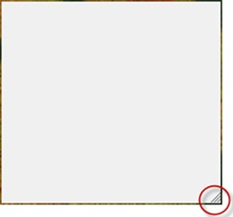

<properties
	pageTitle="C# - Forms – El extraño caso de la ventana sin borde que no se deja cambiar de tamaño"
	description="C# - Forms – El extraño caso de la ventana sin borde que no se deja cambiar de tamaño"
	services="net-dev"
	documentationCenter=""
	authors="andygonusa"
	manager=""
	editor="andygonusa"/>

<tags
	ms.service="net-dev"
	ms.workload="CS"
	ms.tgt_pltfrm="na"
	ms.devlang="na"
	ms.topic="how-to-article"
	ms.date="05/17/2016"
	ms.author="andygonusa"/>

# C\# - Forms - El extraño caso de la ventana sin borde que no se deja cambiar de tamaño

    

Por Juan Carlos Ruiz Pacheco, **Microsoft Technology Evangelist**

  Twitter   | <https://twitter.com/JuanKRuiz>
  ----------| ----------------------------------------
  Facebook  | <https://www.facebook.com/JuanKDev>
  LinkdIn   | <http://www.linkedin.com/in/juankruiz>
  Blog      | <http://juank.io>

Hay dos formas de solucionar este problema, una fácil y una dificil.

La fácil da resultados aceptables y la dificl da resultados
profesionales.

Revisaremos las dos.

Fácil y resultados aceptables
-----------------------------

Dejamos el Form tal y como queda creado por defecto.

Debemos sobrescribir la propiedad **CreateParams**, allí cambiaremos el
estilo inicial de la forma dejándolo tal como está pero quitándole el
atributo **WS\_CAPTION**, que básicamente es la barra de título.

    const int WS_CAPTION = 0xC00000;
    protected override CreateParams
    {
        get
        {
            CreateParams p = base.CreateParams;
            p.Style &= ~WS_CAPTION;
            return p;
        }
    }

Eso es todo, el resultado es una ventana a la que se le puede cambiar el
tamaño, aunque no es del todo una ventana sin bordes, es decir no tiene
header con barra de titulo ni botones de cerrar, minimizar etc. pero
borde de que tiene tiene.

La solución más fácil y obvia es "quitemos el borde" esto lo podemos
hacer quitando además de WS\_CAPTION a **WS\_THICKFRAME** tal y como lo
mostré en el artículo [El extraño caso de la ventana sin borde que no se
deja maximizar ni
minimizar](http://juank.io/extrano-caso-ventana-sin-borde-no-deja-maximizar-minimizar/).
Pero el problema es que precisamente WS\_THICKFRAME *es el que le da al
Form la funcionalidad de cambiar el tamaño*.

Así que hasta aquí llega el método fácil.

Un poco más difícil pero resultados profesionales
-------------------------------------------------

Desde el diseñador de Windows Forms dejamos la ventana sin borde.

Ahora dividimoe sl trabajo en dos partes.

Hacer que el Form luzca como un objeto que se deja cambiar de tamaño.
Adicionándole un **SizeGrip**

Hacer que el SizeGrip sirva para algo.

Hacer que el Form luzca como un objeto que se deja cambiar de tamaño
--------------------------------------------------------------------

Lo primero que debemos hacer es que el Form luzca como un objeto que se
deja cambiar de tamaño, puesto que sino tiene borde hay que buscar una
forma de que el usuario **se de por enterado** de que SI puede cambiarle
el tamaño.

Para poder dibujar el SizeGrip debemos determinar su tamaño, para mi
gusto 15px es perfecto, y debemos dibujarlo en la ubicación tradicional
que es en la parte inferior derecha del Form.

Es importante tener en cuenta que si el usuario cambia el tamaño del
Form la ubicación relativa del SizeGrip cambiará también ya que debe
ajustarse a las nuevas dimensiones así que creamos un método capaz de
establecer el **Rectangle** donde se dibujara el SizeGrip de acuerdo al
tamaño del Form.

    Rectangle sizeGripRectangle;
    const int GRIP\_SIZE = 15;

    private void AdaptGripRectangle()
    {
        sizeGripRectangle.X = this.Width - GRIP_SIZE;
        sizeGripRectangle.Y = this.Height - GRIP_SIZE;
    }

    public Form1()
    {
        InitializeComponent();
        sizeGripRectangle.Width = sizeGripRectangle.Height = GRIP_SIZE;
        AdaptGripRectangle();
    }

Como ya tenemos definido del tamaño y la ubicación del SizeGrip
modificaremos el evento Paint para dibujarlo.

Utilizaré la notación lambda por que me gusta más, no se confundan, es
lo mismo que utilizar un delegado o los eventhandler tradicionales.

    public Form1()
    {
        InitializeComponent();
        sizeGripRectangle.Width = sizeGripRectangle.Height = GRIP_SIZE;
        AdaptGripRectangle();
        this.Paint += (o, ea) => { ControlPaint.DrawSizeGrip(ea.Graphics, this.BackColor, sizeGripRectangle); };
    }

La clase **ControlPaint** incorpora varios métodos útiles, uno de ellos
es precisamente **DrawSizeGrip** que hace el dibujo que necesitamos.
Para ello le pasamos como Color el BackColor de la forma actual, para
que se vea más natural, y desde luego el Rectangle que define el
SizeGrip.

Ejecutamos nuestra Form y se ve así:

Hacer que el SizeGrip sirva para algo
-------------------------------------

Todo va muy bonito, muy simpático...\
pero completamente inútil.

El **SizeGrip** hasta el momento no es nada más que un adorno pero no
sirve para nada. Hay que hacer que funcione.

Antes que nada necesitamos un método que nos diga si un punto dado, por
ejemplo la ubicación del mouse, esta encima del SizeGrip esto es fácil
de hacer:

    private bool IsInSizeGrip(Point tmp)
    {
        if (tmp.X &gt;= sizeGripRectangle.X
            && tmp.X &lt;= this.Width
            && tmp.Y &gt;= sizeGripRectangle.Y
            && tmp.Y &lt;= this.Height
            )
            return true;
        else
            return false;
    }

Una vez hecho esto, hay que detectar cuando el mouse hace clic sobre el
SizeGrip.

Para ello creamos una variable boolean llamada **inSizeDrag** y la
modificaremos con los eventos MouseDown y MouseUp, de tal forma que si
el usuario deja presionado el botón del mouse justo sobre el SizeGrip
ponemos la variable en true, y una vez levante el botón del mouse
ponemos la variable en false.

    //declaramos esta variable en la clase
    bool inSizeDrag = false;
    //...
    //...

    //Adicionamos este codigo en el constructor
    //justo despues de donde hicimos lo del evento Paint
    this.MouseUp += delegate { inSizeDrag = false; };
    this.MouseDown += (o, ea) =>
        {
            if (IsInSizeGrip(ea.Location))
            inSizeDrag = true;
        };

Gracias a esto ya podemos detectar cuando el usuario quiere cambiar el
el tamaño del Form, así que solo basta con modificar el evento
**MouseMove**, allí detectamos si se pretende cambiar el tamaño del Form
y si es así entonces procedemos a cambiarle el tamaño de acuerdo a las
coordenadas del mouse.

A las coordenadas del mouse les he adicionado la mitad del tamaño del
SizeGrip para producir un efecto más natural.

    //La mitad del tamaño del SizeGrip
    //se declara en la clase
    const int GRIP_SIZE_OVER_TWO = GRIP_SIZE / 2;
    //...
    //..

    //esto lo colocamos justo despues de donde
    //hemos colocado todo el código anterior
    this.MouseMove += (o, ea) =>
    {
        if (inSizeDrag)
        {
            this.Width = ea.Location.X + GRIP_SIZE_OVER_TWO;
            this.Height = ea.Location.Y + GRIP_SIZE_OVER_TWO;
            AdaptGripRectangle();
            this.Invalidate();
        }
    };

Eso es todo, pueden ver la aplicación y el ejemplo completo siguiendo
este link [Ventana Sin Borde pero
Resizable](https://3ca0xg.bn1301.livefilestore.com/y2p7KeHzUBSZxStWEeYrgmALiGhgxSbJnyakDJe-n2gvDFAM3fYDNgTdbzSkGbvNXJoKW6Ee-mllGKrFc5Wm2KaBQ/VentanaSinBordeResizable.rar?download&psid=1).

byte!

Artículos relacionados
----------------------

[C\# - Cómo modificar el comportamiento del botón minimizar, maximizar,
etc.](http://juank.io/csharp-c-como-modificar-comportamiento-boton-minimizar-maximizar/)

[C\# - Forms - El extraño caso de la ventana sin borde que no se deja
maximizar ni
minimizar](http://juank.io/extrano-caso-ventana-sin-borde-no-deja-maximizar-minimizar/)
