<properties
	pageTitle="C# – Aplicaciones multilenguaje, globalización y localización"
	description="Ejemplo de Aplicaciones multilenguaje, globalización y localización en C#"
	services="net-dev"
	documentationCenter=""
	authors="JUanKRuiz"
	manager=""
	editor="andygonusa"/>

<tags
	ms.service="net-dev"
	ms.workload="CS"
	ms.tgt_pltfrm="na"
	ms.devlang="na"
	ms.topic="how-to-article"
	ms.date="05/17/2016"
	ms.author="andygonusa"/>


# C\# – Aplicaciones multilenguaje, globalización y localización

<!-- -->

Por Juan Carlos Ruiz Pacheco, **Microsoft Senior Technology Evangelist**

  Network   | Url
  ----------|----------------------------------------
  Twitter   | https://twitter.com/JuanKRuiz
  Facebook  | https://www.facebook.com/JuanKDev
  LinkdIn   | http://www.linkedin.com/in/juankruiz
  Blog      | https://juank.io


>**Recuerda que** <br/>
>Puedes ver el artículo original en: 
> [C# – Aplicaciones multilenguaje, globalización y localización](https://juank.io/c-aplicaciones-multilenguaje-globalizacion-localizacion/)

Continuamente en mis conferencias y de paso por los foros a través de
internet encuentro multitud de dudas e inquietudes al respecto de Cómo
hacer una aplicación que soporte múltiples idiomas, ciertamente hay
varias formas de conseguirlo y no todas esas formas son buenas en todos
los escenarios, dependiendo de diferentes factores como por ejemplo el
tamaño de la aplicación o la cantidad de idiomas soportados.

Sin embargo yo tengo mi método preferido, el cual es válido para la
inmensa mayoría de aplicaciones desarrolladas, el método de los archivos
de recursos y ese es el tema principal de este artículo.

Esta vez me enfocaré en como hacerlo utilizando **Windows Forms**, pero
la lógica utilizada es perfectamente válida para desarrollar
aplicaciones web o Apps para dispositivos.

En tres pasos enseñare como hacerlo.

1. Utilizar archivos de recursos para manipular las cadenas de texto\
2. Soportar múltiples lenguajes con los archivos de recursos\
3. Aislar los archivos de recursos para facilitar la actualización

Finalmente relacionaré otros temas de interés para tener una
funcionalidad más robusta.

Utilizar archivos de recursos para manipular las cadenas de texto
-----------------------------------------------------------------

Preparar la aplicacion

Lo primero que debemos hacer es crear una aplicación de Windows Forms
con 1 ListBox y 5 Botones como se ven la siguiente imagen.

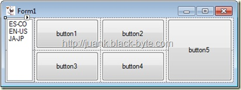

Para fines de este ejemplo con excepción de los textos del listbox
ninguno de los textos es obligatorio.

Ahora, dentro de la solución, creamos una carpeta la cual llamaremos
"Recursos Localizables", justo como se ve a continuación.

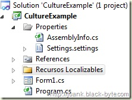

Ahora creamos un nuevo archivo de recursos y lo llamaremos
**StringResources**, debemos crearlo junto dentro de la carpeta
"Recursos Localizables" que acabamos de crear.

Revisamos las propiedades del archivo recién creado y nos aseguramos que
en Build Action diga **"Embedded Resource"**.

Utilizaremos ese archivo de recursos para guardar las cadenas en el
idioma principal (por defecto) de nuestra aplicación, así que le damos
doble clic y adicionamos los valores que se ven en la siguiente imagen.

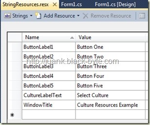

Para efectos del ejemplo **es importante hacerlo con los valores que
ven**.

Utilizar el archivo de recursos en nuestra aplicación
-----------------------------------------------------

Esta parte es muy sencilla, creamos un método llamado **AplicarIdioma**
con el siguiente código:

C\#

```csharp

    private void AplicarIdioma()
    {
	button1.Text = StringResources.ButtonLabel1;
	button2.Text = StringResources.ButtonLabel2;
	button3.Text = StringResources.ButtonLabel3;
	button4.Text = StringResources.ButtonLabel4;
	button5.Text = StringResources.ButtonLabel5;
	this.Text = StringResources.WindowTitle;
    }
```

Y lo llamamos desde el Form\_Load, ejecutamos la aplicación y obtenemos
esto, es decir los label de los botones ahora son los que establecimos
en el archivo de recursos.

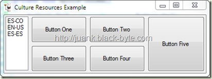

Soportar múltiples lenguajes con los archivos de recursos
---------------------------------------------------------

Casi todo el trabajo de codificación ha terminado ahora viene **'la
magia'**.

En la carpeta **"Recursos Localizables"** creamos 3 copias del archivo
de recursos original, nos aseguramos de que cada una de ellas quede con
los siguientes nombres **(IMPORTANTE)**.

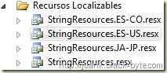

Ahora editamos cada uno de ellos dejándolos con los textos que se ven a
continuación (pueden ayudarse de traductores online para obtener los
caracteres en japonés).

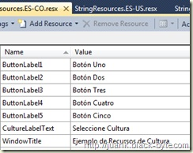

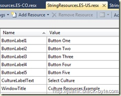

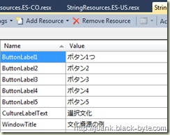

Una vez hecho esto procedemos a modificar el evento
**SelectedIndexChanged** del ListBox adicionando la lógica para cambiar
la **CurrentUICulture** de la aplicación:

C\#

```csharp
    private void listBox1\_SelectedIndexChanged(object sender, EventArgs e)
    {
      Thread.CurrentThread.CurrentUICulture = new
      CultureInfo((string)listBox1.SelectedItem);
      AplicarIdioma();
    }
```

Lo que hemos hecho es que cada vez que se de clic en uno de los miembros
de la lista se cambie la cultura de la interfaz de usuario del hilo
actual de la aplicación, y dado que cada miembro del listbox es el
nombre corto de cada una de las tres culturas que tenemos, basta con
crear un nuevo objeto de tipo **CultureInfo** que coincida con el nombre
corto del ítem seleccionado.

¿Por qué y para qué?
--------------------

Esto que acabamos de hacer tiene un importante objetivo.

Cuando se utiliza un archivo de recursos el CLR busca primero cual es la
cultura del hilo actual

Entonces con ese dato automáticamente utiliza el archivo de recursos
cuya nomenclatura coincide con esa cultura

Sino encuentra dicho archivo de recursos entonces el CLR utiliza el
archivo de recursos que no tiene cultura específica.

¡FUNCIONA!
----------

Ejecutamos la aplicación, damos clic en cada uno de los ítems del
listbox y podemos ver esto:

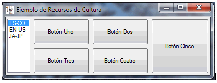

Así se ve en Windows 8

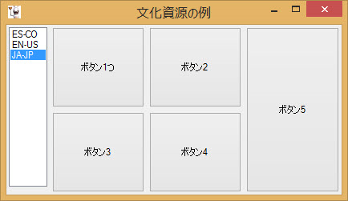

Aislar los archivos de recursos para facilitar la actualización
---------------------------------------------------------------

Hasta aquí nuestro proyecto ya esta terminado y ya estamos en capacidad
de hacer aplicaciones multilenguaje, sin embargo como **tip final** de
este artículo les recomiendo que si piensan incluir alguna funcionalidad
de actualizaciones en sus aplicaciones y tienen planeado actualizar o
incluir nuevos idiomas en su aplicación, coloquen los archivo de
recursos en una dlL por aparte donde solo se coloquen archivos de
recursos, esto permitirá que las actualizaciones relacionadas con
cadenas de lenguaje se aíslen en un solo componente.

Para que esto funcione, en el proyecto de la librería que utilicen para
tal fin, recuerden establecer en cada archivo de recursos el modificador
de acceso en public como lo muestra esta imagen.

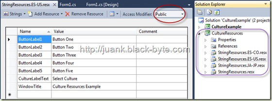

Lecturas recomendadas
---------------------

Este tema puede ir aún más allá de donde lo hemos llevado, los invito
averiguar acerca de cómo utilizar ensamblados satélite para brindar
algunas funcionalidades adicionales y que intenten utilizar la clase
**CultureInfo** y demás relacionadas para detectar el idioma de la
interfaz de usuario actual o el idioma con el cual se ha instalado el
sistema operativo.

En Sistemas como **Windows 7** si instalas el sistema en inglés y luego
le actualizadas el lenguaje a español, algunas funciones te seguirán
reportando que el idioma del sistema está en inglés por lo que hay que
hacer un trabajo adicional para detectar el idioma actual de la interfaz
de usuario actual.

Descárgalo
----------

Puedes bajar la solución completa desde mi GitHub: [Demo de localización
de aplicaciones en Windows
Forms](https://github.com/JuanKRuiz/WinFormsLocalizationDemo)

Espero que le puedan sacar mucho provecho.
