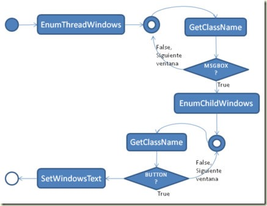

# C\# - ¿Cómo hackear un MessageBox y personalizar los textos en los botones? - Forms


<!-- -->

Por Juan Carlos Ruiz Pacheco, **Microsoft Senior Technology Evangelist**

  Network   | Url
  ----------|----------------------------------------
  Twitter   | https://twitter.com/JuanKRuiz
  Facebook  | https://www.facebook.com/JuanKDev
  LinkdIn   | http://www.linkedin.com/in/juankruiz
  Blog      | https://juank.io


>**Recuerda que** <br/>
>Puedes ver el artículo original en: 
> [C# - Cómo hackear un MessageBox y personalizar los textos en los botones? - Forms](https://juank.io/c-como-hackear-messagebox-personalizar-textos-botones-forms/)


Por razones que aún no me son del todo claras, el .NET Framework no
tiene textos localizables para los MessageBox, razón por la cual no
siempre se muestran en el lenguaje que necesitamos, sino que se muestran
en el lenguaje del Framework instalado.

Puede que nuestra aplicación este en español pero probablemente nuestros
MessageBox siempre salgan con los labels de los botones en ingles:


Además no siempre los labels de los botones tienen textos convenientes
para nuestras aplicaciones.

El Framework no nos ofrece ninguna manera de modificar dichos textos más
allá de las opciones predeterminadas, ¿Qué podemos hacer?

No es una tarea tan sencilla como uno se imaginaria inicialmente,
requiere del uso de la API de Windows y un poco de ingenio.

He creado una utilidad que te ahorrará mucho trabajo y podrás cambiar
los textos de los botones de manera muy sencilla tal como te lo muestra
el siguiente ejemplo:

```csharp
MsgBoxUtil.HackMessageBox("SI","NO", "CANCELAR");
MessageBox.Show("hola", "hola", MessageBoxButtons.YesNoCancel);

MsgBoxUtil.HackMessageBox("REINTENTAR", "CANCELAR");
MessageBox.Show("hola2", "hola2", MessageBoxButtons.RetryCancel);
MsgBoxUtil.HackMessageBox("Descartar", "Reintentar", "Ignorar");
MessageBox.Show("hola3", "hola3",MessageBoxButtons.AbortRetryIgnore);
MsgBoxUtil.UnHackMessageBox();
MessageBox.Show("Normal", "Normal",
MessageBoxButtons.AbortRetryIgnore);
```

Descárgalo
----------

Puedes acceder al código completo en mi Github:
[MsgBoxUtil.cs](https://gist.github.com/JuanKRuiz/8405233)

Planteamiento inicial
---------------------

Para modificar los textos hay que encontrar la manera de llegar hasta
los botones del MessageBox

Para llegar a los botones del MessageBox primero hay que llegar al
MessageBox

Dado que el **.NET Framework** no nos permite manipular la ventana del
**MessageBox** debemos recurrir a la *API de Windows*.

Para Windows (y realmente para todo sistema de ventanas), todo control
que se dibuje en pantalla es una ventana (si, así es), así que si
tuviéramos una forma, esta es una ventana que contiene paneles, los
panales son también ventanas que contienen por ejemplo GroupBox que a su
vez son ventanas que contienen botones, que a su vez también son
ventanas.

Con base a estos puntos entonces detallemos un poco más el
planteamiento.

- Se deben buscar las ventanas hijas de la forma actual

- Cuando se encuentre la ventana del MessageBox se deben buscar los
botones

- Con base a la ventana del MessageBox se deben buscar sus ventanas hijas

- A las ventanas que sean botones se les debe cambiar el texto

- Dado que el MessageBox es una clase estática, la podemos dar por creada
desde un comienzo (el CLR la creara a la primera referencia que se
haga).

Referencias a la API de Windows
-------------------------------

Dado que esta tarea requiere de la API de Windows, y de acuerdo a
nuestro planteamiento detallado, estas son las funciones de la API que
utilizaremos:

**EnumThreadWindows**: Ejecuta un proceso por cada una de las ventanas
del hilo actual, según se le indique. Lo usaremos para encontrar cual es
la ventana del MessageBox.

**GetCurrentThreadId**: Obtiene el id del Thread en ejecución.

**GetClassName**: Obtiene el nombre de la clase a partir de un handler.
Se utilizara junto con EnumThreadWindows para determinar si la ventana
procesada es un MessageBox, dado que se desconoce el nombre que tendrán
las ventanas del MessageBox, se debe determinar utilizando el ClassName
de las ventanas. Más adelante veremos como hallar el ClassName de un
MessageBox.

**EnumChildWindows**: Con base al handler de una ventana recorre cada
una de sus ventanas hijas y ejecuta un proceso. Solo enumera las
ventanas de primer nivel. Lo usaremos para encontrar los botones del
MessageBox.

**SetWindowText**: Establece el texto asociado a una ventana, lo
usaremos para modificar el texto de los Botones.

Diseño
------

Tenemos una única clase, utilicemos algo sencillo que ilustre el proceso
de manera general, con esto bastará.



Iniciaremos el proceso con **EnumThreadWindows** al cual le
pasaremos un delegado que internamente revisará cada ventana
enumerada para determinar si es o no un MessageBox.

Sino es un MessageBox revisará la siguiente ventana enumerada hasta
que lo encuentre. Sino encuentra es que no hay MessageBox.

Cuando encuentra el MessageBox verifica a través de sus ventanas
hijas con **EnumChildWindows** al cual se se pasa un delegado que
internamente revisará cada ventana enumerada para determinar si es o
no un Botón.

Cuando encuentra que es un botón modificará el texto asociado.

Implementación
--------------

Lo primero que debemos hacer es preparar las funciones a las que
accederemos a través de interoperabilidad:

```chsarp
    public class MsgBoxUtil 
    { 
	    #region Interoperabilidad private
	    delegate bool EnumWindowDelegate(IntPtr handler, IntPtr longPointer);
	
	    [DllImport("user32.dll")] 
	    private static extern bool SetWindowText(IntPtr handler, string texto);
	
	    [DllImport("user32.dll")] 
	    private static extern int GetClassName(IntPtr handler, StringBuilder nombre, int tamañoMaximo);
	
	    [DllImport("user32.dll")] 
	    private static extern bool EnumChildWindows(IntPtr handler, EnumWindowDelegate callback, IntPtr longPointer);
	
	    [DllImport("user32.dll")] 
	    private static extern bool  EnumThreadWindows(int threadID, EnumWindowDelegate callback, IntPtr longPointer);
	
	    [DllImport("kernel32.dll")] 
	    private static extern int GetCurrentThreadId(); 
	    #endregion Interoperabilidad 
    }
```

No hay nada nuevo en lo que acabamos de ver, son las funciones que hemos
mencionado desde el comienzo, es de destacar únicamente
**EnumWindowDelegate** que es un delegado (puntero a una función) que
debemos usar cuando llamemos a **EnumChildWindows** y a
**EnumThreadWindows**.

Ahora si a hackear el MessageBox
--------------------------------

Acto seguido crearemos el método **HackMessageBox**, el cual recibe como
parámetro las cadenas de texto que representan los labels de los botones
del MessageBox.

Esta función guarda una referencia estática a ese array de textos para
poderlos usar en otros lugares de la clase, también se determina si hay
o no un windows form y de ser así inicia el procesamiento llamando
asíncronamente a **EnumThreadWindows**

Sin embargo no llamaremos directamente a EnumThreadWindows porque
requiere demasiados parámetros lo cual nos complica un poco el paso de
parámetros en el llamado asíncrono (BeginInvoke), en su lugar llamaremos
a **BuscaMessageBox** que es una función sin parámetros que llamará
internamente a EnumThreadWindows con los parámetros necesarios.

Dado que BeginInvoque requiere enviar un delegado, debemos definirlo
previamente.

En el llamado a **EnumThreadWindows** le debemos pasar el **ThreadId**
el cual obtenemos con un llamado a **GetCurrentThreadId**, el segundo
parámetro es una función **ProcesaMessageBoxEnForms** que se ejecutará
cada por cada ventana que se enumere, el tercer parámetro no lo
necesitamos así que será Zero.

```chsarp
private static string[] textoBotones; private delegate void BuscarMsgBoxDelegate();

public static void HackMessageBox(params string[] textoBotones)
{
	MsgBoxUtil.textoBotones = textoBotones;
	if (Application.OpenForms.Count > 0)
		Application.OpenForms[0].BeginInvoke(new
			BuscarMsgBoxDelegate(BuscaMessageBox));
}

private static void BuscaMessageBox()
{
	EnumThreadWindows(GetCurrentThreadId(), ProcesaMessageBoxEnForms,
	IntPtr.Zero);
}
```

Accediendo la ventana del MessageBox
------------------------------------

Revisemos ProcesaMessageBoxEnForms, como esta funcion es llamada por
EnumThreadWindows, esta le pasa siempre como parámetro el handler de la
ventana que se esta enumerando, así que con ese handler buscaremos el
nombre de la clase de la ventana enumerada para así poder compararlo con
el nombre de la clase de un MessageBox.

Sino es un MessageBox entonces se devuelve true y así EnumThreadWindows
vuelve a llamar a ProcesaMessageBoxEnForms pero pasando como parámetro
la siguiente ventana enumerada, el procedimiento se repite hasta que se
logra hallar la ventana del MessageBox. En ese momento se establece la
variable indiceTexto en 0, esta variable la utilizaremos para recorrer
el array de textos de acuerdo a los botones que encontremos dentro del
MessageBox.

Seguidamente llamamos a EnumChildWindows pasándole como parámetro el
handle de la ventana que desde luego es el MessageBox que acabamos de
encontrar, así que las ventanas que se enumeraran son las subventanas
del MessageBox entre ellas… los botones.

Como ya encontró el MessageBox y realizo el proceso de busqueda de los
botones se retorna false, de tal forma que EnumThreadWindows no siga
enumerando ventanas.

```chsarp
private static int indiceTexto; private const string MBOX_CLASSNAME = "#32770";

private const int STRING_BUILDER_CAPACITY = 256;

private static bool ProcesaMessageBoxEnForms(IntPtr handler, IntPtr longPointer)

{
	StringBuilder nombreClase = new
	StringBuilder(STRING_BUILDER_CAPACITY);
	
	GetClassName(handler, nombreClase, nombreClase.Capacity);
	
	if (nombreClase.ToString() != MBOX\_CLASSNAME)
	    return true;
	else
	{
	    indiceTexto = 0; EnumChildWindows(handler,
	    CambiaTextoBotonMessageBox, IntPtr.Zero);
	    return false;
	}
}
```    

**Te estarás preguntando...
de dónde salió** `MBOX\CLASSNAME = "#32770";`

No te preocupes, si eres de los inquietos que lo quieren saber, al final
de esté artículo verás como se obtiene.

Modificando el texto de los botones
-----------------------------------

Una vez se ha encontrado el MessageBox se hace el llamado a
**EnumChildWindows** pasándole como parámetro el handler del MessageBox,
el segundo parámetro es la función **CambiaTextoBotonMessageBox**, el
tercer parámetro es Zero.

EnumChildWindows invoca a CambiaTextoBotonMessageBox por cada una de las
ventanas enumeradas, internamente CambiaTextoBotonMessageBox revisa si
la ventana procesada es de clase Button, si no lo es entonces se
devuelve true para que EnumChildWindow envie la siguiente ventana a
proceso.

Esto continua así hasta encontrar tantos botones como cadenas de texto
se hallan enviado en HackMessageBox como parámetro, a cada uno de los
botones encontrados se le asigna su cadena de texto en el orden
correspondiente.

```chsarp
private const string BUTTON_CLASSNAME = "Button";

private static bool CambiaTextoBotonMessageBox(IntPtr handler, IntPtr longPointer)
{
	StringBuilder nombreClase = new
	StringBuilder(STRING_BUILDER_CAPACITY);
	GetClassName(handler, nombreClase, nombreClase.Capacity);
	if (nombreClase.ToString() == BUTTON_CLASSNAME && indiceTexto < textoBotones.Length)
	{
	    SetWindowText(handler, textoBotones[indiceTexto]); indiceTexto++;
	}
	return true;
}
```

Ejemplo de uso
--------------

```csharp
    MsgBoxUtil.HackMessageBox("Acepto", "Lo Pensare", "Olvidalo");

    MessageBox.Show("hola3", "hola3",
    MessageBoxButtons.AbortRetryIgnore);
```


Descárgalo
----------

Puedes acceder al código completo en mi Github:
[MsgBoxUtil.cs](https://gist.github.com/JuanKRuiz/8405233)

De dónde sale `MBOX_CLASSNAME = "\#32770"`
-----------------------------------------

Algunos, o espero que todos los que no sepan se estarán haciendo esa
pregunta.

Hay que utilizar herramientas que nos permitan hacer ingeniería inversa,
una de estas herramientas es **Spy++** que viene incluida con Visual
Studio, no haremos un curso completo de Spy++ pero veremos como usarlo
para obtener el **ClassName** de un MessageBox.

*  Abrir una aplicación .NET Framework y desplegar un MessageBox
*  Abrir Spy++
*  Ahora en Spy++ presionaremos esta tecla (círculo irregular negro)
	
*  Esto hace que se despliegue el siguiente dialogo:

<!-- -->


* Allí damos click sostenido en la figura señalada en rojo y la
    arrastramos hasta la ventana del MessageBox ya abierto, teniendo
    cuidado de no seleccionar los botones u otras figuras, solo el
    marco principal. Soltamos el click y damos OK.
* Se abre un cuadro de dialogo, vamos a la pestaña Class y allí
    esta!!! ClassName = \#32770
	

¿Cómo estuvo? ;)


