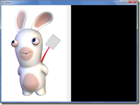
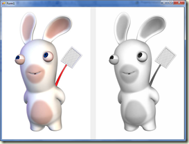

# C\# - Forms - Cómo convertir una imagen a escala de grises


<!-- -->

Por Juan Carlos Ruiz Pacheco, **Microsoft Senior Technology Evangelist**

  Network   | Url
  ----------|----------------------------------------
  Twitter   | https://twitter.com/JuanKRuiz
  Facebook  | https://www.facebook.com/JuanKDev
  LinkdIn   | http://www.linkedin.com/in/juankruiz
  Blog      | https://juank.io


>**Recuerda que** <br/>
>Puedes ver el artículo original en: 
> [C# - Forms - Cómo convertir una imagen a escala de grises](https://juank.io/c-forms-como-convertir-imagen-escala-grises/)


¿CÓMO CONVERTIR UNA IMAGEN A ESCALA DE GRISES?
----------------------------------------------

Para que una imagen sea vea en tonos de gris se requiere que los tres
componentes básicos del color (en el computador: rojo, verde, azul –
**RGB** por sus siglas en inglés) tengan más o menos la misma
intensidad, podemos decir que si queremos convertir un pixel a su
equivalente en escala de grises bastaría con hacer algo como esto:

* Sumar los valores de los componentes de color del pixel, es decir sumar
R + G + B

* Sacar el promedio de esa suma

* El valor hallado se debe asignar a R, G y B

Con estos tres pasos ya logramos que el pixel sea de color gris ya que
cada uno de sus componentes tiene el mismo valor.

Hay muchas otras formas de hacerlo, incluso alguien que haya trabajado
previamente con imágenes puede tener su propia versión de como
implementarlo de acuerdo a lo que necesite o al tiempo que tenga. Pero
existe una manera ampliamente conocida y aceptada en el gremio de las
personas que trabajan con imágenes y visión por computador esa manera es
la que aprenderemos a efectuar.

EL OJO HUMANO Y SU SENSIBILIDAD
-------------------------------

Bien, resulta que el ojo humano es mucho más sensible a los colores
verdes y rojos que al azul, por lo que en cuanto a precepción de
iluminación se trata nuestro ojo reconoce los patrones de iluminación en
color en las siguientes proporciones para cada componente:

* Rojo: 30%
* Verde: 59%
* Azul: 11%

Así que lo más adecuado es calcular el valor de cada componente de color
con base a esta proporción y de este modo se obtiene el pixel de color
gris con la iluminación adecuada para que nuestro ojo lo perciba como un
mejor equivalente a su versión en color.

MANOS A LA OBRA, TIEMPO DE PROGRAMAR
------------------------------------

Los Bitmap tienen diversos formatos, el más normal hoy día es el de
color de 24 bit, el cual tambien es el valor por defecto cuando cargamos
imagenes jpg, en este artículo trabajaremos diseñando un algoritmo para
24 bit de color.

Para visualizar un objeto Bitmap basta con usar un PictureBox y a este
se le asigna la imagen en su atributo Image, tal como lo vemos a
continuación:

```csharp
    private void Form1\_Load(object sender, EventArgs e)
    {
        Bitmap imagen = new Bitmap("conejo.jpg");
        pictureBox1.Image = imagen;
    }
```


    

Ahora lo que haremos es crear una función que reciba como parámetro un
objeto Bitmap (o imagen) y devuelva un nuevo Bitmap (o imagen)
convertido a escala de grises:

```csharp
    private Bitmap CreateGrayScaleBitmap(Bitmap source)
    {
        Bitmap target = new Bitmap(source.Width, source.Height, source.PixelFormat);
        
        return target;
    }
```

PADDING Y STRIDE
----------------

El siguiente paso es obtener del bitmap la información de los pixeles
que lo conforman, esta tarea si bien es sencilla es un poco más
complicada, debido a que el objeto **Bitmap** representa su información
de color fielmente a lo que es un archivo bmp.

Por ello se debe tener en cuenta que no todos los bytes son información
de color, algunos de estos bytes solo son de relleno y ello puede
cambiar de un Bitmap a otro segun sus dimensiones y profundidad de
color, esta caracteristica es normalmente conocida como **padding** y en
su momento se implementó para hacer que la lectura del archivo bmp fuera
mucho mas rápida al poder cargarla en bloques de enteros (4 bytes -- 32
bits).

Asi que lo siguiente a realizar es obtener la información de la imagen
lo cual lo hacemos con el método LockBits, el cual retorna un objeto
**BitmapData**

```csharp
    private Bitmap CreateGrayScaleBitmap(Bitmap source)
    {
        Bitmap target = new Bitmap(source.Width, source.Height,
        source.PixelFormat);
        BitmapData bmpData = source.LockBits(new Rectangle(0, 0, source.Width, source.Height), ImageLockMode.ReadOnly, source.PixelFormat);
        
        return target;
    }
```

Sin embargo BitmapData no nos sirve para recorrer byte por byte la
información de color, por lo que ahora debemos convertir bmpData a un
byte\[\]… ¿pero Como?

Debemos apoyarnos en los mecanismos de **Marshal** provistos por el .net
Framework, la clase Marshal permite por ejemplo convertir un bloque de
memoria no administrado en un bloque administrado, el objeto bmpData
tiene un atributo **Scan0** que no es más que un puntero al arreglo de
bytes donde esta la información del color, así que podemos utilizar ese
puntero para crear poner la información en nuestro array de bytes.

Pero antes debemos crear el array de bytes, el tamaño del array debe ser

´Ancho x Alto x (número de bytes por pixel)\`

Pero… hay que tener en cuenta el **padding**… los bytes de relleno.

Calcular el padding es fácil aunque es dependiente sobre todo de la
profundidad del color, pero el objeto bmpData tiene un atributo llamado
Stride el cual es el ancho en bytes de cada línea de pixeles incluyendo
el padding, así que nuestra formula para hallar el tamaño del array de
bytes se reduce a: bmpData.Stride \* alto

```csharp
    private Bitmap CreateGrayScaleBitmap(Bitmap source)
    {
        Bitmap target = new Bitmap(source.Width, source.Height,
        source.PixelFormat);
        BitmapData bmpData = source.LockBits(new Rectangle(0, 0, source.Width, source.Height), ImageLockMode.ReadOnly, source.PixelFormat);

        byte[] targetBytes = new byte[bmpData.Stride * source.Height];

        return target;
    }
```

EL ENGORROSO SISTEMA DE ACCESO A LOS PIXELES
--------------------------------------------

Ahora utilizando Marshal obtenemos el array de bytes:

```csharp
    private Bitmap CreateGrayScaleBitmap(Bitmap source)
    {
        Bitmap target = new Bitmap(source.Width, source.Height,
        source.PixelFormat);
        BitmapData bmpData = source.LockBits(new Rectangle(0, 0, source.Width, source.Height), ImageLockMode.ReadOnly, source.PixelFormat);

        byte[] targetBytes = new byte[bmpData.Stride * source.Height];

        Marshal.Copy(bmpData.Scan0, targetBytes, 0, targetBytes.Length);

        return target;
    }
```

Como también necesitamos acceder a la información en bytes del bmp de
destino es necesario repetir las mismas tres operaciones pero en
LockBits ahora colocamos WriteOnly.

```csharp
    private Bitmap CreateGrayScaleBitmap(Bitmap source)
    {
        Bitmap target = new Bitmap(source.Width, source.Height,
        			source.PixelFormat);
        BitmapData bmpData = source.LockBits(new Rectangle(0, 0, source.Width, source.Height), I
        			mageLockMode.ReadOnly, source.PixelFormat);

        byte[] targetBytes = new byte[bmpData.Stride * source.Height];

        Marshal.Copy(bmpData.Scan0, targetBytes, 0, targetBytes.Length);

        BitmapData targetData = target.LockBits(new Rectangle(0, 0,
        				target.Width, target.Height), 
        				ImageLockMode.WriteOnly, target.PixelFormat);

        byte[] targetBytes = new byte[targetData.Stride *
        targetData.Height];

        Marshal.Copy(targetData.Scan0, targetBytes, 0, targetBytes.Length);

        return target;
    }
```
Es casi el mismo código, por ello podemos optimizarlo y organizarlo un
poco así:

```csharp
    private byte[] GetImageBytes(Bitmap image, ImageLockMode lockMode, out BitmapData bmpData)
    {
        bmpData = image.LockBits(new Rectangle(0, 0, image.Width, image.Height), 
        		lockMode, image.PixelFormat);

        byte[] imageBytes = new byte[bmpData.Stride * image.Height];

        Marshal.Copy(bmpData.Scan0, imageBytes, 0, imageBytes.Length);

        return imageBytes;
    }

    private Bitmap CreateGrayScaleBitmap(Bitmap source)
    {
        Bitmap target = new Bitmap(source.Width, source.Height,
        source.PixelFormat);
        BitmapData targetData, sourceData;

        byte[] sourceBytes = GetImageBytes(source, ImageLockMode.ReadOnly, out sourceData);

        byte[] targetBytes = GetImageBytes(target, ImageLockMode.ReadWrite,out targetData);

        return target;
    }
```

Ahora se debe recorrer el array de bytes para convertirlo a escala de
grises, para poder hacerlo necesitamos recorrer el arreglo en saltos de
a pixel, si trabajamos con BMP de 24 bit el tamaño de cada pixel es de 3
bytes.

En un Bitmap el formato de color viene en BGR (Blue Green Red ) teniendo
en cuenta esto la implementación para convertir los bytes a escala
grises queda:

```csharp
    private Bitmap CreateGrayScaleBitmap(Bitmap source)
    {
        Bitmap target = new Bitmap(source.Width, source.Height,
        source.PixelFormat);
        BitmapData targetData, sourceData;

        byte[] sourceBytes = GetImageBytes(source, ImageLockMode.ReadOnly, out sourceData);
        byte[] targetBytes = GetImageBytes(target, ImageLockMode.ReadWrite,out targetData);

        //recorrer los pixeles
        for (int i = 0; i &lt; sourceBytes.Length; i += 3)
        {
            //ignorar el padding, es decir solo procesar los bytes necesarios
            if ( (i + 3) % (source.Width * 3) > 0 )
            {
                //Hallar tono gris
                byte y = (byte)(sourceBytes[i+2] * 0.3f
                + sourceBytes[i + 1] * 0.59f
                + sourceBytes[i] * 0.11f);
                //Asignar tono gris a cada byte del pixel
                targetBytes[i + 2] = targetBytes[i + 1] targetBytes[i] = y;
            }
        }

        return target;
    }
```

Finalmente hay que copiar el array de bytes modificado al bitmap de
destino, y desbloquear ambos bitmaps:

```csharp
    private Bitmap CreateGrayScaleBitmap(Bitmap source)
    {
        Bitmap target = new Bitmap(source.Width, source.Height,
        source.PixelFormat);
        BitmapData targetData, sourceData;

        byte[] sourceBytes = GetImageBytes(source, ImageLockMode.ReadOnly, out sourceData);
        byte[] targetBytes = GetImageBytes(target, ImageLockMode.ReadWrite,out targetData);

        //recorrer los pixeles
        for (int i = 0; i < sourceBytes.Length; i += 3)
        {
            //ignorar el padding, es decir solo procesar los bytes necesarios
            if ( (i + 3) % (source.Width * 3) > 0 )
            {
                //Hallar tono gris
                byte y = (byte)(sourceBytes[i+2] * 0.3f
                    + sourceBytes[i + 1] * 0.59f
                    + sourceBytes[i] * 0.11f);
                //Asignar tono gris a cada byte del pixel
                targetBytes[i + 2] = targetBytes[i + 1] = targetBytes[i] = y;
            }
        }

        Marshal.Copy(targetBytes, 0, targetData.Scan0, targetBytes.Length);
        source.UnlockBits(sourceData);
        target.UnlockBits(targetData);

        return target;
    }
```

¡Wowfff! finalmente asignamos la imagen al PictureBox:

```csharp
    private void Form1_Load(object sender, EventArgs e)
    {
        Bitmap imagen = new Bitmap("conejo.jpg");
        pictureBox1.Image = imagen;
        pictureBox2.Image = CreateGrayScaleBitmap(imagen);
    }
```


    

!Eso es todo!


