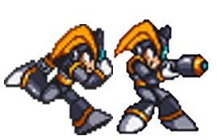
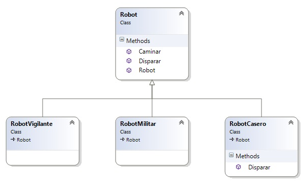
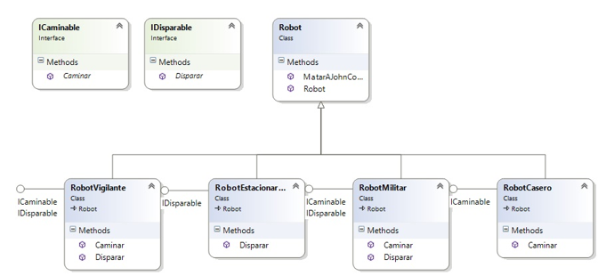
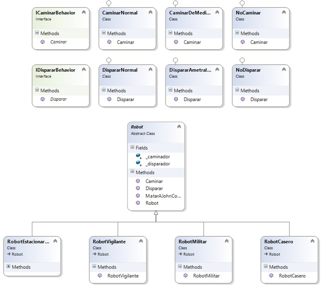

# C\# - Inyección de Dependencias

<!-- -->

Por Juan Carlos Ruiz Pacheco, **Microsoft Senior Technology Evangelist**

  Network   | Url
  ----------|----------------------------------------
  Twitter   | https://twitter.com/JuanKRuiz
  Facebook  | https://www.facebook.com/JuanKDev
  LinkdIn   | http://www.linkedin.com/in/juankruiz
  Blog      | https://juank.io

La **inyección de dependencias** es una herramienta comúnmente utilizada
en varios patrones de diseño orientado a objetos y consiste en inyectar
comportamientos a componentes.

ARTÍCULOS RELACIONADOS
----------------------

[C\# - Inyección de
Dependencias](http://juank.io/c-inyeccion-dependencias/)

En este artículo formalizaremos un poco más su definición para de paso
definir e implementar un conocido patrón de diseño llamado
**estrategia**.

LOS ROBOTS
----------

Imaginemos que tenemos una clase llamada **Robot**, cada Robot puede
realizar una serie de operaciones fundamentales:

Caminar

Disparar

Desde luego hay muchas más pero esas serán suficientes para el ejemplo.

    

Iniciemos con el análisis, en primera instancia revisemos la
característica **Disparar**.

Si tenemos un conjunto de Robots donde todos ellos pueden disparar de
manera diferente podemos pensar en crear una clase base llamada Robot la
cual desde luego implementa la funcionalidad Disparar como **virtual** o
**abstract** de tal forma que las implementaciones concretas puedan
establecer una forma particular de disparar en cada caso.

Existen inicialmente 3 implementaciones de Robot

* RobotVigilante: Dispara como todos los Robot

* RobotMilitar: Dispara como todos los Robot

* RobotCasero: No dispara

Este es nuestro diagrama de clases:

    

Y estas su implementación en código:

    public class Robot
    {
        public Robot()
        {
        }
    
        public virtual void Disparar()
        {
            //Bang!
        }
        
        public virtual void Caminar()
        {
            //Caminar
        }
    }
    public class RobotVigilante : Robot
    {
    }
    public class RobotMilitar : Robot
    {
    }
    public class RobotCasero : Robot
    {
        public override void Disparar()
        {
            //Nothing
        }
    }

Este esquema funciona *bien* pero hay varios problemas que debemos
afrontar si pensamos las cosas detenidamente.

Cada vez que un Robot no dispare debemos sobrescribir el método
**virtual**.

Pueden requerirse Robots que disparen de manera diferente, en cuyo caso
también se requiere sobrescribir el método **virtual**, ¿qué pasa con
caminar? efectivamente pueden aparecer Robots que no caminen o Robots
que lo hagan con un pie o con cuatro pies.

Teniendo este escenario nos damos cuenta que el propósito inicial por el
cual se ha utilizado la herencia se ha desvirtuado, pues no es cierto
que todos los Robot hagan las actividades de la misma forma, incluso
pueden haber Robots que no hagan una determinada actividad.

La herencia en este punto se nos ha convertido en un problema, ¿ya
vieron cuál?, puede que no.

El problema es: **MANTENIMIIENTO**, todos sabemos que crear un programa
es solo la primera parte, la segunda parte es mantener ese programa en
el tiempo, hacerle mejoras, evolucionarlo etc.\
Y desde luego en el escenario de los Robots esto también es una
necesidad, necesitaremos crear nuevos Robots y modificar los existentes.

Pero al haber utilizado herencia nos encontraremos que algunas cosas
habrá que cambiarlas en la clase base y otras en las clases derivadas,
peor aún puede haber un grupo de clases derivadas que no utilicen las
funcionalidades de la clase base pero que entre ellas si comparten la
misma funcionalidad, esto es: tendremos código redundante.

El problema puede llegar a ser muy grueso.

LA SOLUCIÓN CLÁSICA
-------------------

Lo primero que a uno se le viene a la mente para resolver el tema de los
Robot que no **Disparan** o que no **Caminan** es utilizar interfaces,
lo cual suele ser una muy buena idea, sobre todo teniendo en cuenta este
principio de diseño.

Programe contra una interfaz no contra implementaciones concretas.

En este sentido hay que ser claro que este principio hace referencia a
**interfaces** desde el punto de vista del **diseño de software** no de
ningún lenguaje en particular y en este sentido entonces una interfaz
puede ser en esencia un Súper Tipo:

* Clase Base

* Clase Abstracta

* Interfaz

Podemos crear dos interfaces para identificar que habilidades tiene cada
Robot.

* IDisparable

* ICaminable

\*Sorry por los nombres, mi creatividad en ese sentido es limitada.

Esto nos permitirá tener Robots que Camine, Disparen, que no hagan nada
o que solo hagan una de las dos cosas.

    

Y esta es la implementación...ligeramente más compleja

    public interface ICaminable
    {
    void Caminar();
    }

    public interface IDisparable
    {
    void Disparar();
    }

    public class Robot
    {
        public Robot()
        {
        }
        public virtual void MatarAJohnConnor()
        {
            //You could be miiine ♫♪ Yeaahh ♪♪♫
        }
    }

    public class RobotVigilante : Robot, ICaminable, IDisparable
    {
        public void Caminar()
        {
            //Caminar Normal
        }
        public void Disparar()
        {
            //Disparar Normal
        }
    }

    public class RobotMilitar : Robot, ICaminable, IDisparable
    {
        public void Caminar()
        {
            //Caminar Normal
        }
        public void Disparar()
        {
            //Disparar Normal
        }
    }

    public class RobotCasero : Robot, ICaminable
    {
        public void Caminar()
        {
            //Caminar Normal
        }
    }

    public class RobotDetectorDeJohnConnor : Robot, IDisparable
    {
        public void Disparar()
        {
            //Disparar con sevicia hasta lograr objetivo
        }
    }

El tema de la complejidad... preocupante, pero más preocupante aún es el
hecho que tenemos código redundante ya que aunque varios robots disparen
de la misma forma, cada uno tiene su propia implementación.

Así que estamos usando uno de los principios de diseño de software pero
algo anda un poco mal, vamos a solucionarlo.

Para los más experimentados el indicio de solución salta a la vista:
**encapsulamiento**.

Pero pongámoslo en el marco del diseño de software, aquí existe otro
principio fundamental:

Identificar los aspectos que cambian, y sepáralos de los que se
mantienen iguales.

Eso precisamente se hace en POO haciendo uso de encapsulamiento, cosa
que los cambios en este objeto no afecten el resto del código de la
implementación.

Encapsular, en este caso implica necesariamente crear un objeto nuevo
por cada funcionalidad **que cambia**, las funcionalidades que cambian
en nuestros Robot son

* Disparar

* Caminar

Estas funcionalidades que cambian las llamaremos en adelante
**comportamientos**, **behaviors** en inglés. Es tiempo de extraer estos
comportamientos en nuevos objetos.

Cada acción ( caminar, disparar), tienen una serie de comportamientos
posibles aunque exhiben la misma interfaz, es decir los mismos métodos
con los mismos tipos de datos, así que podemos pensar en generalizar
dicha interfaz, de tal forma que podamos crear diferentes
comportamientos, por ejemplo al caminar:

* CaminarNormal

* CaminarDeMedioLado

O al disparar

* DispararNormal

* DispararAmetralladora

Queda la duda de ¿Qué hacer con los que no caminan o no disparan? esta
es la parte más bella

* NoCaminar

* NoDisparar

Este es el diagrama de clases de nuestros comportamientos, y abajo la
implementación de los Robots

    

Ahora veamos el código para los comportamientos

    public interface IDispararBehavior
    {
    void Disparar();
    }
    public interface ICaminarBehavior
    {
    void Caminar();
    }
    public class CaminarNormal : ICaminarBehavior
    {
        public void Caminar()
        {
            //Caminar normal
        }
    }
    public class CaminarDeMedioLado : ICaminarBehavior
    {
        public void Caminar()
        {
            //Hacer como cangrejo
        }
    }
    public class NoCaminar : ICaminarBehavior
    {
        public void Caminar()
        {
            //nada
        }
    }
    public class DispararNormal : IDispararBehavior
    {
        public void Disparar()
        {
            //Disparar normal
        }
    }
    public class DispararAmetralladora : IDispararBehavior
    {
        public void Disparar()
        {
            //Disparar tacatacatacatacataca
        }
    }
    public class NoDisparar : IDispararBehavior
    {
        public void Disparar()
        {
            //nada
        }
    }

Este es el código de implementación de los robots haciendo uso de los comportamientos creados.

    public abstract class Robot
    {
        protected IDispararBehavior _disparador;
        protected ICaminarBehavior _caminador;
        public Robot()
        { }
        public void Caminar()
        {
            _caminador.Caminar();
        }
        public void Disparar()
        {
            _disparador.Disparar();
        }
        public virtual void MatarAJohnConnor()
        {
            //You could be miiine ♫♪ Yeaahh ♪♪♫
        }
    }
    public class RobotVigilante : Robot
    {
        public RobotVigilante()
        {
            _disparador = new DispararNormal();
            _caminador = new CaminarNormal();
        }
    }
    public class RobotMilitar : Robot
    {
        public RobotMilitar()
        {
            _disparador = new DispararAmetralladora();
            _caminador = new CaminarDeMedioLado();
        }
    }
    public class RobotCasero : Robot
    {
        public RobotCasero()
        {
            _disparador = new NoDisparar();
            _caminador = new CaminarNormal();
        }
    }
    public class RobotDetectorDeJohnConnor : Robot
    {
        public RobotDetectorDeJohnConnor()
        {
            _disparador = new DispararAmetralladora();
            _caminador = new NoCaminar();
        }
    }

Es una solución impecable, ¡pero aún se puede hacer más! lo bueno de
tener separados los comportamientos es que nada impide que podamos
cambiar dichos comportamientos en tiempo de ejecución... **hell
yeeaahh**!

Supongamos que queremos actualizar el Robot Detector De John Connor para
que ahora pueda caminar, ¿cómo hacerlo? gracias a que hemos programado
contra interfaces y hemos encapsulado los comportamientos que cambian,
es algo muy sencillo de hacer. Modificando la clase base, exponiendo de
manera pública los comportamientos:

    public abstract class Robot
    {
        IDispararBehavior _disparador;
        public IDispararBehavior Disparador
        {
            get { return _disparador; }
            set { _disparador = value; }
        }
        ICaminarBehavior _caminador;
        public ICaminarBehavior Caminador
        {
            get { return _caminador; }
            set { _caminador = value; }
        }
        public Robot()
        { }
        public void Caminar()
        {
            _caminador.Caminar();
        }
        public void Disparar()
        {
            _disparador.Disparar();
        }
        public virtual void MatarAJohnConnor()
        {
            //You could be miiine ♫♪ Yeaahh ♪♪♫
        }
    }

Así expuestos podemos crear un objeto de cualquier tipo y modificar eso en tiempo de ejecución.

    public static class Programa
    {
        public static void Main()
        {
            var connorKiller = new RobotDetectorDeJohnConnor();
            connorKiller.MatarAJohnConnor();
            connorKiller.Caminador = new CaminarDeMedioLado();
            
            Console.WriteLine("YEAH");
        }
    }

Digamos que ahora se nos ocurre ponernos un poco más agresivos:

    public static class Programa
    {
        public class CaminadorAPropulsion : ICaminarBehavior
        {
            public void Caminar()
            {
                //Activar propulsores y demás
            }
        }

        public static void Main()
        {
            var connorKiller = new RobotDetectorDeJohnConnor();
            connorKiller.MatarAJohnConnor();
            connorKiller.Caminador = new CaminarDeMedioLado();
            //No es muy efectivo, probemos algo mejor
            connorKiller.Caminador = new CaminadorAPropulsion();
            connorKiller.MatarAJohnConnor();
            
            Console.WriteLine("YEEEEEEEEEEEEAHHHHHHHH");
        }
    }

Te desafío a igualar esto con herencia ;)

YEEEEEEEEEEEEAHHHHHHHH

    

En este último ejemplo hemos utilizado la clase
<codeblock>RobotDetectorDeJohnConnor</codeblock> pero observemos atentamente ¿Qué pasa si en
lugar de usar este Robot hacemos uso de la clase base Robot?

Para ello solo debemos quitarle la marca <codeblock>abstract</codeblock> que fue puesta allí
para nuestra propuesta de solución inicial.

El resultado: se hace exactamente igual, es decir ¡**YA NO NECESITAMOS
USAR HERENCIA**!

    public static class Programa
    {
        public class CaminadorAPropulsion : ICaminarBehavior
        {
            public void Caminar()
            {
                //Activar propulsores y demás
            }
        }

        public static void Main()
        {
            var connorKiller = new Robot();
            connorKiller.MatarAJohnConnor();
            connorKiller.Caminador = new CaminarDeMedioLado();
            //No es muy efectivo, probemos algo mejor
            connorKiller.Caminador = new CaminadorAPropulsion();
            connorKiller.MatarAJohnConnor();

            Console.WriteLine("YEEEEEEEEEEEEAHHHHHHHH");
        }

    }

