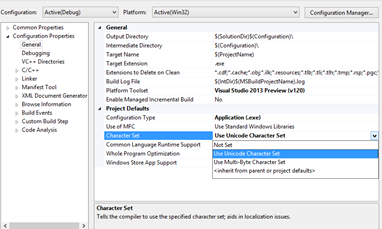

# C++: Ansi? Unicode? main, wmain, _tmain

Por Walter Novoa, **Microsoft Developer Evangelist**

Twitter: @warnov

Siio personal: <http://warnov.com>

Conozco usuarios “avanzados” de C++ que programan sin entender muy bien
este tema. Pero en cuando más se presenta, es cuando hasta ahora estás
comenzando a aprender C++. Y lo que he visto es que en ningún lado hay
una introducción adecuada a este tema, motivo por el cual me vi
determinado a escribir este post.

Encoding
--------

En la computación básicamente todos son números; aún los caracteres. A
cada carácter le corresponde un número determinado. Esta equivalencia es
lo que conocemos como encoding. Hay muchos tipos de encoding. Estos
encoding al principio no tenían en cuenta lenguajes donde habían muchos
más caracteres que por ejemplo aquellos del inglés. Tampoco tenían en
cuenta la necesidad de representar caracteres técnicos como la @ o
muñequitos como los
[*emojis*](http://warnov.tumblr.com/post/54068776944/hay-curiosidades-y-luego-los-emojis).
Además, diversos encodings, tenían diversas asignaciones de números para
un mismo carácter. Así que la comunicación era complicada entre sistemas
con distinto encoding.

En los encoding que tendieron a ser estándar podemos contar al encoding
ANSI. Es por esto, que C y C++ pueden trabajar con éste para representar
caracteres. Pero en ANSI, se usa solo un byte para estas
representaciones. O sea 8 bits. Con lo que se pueden representar solo
2^8 caracteres distintos = 256. Un conjunto muy limitado para un mundo
tan diverso.

Entonces el W3C propuso un encoding con más alcance, usando 2 bytes,
logrando con esto cumplir su premisa de proveer un único número para
cada carácter, sin importar la plataforma, el programa, o el idioma.
Este encoding es llamado Unicode y hoy en día es adoptado por líderes de
la industria como Microsoft, HP, IBM, Oracle, SAP, Sun, Apple y muchos
otros. Además es requerido por estándares modernos como XML, ECMAScript
(JavaScript), LDAP, CORBA 3.0, WML, etc.

Uno diría entonces que el Unicode es lo único que se debería estar
usando, pero hay que seguir dando compatibilidad hacia atrás sobre
sistemas que no son compatibles con Unicode.

Es así como C++ en Windows ofrece la posibilidad de crear programas
orientados a caracteres Ansi, Unicode o Multibyte. En el encoding
multibyte, algunos caracteres son de un byte y otros de varios bytes.
Este acercamiento es muy usado en los lenguajes orientales como el
japonés y el chino. En este artículo solo trataremos Unicode y Ansi.

Funciones
---------

Entonces para diferenciar las funciones orientadas a uno o a otro, se
han de usar nombres distintos.

En especial para la función principal de C++ que es el main, se tiene el
nombre wmain, cuando queremos específicamente tratar con Unicode. Si
solo usaremos Ansi, entonces con main bastará.

Pero puede ocurrir que estemos desarrollando un programa que vaya a
tener varios destinos: Unicode o Ansi.

¿En ese caso tendríamos que escribir dos versiones distintas del mismo
no? A menos de que tengamos una manera de tener nombres comodín que se
adapten a las condiciones requeridas.

Para el main, este comodín es \_tmain. Ya con esto, no tenemos que estar
modificando todo nuestro código, sino solamente especificar el tipo de
encoding en las propiedades del proyecto:

    

En Not Set, se usará Ansi por defecto.

main, no es la única función que debe trabajar distinto cuando maneja
Ansi o Unicode. De hecho todas las funciones que manejar char, tienen
sus diferentes versiones. Y hay muchos comodines para esas funciones al
igual que \_tmain.

Por ejemplo funciones como sprintf() o fopen() en Ansi tienen versiones
swprintf() o \_wfopen() para Unicode y las versiones comodín \_stprintf
y \_tfopen

En general se puede consultar la *documentación* para hallar los nombres
adecuados dependiendo del resultado deseado.

Tipos de Datos
--------------

Los tipos de datos también tienen nombre especial. Por ejemplo el char
para Ansi es char, pero para Unicode (2 bytes) es wchar\_t. Mientras el
comodín es TCHAR.

Esto es importante, porque si llamamos una función Ansi, debemos pasarle
tipos de datos de un byte; así mismo con Unicode. De lo contrario, en
ocasiones se pueden obtener resultados inesperados sin que
necesariamente se produzcan excepciones, o al menos errores o
advertencias en tiempo de compilación.

Literales
---------

Otro punto MUY importante, es el manejo de literales de acuerdo al
encoding.

Por ejemplo, si pasas a una función el valor “miparametro” como
parámetro, esto es interpretado como que estás pasando un char \*. O sea
un arreglo de caracteres de un solo byte: Ansi. El problema es si lo
pasas a la versión Unicode de una función, en cuyo caso vas a tener
resultados no deseados. Por ejemplo, no es correcto llamar:

wcscmp(palabraBase,"mipalabra");

Dado que wcscmp espera 2 argumentos de tipo wchar\_t. Suponiendo que la
variable palabraBase es de tipo correcto, lo que sí se puede asegurar es
que “mipalabra ”es incorrecto porque llega como char \*. Para
especificar que el trato sea con Unicode, usamos el prefijo “L”:

wcscmp(palabraBase, L"mipalabra");

Obviamente las funciones comodín también tienen su prefijo comodín:
“\_T”, aunque éste último actúa más como un operador: \_T(”mipalabra”)
será interpretada como Ansi o Unicode dependiendo del tipo de encoding
que se haya especificado.

Finalmente para ilustrar lo anterior, les dejo las tres versiones de un
sencillo programa que compara un parámetro pasado a la consola, con un
literal definido dentro del código:

Versión Ansi:
-------------

    #include <iostream>;
    #include <string.h>;
    
    using namespace std;
    int main(int argc, char*argv [])
    {
        if (_stricmp(argv[1], "palabraBase")==0)
            cout << "Palabras Iguales" << endl;
    }

 

Versión Genérica:
-----------------

    #include <iostream>;
    #include <string.h>;
    #include <tchar.h>;
    
    using namespace std;
    
    int _tmain(int argc, TCHAR * argv [])
    {
        //Válido si el proyecto se ajusta a Ansi
        //Not Set en el Character Set del Proyecto
        if (_tcsicmp(argv[1], "palabraBase") == 0)
            cout << "Palabras Iguales (T - Ansi): " << endl;
        //Válido SIEMPRE
        //Pero para un funcionamiento más genérico,
        //algo como esto sería más adecuado:
        if (_tcsicmp(argv[1], _T("palabraBase")) == 0)
            cout << "Palabras Iguales (T): " << endl;
        //Válido si el proyecto se ajusta a Unicode
        //Unicode en el Character Set del Proyecto
        if (_tcsicmp(argv[1], L"palabraBase") == 0)
            cout << "Palabras Iguales (T - Unicode): " << endl;
    }

Nótese la inclusión de <tchar.h>; para poder tener acceso a las macros genéricas requeridas.

Adicionalmente los bloques de ejemplo 1 y 3 son mutuamente excluyentes y dependiendo del charset definido solo una es correcta.

Versión Unicode:
----------------

    #include <iostream>;
    #include <string.h>;

    using namespace std;

    int wmain(int argc, wchar_t*argv \[\])
    {
        if (_wcsicmp(argv[1], L"palabraBase") == 0)
            cout << "Palabras Iguales (w)" << endl;
    }

