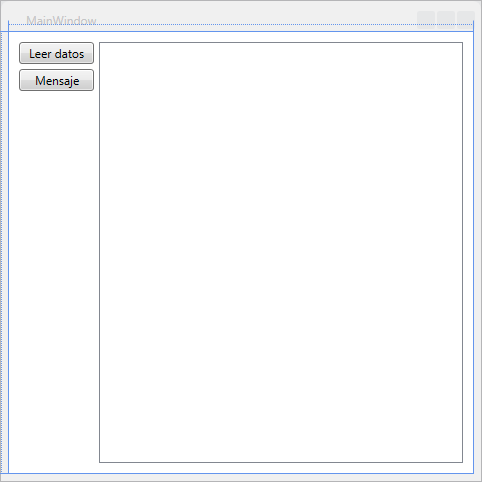
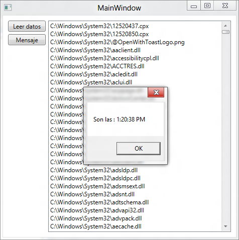
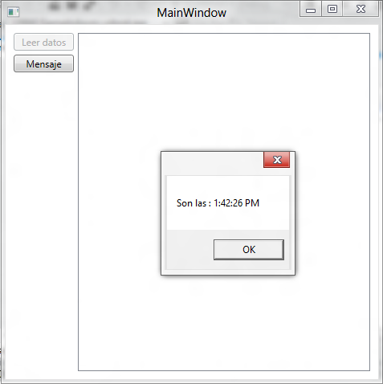

# Programación asíncrona en .NET Framework 4.5

| Jesús Muñoz Torres, MVP            | Mayo 2012 |
|------------------------------------|----- |
| MCT, MCPD, MCITP, MCTS, MCSD, MCAD |      |

[Blog](http://www.lesprogrammers.com/)

C\# 4.5 | Programación asíncrona en .NET Framework 4.5 (Async) 
---------------------------------------------------------------

#### Contenido 

* Operaciones asíncronas

    * Async - Patrón asíncrono en base a tareas
    * Task y Task&lt;IResult&gt;
    * Async
    * Await
    * Elementos necesarios para usar Async
    * Ejemplo usando async y await
        * Primer ejercicio: Creando la aplicación síncrona
        * Segundo ejercicio: Creando la aplicación asíncrona

Las tareas asíncronas se hacen necesarias cuando las aplicaciones se
quedan congeladas debido a acciones que no terminan y no dejan que el
usuario siga utilizándolas, seguramente has visto el mensaje "La
aplicación no responde...". Veamos como se resuelve este problema con
una nueva característica del Framework 4.5.

### Operaciones asíncronas

Una computadora tiene una cantidad fija de procesadores y cada uno de
estos procesadores puede ejecutar solo una operación a la vez,
llamémosle hilo a esta operación. Cada hilo en una aplicación está
programado para correr en el procesador por un periodo de tiempo.

Si un código realiza alguna acción de Entrada/Salida el hilo se suspende
hasta que el dispositivo ha completado su trabajo. Si se tiene una tarea
de muy larga duración se la puede iniciar en un hilo de trabajo separado
y obtener el resultado de la operación una vez que la tarea se haya
completado. Mientras que el hilo separado se ejecuta la aplicación puede
realizar otras tareas que no estén relacionadas con la tarea de larga
duración. Así, podemos aislar el trabajo que hacen las tareas.

La mayoría de los métodos son llamados síncronos, lo que significa que
el método se completará en el hilo actual. Sin embargo, algunos métodos
son llamados asíncronos lo que significa que el hilo actual inicia la
ejecución del método en otro hilo y la llamada regresa inmediatamente.
Los métodos síncronos son conocidos como bloqueos debido a que el hilo
que llama al método no hace otro trabajo hasta que el método se
completa.

Aquí vemos como llamar a otra tarea usando un hilo con el framework 2.0

    namespace Threads
    {
        class Program
        {
            static void Main(string\[\] args)
            {
                //Se crea un hilo que iniciará llamando al método TareaLenta
                System.Threading.Thread tarea =
                    new System.Threading.Thread( 
                        new System.Threading.ParameterizedThreadStart(TareaLenta));
                //Se inicia la otra tarea
                tarea.Start(900);
                //Se revisa si ya terminó la otra tarea
                if (tarea.ThreadState != System.Threading.ThreadState.Stopped)
                System.Console.WriteLine("La otra tarea sigue corriendo");
                //Se detiene el hilo actual hasta que termine la otra tarea o
                //hasta que pasen 1000 milisegundos
                tarea.Join(1000);
                //Se revisa otra vez si ya terminó la otra tarea
                if (tarea.ThreadState != System.Threading.ThreadState.Stopped)
                    System.Console.WriteLine("Paso un segundo y la otra tarea sigue...");
                else
                    System.Console.WriteLine("¡Por fin terminó la otra tarea!");
                System.Console.ReadLine();
            }

            /// 

            /// Método que será llamado por un hilo que tiene una duración igual
            /// a los milisegundos indicados en parametro
            /// 

            /// <param name="param"></param>
            static void TareaLenta(object parametro)
            {
                //Parámetro en forma de entero
                int lapso = (int)parametro;
                //Deteniendo la tarea por el tiempo indicado
                System.Threading.Thread.Sleep(lapso);
                System.Console.WriteLine("Esta tarea lenta ha terminado");
            }
        }
    }

Para más información sobre hilos visite:\
<http://msdn.microsoft.com/es-mx/library/6kac2kdh.aspx>

Las modificaciones a los datos son también consumidoras de tiempo lo
cual resulta en una pobre experiencia de usuario. Otra forma de usar
tareas alternas con hilos es usando un objeto BackgroundWorker como se
muestra a continuación.

    namespace EjemploBackgroundWorker
    {
        class Program
        {
            static void Main(string[] args)
            {
                //Se crea un objeto BackgroundWorker
                System.ComponentModel.BackgroundWorker tarea = new System.ComponentModel.BackgroundWorker();
                //Se genera el código que será asignado
                //al evento DoWork (la tarea asíncrona)
                tarea.DoWork += (o, parametros) =>
                {
                    //Se simula un retardo de 1 segundo
                    //Por ejemplo, un acceso muy tardado
                    //a una base de datos
                    System.Threading.Thread.Sleep(1000);
                    //En el resultado ponemos cualquier cosa
                    //por ejemplo la hora actual
                    parametros.Result = System.DateTime.Now;
                };
                // Se recupera el resultado al completar la tarea
                tarea.RunWorkerCompleted += (o, parametros) =>
                {
                    if (parametros.Error != null)
                    {
                        //Pon mensaje de error
                        System.Console.WriteLine("Con errores");
                    }
                    else
                    {
                        //Pon mensaje de éxito
                        System.Console.WriteLine("Sin errores");
                        //Se obtiene el resultado obtenido en la tarea
                        //y se imprime
                        System.Console.WriteLine(parametros.Result.ToString());
                    }
                };

                //Se pone a funcionar la tarea
                tarea.RunWorkerAsync();
                System.Console.ReadLine();
            }
        }
    }

Este proceso comienza a verse muy complicado ya que siempre necesitamos
de un método o bloque de código que responda a los eventos
“HacerTrabajo” y “TrabajoCompletado” del hilo.

#### Async - Patrón asíncrono en base a tareas 

Cuando se utiliza el patrón asíncrono en base a tareas del Framework
.NET 4.5 (TAP por sus siglas en inglés) los métodos asíncronos devuelven
un objeto Task representando la tarea. Utiliza los tipos Task y
Task&lt;TResult&gt; del espacio de nombre System.Threading.Tasks para
representar operaciones asíncronas arbitrarias.

Cuando se invoca una tarea y se espera su finalización se utiliza la
palabra clave await en la llamada a un método con la sintaxis:

await miMetodoAsync();

De esta manera no se altera el flujo, ni hay que asignar métodos a
eventos, aún más, ya no hay llamadas de retorno porque ahora el
compilador se hace cargo de crearlas.

#### Task y Task&lt;IResult&gt;

El tipo devuelto de una función asíncrona debe ser void, Task o
Task&lt;T&gt;. El tipo devuelto de una función anónima es el tipo del
return (si hay alguno) del delegado.

En una función asíncrona con el tipo de retorno void o Task, las
sentencias return no deben tener una expresión.

Cuando el tipo de retorno es Task&lt;T&gt; las sentencias return deben
tener una expresión que sea implícitamente convertible a T.

async

De manera convencional los métodos asíncronos usan el sufijo Async para
indicar que su ejecución se puede llevar a cabo después de que incluso
el método que haga la llamada ya haya terminado.

Un método async ofrece una forma muy conveniente de hacer cosas que
tardan mucho tiempo sin provocar bloqueos en el hilo que hace la
llamada. El hilo que hace la llamada a un método async puede continuar
sin tener que esperar a que el método async termine.

await

Una expression await solo se permite cuando ocurre dentro de un método
asíncrono.

Comunmente, un método modificado por el modificador async contiene por
lo menos una sentencia await. Tal método corre de forma síncrona hasta
que se encuentra con la primera expresión await, momento en el cual la
ejecución se suspende hasta que la tarea esperada se complete.

Elementos necesarios para usar Async

Async está disponible en la versión Beta de Visual Studio 11 o como una
descarga CTP (Community Technology Preview) para Visual Studio 2010 SP1.

Ejemplo usando async y await

Como un pequeño ejemplo para comprender como es posible utilizar async y
await generemos un pequeño proyecto WPF que nos permita ver el efecto
del patrón TAP

Primer ejercicio: Creando la aplicación síncrona

Tarea 1 - Creación de una aplicación síncrona

1\. Inicie Visual Studio 11 y creé una nueva aplicación WPF en C\#
llamada EjemploAsyn.

2\. Cambie las propiedades de la ventana principal para que tenga un
tamaño de 480 por 480 pixeles.

3\. Agregue dos botones y un ListBox. Asigne a los botones los nombres
BotonLeer y BotonMensaje respectivamente. Al ListBox asigne el nombre de
ListaDeArchivos.

4\. Acomode los componentes de manera que tengan el siguiente aspecto:

5\. Abra el archivo de código en C\# asociado a MainWindow
MainWindox.xaml.cs y agregue el siguiente método justo debajo del
constructor.

    private IEnumerable<string> ObtenerArchivos()
    {
        var archivos = from archivo
        in
        System.IO.Directory.GetFiles(@"C:\Windows\System32")
        select archivo;
        System.Threading.Thread.Sleep(5000);
        return archivos;
    }

6\. Haga doble clic sobre el botón BotonLeer para generar el manejador
del evento Click y agregue el siguiente código.

    private void BotonLeer_Click(object sender, RoutedEventArgs e)
    {
        BotonLeer.IsEnabled = false;
        ListaDeArchivos.ItemsSource = ObtenerArchivos();
        BotonLeer.IsEnabled = true;
    }

7\. Ahora regrese al modo diseño y haga doble clic sobre BotonMensaje
para generar el manejador del evento Click. Enseguida, agregue el
siguiente código al método generado.

    private void BotonMensaje_Click(object sender, RoutedEventArgs e)
    {
        MessageBox.Show("Son las : " +
        DateTime.Now.ToLongTimeString());
    }

8\. Haga funcionar la aplicación y presione el botón Leer datos. Observe
que la aplicación se congela y no es posible presionar el botón Mensaje.
Luego de 5 segundos se llena el ListBox con los archivos del directorio
y el botón Mensaje ya es funcional y muestra el mensaje.

Segundo ejercicio: Creando la aplicación asíncrona

Tarea 1 - Modificación del método ObtenerArchivos para que sea
asíncrono.

1\. Vaya al contenido del método ObtenerArchivos y modifique su
estructura de manera que el tipo de dato que devuelva cambie de
IEnumerable&lt;String&gt; a Task&lt;IEnumerable&lt;String&gt;&gt; y el
nombre del método tenga ahora el sufijo “Async” como se muestra.

    private Task<IEnumerable<String>> ObtenerArchivosAsync()

2\. Ahora envuelva el código del método para que devuelva un objeto de
tipo Task.

    private Task<IEnumerable<String>> ObtenerArchivosAsync()
    {
        return Task.Run(() =>
            {
            System.Threading.Thread.Sleep(5000);
            var archivos = from archivo in
                System.IO.Directory.GetFiles(@"C:\Windows\System32")
                select archivo;
            return archivos;
            });
    }

Tarea 2 – Modificación del manejador del evento Click de BotonLeer para
que sea capaz de hacer llamadas asíncronas.

1\. Cambie la estructura del método BotonLeer\_Click agregando el
modificador async como se muestra.

    private async void BotonLeer_Click(object sender, RoutedEventArgs e)

Observe que ahora el método tiene el modificador async antes del
modificador de tipo void.

2\. Ahora modifique la llamada al método ObtenerArchivos para que se haga
a través de una llamada asíncrona usando la palabra reservada await como
elemento modificador de la llamada al método. Recuerde que hemos
cambiado ya el nombre del método agregando el sufijo Asycn.

    ListaDeArchivos.ItemsSource = await ObtenerArchivosAsync();

3\. Haga funcionar la aplicación, presione el botón Leer datos y
compruebe que la aplicación no está congelada y es receptiva y que ahora
si es posible presionar el botón Mensaje sin tener que esperar que
termine el lapso de 5 segundos.

En este segundo ejercicio hemos creado una aplicación que no congela su
funcionamiento por haber iniciado una llamada a un método.

