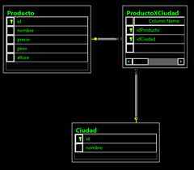
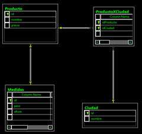

# Utilidad de relaciones 1:1 para optimizar descarga de imágenes desde DBs

Por Walter Novoa, **Microsoft Developer Evangelist**

Twitter: @warnov

Sito personal: <http://warnov.com>

Entre las cosas que supe que existían pero nunca para qué, puedo contar
las tablas relacionadas *1:1*.

Cuando me imaginaba un ejemplo de una implementación de este estilo, me
imaginaba la tabla producto. Entre los atributos podemos contar precio,
ciudades de distribución y medidas.

El precio es una columna, las ciudades de distribución harían parte de
una relación de varios a varios que partiría con una tabla de unión. Las
medidas, pueden ser todas columnas de la tabla: peso, altura, volumen,
etc., dado que las medidas son particulares a un producto dado. Así que
por esto no las sacaría:

    

Pero si quisiera hacer una relación *1:1*, podría crear una tabla de
medidas y entonces hacer que cada producto tuviera una relación unívoca
con un registro de medidas.

Como ven, no tiene mucho sentido... no obtendría mayor velocidad de
consulta y tampoco estaría ahorrando almacenamiento (de hecho estaría
generando un poco más de overhead sobre el tamaño de la DB). *Noten
además cómo representa SQL Server Management Studio las relaciones 1 a
1, con la llave en ambos extremos de la flecha:*

    

Dejemos esa historia hasta ahí por ahora.

Acto seguido, déjenme contarles acerca de un serio inconveniente que
estuve teniendo con LightSwitch y el desarrollo de un emprendimiento.

Ya con el sistema en producción, comencé a observar cómo la carga de uno
de los formularios de datos se hacía eterna, y eso que solo se
consultaba un conjunto de datos muy pequeño (no más de 1000 registros).
Fue abrumador.

Luego de mucho revisar, observé que la demora se producía cuando traía
unos datos de tipo *T*, por decir algo, que eran requeridos para llenar
un combo.

Lo que hace LightSwitch es llenar el combo con la columna de resumen de
la tabla *T*. Así que en mi caso, luego de varios minutos si no había
excepción por timeout, llenaba el combo con los contenidos de la columna
de resumen (un resumen por cada registro retornado)

Precisamente el hecho de tener esa columna de resumen fue el que me hizo
olvidar que la tabla tenía otras columnas adicionales.

Y lo peor, que una de esas columnas adicionales era usada para almacenar
imágenes.

Entonces todo comenzó a esclarecerse.

LightSwitch usa el EntityFramework para agilizar su labor de RAD que
agiliza mucho el desarrollo de aplicaciones basadas en formularios de
datos.

Como la idea de un RAD es hacer todo lo más genérico posible para poder
agilizar el desarrollo, en LightSwitch solo se pueden hacer consultas a
nivel de entidades completas.

I mean, no se puede pedir por ejemplo una consulta que traiga solo tres
campos de una tabla o que traiga extractos de varias tablas. Todo se
debe resolver por las relaciones que hayas creado en el modelo. El
filtro que se haga, siempre retorna *n* elementos de una entidad dada,
donde cada uno de esos *n* elementos baja con TODA LA INFO asociada al
mismo.

El problema descrito aquí no solo aplicaría para LightSwitch, sino para
cualquier otro RAD, dado que solo manejando entidades completas, se
puede ejercer un control automatizado sobre todas las operaciones que se
hagan en el entorno.

Esto en general anda perfecto sin mucho esfuerzo; ¿pero que pasa si tu
tabla *T* tiene 4 columnas de tipo *varbinary* para almacenar imágenes
asociadas con tamaños de varias megas cada uno?

¿Qué pasa si el resultado de una consulta muy sencilla arroja por
ejemplo 30 resultados?

¡Nefasto! Estaremos descargando cientos de megabytes al cliente y sin
darnos cuenta, porque lo que vemos en la pantalla al final por ejemplo
en mi caso, solo es el campo de resumen de la tabla.

De hecho en esta instancia, aún no necesitaba las imágenes. Solo
necesitaba dos columnas: la del resumen para identificar el registro
requerido y el Id para poder operar en adelante.

Así que después de mucho analizarlo, adivinen cuál fue la solución:

Jajaja, sí. La dichosa tabla adicional (en este caso de imágenes) y la
relación 1:1. Llamaremos U a esa tabla.

El hecho de tener las tablas separadas en este caso sí implica una
**gran ventaja** dado que cuando el RAD descargue el resultado de mi
filtro, ¡no se traerá todos los MB de imágenes correspondientes a cada
uno de esos registros!

Entonces la solución es hacer el filtro inicial solo sobre la tabla *T*
y de allí escoger el registro especial al que quiero consultarle sus
imágenes asociadas.

Con una relación *1:1* esto funciona perfectamente, ya que en ambas
tablas los *PK* son los mismos. Así que cuando de la tabla *T* escojo el
*id 7* por ejemplo, luego haría un filtro sobre la tabla *U where
U.id=7* y ahí sí me bajaría solo las 10MB del registro requerido. Algo
completamente apropiado, sin mencionar que además es más fácil soportar
el tiempo de espera para obtener la info de un registro particular que
cuando esperamos minutos para traer un listado que después vamos a tener
que filtrar nuevamente!

**CONCLUSION:**
---------------

All in All, las dichosas *1:1* resultan muy útiles cuando a una entidad
dada tenemos asociada información que no se requiere frecuentemente pero
que sí puede ser muy pesada para estar bajando del server con cada
consulta, cuando no se pueden hacer filtros con altos grados de
personalización como sucede en todo **RAD** que trabaje con datos a
nivel de entidades.

Si conocen más usos prácticos de este caso, ¡siéntanse libres de
comentar abajo!

**Nota: **
----------

En LightSwitch no se soportan las relaciones 1:1, pero sí las *1:0..1*,
que en términos prácticos cumplen exactamente la misma función.

