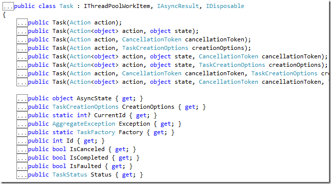

<properties
	pageTitle="Parallel Series: Tasks, la 8ª maravilla"
	description="Parallel Series: Tasks, la 8ª maravilla"
	services="net-dev"
	documentationCenter=""
	authors="andygonusa"
	manager=""
	editor="andygonusa"/>

<tags
	ms.service="net-dev"
	ms.workload="CS"
	ms.tgt_pltfrm="na"
	ms.devlang="na"
	ms.topic="how-to-article"
	ms.date="05/17/2016"
	ms.author="andygonusa"/>

# Parallel Series: Tasks, la 8ª maravilla

[Lluís Franco](http://lluisfranco.com/about/), Microsoft MVP

<http://lluisfranco.com/category/language/spanish/>

<http://www.linkedin.com/in/lluisfranco>

<https://twitter.com/lluisfranco>

The show must go on
-------------------

En los posts previos hemos hablado de
[PLINQ](http://lluisfranco.com/2011/05/31/parallel-series-parallel-linq-plinq/)
y de la [clase
Parallel](http://lluisfranco.com/2011/06/26/parallel-series-la-clase-esttica-parallel/),
dos características que facilitan mucho la ejecución de datos en
paralelo, sin embargo si alguien me preguntase cual es la característica
que más me gusta de la Task Parallel Library lo tendría muy claro: El
manejo de tareas asíncronas mediante la clase
[Task](http://msdn.microsoft.com/en-us/library/system.threading.tasks.task.aspx).

Durante muchos años los desarrolladores hemos tenido que lidiar -más ben
pelearnos- con la multitarea y la ejecución de código asíncrono. Ya dese
las primeras versiones de C\# podíamos crear hilos a mano mediante la
clase
[Thread](http://msdn.microsoft.com/en-us/library/system.threading.thread.aspx),
pero el proceso distaba mucho de ser sencillo y además adolecía de
cierta complejidad para manejar cancelaciones o actualizar la interfaz
de usuario. Y aunque han habido intentos de mejora como la interfaz
[IAsyncResult](http://msdn.microsoft.com/en-us/library/system.iasyncresult.aspx)
también han aparecido engendros infumables como el
[BackgroundWorker](http://msdn.microsoft.com/en-us/library/system.componentmodel.backgroundworker.aspx),
el cual es tan malo como hacerse cirugía cerebral con manoplas uno
mismo.

Task al rescate!
----------------

Así que cuando apareció la TPL y la clase
[Task](http://msdn.microsoft.com/en-us/library/system.threading.tasks.task.aspx)
los desarrolladores encontramos por fin un método simple y cómodo para
ejecutar código asíncrono y además en paralelo. Y esto es realmente muy
importante ya que hoy en día en muchas aplicaciones (al menos las que
están bien diseñadas) se ejecutan tareas en paralelo para acceder a
recursos externos o ‘costosos’, bases de datos, y sobre todo para
actualizaciones de la interfaz de usuario. De hecho es tan importante
que será una de las mejoras más importantes en la siguiente versión de
[C\#
5.0](http://blogs.msdn.com/b/mvpawardprogram/archive/2012/03/26/introduction-of-new-features-in-c-5-0.aspx)
de la cual hablaremos al final de la serie.

Actions everywhere
------------------

Al igual que la clase estática Parallel y gran parte de la TPL, la clase
[Task](http://msdn.microsoft.com/en-us/library/system.threading.tasks.task.aspx)
se basa en acciones, de modo que si no las controlas demasiado [dale una
ojeada al post](http://lluisfranco.com/2012/02/08/luces-camara-action/)
que publiqué hace un tiempo sobre el tema.

En su sintaxis más básica, se puede utilizar de este modo:

    var t = new Task(() => {
        Thread.Sleep(1000);
        Console.WriteLine("A");
        });
    t.Start();
    Console.WriteLine("B");

O lo que es lo mismo:

    Task.Factory.StartNew(() => {
        Thread.Sleep(1000);
        Console.WriteLine("A");
        });
    Console.WriteLine("B");

La única diferencia es que en la primera declaramos la variable
especificando la acción a ejecutar y luego la ejecutamos explícitamente
mediante su método ‘Start’, y en la segunda no utilizamos ninguna
variable, sólo especificamos y ejecutamos la acción mediante el método
‘StartNew’ de la clase ‘Task.Factory’.

Observando el código anterior, qué os pensáis que se escribirá primero?
A o B? Evidentemente B, ya que podemos imaginar cómo el código no se
detiene en el Thread.Sleep(1000) (éste se ejecuta en otro Thread) de
modo que ejecuta inmediatamente el print ‘B’. Correcto.

Pero las tareas son mucho más, permiten desde devolver resultados hasta
manejar éstas ‘unidades de trabajo’ encadenando tareas a continuación de
otras, esperando a que terminen una o un grupo de tareas antes de
ejecutar otra, cancelar una tarea o propagar excepciones entre ellas.

**1) Devolver un valor desde una tarea…**

Como en un método, una tarea puede devolver desde un tipo básico (int,
string) hasta cualquier tipo complejo. Para hacer el ejemplo más
interesante vamos a utilizar un método que examina la red local en busca
de servidores SQL Server y devuelve una lista de strings:

    public static List<string> GetSQLServerNames()
    {
        List<string> sqlservernames = new List<string>();
        sqlservernames.Add("local");
        SqlDataSourceEnumerator enumSQLServers =
        SqlDataSourceEnumerator.Instance;
        foreach (DataRow server in enumSQLServers.GetDataSources().Rows)
        {
            if (server["InstanceName"] is System.DBNull)
                sqlservernames.Add(server["ServerName"].ToString());
            else
                sqlservernames.Add(string.Format("{0}\\{1}", server["ServerName"],server["InstanceName"]));
        }
        Console.WriteLine("end get servers");
        return sqlservernames;
    }

La ventaja de usar este método es que tarda unos segundos en ejecutarse,
con lo cual es un candidato perfecto para ser ejecutado de forma
asíncrona:

    var getServersAsync = new Task<List<string>>(() => GetSQLServerNames());
    getServersAsync.Start();
    Console.WriteLine("end call");

Si lanzamos este código observaremos que se imprime ‘end call’
inmediatamente, y tarda unos segundos en imprimir ‘end get servers’.
Realmente se está ejecutando asíncronamente!

**2) …y al terminar continuar con otra tarea**

Ahora supongamos que tenemos otro método que se encarga de actualizar la
interfaz de usuario  a partir de la lista anterior:

    private void updateServersListUI(List<string> servers)
    {
        comboBox1.Items.Clear();
        servers.ForEach(p => comboBox1.Items.Add(p));
    }

¿No sería lógico que lo hiciese al terminar la tarea anterior? Pues la
verdad es que si, y encadenar tareas es algo trivial y que ofrece mucha
potencia al desarrollador. De hecho estoy seguro que ya se os ha
ocurrido alguna aplicación ;)

Encadenar tareas es tan sencillo como utilizar el método ‘ContinueWith’:

    var getServersAsync = new Task<List<string>>(() => GetSQLServerNames());
    getServersAsync.Start();
    Console.WriteLine("end button2");
    getServersAsync.ContinueWith((p) => updateServersListUI(getServersAsync.Result));

Sobre el papel debería funcionar pero no lo va a hacer, ya que hasta
ahora no nos hemos fijado en un detalle: **En la plataforma .NET no es
posible actualizar un control desde otro hilo distinto al que lo ha
creado**, y toda la interfaz de usuario se crea en el main thread o hilo
principal. Y esta limitación todavía existe.

Estableciendo el contexto de ejecución
--------------------------------------

Antes de la TPL para actualizar la interfaz de usuario desde otro hilo
debíamos utilizar el método ‘Invoke’ de la clase ‘Control’, de modo que
deberíamos modificar el método anterior de este modo:

    private void updateServersListUI(List<string> servers)
    {
        if (this.InvokeRequired) this.Invoke(new Action(() =>
        {
            comboBox1.Items.Clear();
            servers.ForEach(p => comboBox1.Items.Add(p));
        }));
    }

Pero no va a ser necesario, ya que como parte de la magia de la TPL se
nos ofrece la posibilidad de llamar a
[‘TaskScheduler.FromCurrentSynchronizationContext’](http://msdn.microsoft.com/en-us/library/system.threading.tasks.taskscheduler.fromcurrentsynchronizationcontext.aspx)
que nos permite acceder a la interfaz de usuario de forma segura. Así
pues lo único que hay que modificar el código anterior es encadenar la
segunda tarea usando el contexto de sincronización antes mencionado y
olvidarnos de la llamada a Invoke:

    getServersAsync.ContinueWith((p) => updateServersListUI(getServersAsync.Result),
    TaskScheduler.FromCurrentSynchronizationContext());

Esperando la ejecución de varias tareas
---------------------------------------

Otra característica muy interesante es la posibilidad de esperar a que
termine un grupo de tareas entero, o sólo una de ellas. Supongamos que
tenemos unja serie de tareas que se encargan de aplicar unos efectos a
una serie de imágenes:

    var t1 = Task.Factory.StartNew(() => pictureBox1.Image = Properties.Resources.Landscape08.Invert());
    var t2 = Task.Factory.StartNew(() => pictureBox2.Image = Properties.Resources.Landscape08.Grayscale());
    var t3 = Task.Factory.StartNew(() => pictureBox3.Image = Properties.Resources.Landscape08.Brightness(140));
    var t4 = Task.Factory.StartNew(() => pictureBox4.Image = Properties.Resources.Landscape08.Contrast(80));
    var t5 = Task.Factory.StartNew(() => pictureBox5.Image = Properties.Resources.Landscape08.Gamma(1, 5, 1));
    var t6 = Task.Factory.StartNew(() => pictureBox6.Image = Properties.Resources.Landscape08.Color(255, 0, 0));

Podría ser interesante no seguir ejecutando el código hasta que la
primera termine, o hasta que terminen todas, o hasta que terminen todas
pero con un timeout. O sea, que si no terminan todas en 100 milisegundos
seguir con la ejecución:

    Task.WaitAny(new Task[] {t1, t2, t3, t4, t5, t6});
    Task.WaitAll(new Task[] {t1, t2, t3, t4, t5, t6});
    Task.WaitAll(new Task[] {t1, t2, t3, t4, t5, t6}, 100);

Otra forma de conseguir esto es mediante la creación de una tarea,
especificando que debe esperar a que se complete alguna tarea o todas
las especificadas:

    var t7 = Task.Factory.ContinueWhenAll(new[] { t1, t2, t3, t4, t5, t6 }, (t) =>
    {
    //DoSomething...
    });

Cancelando tareas
-----------------

Al igual que en posts anteriores, la clase Task también admite
cancelaciones, y a mi juicio suelen ser más utilizadas que sus
equivalentes en PLINQ o Parallel, ya que pueden permitir a un usuario
cancelar el acceso a un recurso que tarda más de lo previsto (una URL
p.e.) y las tareas que debían ejecutarse a continuación.

Partiendo de la base de un método que hace un trabajo largo:

    private void DoALongWork(CancellationTokenSource cs)
    {
        try
        {
            for (int i = 0; i < 100; i++)
            {
                Thread.Sleep(10);
                cs.Token.ThrowIfCancellationRequested();
            }
        }
        catch (OperationCanceledException ex)
        {
            Console.WriteLine(ex.Message);
        }
    }

Podemos cancelar la tarea llamando al método ‘Cancel’ del token:

    var cs = new CancellationTokenSource();
    var t = Task.Factory.StartNew(() => DoALongWork(cs));
    Thread.Sleep(500);
    cs.Cancel();

Y al cancelarse el código entrará en el catch del método ‘DoALongWork’
en el que se realizarán las acciones apropiadas a la cancelación.

Cancelación y estado
--------------------

Para terminar, en algunos casos puede ser interesante que en caso de
éxito la tarea llame a una segunda, pero en cambio si se cancela llame a
una tercera. Para poder hacer esto debemos preguntar por el estado de la
primera tarea y realizar un pequeño truco: *La excepción no debe ser
interceptada en un bloque try!*

Así pues el código del método quedaría de este modo (sin try):

    private void DoALongWork(CancellationTokenSource cs)
    {
        for (int i = 0; i < 100; i++)
        {
            Thread.Sleep(10);
            cs.Token.ThrowIfCancellationRequested();
        }
    }

Y la llamada de este otro:

    var cs = new CancellationTokenSource();
    var t = Task.Factory.StartNew(() => DoALongWork(cs));
    Thread.Sleep(500);
    cs.Cancel();
    t.ContinueWith(task =>
        {
        switch (task.Status)
            {
                case TaskStatus.Faulted:
                    MessageBox.Show("Fail");
                    break;
                case TaskStatus.RanToCompletion:
                    MessageBox.Show("Success");
                    break;
            }
        }, TaskScheduler.FromCurrentSynchronizationContext());

Como podéis observar, podemos cambiar el flujo del código en función del
estado de la tarea.

Importante: Para poder ejecutar este último ejemplo es necesario
ejecutar sin depuración (Ctrl+F5)

Bueno, nos hemos dejado algunas cosas en el tintero, pero para no hacer
muy largo éste post las veremos más adelante, en otros posts avanzados
de la misma serie.
