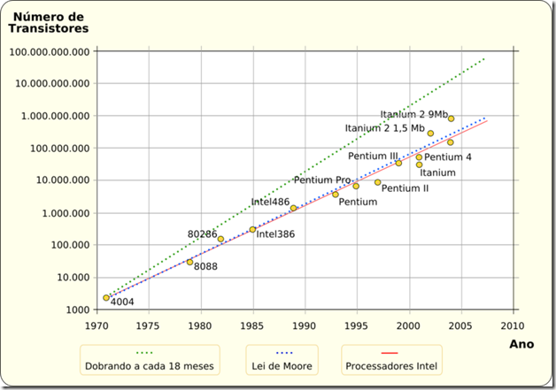

<properties
	pageTitle="Parallel Series: Un poco de historia"
	description="Parallel Series: Un poco de historia"
	services="net-dev"
	documentationCenter=""
	authors="andygonusa"
	manager=""
	editor="andygonusa"/>

<tags
	ms.service="net-dev"
	ms.workload="CS"
	ms.tgt_pltfrm="na"
	ms.devlang="na"
	ms.topic="how-to-article"
	ms.date="05/17/2016"
	ms.author="andygonusa"/>

# Parallel Series: Un poco de historia

[Lluís Franco](http://lluisfranco.com/about/), Microsoft MVP

<http://lluisfranco.com/category/language/spanish/>

<http://www.linkedin.com/in/lluisfranco>

<https://twitter.com/lluisfranco>

La programación paralela no es nada nuevo. Ya estaba presente allá en
mis tiempos de estudiante hace más de 20 años, y hoy en día, desde la
aparición del .Net Framework 4.0 está más viva que nunca gracias a la
[Task Parallel
Library](http://msdn.microsoft.com/en-us/library/dd460693.aspx) o TPL.

No obstante, decir que la TPL sólo sirve para realizar tareas asíncronas
es como decir que un smartphone sólo sirve para llamar por teléfono. Es
más, muchísimo más. Y es precisamente, de la mano de ésta librería que
vamos a introducirnos en el apasionante mundo de la programación
paralela. Una disciplina que tradicionalmente siempre ha estado asociada
a los perfiles técnicos más elevados, y reservada para ocasiones
especiales. Sin embargo, a partir de ahora y gracias a la TPL va a ser
accesible a todo tipo de desarrolladores, y se va a convertir en algo
muy importante, algo que todo buen desarrollador deberá añadir a su
lista de activos. De hecho, va a ser una parte esencial en el futuro
inmediato del desarrollo de aplicaciones para [Windows
8](http://lluisfranco.com/2011/06/02/windows-8-first-official-preview/)
y posteriores.

Pero ¿qué realmente es la programación paralela? Podemos pensar en ella
como en la posibilidad de dividir una tarea larga y pesada en varias
tareas más cortas, y ejecutar éstas al mismo tiempo, de modo que tarde
mucho menos que la tarea original.

Enciclopedias y monos
---------------------

Vamos a suponer que tenemos que copiar los 200 tomos de la gran
enciclopedia galáctica de
[Términus](http://es.wikipedia.org/wiki/T%C3%A9rminus). Lógicamente no
es lo mismo copiarlos uno detrás de otro, que contratar a 200 monos
mutantes entrenados para copiar, y sentarlos en 200 escritorios con sus
200 bolígrafos a copiar los 200 libros. Es evidente que la segunda
opción es mucho más rápida.

Pero ¿qué sucede si sólo tenemos 100 escritorios y bolígrafos? Pues que
los monos van a tener que hacer cola y esperar su turno, de modo que
cuando uno de los monos termine o se canse de escribir, deberá ceder su
turno al mono que espera, provocando por el camino algunas colas y
enfados por parte de los monos, que son buenos trabajadores pero un poco
particulares.

Con todo, siempre será más rápido que la primera opción, pero la primera
conclusión es que a más recursos (escritorios y bolígrafos) más rápido
terminaremos la tarea. Y de paso menos vamos a tener que preocuparnos de
gestionar los turnos y las esperas de los monos, con todo lo que
conlleva. Porque en muchas ocasiones *cuando trabajamos con monos o con
threads el tiempo de sincronización es primordial, y puede marcar la
diferencia entre el éxito y el fracaso*.

Leyes muertas y física cuántica
-------------------------------

Sin embargo, hasta ahora nos ha ido muy bien con la programación
tradicional ¿porque parece que ahora es cuestión de vida o muerte
aprender este nuevo paradigma? Es decir, habitualmente hasta ahora no
habían demasiadas ocasiones en las que una aplicación debía recurrir a
la asincronía o al paralelismo (que como veremos más adelante no es
exactamente lo mismo). Por qué ahora sí?

La respuesta es sencilla, parece que la buena vida se termina. Si ha
habido una constante en IT en los últimos 45 años, esa es la que
describe la [ley de Moore](http://es.wikipedia.org/wiki/Ley_de_Moore):
En 1965 Gordon Moore, uno de los fundadores de Intel predijo que cada 2
años (18 meses al principio) se doblaría el número de componentes de un
circuito integrado. Y se ha cumplido a rajatabla hasta hoy, pero en los
últimos años se están alcanzando ciertos límites que hacen que dicha ley
no pueda seguir cumpliéndose.

1.  
    

Simplificando un poco podríamos decir que existen un par de problemas:
El escalado de frecuencia de los microprocesadores y el calor generado
por los mismos. El primero de ellos hace referencia a la dificultad de
seguir incrementando la velocidad de los microprocesadores, debido
principalmente a que la tecnología utilizada para diseñarlos está
actualmente cerca de los 32 nanómetros y el límite físico antes de que
la materia experimente cambios, se calcula que está entre los 22 y los
18 nanómetros. Esta previsto alcanzar este límite aproximadamente en
sólo dos o tres años, hacia 2014. A la vuelta de la esquina.

Una vez alcanzado ese nivel de miniaturización, en palabras del
científico [Stephen
Hawking](http://es.wikipedia.org/wiki/Stephen_Hawking): “*La materia
presenta efectos cuánticos que harían necesaria una tecnología diferente
para seguir realizando cálculos a ese nivel*”.

El segundo de los problemas va ligado al primero, y es que en los
últimos años el calor generado por los microprocesadores se ha ido
incrementado exponencialmente, y en términos de densidad de potencia ya
es igual al calor generado por la tobera de un cohete. Lo peor de todo
ello es que *incrementar la frecuencia sólo entre un 5 y 10 por ciento
cada año, tiene un coste de casi doblar la temperatura*.

1.  

Con esto no quiero decir que no puedan fabricarse ordenadores más
rápidos en un futuro. Quiero decir que si estas predicciones son
acertadas, no podrán fabricarse microprocesadores más rápidos con la
tecnología actual. Tal vez sea posible si se descubre cómo construir
ordenadores que utilicen tecnología óptica, nano-ingeniería para crear
transistores basados en nanotubos que aprovechen el llamado efecto
túnel, o cualquier otro concepto aún por descubrir. Pero por el momento
no podemos contar con ello.

Deus ex machina
---------------

Si por algo se ha caracterizado el ser humano es por su gran habilidad
en resolver problemas (dejando aparte su nada desdeñable habilidad para
provocarlos), de modo que ya hace unos años que se ha empezado a
desarrollar y fabricar una de las soluciones a este problema. De hecho
hoy en día se ha convertido en algo casi cotidiano: Se trata de fabricar
procesadores con varios núcleos, que se repartan el trabajo -como los
monos- consiguiendo así aumentar la velocidad. No por el hecho de ser
cada vez más rápidos, si no por existir cada vez más recursos trabajando
al mismo tiempo. Algo parecido -salvando las distancias- al cerebro
humano, que en comparación con un ordenador es infinitamente más lento,
pero su capacidad de procesamiento en paralelo gracias a sus millones de
conexiones entre neuronas, no tiene rival con ningún otro elemento
conocido en la naturaleza ni creado por el hombre.
