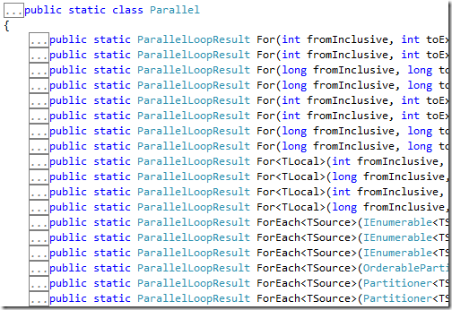
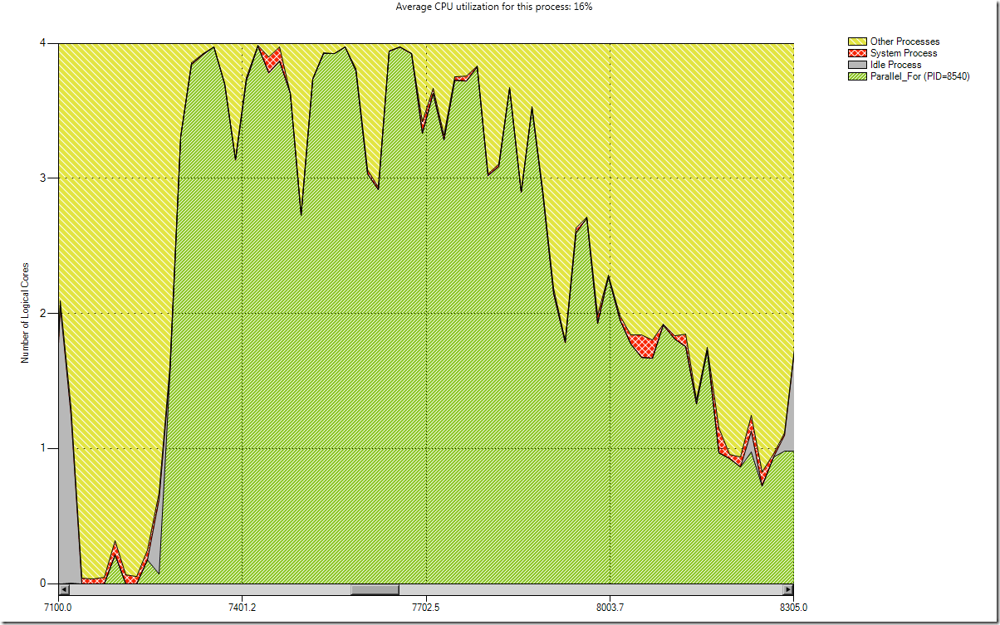

# Parallel Series: La clase estática Parallel

[Lluís Franco](http://lluisfranco.com/about/), Microsoft MVP

<http://lluisfranco.com/category/language/spanish/>

<http://www.linkedin.com/in/lluisfranco>

<https://twitter.com/lluisfranco>

Hoy quiero hablaros de la [clase estática
Parallel](http://msdn.microsoft.com/en-us/library/system.threading.tasks.parallel.aspx).
Esta clase provee soporte para paralelizar bucles y regiones, y al igual
que PLINQ su uso es muy sencillo. Cabe destacar que está especialmente
optimizada para iteraciones, y que en este contexto se desenvuelve un
poco mejor que PLINQ. No hay una diferencia significativa en tiempos
absolutos, pero puede verse perfectamente si utilizamos el magnífico
profiler de Visual Studio 2010. No obstante, pueden existir situaciones
en las que si se necesita afinar mucho el rendimiento en iteraciones, y
aquí es dónde tiene más sentido utilizar dos de los tres métodos de esta
clase: **For** y **ForEach**. Al tercero lo llamaremos
[Cirdan](http://es.wikipedia.org/wiki/C%C3%ADrdan) y apenas aparecerá en
esta historia (en realidad me refiero a Invoke pero tampoco aparecerá
por aquí).

    

Comprendiendo las acciones
--------------------------

Los dos métodos tienen una firma muy similar en su forma más sencilla.
Ambos iteran sobre una serie de instrucciones realizando n veces cada
una de ellas. Y aquí es dónde vemos aparecer los parámetros de tipo
Action:

    public static ParallelLoopResult For
        (int fromInclusive, int toExclusive, Action<int> body)

    public static ParallelLoopResult ForEach<TSource>
        (IEnumerable<TSource> source, Action<TSource> body)

Un Action&lt;T&gt;, al igual que su hermano Func&lt;T&gt; es uno de los
elementos de C\# importados de la [programación
funcional](http://lluisfranco.com/2012/02/08/programacin-funcional-para-el-resto-de-nosotros/),
y desde el momento en que uno se acostumbra a usarlo, cuesta pensar cómo
ha podido desarrollar toda su vida anterior. Si no, los que estéis
acostumbrados a usar expresiones lambda en LINQ, imagináos que
desaparecen de un día para otro.

No quiero empezar a divagar ahora sobre programación funcional, aunque
si que quiero hacer incapié en el uso de Actions y lo importantes que se
han vuelto en los últimos años. De hecho, recientemente [he dedicado un
post a cómo Action y
Func](http://lluisfranco.com/2012/02/08/luces-camara-action/) han
simplificado mucho el trabajo con delegados a los desarrolladores.

El método Parallel.For 
-----------------------

Pero volviendo al tema que nos ocupa, si observamos la firma del método
**Parallel.For** podremos ver que en lo importante no difiere demasiado
de su homólogo **for** de toda la vida: Ambos tienen un inicio, un final
y unas acciones a realizar un número determinado de veces.

Así que partiendo del método *IsPrime* que ya utilizamos en el [anterior
post sobre
PLINQ](http://lluisfranco.com/2011/05/31/parallel-series-parallel-linq-plinq/),
vamos a ver una comparativa entre las sintaxis de éstos dos métodos:

    for (int i = 0; i < 100; i++)
    {
        if(i.IsPrime())
            Console.WriteLine(string.Format("{0} es primo", i));
        else
            Console.WriteLine(string.Format("{0} no es primo", i));
    }

    Parallel.For(0, 100, (i) =>
    {
        if (i.IsPrime())
            Console.WriteLine(string.Format("{0} es primo", i));
        else
            Console.WriteLine(string.Format("{0} no es primo", i));
    });

En ambos  casos tenemos una serie de líneas que deben ejecutarse 100
veces. Concretamente desde 0 hasta 99, ya que el elemento superior no se
incluye en ninguno de los dos casos. Sólo se ve un poco extraño el uso
del Action<T>, pero podéis pensar en que la variable int i del
primer bucle for, aquí se transforma en la parte (i) a la izquierda de
la expresión lambda (=>). Y las acciones a ejecutar del primer for
son exactamente iguales y van a la derecha de la expresión lambda.

So, let’s parallelize!
----------------------

Viéndolo de este modo debe resultar extremadamente sencillo transformar
todos nuestros bucles de este modo, así que ¿debemos hacerlo? La
respuesta es NO.

En algunas ocasiones no vamos a obtener rendimiento por el hecho de
paralelizar, ya que si el trabajo a realizar es mínimo, tardaremos más
tiempo en dividir el trabajo en distintos threads, ejecutarlos y
consolidar la información que en ejecutar la tarea sin paralelizar.
También podría ser que nos encontrásemos un cuello de botella externo en
un dispositivo de I/O, como un puerto, un servidor remoto o un socket.

Otro claro ejemplo de esto son los bucles anidados. Es común anidar
varias estructuras for o foreach para realizar ciertos algoritmos. En
este caso el candidato a ser paralelizado siempre es el bucle exterior y
no es necesario (de hecho sería contraproducente) paralelizar los bucles
internos:

    Parallel.For(0, 100, (z) =>
    {
        for (int i = 0; i < 100; i++)
        {
            if (i.IsPrime())
                Console.WriteLine(string.Format("{0} es primo", i));
            else
                Console.WriteLine(string.Format("{0} no es primo", i));
        }
    });

Por lo pronto resulta bastante evidente, ya que si paralelizamos en
bucle exterior necesitaríamos un ordenador con 100 cores y
evidentementemente todavía no existen, así que la TPL tiene que agrupar
estas tareas para adaptarlas a los cores disponibles, tardando cierto
tiempo en hacer la sincronización (parecido a los [primeros ejemplos con
monos de la
serie](http://lluisfranco.com/2011/02/21/parallel-series-un-poco-de-historia/)).
Imagináos entonces si paralelizamos ambos bucles: 100 x 100 = 10.000
cores? Simplemente no tiene sentido.

Mi consejo es que en todos los casos en los que se decida paralelizar un
bucle (y esto también vale para las consultas PLINQ) se realice primero
una comparativa de rendimiento.

    

El método Parallel.ForEach
--------------------------

En cuanto al método ForEach es prácticamente igual al anterior con la
salvedad que no tenemos un inicio y un final, sino una secuencia de
entrada de datos (basada en IEnumerable, como PLINQ) y una variable que
usamos para iterar por cada uno de los elementos de la secuencia y
realizar una serie de acciones.

Consideremos el siguiente código:

    List<FeedDefinition> feeds = new List<FeedDefinition>();
    clock.Restart();
    var blogs = FeedsEngine.GetBlogsUrls();
    foreach (var blog in blogs)
    {
        feeds.AddRange(FeedsEngine.GetBlogFeeds(blog));
    }
    clock.Stop();
    this.Text = clock.ElapsedMilliseconds.ToString("n2");
    feeds.ForEach(p => Console.WriteLine(p.Name));

Suponiendo que tenemos un método FeedsEngine.GetBlogsUrls que devuelve
una lista de urls de proporcionan contenido RSS, el código anterior se
conecta a cada una de las urls e intenta descargar toda la información
de los posts mediante un método FeedsEngine.GetBlogFeeds(blog).

*Nota: El código completo lo podréis encontrar en el post (todavía no
publicado) ‘Código de ejemplo de las Parallel Series’, que contiene
todos los ejemplos de todos los posts de la serie.*

Como podéis imaginar este proceso totalmente secuencial es un serio
candidato a ser paralelizado, ya que la mayoría del tiempo de este
proceso es tiempo desperdiciado intentando a conectar con un servidor
externo y que éste responda a las peticiones. En este caso paralelizar
va a ser de gran ayuda aunque es importante comprender que en este caso
la ganancia de rendimiento no va a ser por usar más potencia local, sino
por lanzar las peticiones a los distintos servidores de forma asíncrona.

Así pues, basta cambiar la parte del bucle foreach por su versión
paralelizada:

    Parallel.ForEach(blogs, (blog) =>
    {
        feeds.AddRange(FeedsEngine.GetBlogFeeds(blog));
    });

En la que definimos la secuencia de datos a utilizar y declaramos la
variable blog al vuelo (el compilador infiere el tipo automáticamente) a
la izquierda de la expresión lambda, y a la derecha las acciones que
deseamos realizar, que son exactamente iguales a la anterior versión
foreach.

Y comprobaremos como se ejecuta mucho más rápido. En mi estación de
trabajo pasamos de 6,7 segundos a 1,4 lo que no está nada mal.

Explorando más opciones
-----------------------

En la clase Parallel al igual que en las consultas PLINQ, existe la
posibilidad de especificar el grado de paralelismo así como de cancelar
la ejecución de un bucle. Sólo debemos usar una de las sobrecargas que
utiliza un objeto de tipo
[ParallelOptions](http://msdn.microsoft.com/en-us/library/system.threading.tasks.paralleloptions.aspx).

    private void button11\_Click(object sender, EventArgs e)
    {
        CancellationTokenSource cs = new CancellationTokenSource();
        var cores = Environment.ProcessorCount;
        clock.Restart();
        var options = new ParallelOptions() {
            MaxDegreeOfParallelism = cores / 2,
            CancellationToken= cs.Token };
        try
        {
            Parallel.For(1, 10, options,
            (i) =>
            {
                dowork_cancel(i, cs);
            });
        }
        catch (Exception ex)
        {
            MessageBox.Show(ex.Message);
        }
        clock.Stop();
        this.Text = clock.ElapsedMilliseconds.ToString("n2");
    }

    void dowork\_cancel(int i, CancellationTokenSource cs)
    {
        Thread.Sleep(1000);
        if (i == 5) cs.Cancel();
    }

En el caso anterior especificamos un grado de paralelización de la mitad
del número de cores y preparemos la consulta para su posible cancelación
(algo que simulamos en el interior del método dowork\_cancel al llegar
el contador a 5).

**Próximanante en sus pantallas…**

Todavía no he terminado ni la mitad de los posts de esta serie y ya
estoy viendo que sería muy interesante ampliarla, mostrando ciertas
características avanzadas que -por extensión- no quiero incluir en estos
posts, más introductorios.

Más adelante veremos cómo salir o parar (no es lo mismo) un bucle
parallelizado mediante un objeto ParallelLoopState, lidiar con variables
compartidas o inicializar variables locales a cada partición. Pero eso
lo dejamos para los posts avanzados de las Parallel Series.

