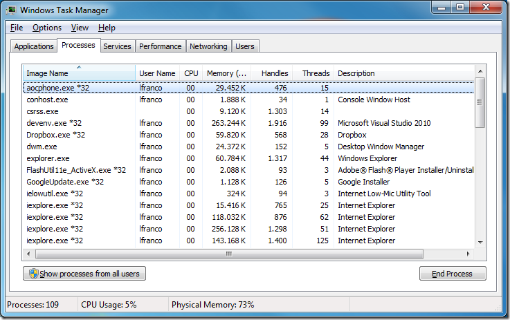
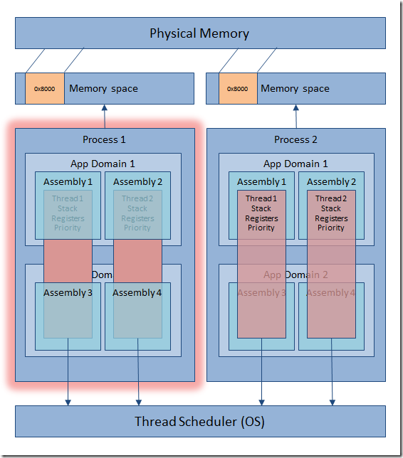
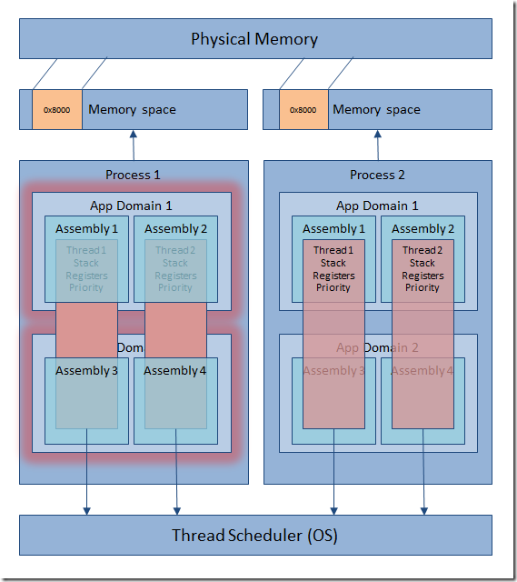
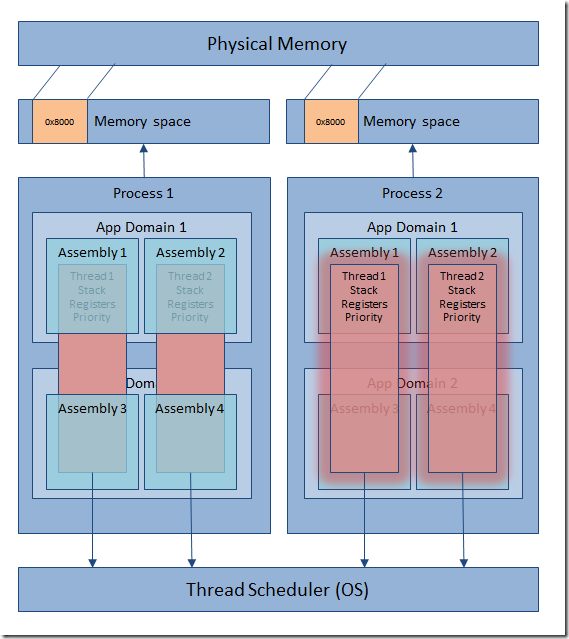
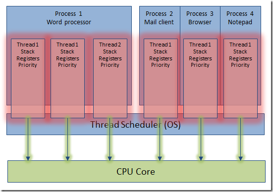
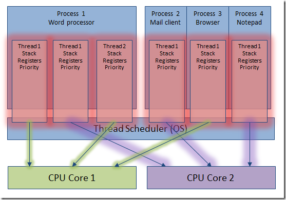
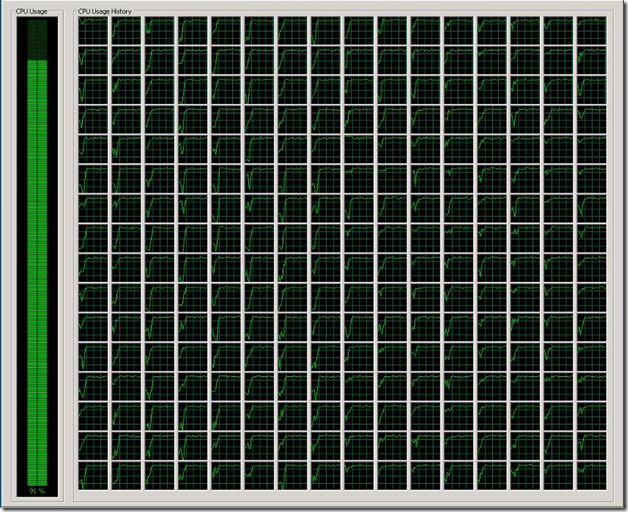

# Parallel Series: Aclarando conceptos base

[Lluís Franco](http://lluisfranco.com/about/), Microsoft MVP

http://lluisfranco.com/category/language/spanish/

http://www.linkedin.com/in/lluisfranco

https://twitter.com/lluisfranco

Cuando hablamos de programación paralela conviene tener bastante claros
algunos conceptos a nivel de sistema operativo. En este apartado
trataremos de aclarar estos términos, ya que más adelante los usaremos
frecuentemente.

Procesos (Processes)
--------------------

Toda aplicación ejecutándose en el sistema operativo existe dentro del
contexto de un proceso, aunque no todos los procesos se corresponden con
aplicaciones visibles. Basta abrir el administrador de tareas para
comprobar que la lista de procesos es bastante mayor a la de
aplicaciones. Eso es así porque pueden corresponderse a servicios,
aplicaciones no visibles o porque algunas aplicaciones -como algunos
navegadores- están diseñadas para crear varios procesos.

Un proceso proporciona los recursos necesarios para ejecutar un
programa. Contiene un espacio de memoria virtual, código ejecutable, un
contexto de seguridad, un identificador de proceso único, variables de
entorno, y al menos un thread de ejecución.

Cada proceso se inicia con un único thread, a menudo llamado thread
principal. Pero puede crear threads adicionales, que pueden ser
utilizados para encargarse de diferentes tareas.

Hacer llamadas entre procesos resulta complejo y muy costoso en términos
de rendimiento debido a que deben usarse mecanismos especiales como
pipes, sockets o llamadas RPC (Remote procedure call).

Dominios de aplicación .NET (AppDomains)
----------------------------------------

Al ser .NET una plataforma que ejecuta código administrado, los procesos
que se crean al ejecutar éstas aplicaciones son un poco diferentes, ya
que cuando se diseñó .NET una de las máximas preocupaciones fue la de
tratar de mejorar el manejo de los procesos clásico o no administrados.
Por ello se creó el concepto de dominio de aplicación, que podría
definirse como un proceso lógico dentro del proceso del sistema
operativo.

    

La gran diferencia es que dentro de un proceso podemos crear distintos
dominios de aplicación y cargar en cada uno de ellos varios ensamblados,
y aprovechar que las llamadas entre distintos dominios de aplicación y
los ensamblados que contienen son mucho más rápidas que entre procesos.
Si uno de estos ensamblado debe ser compartido entre dos dominios de
aplicaciones éste se copia en cada uno de los dominios.

De este modo, al usar los dominios de aplicación se obtiene la ventaja
de aislar el código de un proceso a otro, pero sin pagar el sobrecoste
dedicado a realizar llamadas entre procesos.

Hilos (Threads)
---------------

Un thread es la entidad dentro de un proceso encargada de ejecutar el
código. Todos los threads que contiene un proceso comparten los recursos
y memoria virtual de éste, y mantienen controladores de excepciones, una
prioridad de programación, almacenamiento local, y un identificador de
thread único.

Los threads son independientes a los dominios de aplicación, de forma
que podemos pensar en ellos como elementos transversales que pueden
saltar de un uno a otro a lo largo del tiempo. No existe ninguna
correspondencia entre el número de threads y de dominios de aplicación.

Por defecto, todos los procesos se crean con un thread por defecto
llamado thread principal, aunque en las aplicaciones .NET se crear al
menos dos, ya que es necesario al menos un segundo thread para
administrar el recolector de basura. No obstante cada proceso puede
crear un número casi ilimitado de ellos, aunque en última instancia el
sistema operativo siempre tiene la potestad de priorizar a la baja estos
hilos o incluso congelarlos.

    

Realizar cambios de contexto entre threads es muchísimo más rápido que
los cambios de contexto de proceso. De hecho en los sistemas operativos
que utilizan multitarea preemptiva (la gran mayoría hoy en día) el
sistema operativo va cediendo una pequeña fracción de tiempo a cada uno
de los threads de cada uno de los procesos cargados para que ejecuten
una porción de su código ejecutable, dando la sensación de que varias
aplicaciones se ejecutan al mismo tiempo.

Este tipo de multitarea tiene la ventaja frente a sus predecesores de
que si un proceso deja de responder, el sistema no se colapsa y puede
seguir respondiendo sin verse afectado por la caída del mismo. Esto en
la práctica ha significado la casi desaparición de las llamadas BSOD
(Blue Screen Of Death).

Multihilo (Multithreading)
--------------------------

A la capacidad que tienen los procesos de crear distintos threads
ejecutándose simultáneamente es a lo que llamamos Multithreading. Y nos
ha permitido simular la multitarea en los ordenadores personales de la
última década y media. Esto es así porque aunque físicamente sólo hay un
microprocesador, en términos del sistema operativo éste cede un periodo
de tiempo a cada thread de cada uno de los procesos cargados en el
sistema, y al repetirse una y otra vez produce la sensación de que todas
las aplicaciones se ejecutan al mismo tiempo, pero nada más lejos de la
realidad. Al menos hasta hace poco.

    

Paralelismo (Parallelism)
-------------------------

Con la aparición de los primeros microprocesadores con varios núcleos,
al fin se pudo ejecutar código en paralelo y obtener la tan deseada
multitarea real, ya que distintos threads pueden ejecutarse en distintos
cores al mismo tiempo. De modo que a más cores, más threads pueden
ejecutarse y por consiguiente más código.

    

Hace apenas cuatro o cinco años de la aparición de los primeros dual
core, sólo un poco más tarde aparecieron los quad core, y hoy en día es
bastante habitual ver estaciones de trabajo con 8 y hasta 16 cores. En
cuanto al futuro, nadie sabe al ritmo que evolucionará esta tecnología,
pero los chicos de Intel hace más de dos años ya filtraron imágenes de
un Windows Server 2008 con 256 cores. Incluso los súper ligeros
procesadores para teléfonos y tablets basados en ARM están empezando a
lanzar modelos de dos y cuatro cores.

    

Volviendo al ejemplo de los monos, resulta muy tentador pensar que si
aprovechamos toda la potencia de los nuevos núcleos podemos obtener
ganancias de rendimiento espectaculares y escribir los 200 tomos en el
tiempo que escribimos uno de ellos.

Evidentemente esta afirmación es un poco exagerada, ya que siempre va a
haber un arduo trabajo de sincronización entre los diferentes monos…
perdón threads. Con todo, la ganancia es espectacular, llegando
fácilmente a multiplicar x5 o x6 en un entorno con 8 cores. Algo nada
despreciable en según qué procesos. De modo que viendo el número de
cores hacia dónde nos movemos, a mi juicio se hace imperativo conocer
-si no dominar- la TPL.

Antes de terminar, un consejo
-----------------------------

Como se ha visto, sólo puede existir paralelismo real en una estación
con varios cores. De otro modo el código funcionará sin errores pero
solo utilizando el único core de la máquina. Así que un error bastante
común entre los desarrolladores es utilizar máquinas virtuales para
desarrollar, y olvidarnos que la mayoría no permiten especificar varios
cores. De modo que es bastante probable que alguna vez nos encontremos
refunfuñando porque un código bien escrito no obtiene ninguna ganancia
cuando lo ejecutemos dentro de una máquina virtual.

