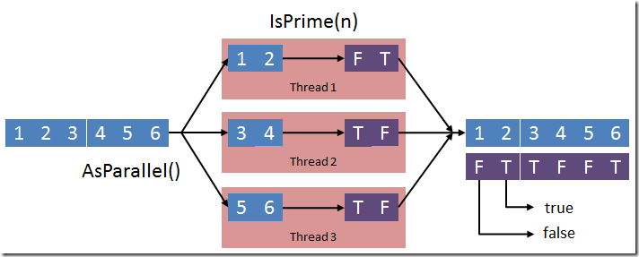
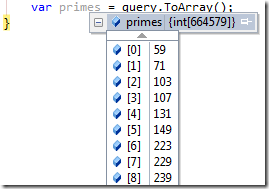
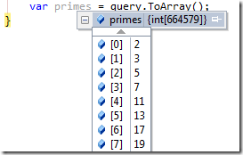
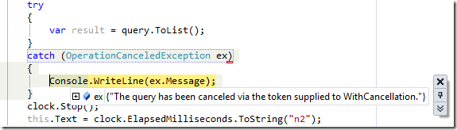

<properties
	pageTitle="Parallel Series: Parallel LINQ (PLINQ)"
	description="Parallel Series: Parallel LINQ (PLINQ)"
	services="net-dev"
	documentationCenter=""
	authors="andygonusa"
	manager=""
	editor="andygonusa"/>

<tags
	ms.service="net-dev"
	ms.workload="CS"
	ms.tgt_pltfrm="na"
	ms.devlang="na"
	ms.topic="how-to-article"
	ms.date="05/17/2016"
	ms.author="andygonusa"/>

# Parallel Series: Parallel LINQ (PLINQ)

[Lluís Franco](http://lluisfranco.com/about/), Microsoft MVP

http://lluisfranco.com/category/language/spanish/

http://www.linkedin.com/in/lluisfranco

<https://twitter.com/lluisfranco>

LINQ power!
-----------

Creo que estaremos todos de acuerdo en que LINQ ha supuesto una
revolución en la forma de desarrollar, y ha hecho que muchos
desarrolladores de otros lenguajes nos miren con cierto tono de envidia…
E incluso que otras plataformas estén haciendo serios esfuerzos para
incorporarlo en sus Frameworks :-)

Ahora, con la llegada de la Task Parallel Library, se abre un mundo de
posibilidades gracias a PLINQ, que permite -de forma extremadamente
sencilla- convertir cualquier consulta LINQ secuencial en una consulta
paralelizable, permitiendo su segmentación y ejecución en los distintos
cores en paralelo.

Es decir, cualquier consulta LINQ como ésta, en la que tenemos un array
llamado numbers y un método IsPrime que devuelve un valor boolean en
función de si un número es primo:

    var query =
        from n in numbers
        where n.IsPrime()
        select n;

Puede ser paralelizada simplemente agregando esto:

    var query =
        from n in numbers.AsParallel()
        where n.IsPrime()
        select n;

Método IsPrime:

    public static class BaseTypesExtensions
    {
        public static bool IsPrime(this int n) //1 = false, 2 = true, 3 = true...
        {
            if (n <= 1) return false;
            if ((n & 1) == 0)
            {
                if (n == 2) return true;
                else return false;
            }
            for (int i = 3; (i * i) <= n; i += 2)
            {
                if ((n % i) == 0) return false;
            }
            return n != 1;
        }

    }

Partiendo de que el array de números contiene 10 millones de números
enteros, y de que mi estación de trabajo actual tiene un procesador i7
con 8 cores, el resultado es abrumador:

*La consulta LINQ tarda  5,2 segundos frente a los 1,3 segundos de la
segunda.*

Es decir, casi 4 segundos menos o un 400% más rápido.

¿Dónde está la magia?
---------------------

La magia verdadera es que PLINQ nos abstrae de todo el proceso de
paralelización, creación de tareas, threads, sincronización y
consolidación de los datos.

Y además creo que lo hace de forma muy elegante :-)

Como ya sabemos, las consultas LINQ to objects se basan en
IEnumerable&lt;T&gt; (gracias Generics!) que expone un enumerador para
recorrer los elementos de una secuencia de elementos de tipo T. Esto
hace que todas las colecciones que puedan devolverse en este tipo de
consultas (IOrderedEnumerable, IQueryable, etc.) implementen esta
interfaz. Hasta aquí nada nuevo bajo el sol.

Sin embargo, en la consulta PLINQ al utilizar el método extensor
[AsParallel()](http://msdn.microsoft.com/en-us/library/dd413602.aspx)
estamos transformando la secuencia de entrada de
[IEnumerable&lt;T&gt;](http://msdn.microsoft.com/en-us/library/9eekhta0.aspx)
a [ParallelQuery
&lt;T&gt;](http://msdn.microsoft.com/en-us/library/dd383736.aspx)
permitiendo la segmentación de los elementos de la secuencia y
ejecutando cada uno de los segmentos en un thread distinto. Y por
supuesto, repartiendo el trabajo en los diversos cores (si los hay).

    

La secuencia de entrada se particiona y se manda por fragmentos a
distintos threads que invocan al método IsPrime devolviendo true (T) o
false (F), y posteriormente los consolida en una secuencia de salida que
puede ser consumida.

No obstante, el hecho de paralelizar el trabajo no garantiza que el
resultado sea devuelto en el mismo orden, ya que es posible que un
thread termine antes que otro y devuelva su resultado parcial antes de
lo esperado. Así que, si la ordenación de los datos de salida es
importante tenemos que ir un paso más allá.

    

Los primeros elementos deberían ser 2, 3, 5, 7… no 59 y 71 ¿?

PLINQ y la ordenación
---------------------

Para asegurar la ordenación del conjunto de resultados, basta agregar el
método AsOrdered() a la consulta. Este método asegura la correcta
ordenación, a costa de implementar una serie de mecanismos de
sincronización. Estos mecanismos, lógicamente retardan un poco el tiempo
de entrega de los resultados, pero es despreciable. En mi estación de
trabajo se arrojan unos valores de 1,311 segundos sin ordenar frente a
1,344 segundos ordenados (apenas 30 milésimas). Estos resultados son la
media de una serie de 50 mediciones, con lo que son bastante fiables.

Una vez modificada la consulta:

    var query =
        from n in numbers.AsParallel().AsOrdered()
        where n.IsPrime()
        select n;

El resultado es claro:

    

Especificar el grado de paralelización
--------------------------------------

En la mayoría de las charlas que he dado sobre la TPL se acostumbra a
preguntar respecto a funciones que acceden a recursos externos
(servicios, sockets, etc.). En estos casos aparece claramente un cuello
de botella, y no porque una función necesite hacer uso intensivo de la
CPU, sino porque debe esperar un resultado externo. Aquí suele ser
interesante especificar el grado de paralelización de deseamos. Otro
caso interesante para especificar el grado de paralelización puede ser
el típico escenario de productor/consumidor.

Es interesante notar que al especificar el grado de paralelización no
estamos forzando a que se usen n particiones, sino que simplemente
estamos especificando el valor máximo:

    var cores = Environment.ProcessorCount;
    var query =
        from n in numbers.AsParallel().AsOrdered().
            WithDegreeOfParallelism(cores / 2)
        where n.IsPrime()
        select n;

De este modo, al definir el grado de paralelización en la mitad del
número de cores del procesador nos aseguramos que (por ejemplo) podremos
tener un hilo que vaya creando elementos (productor) y otro hilo que
vaya consumiendo dichos elementos (consumidor).

Cancelación de una consulta PLINQ
---------------------------------

En ocasiones, una consulta PLINQ puede ser cancelada. Bien porque
durante el proceso se ha encontrado un error y ya no es necesario
terminar de calcular el resto de resultados, o simplemente porque ha
sido cancelada por el usuario.

Es estos casos, es necesario utilizar un token de cancelación. Este
token tiene su origen en la estructura CancellationTokenSource, que
representa ‘una potencial cancelación’ y proporciona los mecanismos para
cancelar y comprobar el estado de una tarea asíncrona, de modo que puede
utilizarse con todos los elementos de la Task Parallel Library, no sólo
con PLINQ.

A continuación, vamos a modificar el código del ejemplo que hemos usado
hasta ahora para simular un error y comprobar el funcionamiento de la
cancelación de tareas en PLINQ. Para ello lo primero que vamos a hacer
es crear una sobrecarga del método IsPrime, que reciba un parámetro de
tipo CancellationTokenSource, para poder cancelar la tarea:

    public static bool IsPrime(this int n CancellationTokenSource cs)
        {
        if (n == 1000) cs.Cancel();
        return IsPrime(n);
        }

A modo de ejemplo, cuando el número a calcular sea 1.000 cancelaremos la
tarea, de modo que no sea necesario llegar a los 10 millones. De este
modo, por un lado se lanzará una excepción y por otro el tiempo en
ejecutar la consulta PLINQ será mucho menor.

    private void plinq_cancellable()
    {
        var numbers = Enumerable.Range(1, 10000000);
        using (var cs = new CancellationTokenSource())
        {
            clock.Restart();
            var query = numbers.AsParallel().AsOrdered().
                WithCancellation(cs.Token).
            Where(p => p.IsPrime(cs));
            try
            {
                var result = query.ToList();
            }
            catch (OperationCanceledException ex)
            {
                Console.WriteLine(ex.Message);
            }
            clock.Stop();
            this.Text = clock.ElapsedMilliseconds.ToString("n2");
        }
    }

Por un lado tenemos que tener la precaución de envolver la consulta
dentro de un bloque try-catch (en este caso sólo la llamada a ToArray()
que es realmente cuando se ejecuta la consulta), y por el otro
especificamos que la consulta puede ser cancelada mediante
WithCancellation. A continuación creamos un objeto de tipo
[CancellationTokenSource](http://blogs.msdn.com/b/pfxteam/archive/2009/05/22/9635790.aspx)
para administrar la cancelación de esta consulta. Este objeto será el
que finalmente pasemos al método IsPrime() y en caso que se cancele
provocará que su propiedad
[IsCancellationRequested](http://msdn.microsoft.com/en-us/library/system.threading.cancellationtoken.iscancellationrequested.aspx)
devuelva true y que se produzca una bonita excepción de tipo
[OperationCanceledException](http://msdn.microsoft.com/en-us/library/system.operationcanceledexception(v=vs.80).aspx).

    

Limitaciones de PLINQ
---------------------

No quiero extenderme mucho más porque creo que hay material suficiente
para hacer un post más adelante sobre temas avanzados. Sin embargo
quiero dejar claro que existen algunas limitaciones en PLINQ, como el
uso de algunos operadores (Take, SkipWhile) y de las versiones indexadas
de Select o ElementAt.

Además existen otros casos en los que por cuestiones de rendimiento no
es recomendable usar PLINQ en todos los casos, debido al sobrecoste que
puede llegar a ocasionar, como el uso de Join, Union o GroupBy. Sin
embargo, trataremos éstas cuestiones más adelante.
