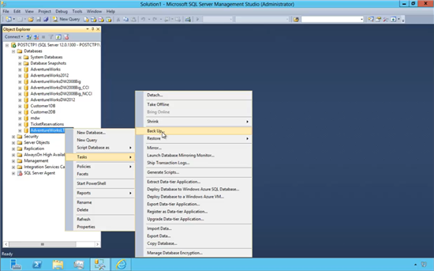
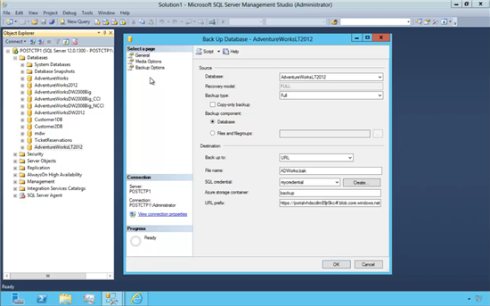
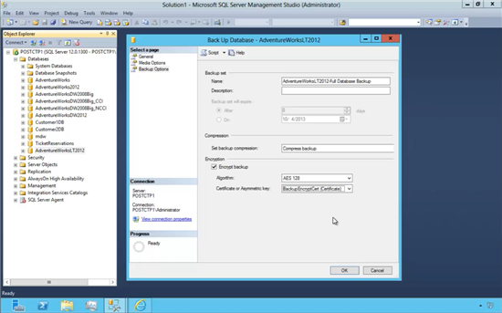
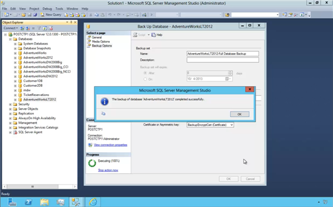
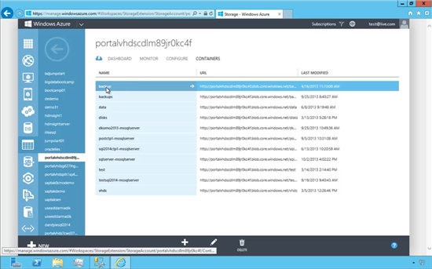
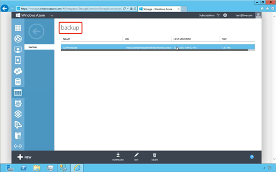

<properties
pageTitle="Cómo hacer un backup en Azure desde SSMS 2014"
description="Cómo hacer un backup en Azure desde SSMS 2014"
services="servers"
documentationCenter=""
authors="andygonusa"
manager=""
editor="andygonusa"/>

<tags
ms.service="servers"
ms.workload="SSMS"
ms.tgt_pltfrm="na"
ms.devlang="na"
ms.topic="how-to-article"
ms.date="05/12/2016"
ms.author="andygonusa"/>

#Cómo hacer un backup en Azure desde SSMS 2014

Por **Freddy Angarita**

SqlServer MVP - [Perfil MVP](https://mvp.support.microsoft.com/es-es/mvp/Freddy%20Leandro%20Angarita%20Castellanos-4028407)

<freddy_angarita@hotmail.com>

<http://geeks.ms/blogs/fangarita/default.aspx>

En el siguiente artículo presentaremos cómo realizar backups de nuestras
bases de datos directamente en la nube directamente desde Management
Studio

La importancia de ésta característica es que un backup de nuestra
importante base de datos ahora podrá estar ubicada fuera de los
servidores corporativos y si sucede cualquier tipo de desastre podremos
recuperarnos fácilmente

Para lograrlo vamos a hacer un backup de la base de datos de ejemplo
[AdventureWorks](http://msftdbprodsamples.codeplex.com/releases/view/55330) usando
Management Studio 2014. Ésta característica también está disponible para
[versiones de SQL Server 2005 y
2008](http://www.microsoft.com/en-us/download/details.aspx?id=40740)

El primer paso consiste en seleccionar la base de datos a la que
queremos hacer Backup, se oprime botón derecho en el mouse, se
selecciona Task (tareas), Back Up...

Luego, se observa que se tiene la opción para configurar una URL como
destino del BackUp, la cual es la dirección del almacenamiento que se
tenga configurado para el propósito del BackUp, una vez seleccionada la
dirección podremos configurar otros parámetros tales como las
credenciales a usar para conectarnos al almacenamiento de Azure. Es
posible seleccionar credenciales previamente creadas o crear unas
credenciales haciendo clic sobre el botón Create... 

Adicionalmente, se debe ingresar el nombre del archivo tal y como se
desea en Azure, asimismo es necesario configurar el nombre del
contenedor Azure que mantendrá la copia de la base de datos

Es sabido que los archivos de backup comprimidos ocupan mucho menos
espacio, razón por la cual SqlServer Management Studio incluye la opción
de compresión del backup directa del backup sin necesidad de ejecutar
ninguna tarea adicional, sino directamente desde el backup; asimismo se
provee un cifrado del backup con el fin que los datos estén protegidos
en la nube. Es posible especificar certificados x509 para cifrar el
Backup facilitando así el manejo del backup y su descifrado

Al hacer clic en Ok, el proceso inicia una vez se finalice la carga del
archivo a Azure se presenta una ventana similar a la siguiente

Una vez finalizado el proceso verificaremos que el archivo del Backup se
encuentre en la nube, para ello se ingresa a la cuenta de Azure usando
el portal de administración, Seleccionamos Storage, Luego se selecciona
el contenedor seleccionado en el momento de hacer el backup, que para
éste caso se llama ***Backup***. 

Al hacer clic en el contenedor podemos observar el archivo almacenado de
manera segura en la nube

 

Los backups ubicados en Azure ofrecen confiabilidad dada su triple
redundancia (garantizada por cada uno de los archivos ubicados en un
Storage Azure, el cual no sólo es a nivel local sino a nivel
geográfico), junto con las protección que ofrece el cifrado para evitar
acceso no autorizado (por si por alguna razón, y aunque es poco probable
dada la seguridad de Azure, algún usuario pudiera descargar el archivo
del backup no podría accederlo por la falta de la llave de cifrado).

**FREDDY ANGARITA**

SQL Server MVP
