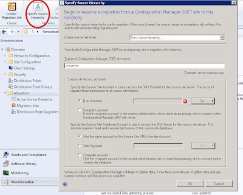
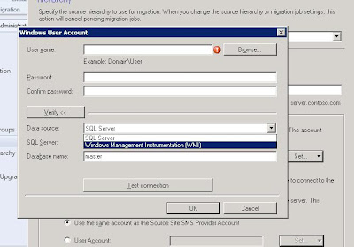
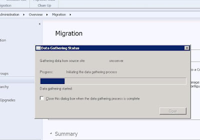
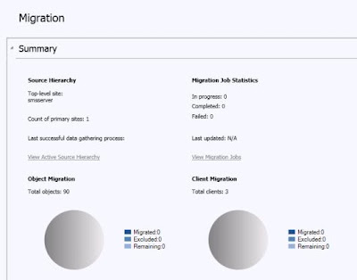
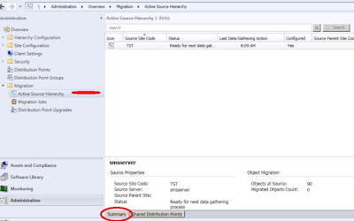
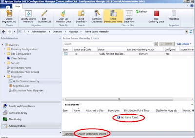
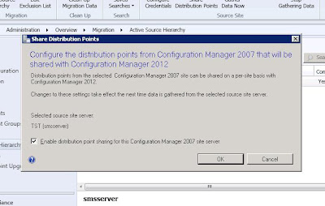
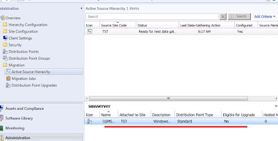

<properties
pageTitle="Guía Migración de Objetos (Conexión) desde Configuration Manager 2007 a CM 2012"
description="Guía Migración de Objetos (Conexión) desde Configuration Manager 2007 a CM 2012"
services="servers"
documentationCenter=""
authors="andygonusa"
manager=""
editor="andygonusa"/>

<tags
ms.service="servers"
ms.workload="Hyper-V"
ms.tgt_pltfrm="na"
ms.devlang="na"
ms.topic="how-to-article"
ms.date="05/12/2016"
ms.author="andygonusa"/>

#Guía Migración de Objetos (Conexión) desde Configuration Manager 2007 a CM 2012

[Marcela Berri](https://plus.google.com/102022832380927697290/posts/p/pub)

Instructor / Consultor Senior IT

MCT – MVP Configuration Manager

MCTS Server Administrator - MCTS AD 2008 - MCTS Network Inf

MCTS - Server Virtualization

MCTS W7 & Off2010 - MCTS SCCM 2012/2007 - MCTS SCOM 2007

MCITP Exchange 2010/2007 - MCTS Exch 2010/2007 - MCTS Lync 2010

Blog [IT Technology Site: *About me*](http://ittechnologysite.blogspot.com.ar/)

Para migrar objetos desde Configuration Manager 2007 al nuevo Site en
2012, existe un asistente built-in dentro de la consola que permite
elegir los objetos que se deseen pasar. Inclusive, estos Jobs pueden
correrse mas de una vez, si es que durante una migración escalonada, los
objetos origen fueron cambiados a lo largo de la transición.

Esta guía brinda los pasos necesarios para una migración completa de
objetos.

Conexión:
---------
Para poder comenzar a conectar las 2 estructuras, es necesario ejecutar
un asistente que nos pedirá toda la información necesaria para una
migración exitosa.

Dentro de la Consola 2012 en Administration, se encuentra el punto de
“Migration”, desde allí lanzamos el asistente que se encuentra arriba en
la Botonera: “Specify Source Hierarchy” (Figura 1)

En ella debemos colocar el nombre o FQDN del Site server Top de la
jerarquía.

El proceso necesita colectar información de la estructura CM 2007 y para
ello nos pide las cuentas con los privilegios necesarios que establecen
la conexión.

Es posible utilizar la cuenta de máquina del Site CM2012 o bien utilizar
alguna cuenta de AD con los privilegios necesarios. En el botón de
“Set…”, donde se coloca la cuenta, se puede realizar un TEST de conexión
tanto a la base como al WMI de la estructura 2007. (figura 2)

Una vez establecida las cuentas, el proceso de conexión hacia los datos
comienza (figura 3). Este proceso se repite por Schedule cada 4 horas
por defecto. El proceso inicial debe traer la información de todos los
objetos de la base de Configuration Manager 2007 y la lista de
Distribution Points.

Como resultado, en la consola de “Migration” se puede ver el número de
objetos que se encontraron listos para migrar. Como la conexión es
realizada al top-level Site, cualquier site por debajo es visto en la
consola.

Es posible generar otra conexiones a otros sites (todos los que se
necesiten) siempre con la lógica top to down. Es importante tener en
cuenta que estas nuevas conexiones se deben hacer después de completar
los Jobs activos, ya que ConfMgr cancelará los Jobs activos para darle
prioridad al nuevo configurado.

Dentro de la consola, en el ítem de “Active Source Hierrchy”, vemos un
resumen de la o las conexiones realizadas, su estatus y el resumen de
los objetos encontrados.

Durante lo que dure el proceso de migración, es posible que se necesite
que el contenido de paquetes que está en los Distribution Points de 2007
también esté disponible para los clientes migrados a 2012. Esto es
posible configurando “Distribution Point sharing”. Esto asegura que se
mantenga el mismo contenido para ambos clientes, hasta que se complete
la migración.

Al ser esta característica opcional, si observamos la consola (figura
6), no hay por defecto ningún DP asignado.  Si se necesita, en la
botonera, se encuentra “Share Distribution Point”, la opción que permite
habilitar dicha característica.

Aquí se verán aquellos DP de la estructura 2007 que serán compartidos.

 

Una vez finalizada y establecida la conexión, estamos listos para migrar
los objetos que se deseen. 
