<properties
	pageTitle="Instalando Forefront Security for Office Communications Server"
	description="Instalando Forefront Security for Office Communications Server"
	services="servers"
	documentationCenter=""
	authors="andygonusa"
	manager=""
	editor="andygonusa"/>

<tags
	ms.service="servers"
	ms.workload="OCS"
	ms.tgt_pltfrm="na"
	ms.devlang="na"
	ms.topic="how-to-article"
	ms.date="05/16/2016"
	ms.author="andygonusa"/>

#Instalando Forefront Security for Office Communications Server

Andrés Galván, MCITP, MCP, MCSA, MCSAS, MCTS, MCT      
  ---------------------------------------------------------------------------------------------------------------------------------------------------------------------------------------------------------------------- ------------
  Trabajando en IT desde principios de 1996, actualmente soy Administrador de Redes, empecé a trabajar con Forefront en el año 2007, unos días después de que saliera la primera versión de Forefront Client Security.

  [Blog](http://agalvanff.wordpress.com/author/agalvanked/)
  -----------------------------------------------------------------------------------------------------------------------------------------------------------------------------------------------------------------------------------
Julio 2012

Muchos me han preguntado de qué forma pueden proteger los archivos que
envían y reciben por medio Messenger, la respuesta para esto es utilizar
y configurar **Security Essentials** para el caso del uso casero y
**Forefront Endpoint Protection (FEP).**

¿Pero que pasa cuando e la oficina tenemos como solución para mensajería
instantánea **Office Communications Server 2007 (OCS)**?

Pues bien, lo que podemos hacer aquí es una combinación de **Forefront
Endpoint Protection (FEP)** con **Forefront Security for Office
Communications Server (FSOCS)**, esta solución de seguridad nos ayuda a
proteger todos los archivos que son enviados en la mensajería
instantánea, así como las conversaciones ya que podemos bloquear,
archivos, palabras y remitentes.

Esto es de gran ayuda ya que podemos evitar fuga de información,
insultos y palabras con contenido ofensivo dentro de la oficina.

¿Pero bien como se hace la instalación de este servicio? Para hacer la
instalación debemos de contar con lo siguiente.

* Tener una cuenta de Servicio en el **AD**.

* Crear una cuenta de para las notificaciones en el **AD**, esta cuenta solo es necesario que sea miembro de **Domain Users, RTCProxyUniversalServices, RTC Server Applications**.

* Posteriormente podremos hacer la descarga de **FSOCS** [*aquí*](http://technet.microsoft.com/en-us/forefront/cc514240).

* Ejecutar el **Setup**.

* Tendremos que aceptar el acuerdo de licencia, presionamos el botón de **Siguiente (Next).**

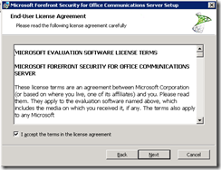

* Seleccionamos **Instalación completa (Full Instalation)** la otra opción es solo para instalar la consola de administración y damos clic en **Siguiente (Next).**

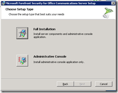

* Verificamos los requerimientos para la instalación y damos clic en **Siguiente (Next).**

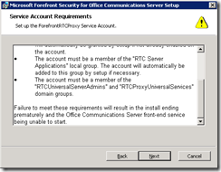

* Configuramos la cuenta de servicio, con la que se iniciara el servicio de **ForefrontRTCProxy** y damos clic en **Siguiente (Next).**

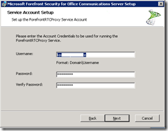

* Configuramos la cuenta de notificaciones que será de la cual nos llegaran los mensajes instantáneos cuando una política se viola, presionamos **Siguiente (Next).**

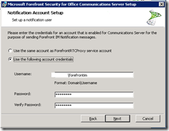

* Configuramos el **SIP URI** de la cuenta, así como el **Pool Server** y el tipo de **Transporte** (Esto dependerá de la configuración que tenga nuestro servicio de **OCS**) y presionamos **Siguiente (Next).**

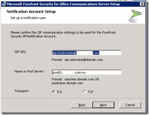

* Habilitamos el servicio para que juegue un rol de **Director** para tener un mejor proceso de análisis, presionamos **Siguiente (Next).**

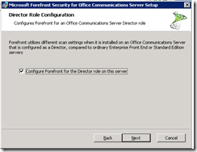

* Leemos y le damos clic en **Siguiente (Next)** en la notificación de actualización.

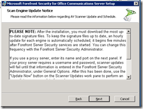

* En caso de que contemos con un servidor de **Proxy** que tengamos que configurar para la descarga de las actualizaciones de dediciones, lo configuramos y le damos clic en **Siguiente (Next).**

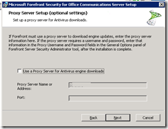

* Seleccionar la **carpeta destino de la instalación** y presionamos **Siguiente (Next)** y posteriormente presionamos el botón de **Instalar (Install).**

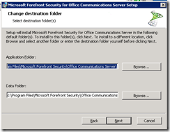

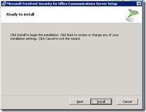

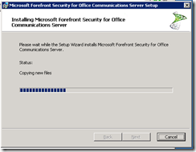

Una vez hecho esto, estaría instalado **FSOCS**, espero que les sea de
utilidad.
