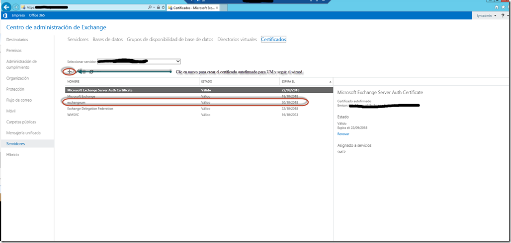
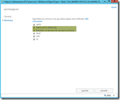
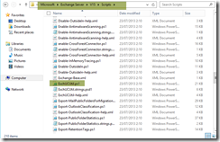
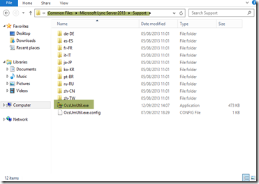
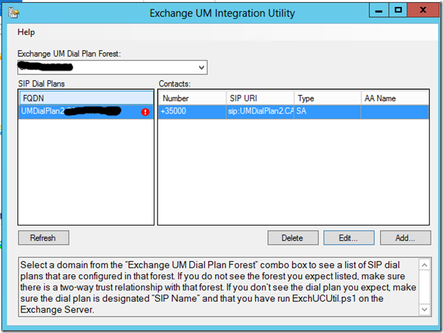
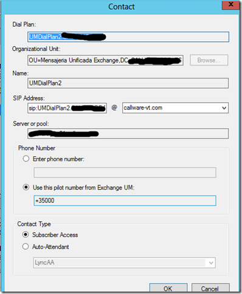
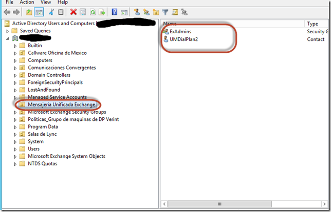
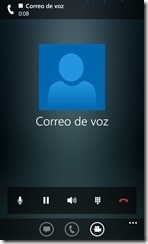
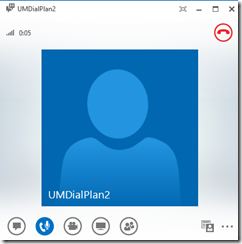

<properties
	pageTitle="Integrando Lync 2013 y Exchange 2013 para mensajería unificada y Outlook Voice"
	description="Integrando Lync 2013 y Exchange 2013 para mensajería unificada y Outlook Voice"
	services="servers"
	documentationCenter=""
	authors="andygonusa"
	manager=""
	editor="andygonusa"/>

<tags
	ms.service="servers"
	ms.workload="Lync"
	ms.tgt_pltfrm="na"
	ms.devlang="na"
	ms.topic="how-to-article"
	ms.date="05/16/2016"
	ms.author="andygonusa"/>

#Integrando Lync 2013 y Exchange 2013 para mensajería unificada y Outlook Voice

**Peter Diaz**

Profesional en el área de IT con más de 10 años de experiencia en
proyectos y consultorías de Seguridad Informática, Infraestructura y
Comunicaciones Unificadas. MVP/MCT/MCITP Lync/MAP 2012/MCC MCP ID:
3095363 MVP ID: 4039848

**LinkedIn**: <http://www.linkedin.com/pub/peter-diaz/8/61b/a72>

**Microsoft MVP **

Escenario: No hay integración con PBX, el rol de UM y OVA solo podrá ser accedido desde los clientes de Lync y teléfonos internos, sin embargo los comandos aquí reflejados realizándole algunos ajustes son compatibles si queremos realizar integración con una centralita (PBX) 
-----------------------------------------------------------------------------------------------------------------------------------------------------------------------------------------------------------------------------------------------------------------------------------

1\. Crear un certificado para el rol de Unified Messaging auto firmado y
asignarlo a nuestro servidor de Exchange 2013, que podemos realizar a
través de la consola de Exchange o por comando Exchange Managment Shell
console:

Referencia:
[*http://technet.microsoft.com/en-us/library/dn205141(v=exchg.150).aspx*](http://technet.microsoft.com/en-us/library/dn205141(v=exchg.150).aspx)

Ejecutar desde una consola con privilegios administrativos Microsoft
Exchange 2013 Managment Shell los siguientes comandos:

New-ExchangeCertificate -Services ‘UM, UMCallRouter’ -DomainName
‘\*.northwindtraders.com’ -FriendlyName ‘UMSelfSigned’ -SubjectName
‘C=US,S=WA,L=Redmond,O=Northwindtraders,OU=Servers,CN=
Northwindtraders.com’ -PrivateKeyExportable \$true

**Vía consola de Exchange:**

[*https://myservidordeexchange.com/ECP*](https://myservidordeexchange.com/ECP) 
(dirección referencial en este caso la URL es donde vosotros han
instalado el rol de Client Access)

    

Desde la consola una vez creado el certificado debemos de asignarlo al
rol de Unified Messaging, para ello le damos doble clic sobre el
certificado y lo asignamos a los servicios:

    

2\. Luego de tener nuestro certificado ya listo debemos de ejecutar desde
una consola con privilegios administrativos en el Microsoft Exchange
2013 Managment Shell los siguientes comandos, uno por uno en orden
seguido  (la línea \_\_\_\_ separa los comando a ejecutar), en este
escenario mi extensión local para el **Outlook Voice Access es el
+3500** y para el **AutoAttendant es el +35002**:

New-UMDialPlan -Name “UMDialPlan2” -Uritype SIPName -NumberofDigits 5 
-VoIPSecurity Secured -CountryOrRegionCode 34 -AccessTelephoneNumbers
+35000

New-UMAutoAttendant -Name  LyncAA -UMDialPlan UMDialplan2
-PilotIdentifierList +35002 -SpeechEnabled \$true  -Status Enabled

Set-UMCallRouterSettings -Dialplans UMDialplan2 -UMStartupMode TLS

Get-UMService | Set-UMService -DialPlans UMDialplan2 -UMStartupMode TLS

Restart-service msExchangeUM

3\. Ejecutamos el script **ExchUtil.ps1** desde una consola Exchange
Managment Shell (Powershell):

    

    

Una vez ejecutado nos creara la puerta de enlace contra nuestro servidor
de Microsoft Lync Server 2013.

4.- Ahora nos vamos a nuestro servidor FrontEnd de Microsoft Lync Server
2013 para ejecutar el **OcsUMUtil.exe** que nos creara el usuario de
Unified Messaging en nuestro directorio activo y activara la
funcionabilidad de  Outlook Voice Access basta con darle doble clic en
**OcsUMUtil.exe**, luego en Load Data, luego clic sobre el plan de
marcado creado previamente, luego clic al botón ADD y añadir el plan de
marcado con el suscriber (Outlook Voice Access) correspondiente:

**Ruta: c:\\program files\\commond files\\Microsoft Lync Server
2013\\support**

    

    

    
 

5\. Podemos comprobar que ha creado el usuario para OVA hiendo a nuestro
directorio activo en la OU que hayamos seleccionado para alojar al
usuario:

    

Nota: Importante que para realizar todo este proceso el usuario que
utilicemos tiene que tener permisos:

**Organization Managment de Exchange**

Referencia:
[*http://technet.microsoft.com/en-us/library/dd335087(v=exchg.150).aspx*](http://technet.microsoft.com/en-us/library/dd335087(v=exchg.150).aspx)

Algunas imágenes
----------------

    

Accediendo desde el cliente Lync 2013 para Windows Phone para revisar
los correos electrónicos, calendario y contactos. (Outlook Voice Access)

 

Accediendo desde el cliente Lync 2013.

 

Peter Diaz

MVP-MCT-MAP
