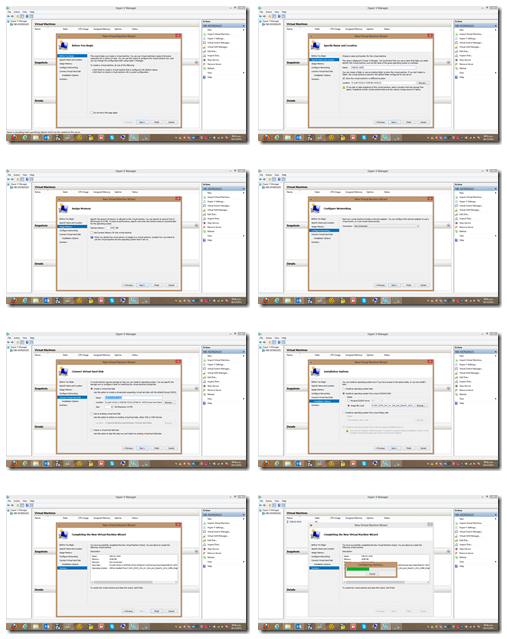
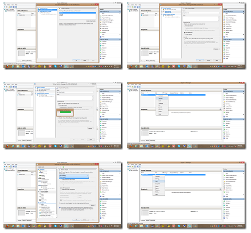
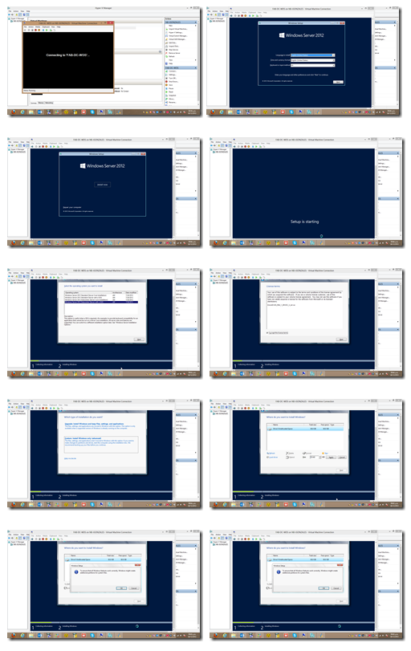
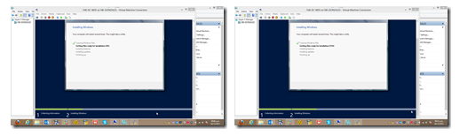
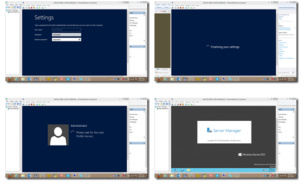
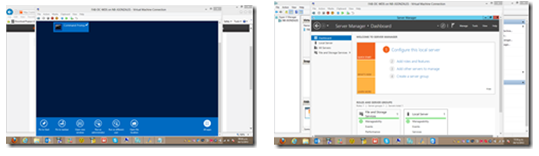

<properties
	pageTitle="LAB Virtual WS 2012 y Windows 8 [Parte 2] – Instalación y Configuración en Windows Server 2012 de los roles: Active Directory, DNS, DHCP"
	description="LAB Virtual WS 2012 y Windows 8 [Parte 2] – Instalación y Configuración en Windows Server 2012 de los roles: Active Directory, DNS, DHCP"
	services="web-dev"
	documentationCenter=""
	authors="andygonusa"
	manager=""
	editor="andygonusa"/>

<tags
	ms.service="servers"
	ms.workload="WS2012"
	ms.tgt_pltfrm="na"
	ms.devlang="na"
	ms.topic="how-to-article"
	ms.date="05/16/2016"
	ms.author="andygonusa"/>

#LAB Virtual WS 2012 y Windows 8 [Parte 2] – Instalación y Configuración en Windows Server 2012 de los roles: Active Directory, DNS, DHCP

Por [Jesús Enrique
Gonzales](http://mvp.microsoft.com/en-us/mvp/Jesus%20Enrique%20Gonzales%20Azcarate-5000714)

Blog: <http://geeks.ms/blogs/JesusGonzales/>

<http://pe.linkedin.com/pub/jesus-enrique-gonzales-azcarate/24/a41/530>

Primero empezamos creando la VM en donde instalaremos Windows Server
2012, para ésto debemos agregar el rol de Hyper-V en

Windows Server y luego procedemos a crear la máquina virtual desde cero
para continuar con la instalación del S.O.

Pueden descargar una copia trial de Windows Server 2012:
[*http://technet.microsoft.com/en-us/evalcenter/hh670538.aspx*](http://technet.microsoft.com/en-us/evalcenter/hh670538.aspx) 

Una vez configurada la VM con los recursos necesarios, agregamos el ISO
de instalación de WS 2012 y continuamos con la instalación:

Configuramos la cuenta Administrator y agregamos el password respectivo.

Luego debemos de activar nuestro WS 2012, accedemos al CMD como
administrador y ejecutamos lo siguiente:

Ejecuta CMD como Administrator

slmgr.vbs –ipk **“Ingresar product key” **

slmgr.vbs -ato

En una próxima entrega estaremos instalando y configurando nuestro
servidor WS 2012 como Active Directory, DNS y DHCP.

Nos vemos!
