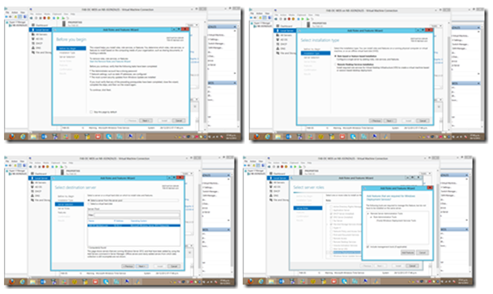
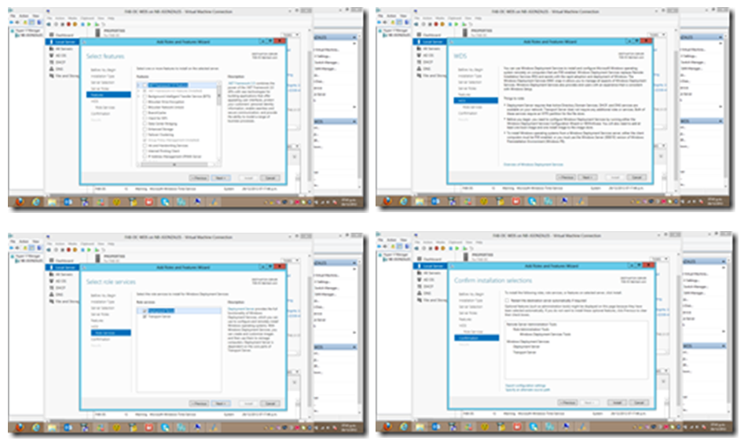
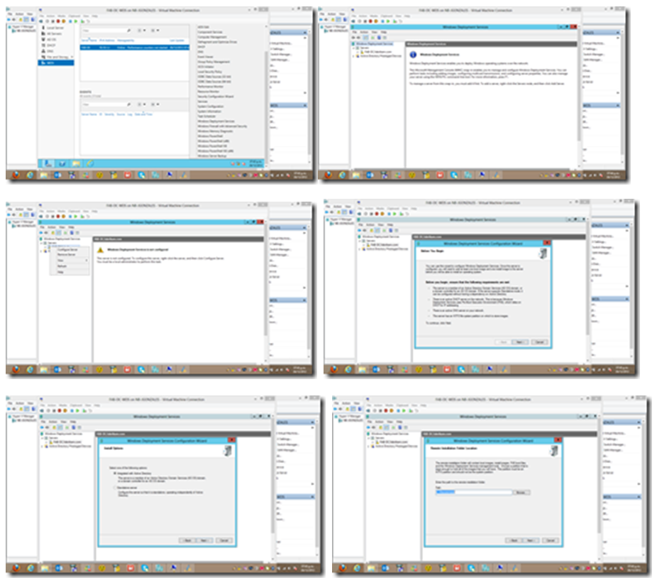
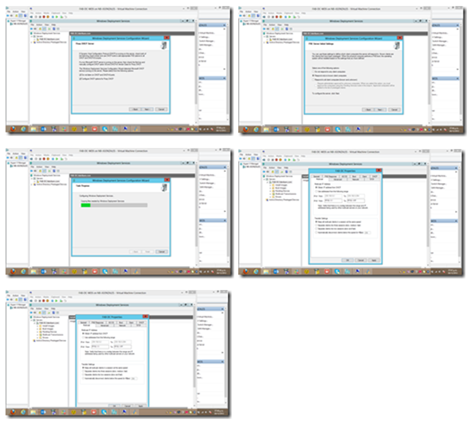

Por Jesús Enrique Gonzales

Blog: http://geeks.ms/blogs/JesusGonzales/

http://pe.linkedin.com/pub/jesus-enrique-gonzales-azcarate/24/a41/530

Continuamos con la 3ra parte de la serie, ahora vamos a realizar la
instalación y configuración de Windows Deployment Services para proceder
con el deploy de las imágenes Windows 8.

Agregando el rol de Windows Deployment Services (WDS)

1.  {width="6.5in"
    height="3.879861111111111in"}

    {width="6.5in" height="3.9125in"}

    {width="6.5in"
    height="1.9416666666666667in"}

Ahora toca configurar el Windows Deployment Services (WDS), es
importante tener en cuenta las opciones de integración con el DHCP para
que éste le asigne de forma correcta una dirección IP.

1.  {width="6.5in"
    height="5.784027777777778in"}

    {width="6.5in"
    height="5.877083333333333in"}

En la próxima entrega realizaremos la configuración para el despliegue
de las imágenes Windows 8.
