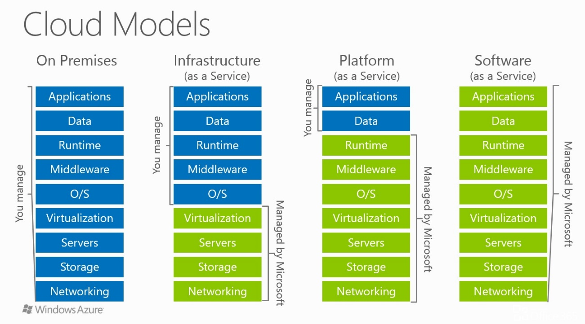
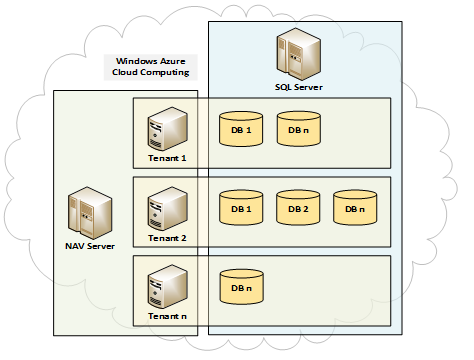
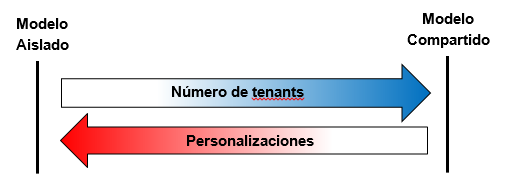
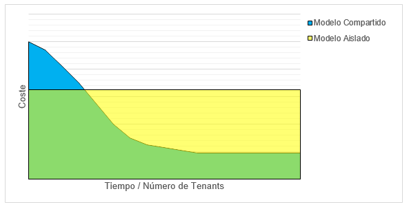

<properties
pageTitle="Microsoft Dynamics NAV en el Cloud"
description="Microsoft Dynamics NAV en el Cloud"
services="servers"
documentationCenter=""
authors="andygonusa"
manager=""
editor="andygonusa"/>

<tags
ms.service="servers"
ms.workload="Dynamics"
ms.tgt_pltfrm="na"
ms.devlang="na"
ms.topic="how-to-article"
ms.date="05/12/2016"
ms.author="andygonusa"/>

#Microsoft Dynamics NAV en el Cloud

Por **Josep Pages**

<http://geeks.ms/blogs/jpages/>

Con la llegada de Dynamics NAV (Navision) en la nube nuevos conceptos
como Software as a Service, multi-tenant, repeatability, Intellectual
Property o Pay per Use llegarán para quedarse y deberemos aprender otras
maneras de diseñar, desarrollar y desplegar el software básicamente
porque será consumido y pagado de maneras distintas a las habituales
hasta ahora.

La nube y el modelo SaaS (Software as a Service) o Software como
Servicio no es una moda, ni otra manera de pagar por el software, es un
nuevo paradigma que afecta a todos los actores implicados obligando a
replantear conceptos y maneras de hacer tradicionales, desde la
comprensión de la arquitectura cloud hasta en cómo afecta a las finanzas
de la organización.

Para empezar, veamos los 5 beneficios más destacables de la utilización
o consumo de software en la nube:

1. Se eliminan los costes iniciales de creación de la
    infraestructura propia.

2.  Acceso triple A: Anywhere, Anytime, Anydevice.

3.  Concepto de servicio de pago por uso. Se paga si se utiliza,
    sino no.

4.  No existe obsolescencia. La última versión siempre está disponible.

5.  Acceso a infraestructura de vanguardia, escalable, segura y de
    acceso global.

Infraestructura cloud
---------------------

La siguiente ilustración muestra cómo en los distintos modelos de
consumo de tecnología cloud, desde ninguno (On Premises) hasta todo
(SaaS), va desapareciendo la propia responsabilidad (en azul) de manejo
de la infraestructura y se concede (en verde) al proveedor cloud, en
este caso, Microsoft Windows Azure.

También es útil para identificar qué componentes son los que intervienen
en una infraestructura TI, aunque podría haber más, como servicios de
colas o de autentificación, entre otros.

    

 | Ejemplos de modelos tecnológicos en la nube:||
 | --------------------------|-------------------- --------|
|On Premises| Servidor (hardware) propio|
|  IaaS|Servidor (software) virtual|
 | PaaS|Role (servicio)|
 | SaaS|Microsoft CRM on line, próxima version de Dynamics NAV (Navision)|

Multi-tenant
------------

Como se puede ver en la ilustración anterior, la virtualización forma
parte de la porción física de la infraestructura y, en el caso del
cloud, el arquitecto de software no tiene acceso a este servicio. Por
tanto, a nivel lógico se trata el concepto multi-tenant, donde sí se
puede tener acceso.

¿Qué es multi-tenant? Según Wikipedia:\
“Se refiere a un principio en arquitectura de software donde una sola
instancia del software ejecutada en un servidor, sirve a múltiples
organizaciones de clientes (tenants). Multitenancy se diferencia de una
arquitectura de multiple-instancia donde cada instancia de software (o
sistema de hardware) es establecida para diferentes organizaciones de
clientes. Con una arquitectura multitenant, una aplicación de software
es diseñada para, virtualmente, separar los datos y la configuración y
cada organización cliente trabaja con una instancia virtual de la
aplicación customizada.\
Multitenancy es también nombrada como uno de los atributos esenciales
del cloud computing.\
El principio del multitenancy no es universalmente aceptado ni soportado
por la industria del software, y esto puede ser objeto de una ventaja
competitiva.”

La descripción anterior es suficientemente esclarecedora, pero las dos
últimas frases son determinantes:

- Concepto esencial del cloud computing.

- Puede ser una ventaja competitiva.

Se puede deducir entonces que Microsoft Dynamics NAV (Navision)
incorporará este concepto. No sólo eso, sino que puede llegar a ser un
aspecto fundamental, que lo diferencie de sus competidores, que lo haga
más asequible y más rentable.

Dynamics NAV (Navision) y el multi-tenant
-----------------------------------------

Actualmente Dynamics NAV (Navision) es open source. Todo el código
fuente se guarda en la misma base de datos que los datos. Si el código
fuente se modifica, cosa habitual, se pierde el código original. Una
única base de datos alberga el código fuente, estándar y modificado, y
los datos de las diferentes empresas.

En estos momentos es muy probable que no haya en todo el mundo 2
instalaciones de Dynamics NAV iguales, en diferentes organizaciones. Por
supuesto esto afecta negativamente a la hora de distribuir hot-fixes,
actualizar versiones y dar soporte a variopintas implantaciones.

Con el concepto multi-tenant se pretende dar solución a problemas
actuales. Por ejemplo, organizaciones similares podrán convivir en el
mismo tenant y realizar así economías de escala para compartir costes.\
Según Wikipedia:\
“El concepto de economías de escala sirve para el largo plazo y hace
referencia a las reducciones en el coste unitario a medida que el tamaño
de una instalación y los niveles de utilización de inputs aumentan.”

Está claro entonces que cuantas más organizaciones compartan el mismo
tenant, más asequible será, y más rentable será para el prestador del
servicio. No es de extrañar que en un futuro exista el mismo producto o
servicio a precios diferentes, en función del tipo de organización al
que vaya destinado.

Una hipotética infraestructura de Dynamics NAV (Navision) en modo
multi-tenant podría ser como en la siguiente ilustración:

    

Donde cada tenant será un Application NAV Server con un único código
fuente y podrá servir distintas bases de datos de datos, valga la
redundancia. Destacar que Microsoft SQL Server incorpora funcionalidades
para dar soporte al concepto multi-tenant, como son los Schemas o
Federations.

En cuanto al despliegue o entrega de servicios, el dominio de
herramientas como PowerShell o Microsoft System Center será clave.

IP y Repeatability
------------------

La IP (Intellectual Property) o Propiedad Intelectual junto con el
concepto Repeatability o Repetitividad cobrará más importancia que
nunca.

Actualmente los ISV, en el ámbito de Microsoft Dynamics NAV, en muchas
ocasiones prestan más atención a los servicios de valor añadido
(personalizaciones) que al número de veces que su IP es ejecutada por
alguna organización.

En este nuevo paradigma se elimina la necesidad de realizar complejas
adaptaciones y es preferible disponer de un abanico de soluciones donde
el cliente final pueda escoger y renunciar a ciertas personalizaciones a
cambio de un menor coste.

  |Cambio en la consultoría de software:||
  |------------|--------------------|
  |La consultoría ahora|Adaptar Dynamics NAV a la empresa|
  |La consultoría en el futuro|Adaptar la empresa a Dynamics NAV|

Según el libro Repeatability: Build Enduring Businesses for a World of
Constant Change de Chris Zook and James Allen (Harvard Business Review
Press, 14 de febrero de 2012):\
“La complejidad es un asesino silencioso del crecimiento rentable. Las
empresas de éxito crecen manteniendo la simplicidad en su núcleo. No se
apartan de su modelo de negocio en la búsqueda de la renovación radical.
En su lugar, construyen un modelo de negocio repetible que produce la
mejora continua y les permite adaptarse rápidamente a cambios sin
sucumbir a la complejidad.”

Al estar Dynamics NAV (Navision) en una plataforma de computación de
primer nivel es probable que incluya más y mejores herramientas de
integración, con lo que las posibilidades de combinar aplicaciones que
“están cerca” abren un mundo a explorar. En Dynamics NAV 2013 tenemos un
claro ejemplo como es la integración con el servicio ACS, un servicio
alojado en Windows Azure y que permite la autentificación de usuarios
con múltiples servicios de autentificación como Facebook, Google o
Yahoo.

Costes
------

Los factores que hacen que el modelo se acerque más al lado aislado y
caro (en rojo) y se aleje del lado repetible y barato (azul) son:

    

Lo que indica que el modelo repetible es más económico cuantos más
clientes lo utilicen y cuantas menos personalizaciones existan.

En el caso del modelo compartido los costes disminuyen casi a la mitad
en cuanto se incorpora el segundo cliente y van decreciendo de forma
significativa hasta encontrar un umbral a partir del cual ya no permite
la incorporación de más clientes.

    

Finalmente en el siguiente cuadro se comparan los principales criterios
a tener en cuenta a la hora de afrontar una inversión a tenor de las
alternativas más comunes:

|||||
|------|-----|------|------|
| CRITERIO | RENTING / ALQUILER |    LEASING    |  COMPRA FINANCIADA|
|  ECONÓMICO       |                       Utiliza bien sin desembolso  |                                          Utiliza bien sin desembolso |                                                                                                                       Propiedad del bien financiada|
 | FISCAL       |                          Gasto totalmente deducible         |                                    No todo el gasto es deducible, sólo una parte        |                                                                                              Deducibles hasta una cuota|
 | FINANCIERO       |                      Mayor liquidez, es gasto    |                                           Menor liquidez, aparece en pasivo               |                                                                                                   Menor liquidez, aparece en pasivo|
 | TÉCNICO      |                          Permite cambios continuos de equipo      |                              Permite cambios continuos de equipo                |                                                                                                Inversión CAPEX|
 | CONTABLE     |                          OPEX. No figura en el inmovilizado ni pierde vida útil. Es un gasto.  | Figura en balance como activo y por la parte de la deuda como pasivo. La amortización es acelerada y da lugar a diferencias temporales en el IS. |  Figura en balance como activo y por la parte de la deuda como pasivo.|
 | OPCION DE COMPRA     |                  No en principio       |                                                 Por valor residual desde el inicio              |                                                                                                   Implícita|
 | MANTENIMIENTO   |                       Incluido en cuota    |                                                  No      |                                                                                                                                           No|
 | DURACION                  |             Corto plazo     |                                                       Medio/largo plazo  |                                                                                                                                Medio/largo plazo|
 | PRORROGA      |                         Si                                                                |     Si   |                                                                                                                                              No|
 | COMPUTA EN CIRBE     |                  No                                                               |      Si   |                                                                                                                                              Si|
 | DISMINUYE CAPACIDAD DE ENDEUDAMIENTO |  No                                                              |       Si         |                                                                                                                                        Si|
 | PROPIEDAD DEL BIEN   |                  Proveedor        |                                                      Proveedor |                                                                                                                                         Empresa|
 
  
  
  

Conclusiones
------------

Las caras y complejas instalaciones de infraestructuras en TIC se
reemplazarán paulatinamente por servicios cloud, donde el coste es uno
de los factores clave, consecuentemente los proveedores VAR deberán
abandonar el modelo actual, básicamente el de adaptar software para el
cliente final, para centrarse en el desarrollo (IP) o distribución de
múltiples y sencillas soluciones ad hoc y pensando en la repetitividad
(repeatability) para lograr volumen y por tanto mejor coste para el
cliente y mayor rentabilidad para el proveedor.
