<properties
pageTitle="Paso a Paso -  Reporting Services en Azure"
description="Paso a Paso -  Reporting Services en Azure"
services="servers"
documentationCenter=""
authors="andygonusa"
manager=""
editor="andygonusa"/>

<tags
ms.service="servers"
ms.workload="RS"
ms.tgt_pltfrm="na"
ms.devlang="na"
ms.topic="how-to-article"
ms.date="05/12/2016"
ms.author="andygonusa"/>


#Paso a Paso -  Reporting Services en Azure


Por FREDDY LEANDRO ANGARITA C.

SQL Server MVP - [Perfil MVP](https://mvp.support.microsoft.com/es-es/mvp/Freddy%20Leandro%20Angarita%20Castellanos-4028407)

<freddy_angarita@hotmail.com>

<http://geeks.ms/blogs/fangarita/default.aspx>


Una vez se adquiere la cuenta de Azure, bien sea de prueba o paga se
puede crear un servidor de Base de datos

Creando el Servidor
-------------------

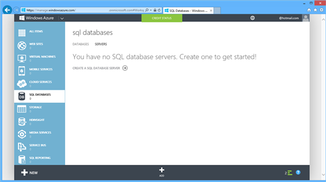
    

Éste paso es opcional para usar Reporting Services, pero para éste
artículo usaremos la base de datos SQL de Azure

Para crear el servidor debemos configurar un usuario Administrador con
el que luego nos conectaremos a la instancia de SQL Server, es
importante seleccionar la región correcta (la más cercana) para
disminuir latencia en el servicio

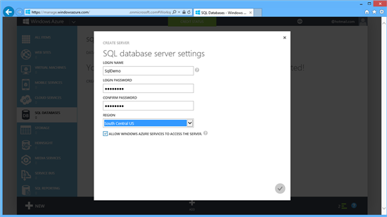
    

Una vez está todo configurado Azure realiza el proceso de creación de
servidor, presentado en la siguiente imagen:

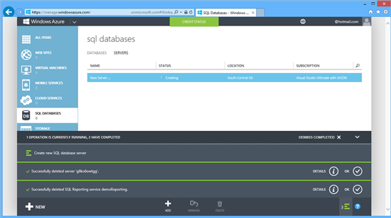
    

Una vez finalizada la creación se ve una pantalla como la presentada a
continuación:

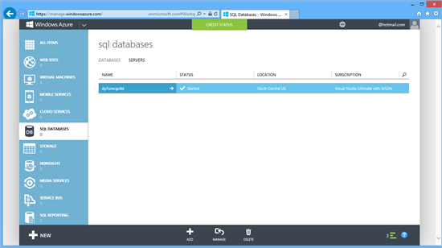
    

Para poder acceder a la base de datos remotamente se debe permitir el
acceso, para cual se necesita crear una regla en el Proxy Azure, para
crearla fácilmente se hace clic en Manage

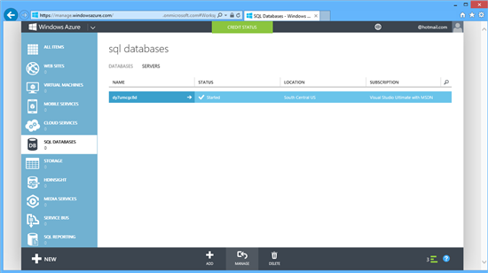
    

Azure advierte que no tiene permisos y que debe crear una regla para
permitir el acceso y ofrecerlo automáticamente:

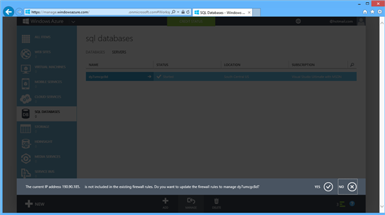
    

Dado que seleccionamos la opción de administración ofrecer ir a éste
sitio, pero tan solo queremos crear la regla, por lo que seleccionamos
NO


    

Para el ejemplo que trabajaremos, usamos la base de datos de ejemplo
encontrada en
<http://msftdbprodsamples.codeplex.com/releases/view/37304>

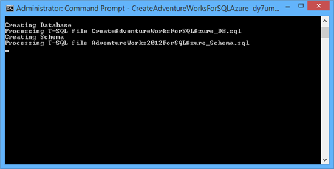
    

 La instrucción Usada para subir la base de datos es:

    CreateAdventureWorksForSQLAzure

    <NombreServidorDB>.database.windows.net
    SqlDemo@<NombreServidorDB> Pa$$w0rd

 

SERVIDOR DE REPORTING SERVICES
------------------------------

Crearemos el servicio de Reporting Services

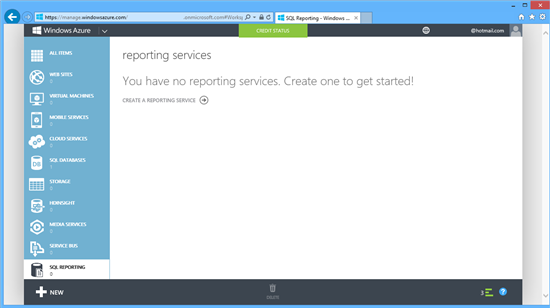
    

 

Al hacer clic en Crear se presenta la siguiente pantalla:

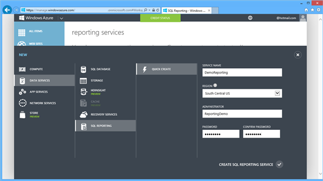
    

Luego de diligenciar el formulario inicia el proceso de creación del
servidor

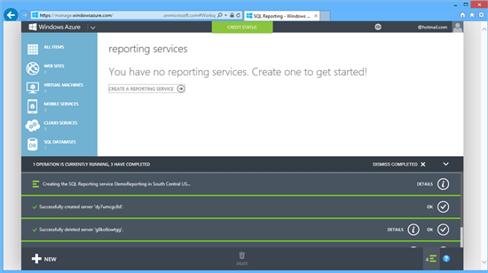
    

Al finalizar, se puede revisar el servidor al hacer clic en la columna
WebService URL

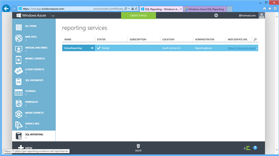
    

El Servicio solicita credenciales:

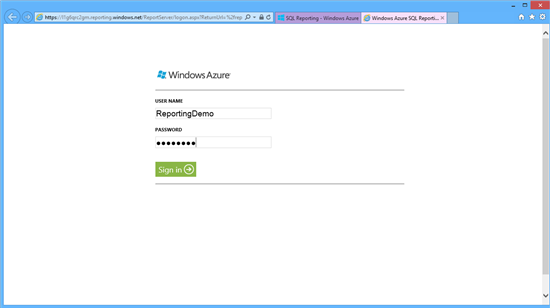
    

Se presenta la página básica del servicio:

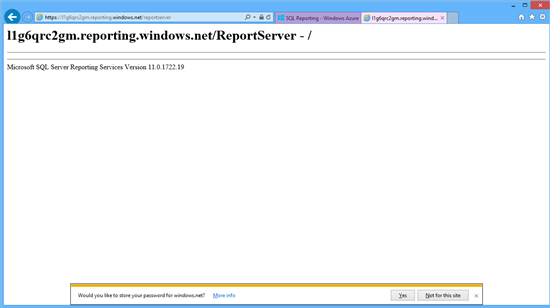
    

 

 

CONECTÁNDOSE DESDE SSMS
-----------------------

Éste paso es opcional

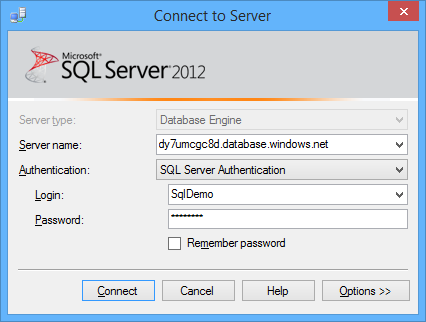
    

Ésta es la forma en la que se visualiza la base de datos Azure desde
SSMS

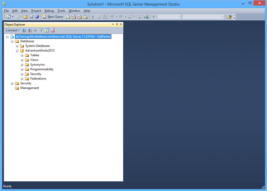
    

 

 

REPORT BUILDER
--------------

Para crear un reporte podemos utilizar Visual Studio o Report Builder,
en éste caso usaremos Report Builder

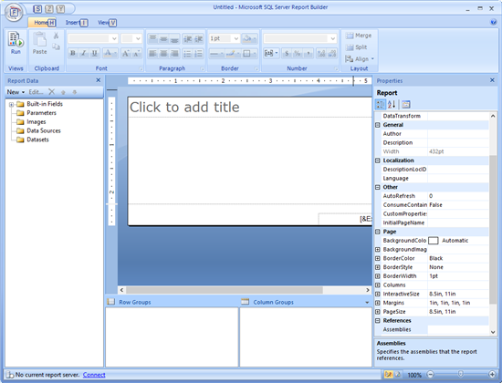
    

Nos conectaremos al Servidor

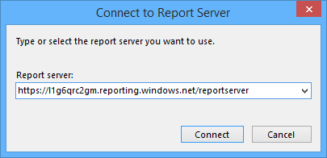
    

Ingresamos las credenciales de Reporting

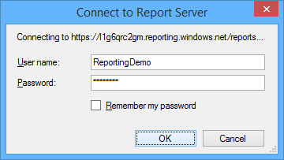
    

Y posteriormente crearemos el DataSource que usaremos para el reporte

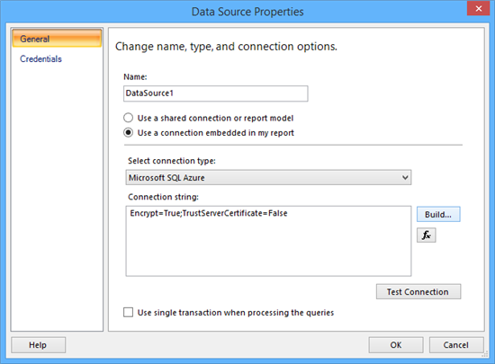
    

Conectándose a Base de Datos Remota (importante escribir el nombre de la
base de datos a mano)

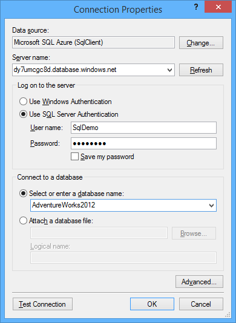
    

Conexión Exitosa

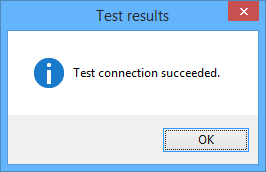
    

Visualizamos la cadena de conexión

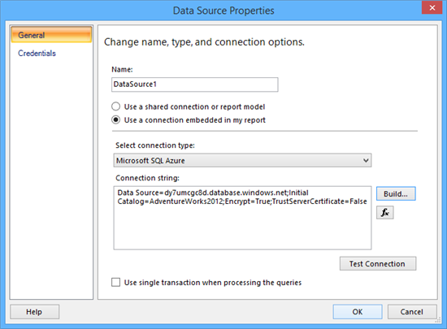
    

Luego, procedemos a crear el DataSet con el que vamos a desarrollar el
reporte

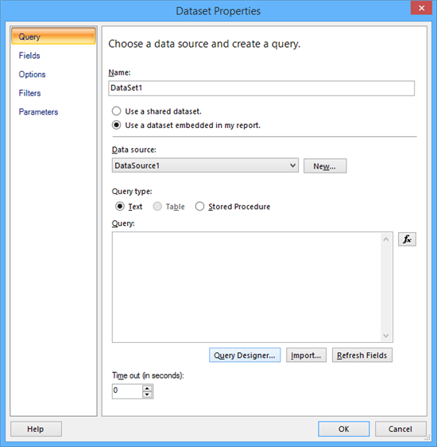
    

Clic en Query Designer (solicita credenciales)

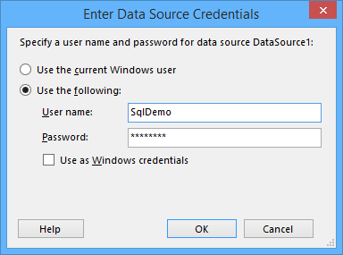
    

Definimos el query a usar

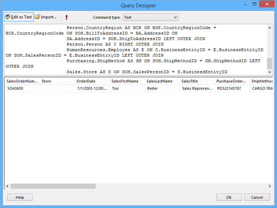
    

El Query usado es:


``` SQL
SELECT SOH.SalesOrderNumber, S.Name AS Store, SOH.OrderDate, C.FirstName AS SalesFirstName, C.LastName AS SalesLastName, E.JobTitle AS SalesTitle, SOH.PurchaseOrderNumber, SM.Name AS ShipMethod, BA.AddressLine1 AS BillAddress1, BA.AddressLine2 AS BillAddress2, BA.City AS BillCity, BA.PostalCode AS BillPostalCode, BSP.Name AS BillStateProvince, BCR.Name AS BillCountryRegion, SA.AddressLine1 AS ShipAddress1, SA.AddressLine2 AS ShipAddress2, SA.City AS ShipCity, SA.PostalCode AS ShipPostalCode, SSP.Name AS ShipStateProvince,SCR.Name AS ShipCountryRegion, PPP.PhoneNumber AS CustPhone, CC.FirstName AS CustFirstName, CC.LastName AS CustLastName
FROM Person.Address AS SA INNER JOIN
    Person.StateProvince AS SSP ON SA.StateProvinceID = SSP.StateProvinceID INNER JOIN 
    Person.CountryRegion AS SCR ON SSP.CountryRegionCode = SCR.CountryRegionCode RIGHT OUTER JOIN
    Sales.SalesOrderHeader AS SOH LEFT OUTER JOIN
    Sales.Customer AS SC ON SOH.CustomerID = SC.CustomerID LEFT OUTER JOIN 
    Person.Person AS CC ON SC.PersonID = CC.BusinessEntityID INNER JOIN 
    Person.PersonPhone AS PPP ON CC.BusinessEntityID = PPP.BusinessEntityID LEFT OUTER JOIN 
    Person.Address AS BA INNER JOIN 
    Person.StateProvince AS BSP ON BA.StateProvinceID = BSP.StateProvinceID INNER JOIN 
    Person.CountryRegion AS BCR ON BSP.CountryRegionCode = BCR.CountryRegionCode ON SOH.BillToAddressID = BA.AddressID ON SA.AddressID = SOH.ShipToAddressID LEFT OUTER JOIN 
    Person.Person AS C RIGHT OUTER JOIN
    HumanResources.Employee AS E ON C.BusinessEntityID = E.BusinessEntityID ON SOH.SalesPersonID = E.BusinessEntityID LEFT OUTER JOIN 
    Purchasing.ShipMethod AS SM ON SOH.ShipMethodID = SM.ShipMethodID LEFT OUTER JOIN
    Sales.Store AS S ON SOH.SalesPersonID = S.BusinessEntityID
```

Establecemos un nombre al Dataset

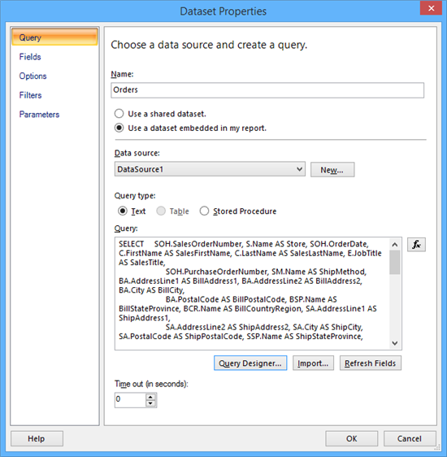
    

 

Creamos el reporte:

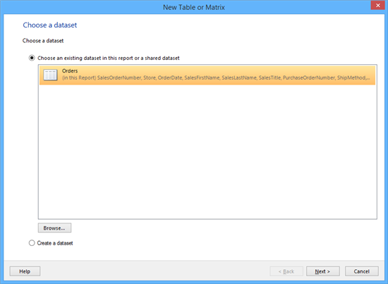
    

Una vez diseñado:

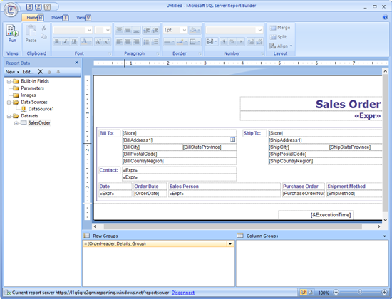
    

Ejecutamos el reporte localmente

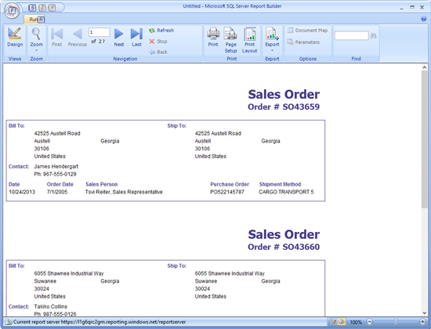
    

Posteriormente guardamos el reporte en el  servidor

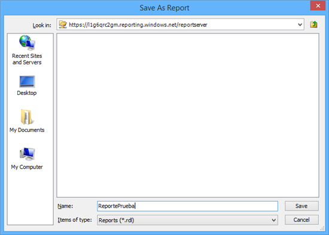
    

Reporte Publicado en Reporting Services Azure

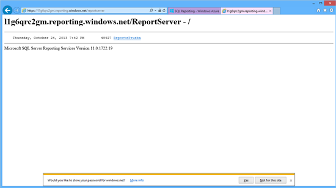
    

Visualización de reporte

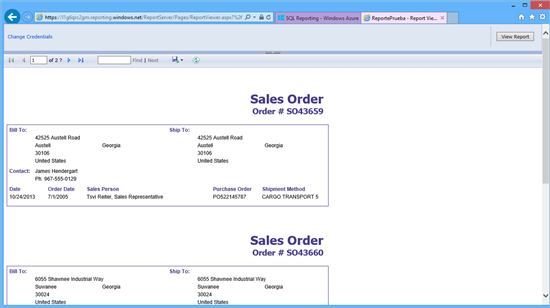
    

Observamos el campo que dice cambio de credenciales en caso de tener
varios usuarios y varios contextos de seguridad

Reporting Services en Azure permite la conexión desde varios orígenes de
datos, es importante tener en cuenta la latencia

También se recomienda que el desarrollo de los reportes (en la medida de
lo posible se haga con orígenes de datos remotos)
