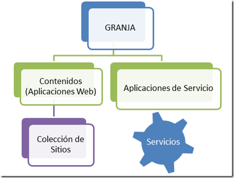
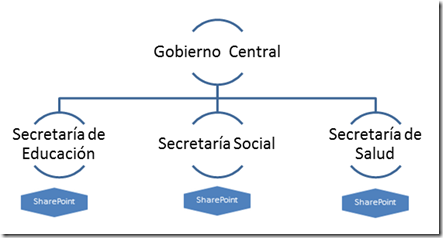
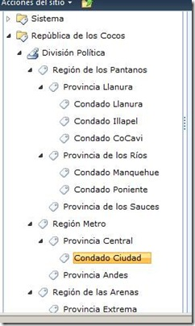
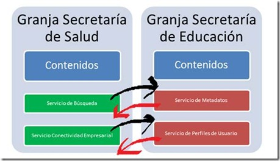
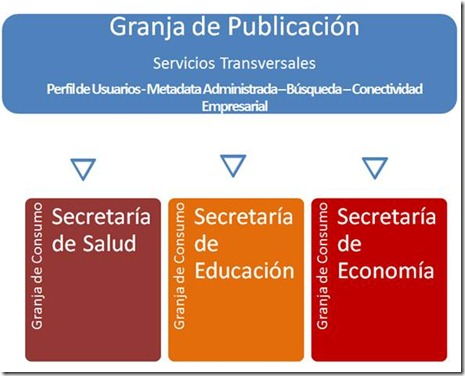

#Servicios InterGranjas para Gobiernos Corporativos y Administrativos con SharePoint 2010

Julio 2012

Por **Juan Andrés Valenzuela**
                                      
MVP y Director de MOSSCA.org (Grupo latinoamericano de Usuarios de SharePoint). Periodista y Consultor de Soluciones Colaborativas y ha desarrollado diversos proyectos SharePoint desde su versión en Team Services. Especialista en Usabilidad, y Experiencia del Usuario, es diplomado en Multimedia e Internet aplicado a la Educación, Comunicación y Negocios. Actualmente es Consultor Senior IW y además es Microsoft Certified Technology Specialist de MOSS 2007.

#### Las aplicaciones de servicios intergranjas, nos entregan la gran potencialidad de poder optar por una implementación de Granja de Servicios, que esté disponible para proveer las funcionalidades de muchas granjas de contenidos necesarias en un gran Holding Empresarial o un Gobierno Administrativo Nacional. La eficiencia de la administración de los recursos tecnológicos como humanos; como también la eliminación de la “redundancia funcional” son claves para optar a este tipo de arquitectura, que también apoyan la Gestión del Conocimiento de las Organizaciones.

Las aplicaciones de servicio para SharePoint 2010 son tan trascendentes
para la soluciones de contenido, que sin estas aplicaciones (desde un
visto de muy personal), las aplicaciones de contenido de SharePoint
serían casi, simples repositorios de datos.

En el contexto del ecosistema de Granja SharePoint, las Aplicaciones de
Contenidos se van desencadenando en una jerarquía desde la Aplicación
Web, para seguir con la Colección de Sitio que contiene finalmente el
contenido de los usuarios. A la par de este modelo jerárquico de
contenidos, se encuentran las Aplicaciones de Servicio. Metafóricamente,
estas aplicaciones de Servicio son verdaderos “Engranajes” de esta
“Máquina” llamada SharePoint y que permite el proceso, movimiento,
interacción, integración, entre otros tantos verbos, para las soluciones
de contenido.

    

Ilustración 1

Esta arquitectura fundamental de la Granja SharePoint, hace necesario
que las implementaciones de SharePoint supongan un tiempo, análisis y
dedicación bastante extensa para disponer estas aplicaciones de
servicio; que dependiendo de la necesidad del negocio del cliente,
tendrán una forma de configuración determinada.

Esto también, con fines de la administración posterior, significará un
esfuerzo para mantener estas aplicaciones de servicio, en un correcto
estado y funcionamiento. Como se trata de elementos de la arquitectura
que no están a la “luz” de los usuarios – como sí lo están los
contenidos – es más fácil caer en el descuido o la poca dedicación de su
monitoreo, mantención, respaldo y administración en general.

“N” Granjas, “N” Administraciones de Servicios
----------------------------------------------

Cuando a esto sumamos, que en diferentes corporaciones globales, o
incluso Gobiernos Administrativos, pueden existir diferentes
implementaciones de Granjas SharePoint, el esfuerzo de la Administración
sobre las Aplicaciones de Servicio también debe extenderse.

Tan sólo imaginemos una gran organización distribuida geográficamente,
ya sea una gran corporación o un Gobierno que tiene diferentes
instalaciones de SharePoint dependiendo de la repartición pública; ya
sean Secretarías, Ministerios, Institutos u otras Instituciones;
requieren necesariamente de varias instalaciones de Granja de SharePoint
para cumplir con sus necesidades de Negocio individual. Esta misma
nomenclatura se debe repartir también para las diferentes aplicaciones
de Servicio que existen en cada una de estas granjas.

    

Ilustración 2

En cada una de estas Granjas de SharePoint, se deben definir los
esfuerzos para Administrar las Aplicaciones de Servicio, que en último
objetivo, está cumpliendo con una necesidad de negocio única.

Dos casos puntuales pueden ser:

1\. El uso del servicio de Metadata Administrada, para disponer de los
términos y jerarquía de la división política del país, que generalmente
se puede dividir en Regiones, Estados, Provincias, Comunas, Condados,
etc. Pero que finalmente es una disposición de términos jerarquizados,
que siempre tendrá “una sola versión oficial”. (Ver ilustración 3)

    

2\. Diferentes Servicios de Búsqueda en las diferentes reparticiones, que
finalmente tienen Orígenes de Contenido en Común.

En ambos casos, las Aplicaciones de Servicios en las diferentes Granjas
de las Reparticiones Gubernamentales, requerirán tener configurado y
disponible este servicio; y como se trata de una necesidad en múltiples
instituciones, cada configuración será redundante.

Una Solución Global
-------------------

Independiente a que las Soluciones de Contenido, requieren de una
administración en cada institución, existen casos, como los
ejemplificados anteriormente, que podrían estar centralizados en una
instancia de servicio y no redundantes.

Aquí aparece la tesis ya mencionada en la Introducción de este artículo,
en la cual podemos aprovechar las condiciones y avances de arquitectura
tecnológica que han logrado las Aplicaciones de Servicio en SharePoint
Server 2010.

Como definición base de la plataforma de SharePoint 2010, existen
ciertas Aplicaciones de Servicio que dada su arquitectura pueden estar
disponibles para ser publicadas y compartidas con otras granjas de
SharePoint. La concepción de esta cualidad es la misma que se ha estado
planteando en este artículo, y que es poder optimizar los recursos
(físicos, administrativos y humanos) y evitar la redundancia de
conocimiento. Estos servicios son: Conectividad a datos empresariales
(BCS), Metadatos administrados (Managed Metadata), Sincronización de
Perfiles de Personas (User profile Services), Búsqueda, Almacenamiento
seguro de Accesos (Secure Store Services) y Web Analytics.

Esta capacidad es posible implementarla de dos formas diferentes,
considerando la posibilidad de “compartir” el Servicio entre diferentes
Implementaciones de Granja.

***Escenario A***: Dos granjas corporativas o Departamentales, con
soluciones de contenidos poseen diferentes servicios, que entre ellos no
se redundan, y por lo contrario comparten los servicios no disponibles
en la “granja vecina”.

    

***Escenario B***: Este segundo escenario permite centralizar los
servicios que son transversales a la organización desde una sola Granja
dedicada exclusivamente a los Servicios. A este tipo de granja se le
llama *Granja de Publicación*. Mientras tanto, aquellas granjas de
contenido, donde se encuentran las soluciones de negocio son llamadas
*Granjas de Consumo*.

    

Consideraciones de las Granjas de Publicación de Servicios
----------------------------------------------------------

Ahora que hemos logrado evidenciar la gran oportunidad que tiene
trabajar con una arquitectura de Servicios de SharePoint, en esta
nomenclatura; debemos recalcar algunas consideraciones que debemos tomar
para llevar a cabo esta decisión.

a\) *Intercambio de certificados*: Para lograr la “confianza” entre las
Granjas de Publicación y Consumo, necesariamente debemos generar
intercambio de certificados de confianza que permitan la comunicación
fluida entre ambas entidades. Para esto se debe contar con un
certificado raíz y un certificado de token de seguridad (STS). El
mecanismo de copia, exportación e implementación de estos certificados,
requiere de privilegios que permitan la interacción con PowerShell,
método con el cual se realizarán las actividades. (El detalle de estas
actividades, se encuentra publicado en las Bibliotecas Técnicas de
TechNet <http://technet.microsoft.com/es-ar/library/ee704552.aspx> )

b\) *Publicación del servicio en la Granja de Publicación*: Esto
permitirá identificar individualmente la Aplicación de Servicio que
requerimos consumir desde la Granja de Contenidos (de Consumo). Si la
Aplicación de Servicio no es publicada, sólo estará disponible en la
propia Granja de Publicación, y para nuestro objetivo, no es viable.
Esta actividad requiere necesariamente de privilegios de Administrador
de la Granja. (El detalle de estas actividades, se encuentra publicado
en las Bibliotecas Técnicas de TechNet
<http://technet.microsoft.com/es-ar/library/ee704545.aspx> ).

c\) *Conexión desde la Granja de Consumo*: Esta actividad permitirá, que
desde nuestra Granja de Consumo (Contenidos), podamos generar la
asociación con el servicio recién publicado desde la Granja de
Publicación. Para este tipo de actividades, igual que el caso anterior,
requiere ser parta de los Administradores de la Granja. Además contamos
de la posibilidad de generar las actividades conducentes a la conexión,
a través de Administración Central y PowerShell. (El detalle de estas
actividades, se encuentra publicado en las Bibliotecas Técnicas de
TechNet <http://technet.microsoft.com/es-ar/library/ee704558.aspx> ).

d\) *La nueva Aplicación de Servicio en un Grupo Proxy de la Granja de
Consumo*: Tal como es requerido en una Aplicación de Servicio regular en
una granja simple, la Aplicación de Servicio “intergranja” debe ser
considerada en un Grupo Proxy de la Granja de Consumo, de tal manera que
pueda satisfacer los requerimientos de una Aplicación Web y todos los
contenidos que están bajo ella. (Esta operación también es posible verla
en detalle en la documentación Technet correspondiente
<http://technet.microsoft.com/es-ar/library/ee704550.aspx>).

Conclusión
----------

Las aplicaciones de Servicio intergranjas, son una posibilidad
tecnológica bastante potente e interesante de implementar en grandes
corporaciones o administraciones de gobiernos políticos de una Nación o
Estado. Cada día, las implementaciones de Granja de SharePoint 2010,
ganan terrenos en estos dos ámbitos de organización, y no es un secreto
que la definición de multigranjas de contenidos, dependiendo de
sucursales, matrices (por el lado de corporaciones empresariales) y
secretarías, ministerios, entre otros (por el lado de Gobiernos
Nacionales); son una realidad recurrente. Por lo mismo, se vuelve
forzoso para la eficiencia de la administración de los recursos de estas
organizaciones, entender las capacidades de esta arquitectura.

Disponer de una Granja de Publicación de Servicios para una gran
Organización, puede ser tan trascendente, que impactará directamente
sobre el éxito y eficiencia del resto de las Granjas de Contenido
disponibles en todo el ecosistema de SharePoint en aquella corporación.
Los esfuerzos de estas Granjas de Contenido (Consumo) se centrarán en la
administración y mantención del objetivo directo de éstas, pudiendo
obviar y confiar la administración de los servicios a una entidad
superior, que si puede poseer los recursos técnicos y humanos; evitando
así la duplicidad de esfuerzos.

La duplicidad de esfuerzo de administración y la adecuada Gestión del
Conocimiento Organizacional, dependen de aprovechar estas cualidades que
SharePoint Server 2010 nos ofrece.

