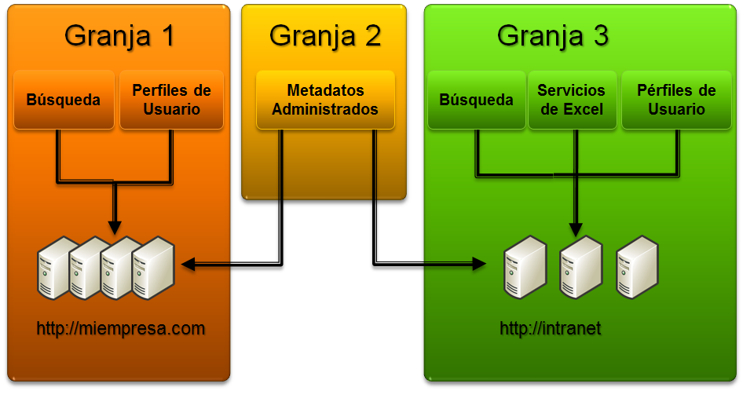
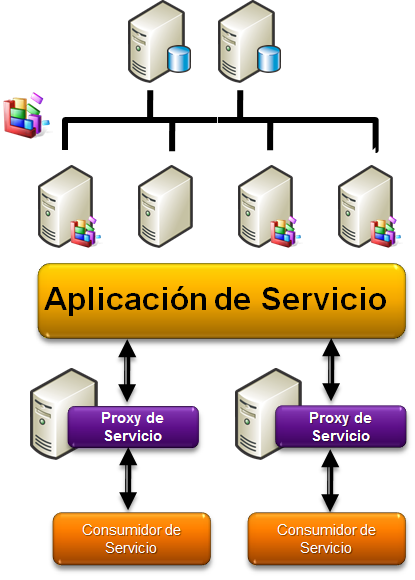
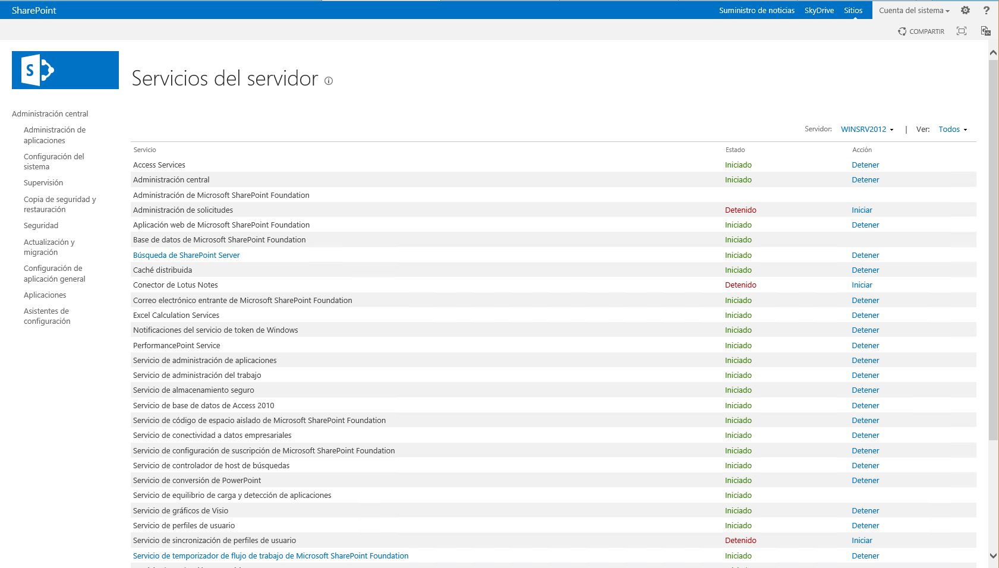
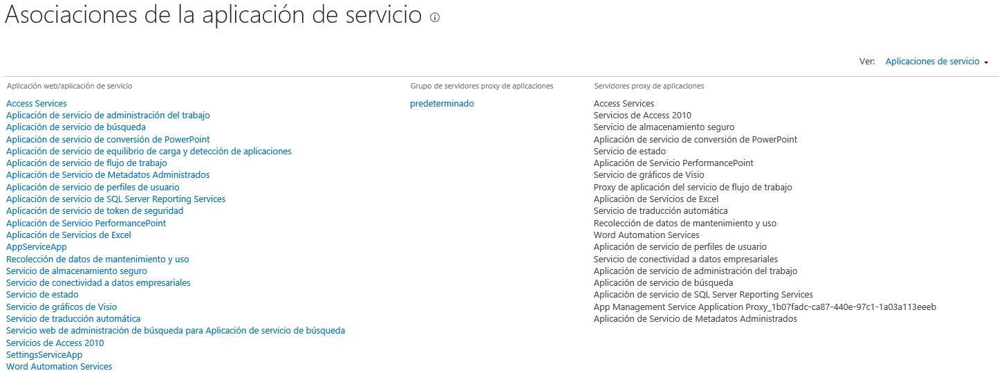
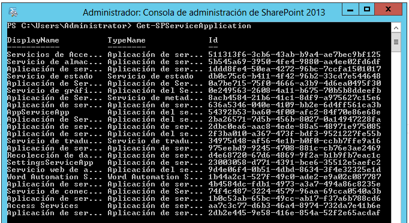
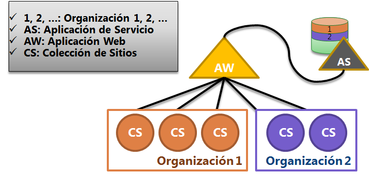
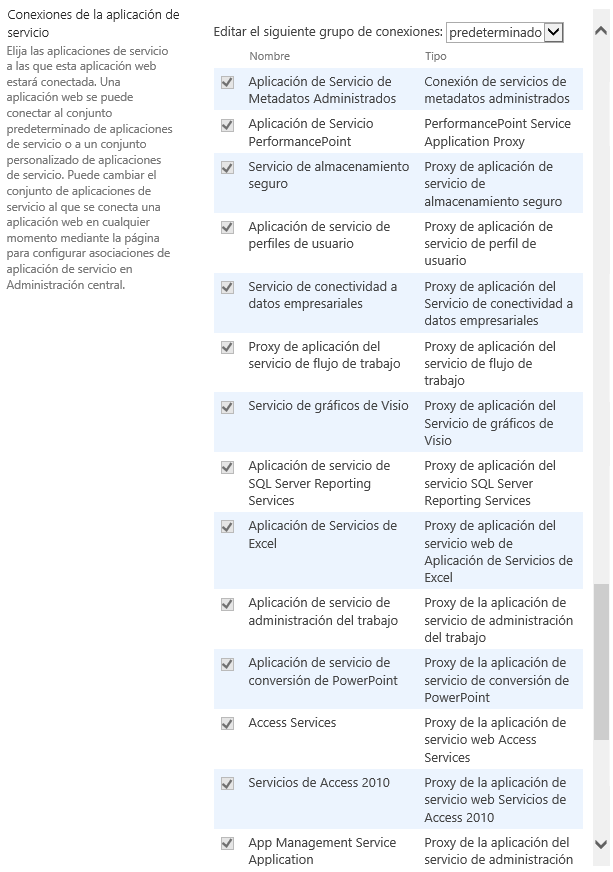
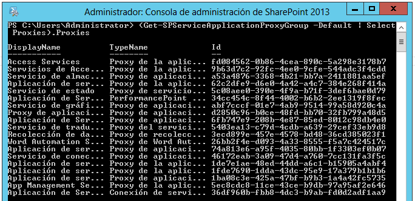

#Aplicaciones de servicio en SharePoint 2013: Introducción y funcionalidad

Gustavo Velez

- MVP de SharePoint.
- Sitio web: <http://www.gavd.net>
- Email: <gustavo@gavd.net>

-------
Juan Carlos González Martín, MVP de SharePoint

- Co-fundador del Grupo de usuarios de SharePoint de España (SUGES,
[www.suges.es](http://www.suges.es)) y del Grupo de usuarios de Cloud Computing de España (CLOUDES)

- Twitter: @jcgm1978.

- Blogs: <http://geeks.ms/blogs/ciin> &
<http://jcgonzalezmartin.wordpress.com/>

--------

Fabian Imaz, MVP de SharePoint

- Director de la carrera SharePoint 2010 en Microsoft Virtual Academy,
<http://www.mslatam.com/latam/technet/mva2/Home.aspx>, y cuenta con
un sitio en CodePlex con varios desarrollos
(<http://siderys.codeplex.com>).

- Twitter: @fabianimaz

- Blog: <http://blog.siderys.com>

--------

Las Aplicaciones de Servicio en SharePoint 2013 constituyen una de las
características más potentes de la plataforma permitiendo modelar una
capa intermedia de servicios que pueden ser compartidos entre múltiples
granjas, a la vez que proporcionan beneficios en términos de
escalabilidad, mantenimiento y extensibilidad permitiendo que los
desarrolladores puedan crear nuevos servicios que complementen los
disponibles de forma nativa en SharePoint 2013.

Descripción y funcionalidad
---------------------------

Las Aplicaciones de Servicio forman parte del núcleo de la plataforma,
suponen un modelo de servicios muy flexible y se caracterizan por su
extensibilidad, su escalabilidad en escenarios de gran demanda. Una
Aplicación de Servicio en SharePoint 2013 viene a ser un servicio de
software ejecutándose en una granja y que se puede vincular “a la carta”
a una o varias Aplicaciones Web. Las Aplicaciones de Servicio están
pensadas para compartir recursos y capacidades entre diferentes sitios y
servidores en la misma granja o incluso en granjas diferentes, siempre
de acuerdo a la arquitectura de software que se haya diseñado. Por
ejemplo, el motor de búsqueda de SharePoint 2013 está basado en la
correspondiente Aplicación de Servicio que se puede compartir entre
diferentes servidores de una misma granja o de otras granjas remotas. De
hecho, en escenarios de despliegue grandes se podría incluso pensar en
una granja dedicada a búsquedas que diese este servicios a otras
granjas. Generalizando esta idea a un escenario de varias granjas que
comparten servicios, podrían diseñarse modelos de servicios como el que
muestra la Figura 1. Dicho esquema muestra un ejemplo de cómo se pueden
consumir Aplicaciones de Servicio de manera específica a cada granja en
particular y como varias granjas pueden consumir una misma aplicación de
servicio.

Figura 1.- Vista lógica de un modelo de servicios basado en
SharePoint 2010

<!-- -->

Como se muestra en la Figura 1, una Aplicación Web puede usar cualquier
Aplicación de Servicio disponible independientemente de que se esté
usando o no en otra Aplicación Web. Además, y como se detalla en la
sección de arquitectura, se pueden definir múltiples instancias de una
misma Aplicación de Servicio que puedan tener propósitos diferentes. Por
ejemplo, se podrían crear dos instancias de la Aplicación de Servicio de
metadatos administrados de manera que la primera se utilizase para
administración de tipos de contenido y la segunda para aspectos
relativos a etiquetado social, uso de palabras clave y navegación.

Arquitectura de las aplicaciones de servicio
--------------------------------------------

Desde el punto de vista de arquitectura de software, una Aplicación de
Servicio (Figura 2) se compone de los siguientes bloques o elementos:

- ***El servicio***, es decir, el programa software (los bits) creado
por un desarrollador y que se instala y despliega en los servidores
de la granja. Normalmente un servicio dispone de componentes propios
relativos a almacenamiento, infraestructura necesaria, etc; y puede
ser hospedado en un servidor de la granja o de manera externa.

- ***La instancia del servicio en la máquina***, es decir, la
aplicación ejecutándose en el servidor de aplicaciones. En el caso
de las aplicaciones de servicio, el servidor de aplicaciones es IIS
(*Internet Information Services*) dónde se despliegan en la forma de
directorios virtuales (garantizando aislamiento a nivel de proceso)
que pueden usar su propio pool de aplicaciones.

- Es posible contar con múltiples instancias de un servicio
ejecutándose en múltiples servidores de aplicaciones de manera que
se aseguren prestaciones adecuadas en términos de escalabilidad,
balanceo de carga o configuración multi-servidor.

- ***La Aplicación de Servicio en sí***, es decir, el elemento lógico
configurado y listo para ser expuesto y consumido.

- ***Proxy de Aplicación de Servicio***, es decir, la referencia o
puntero a la Aplicación de Servicio y que constituye el punto de
entrada a la misma por parte de sus consumidores. El proxy facilita
el acceso a la Aplicación de Servicio y normalmente se usa en los
frontales web de manera que se permita el acceso a la aplicación de
forma transparente.

- ***Consumidores del servicio***, es decir, aquel artefacto que
consume la aplicación y utilizan la lógica del servicio: WebParts,
páginas, comandos PowerShell, etc.

- ***Infraestructura de comunicación***, basada en *Windows
Communication Foundation* (WCF) se caracteriza por ser segura
(sobre http/https) y confiable. El uso de WCF como tecnología de
comunicaciones implica que cada aplicación de servicio expone el
correspondiente endpoint.

- ***Contenedor de datos***, ya que una aplicación de servicio puede
tener vinculada una o más bases de datos (BD). También es posible
crear y disponer de Aplicaciones de Servicio sin una BD vinculada.
Por ejemplo, la Aplicación de Servicio de búsqueda si tiene BDs
vinculadas, mientras que la de Gráficos de Visio no.

----------

Esta arquitectura garantiza la escalabilidad y extensibilidad de una
Aplicación de Servicio en cuanto a qué los consumidores de la misma no
son conscientes en ningún momento de su implementación o funcionamiento.
Toda la interacción y comunicación con una aplicación de servicio se
realiza a través del correspondiente proxy \[2\]. Además, el modelo
permite no sólo exponer aplicaciones de servicio para ser consumidas,
sino consumir otras que esté publicadas en granjas remotas.

Figura 2.- Arquitectura de una Aplicación de Servicio

<!-- -->

Estos componentes son los que un desarrollador debe considerar en el
momento en que necesite diseñar e implementar aplicaciones de servicio
personalizadas. En este sentido, se podrían crear aplicaciones de
servicio personalizadas en escenarios en los que se necesitan compartir
datos de negocio entre múltiples sitios y colecciones de sitios, se
requiere realizar cálculos complejos o aplicar algoritmos específicos
sobre una serie de datos, se necesita facilitar la administración e
integración de operaciones de ejecución larga, etc. En cambio, no sería
necesario recurrir al diseño y desarrollo de una aplicación de servicio
cuando sólo se necesite que la funcionalidad implementada sea específica
a un cierto sitio o colección de sitios.

 Servicios disponibles en SharePoint Foundation 2013 vs SharePoint Server 2013 
-----------------------------------------------------------------------------

De acuerdo a la arquitectura de una Aplicación de Servicio (Figura 2),
el primer componente o bloque de la misma es el servicio. Por defecto,
SharePoint Foundation 2013 y SharePoint Server 2014 disponen de una
serie de servicios tal y como se muestra en la Tabla 1.

|Servicios en SharePoint Foundation 2013|Servicios en SharePoint Sever 2013|
|-----------|------------|
|Administración central.|Access Services.|
|Administración de Microsoft SharePoint Foundation.| Administración central.|
|Administración de solicitudes. |Administración de Microsoft SharePoint Foundation.|
|Aplicación web de Microsoft SharePoint Foundation.| Administración de solicitudes.|
|Base de datos de Microsoft SharePoint Foundation. | Aplicación web de Microsoft SharePoint Foundation.|
|Búsqueda de SharePoint Server. |Base de datos de Microsoft SharePoint Foundation.|
|Caché distribuida.| Búsqueda de SharePoint Server.|
|Conector de Lotus Notes. |  Caché distribuida.|
|Correo electrónico entrante de Microsoft SharePoint Foundation.|Conector de Lotus Notes.|
|Notificaciones del servicio de token de Windows. | Correo electrónico entrante de Microsoft SharePoint Foundation.|
|Servicio de administración de aplicaciones.|Excel Calculation Services.|
|Servicio de almacenamiento seguro. |Notificaciones del servicio de token de Windows.|
|Servicio de código de espacio aislado de Microsoft SharePoint Foundation. | PerformancePoint Service.|
|Servicio de conectividad a datos empresariales.|Servicio de administración de aplicaciones.|
|Servicio de configuración de suscripción de Microsoft SharePoint Foundation. |  Servicio de administración del trabajo.|
|Servicio de controlador de host de búsquedas. | Servicio de almacenamiento seguro.|
|Servicio de equilibrio de carga y detección de aplicaciones.| Servicio de base de datos de Access 2010.|
|Servicio de temporizador de flujo de trabajo de Microsoft SharePoint Foundation.   |Servicio de código de espacio aislado de Microsoft SharePoint Foundation.|
|Servicio web de administración de búsqueda.|Servicio de conectividad a datos empresariales.|
|Servicios configuración del sitio y consulta de búsqueda. | Servicio de configuración de suscripción de Microsoft SharePoint Foundation.|
|Temporizador de Microsoft SharePoint Foundation. |  Servicio de controlador de host de búsquedas|
||Servicio de conversión de PowerPoint|
||Servicio de equilibrio de carga y detección de aplicaciones|
||Servicio de gráficos de Visio|
||Servicio de perfiles de usuario|
||Servicio de sincronización de perfiles de usuario|
||Servicio de temporizador de flujo de trabajo de Microsoft SharePoint Foundation|
||Servicio de traducción automática|
||Servicio del equilibrador de carga de conversiones de documentos|
|| Servicio del iniciador de conversiones de documentos|
||Servicio SQL Server Reporting Services|
||Servicio web de administración de búsqueda|
|| Servicio web de metadatos administrado|
||Servicios configuración del sitio y consulta de búsqueda|
|| Temporizador de Microsoft SharePoint Foundation|
|| Word Automation Services|

Tabla 1.- Servicios disponibles en SharePoint Foundation 2013 vs
SharePoint Server 2013.

Para administrar los servicios disponibles en SharePoint Server 2013 se
disponen de tres posibilidades:

- A través de la Administración Central de SharePoint 2013 y siguiendo la ruta “Configuración del sistema -&gt; Administrar servicios en el servidor”, de manera que se accede a la visa de servicios que se muestra en la Figura 3.

Figura 3.- Listado de servicios disponibles en una instalación típica de SharePoint Server 2013

<!-- -->

        

- Programáticamente utilizando el modelo de objetos de SharePoint. El Listado 1 muestra cómo acceder al conjunto de servicios existentes en una instalación de SharePoint 2013.

- Listado 1.- Acceso a las Aplicaciones de Servicio a partir de los
    servicios disponibles

        Console.WriteLine("Servicios disponibles en el servidor");

        SPFarm spfGranja = SPWebService.ContentService.Farm;

        SPServerCollection scColeccionServidores = spfGranja.Servers;

        foreach (SPServer sServidor in scColeccionServidores)

        {

            SPServiceInstanceCollection sicColeccionInstanciasServicios =
            sServidor.ServiceInstances;

            foreach (SPServiceInstance siInstanciaServicio
            in sicColeccionInstanciasServicios)

            {

            Console.WriteLine(siInstanciaServicio.Service.TypeName);

            }

        }

- A través de la interfaz de línea de comandos el comando
    **Get-SPServiceInsntance**.

    

Aplicaciones de Servicio disponibles en SharePoint Foundation 2013 vs SharePoint Server 2013
--------------------------------------------------------------------------------------------

Tanto el núcleo de la plataforma, Foundation, como la versión de
servidor cuentan con un conjunto pre-definido de Aplicaciones de
Servicio (nativas) que puede ser extendido con aplicaciones de servicios
creadas por terceros. SharePoint 2013 instala y pre-configura un par de
Aplicaciones de Servicio necesarias para el correcto funcionamiento de
toda la infraestructura de Aplicaciones de Servicio: la Aplicación de
Servicio de equilibrio de carga y de detección de aplicaciones y la de
token de seguridad. En cuanto al resto de aplicaciones disponibles por
defecto, se pueden crear y configurar como parte del proceso de
instalación o bien con posterioridad. En el primer caso, el asistente de
configuración de SharePoint o el script PowerShell correspondiente
realizan todo el trabajo. En el segundo, la creación y configuración se
puede realizar de forma completa mediante la interfaz de usuario de la
Administración Central de SharePoint 2013, a través de comandos
PowerShell. En cambio, no es posible realizar el mismo trabajo de forma
programática utilizando el modelo de objetos de servidor de SharePoint.

La Tabla 2 \[1\] muestra las Aplicaciones de Servicio disponibles en
SharePoint Server 2013, particularizando en cada caso si la aplicación
está disponible en el núcleo de la plataforma o no. Para cada aplicación
se recoge la descripción de funcionalidad tal y como aparece en la
Administración Central de SharePoint 2013.

| Aplicación de Servicio | Plataforma  | Descripción|
|----------|-----------|------------|
|  Administración del trabajo   |                                                        SharePoint Server 2013           |                            Proporciona agregación de tareas a través de sistemas de administración del trabajo que prioriza las peticiones recibidas.|
  |Equilibrio de carga y detección de aplicaciones |                                     SharePoint Foundation 2013 y SharePoint Server 2013 |         Permite administrar aplicaciones de servicios, descubrir nuevas instancias de servicio e implementar balanceo de carga para peticiones entre múltiples instancias de servicio.|
  |Aplicación de servicio de token de seguridad |                                        SharePoint Foundation 2013 y SharePoint Server 2013 Server  | Supervisa todo el proceso de autenticación, utilizando WCF para dar seguridad a la comunicación, autenticación y delegación entre los frontales web y los servidores de aplicaciones dónde residen las instancias de los servicios.|
 | Aplicación de servicio de flujo de trabajo                                     |      SharePoint Foundation 2013 y SharePoint Server 2013 Server  | Este servicio conecta SharePoint a un servicio externo de flujo de trabajo|
  |Servicio de perfiles de usuario      |                                                SharePoint Server 2013    |                                   Agrega compatibilidad para Mis sitios, páginas de perfiles, etiquetado social y otras características de sistemas sociales. Algunas de las características que ofrece este servicio requieren una aplicación de servicio de búsqueda y servicios de metadatos administrados para que puedan aprovisionarse.|
 | Servicio de PerformancePoint                                                    |     SharePoint Server 2013                   |                    Suministra las capacidades de PerformancePoint en SharePoint 2013: diseño, creación y despliegue de cuadros de mando, informes, paneles, etc.|
 | Servicios de Excel           |                                                        SharePoint Server 2013               |                        Permite ver e interactuar con archivos de Excel en el explorador web.|
|  Conector de Lotus Notes        |                                                      SharePoint Server 2013                |                       Conector de búsqueda que va a rastrear los datos en servidores Lotus Notes.|
 | Conversión de PowerPoint   |                                                          SharePoint Server 2013             |                          Habilita la conversión de presentaciones PowerPoint a diferentes formatos.|
 | Recolección de datos de mantenimiento y uso                                       |   SharePoint Foundation 2013 y SharePoint Server 2013    |      Recopila los datos de mantenimiento y uso del conjunto de servidores. Permite visualizar varios informes de mantenimiento y uso.|
 | Administración de aplicaciones    |                                                   SharePoint Foundation 2013 y SharePoint Server 2013   |       Permite agregar aplicaciones de SharePoint desde el almacén de SharePoint o desde el catálogo de aplicaciones.|
 | Almacenamiento seguro                                                      |          SharePoint Foundation 2013 y SharePoint Server 2013   |       Proporciona la capacidad de almacenar datos de forma segura (por ejemplo, un conjunto de credenciales) y asociarlos a una determinada identidad o grupo de identidades. Estas identidades son necesarias para otras Aplicaciones de Servicio como es el caso de PerformancePoint.|
 | Conectividad a datos empresariales                             |                      SharePoint Foundation 2013 y SharePoint Server 2013   |       Permite cargar archivos de definición de aplicaciones que describen las interfaces de los sistemas de la línea de negocio de una organización y la forma de acceder a los datos que almacenan.|
  |Servicio de estado                                                        |           SharePoint Foundation 2013 y SharePoint Server 2013   |       Proporciona almacenamiento temporal de los datos de usuario para los componentes de SharePoint.|
 | Servicio de gráficos de Visio                                                    |    SharePoint Server 2013            |                           Habilita la visualización y actualización de diagramas Visio vivos (conectados a fuentes de datos) en el explorador web.|
 | Metadatos administrados                                                        |      SharePoint Server 2013.      |                                Proporciona acceso a jerarquías de taxonomía administradas, palabras clave y a la infraestructura de etiquetado social, así como a publicaciones de Tipos de Contenido en Colecciones de Sitios.|
 | Traducción automática                                                  |              SharePoint Server 2013         |                              Proporciona traducción automática de sitios y archivos.|
 | Servicio web de administración de búsqueda para Aplicación de servicio de búsqueda  | SharePoint Foundation 2013 y SharePoint Server 2013          ||
  |Servicio de Access 2010   |        SharePoint Server 2013     |                                  Habilita la publicación y visualización de aplicaciones Access 2010 en el Explorador Web.|
 | Servicio de Access     |                                                              SharePoint Server 2013           |                            Habilita la publicación y visualización de aplicaciones Access en el Explorador Web.|
  |Word Automation    |                                                                  SharePoint Server 2013       |                                Proporciona un marco para realizar conversiones automáticas de documentos.|

Tabla 2.- Aplicaciones de servicio en SharePoint Foundation 2013 y
SharePoint Server 2013.

Para administrar las Aplicaciones de Servicio se pueden utilizar tres
entornos diferenciados:

- A través de la Administración Central de SharePoint 2013. Por
    ejemplo, se puede ver el lista completo de Aplicaciones de Servicio
    recogido en la Tabla 1 a través de la siguiente ruta:
    “Administración de aplicaciones -&gt; Configurar asociaciones de
    aplicaciones de servicio”. En la página con el listado de
    asociaciones basta con cambiar de la vista “Aplicaciones web” a
    “Aplicaciones de servicio” para obtener el listado de aplicaciones
    completo (Figura 4).

    
Figura 4.- Listado de aplicaciones disponible en una instalación
        de SharePoint Server 2013

- Programáticamente utilizando el modelo de objetos de SharePoint. El
    Listado 2 muestra como listar las Aplicaciones de Servicio
    disponibles en una instalación de SharePoint 2013 a partir de
    acceder a las instancias de servicio disponibles.

    

Listado 2.- Acceso a las aplicaciones de servicio a partir de
        los servicios disponibles

    Console.WriteLine("Aplicaciones de servicio a partir de los servicios");
    SPServiceCollection spscServicios = SPFarm.Local.Services;
    foreach (SPService spServicio in spscServicios)
    {

        if (!(spServicio is SPWebService) && !(spServicio is SPWindowsService))
        {
        Console.WriteLine("- " + spServicio.TypeName);
        SPServiceApplicationCollection spsaColeccionAplicaciones = spServicio.Applications;
        foreach (SPServiceApplication saAplicacionServicio in spsaColeccionAplicaciones)
            {
                Console.WriteLine(" \* " + saAplicacionServicio.Name);
            }
        }
    }

- A través de la interfaz de línea de comandos y los correspondientes
    comandos PowerShell. Para listar las aplicaciones de servicio
    disponibles se utiliza el comando
    **Get-SPServiceApplication** \[3\]. La Figura 5 muestra cómo obtener
    el listado de aplicaciones de servicio disponibles tras ejecutar una
    variante de dicho comando que permite mostrar el Id y nombre de cada
    aplicación disponible.

    

  

Figura 5.- Listado de aplicaciones de servicio obtenido con
        Get-SPServiceApplication

        

El uso de la interfaz de usuario y de PowerShell permite visualizar
todas las Aplicaciones de Servicio disponibles de una forma simple, lo
que con el modelo de objetos no resulta tan directo y requiere de lógica
adicional para discriminar las Aplicaciones de Servicio del resto de
servicios disponibles. Esta diferencia es debida, sobre todo en el caso
de PowerShell, a que se utilizan métodos de tipo internal que no se
pueden usar con el modelo de objetos de SharePoint.

Segmentación de aplicaciones de servicio
----------------------------------------

SharePoint 2013 incorpora en su arquitectura el concepto de
Multi-Tenancy el cuál se pude definir como el conjunto de técnicas y
mecanismos para conseguir aislamiento a nivel de datos, a nivel de
servicios y de administración sobre una misma base. En este sentido, la
implementación de Multi-Tenancy en SharePoint 2013 dispone de
aislamiento en los siguientes niveles \[4\]:

- ***Datos***, lo que implica que los datos de cada cliente u
    organización deberían estar aislados o segmentados. Se trata de
    asegurar que los datos de cada cliente no puedan ser utilizados por
    los demás comenzando a nivel de colección de sitios y llegando a
    nivel de granja.

-     ***Uso***, es decir, como se exponen datos, servicios y datos de los
    servicios a cada organización de forma individual.

-     ***Administración***, como administrar los servicios,
    personalizaciones y datos que se exponen a los usuarios de una forma
    aislada y asegurando que no se produce ningún tipo de interferencia
    entre usuarios de organizaciones diferentes. En definitiva, se trata
    de ofrecer capacidades de administración delegada a
    cada organización.

-    ***Personalizaciones***, es decir, garantizar que las
    personalizaciones de una organización no son visibles para
    otra organización.

-     ***Operaciones***, se trata de medir cuando, cuanto y como se están
    usando los datos y servicios.

    

Como se puede deducir de estos niveles de aislamiento, la idea de
Multi-Tenancy en SharePoint 2013 se puede equiparar a proporcionar una
serie de servicios a usuarios pertenecientes a organizaciones o clientes
diferentes sobre una infraestructura común asegurando que los datos
están perfectamente aislados, que las personalizaciones realizadas se
aplican por organización y que se dispone de capacidades de
administración y operación específicas a cada una de ellas. El concepto
de Multi-Tenancy no es nuevo y se ha venido aplicando tradicionalmente
en escenarios de hosting de aplicaciones y servicios o de despliegues
corporativos On-Premise. En el mundo de SharePoint, la aplicación más
clara de Multi-Tenancy se puede encontrar en SharePoint Online en Office
365.

Precisamente las Aplicaciones de Servicio en SharePoint 2013 son uno de
los pilares sobre los que se asienta la implementación Multi-Tenancy
particular junto con otros elementos clave como la autenticación basada
en notificaciones, la capacidad de segmentar datos y servicios o las
capacidades de administración y operación presentes en la plataforma. De
esta forma, es posible modelar escenarios como el que se detalla en la
Figura 6 en el que cada organización convive de forma aislada en un
entorno compartido.

Figura 6.- Escenario típico de Multy-Tenancy en SharePoint 2013

<!-- -->

    

Como se aprecia en la Figura 6, el escenario planteado se caracteriza
por disponer de una serie de colecciones de sitios creadas en una
Aplicación Web. Estas colecciones presentan la particularidad de que se
han segmentado por organización gracias al mecanismo de suscripción
disponible en SharePoint 2013 que permite agrupar varias colecciones de
sitios en un mismo identificador de suscripción y asociar dicha
suscripción a una organización. Los datos se están dividiendo a nivel de
granja gracias a este identificador de suscripción, de manera que varios
suscriptores pueden coexistir en la misma Aplicación Web y en la misma
granja. La ventaja de esta aproximación es que es mucho más escalable
que la alternativa de realizar el aislamiento a nivel de Aplicación Web.
El principal inconveniente es que se dispone de un único archivo
web.config compartido por todos los suscriptores. La Aplicación Web está
asociada a una o varias Aplicaciones de Servicio y estas utilizan el
identificador de suscripción para determinar a qué organización
pertenecen los datos. Por ejemplo, si un usuario intenta realizar una
búsqueda sólo visualizará resultados pertenecientes a las colecciones de
sitios de la organización a la que pertenece.

De la misma forma que se pueden segmentar los datos, es posible
configurar las Aplicaciones de Servicio para que sirvan a múltiples
organizaciones de una forma completamente aislada. Para ello, es
necesario crear y configurar en modo segmentado tanto la aplicación de
servicio como el proxy o proxies correspondientes a través de PowerShell
(lo que no es posible mediante el modelo de objetos). A la hora de
segmentar Aplicaciones de Servicio es importante tener en cuenta los
siguientes puntos:

- Si se decide configurar una Aplicación de Servicio para que sirva a
    varias organizaciones, no es posible revertir dicha configuración.
    Lo mismo sucede en un escenario sin Multi-Tenancy.

-     Tiene sentido segmentar aquellas Aplicaciones de Servicio que vayan
    a almacenar o exponer datos de múltiples organizaciones, aunque hay
    ciertas aplicaciones que no cumplen esta idea.

-     No todas las Aplicaciones de Servicio disponibles se
    pueden segmentar.

-     La arquitectura de las Aplicaciones de Servicio de SharePoint 2013
    es suficientemente flexible como para permitir modelar escenarios en
    los que se disponga de algunas aplicaciones de servicio segmentadas
    y otras sin segmentar.

    

La Tabla 3 muestra las aplicaciones de servicio categorizadas en función
de si se pueden segmentar o no.

  
 | Aplicaciones de servicio segmentables   |Aplicaciones de servicio no segmentables|
 | -------------------------- |---------------------------|
 | Administración de aplicaciones.     |    Recolección de datos de mantenimiento y uso.|
 | Administración del trabajo. |            PerformancePoint.|
|  Búsqueda.           |                    Estado.|
|  Perfiles de Usuario.     | Gráficos de Visio.|
|  Conectividad a Datos Empresariales. |    Access.|
|Metadatos Administrados.  |              Excel.|
| Almacenamiento Seguro.    |              Token de Seguridad.|
|  Automatización de Word.   |              Equilibrio de carga y detección de aplicaciones.|
|  Traducciones.      |                     Registro de aplicaciones.|
  

Tabla 3.- Aplicaciones de Servicio segmentables vs no segmentables.

Agrupaciones de Aplicaciones de Servicio: Grupos de proxy de Aplicaciones de Servicio
-------------------------------------------------------------------------------------

En SharePoint 2013, las Aplicaciones Web consumen a la carta una o
varias Aplicaciones de Servicio. Cuando se configuran estas, es posible
agruparlas o asociarlas a través de los denominados “Grupos de
servidores proxy”. Por defecto, existe una asociación denominada
“predeterminado” (creada automáticamente durante el proceso de
instalación) a la que se agregan todas las Aplicaciones de Servicio
existentes en el caso en el que se haya utilizado el asistente de
configuración. En cambio, es posible elegir la agrupación a asignar en
el caso en el que la Aplicación de Servicio se cree manualmente. Esta
agrupación “predeterminado” es la que se vincula a cada nueva Aplicación
Web creada salvo que se utilice el grupo “personalizado” que permite
elegir que aplicaciones se van a vincular en lugar de vincular todas las
existentes. La Figura 7 muestra el último escenario comentado.

Figura 7.- Uso de la agrupación “personalizada” en la creación de
    una Aplicación Web

<!-- -->

    

Para listar las Aplicaciones de Servicio incluidas dentro de un grupo de
servidores proxy se puede utilizar la interfaz de usuario siguiendo el
camino reflejado en la Figura 4 y la vista por defecto, mediante la
interfaz de línea de comandos y PowerShell o bien mediante el modelo de
objetos. El Listado 3 muestra como listar las aplicaciones de servicio
disponibles en una instalación de SharePoint 2013 para cada agrupación
de aplicaciones de servicio disponible en la granja.

Listado 3.- Obtener el listado de Aplicaciones de Servicio para una
    cierta agrupación.

<!-- -->

    Console.WriteLine("Aplicaciones de servicio pro grupo de Proxies en
    la granja");
    SPServiceProxyCollection spColeccionProxies =
    SPFarm.Local.ServiceProxies;
    foreach (SPServiceProxy spProxy in spColeccionProxies)
    {

        SPServiceApplicationProxyCollection sapcSAColeccionProxies = spProxy.ApplicationProxies;
        foreach (SPServiceApplicationProxy spSAProxy in sapcSAColeccionProxies)
        {
            Console.WriteLine("- " + spSAProxy.DisplayName);
        }
    }

El Listado 4 muestra la secuencia PowerShell que permite obtener el
listado de proxies de aplicaciones de servicios para la agrupación
predeterminado utilizando el comando Get-SPServiceApplicationProxyGroup.

    (Get-SPServiceApplicationProxyGroup -Default | Select Proxies).Proxies

Listado 4.- Obtener el listado de aplicaciones de servicio para una
cierta agrupación mediante PowerShell.

La correspondiente salida por pantalla se recoge en la Figura 8.

Figura 8.- Listado de aplicaciones de servicio para una cierta
    agrupación

<!-- -->

    
En cambio, para crear un nuevo grupo únicamente podremos utilizar
PowerShell o el modelo de objetos. En el primer caso, utilizaremos el
comando PowerShell New**-SPServiceApplicationProxyGroup** \[5\]
utilizando la sintaxis que se muestra en el Listado 5.

    New-SPServiceApplicationProxyGroup "Mi Grupo Personalizado"

Listado 5.- Creación de un nuevo grupo de proxies de aplicaciones de
servicio.

Como resultado de la ejecución del comando anterior en la consola de
administración de SharePoint 2013 se muestra el grupo creado, los
proxies que incluye (inicialmente cero) y los proxies por defecto
(también cero). Para visualizar los proxies incluidos en el grupo de
aplicaciones de servicio “predeterminado” basta con ejecutar el comando
**Get-SPServiceApplicationProxyGroup** (Listado 6).

    Get-SPServiceApplicationProxyGroup -Default

Listado 6.- Acceso a los proxies del grupo “predeterminado” de
SharePoint 2013.

Uso de Aplicaciones de Servicio entre diferentes granjas
--------------------------------------------------------

Como se ha comentado en secciones previas, las Aplicaciones de Servicio
pueden dar servicio a una o varias granjas de SharePoint 2013 aportando
un componente de re-utilización de las mismas entre varias granjas y
permitiendo incluso modelar despliegues de SharePoint 2013 en los que se
defina una granja centralizada de Aplicaciones de Servicio que den
servicio al resto de granjas \[6\] y \[7\]. Esta re-utilización o
compartición de datos y servicios es posible gracias a la
infraestructura de servicios WCF sobre la que están construidas las
Aplicaciones de Servicio. Son estos servicios los que facilitan que se
puedan consumir Aplicaciones de forma remota sin tener permisos sobre
los datos de origen, optimizando el uso de recursos y evitando
redundancias innecesarias.

El modelo consumo y publicación de Aplicaciones de Servicio permite que
cualquier granja de SharePoint 2013 pueda ser a la vez consumidora y
publicadora de aplicaciones, lo que aporta una característica de
flexibilidad muy interesante a la hora de diseñar e implementar granjas
de SharePoint. Sin embargo, no todas las Aplicaciones de Servicio
disponibles por defecto se pueden compartir entre granjas. La Tabla 4
muestra que Aplicaciones de Servicio se pueden publicar y cuáles no.

  
|Aplicaciones de servicio segmentables    |                                             Aplicaciones de servicio no segmentables|
|-------|--------|
 | Perfiles de Usuario.  |                                                                Access 2010.|
 | Metadatos Administrados.   |                                                           Access 2013.|
 | Búsqueda.                                                     |                        Gráficos de Visio.|
 | Catálogo de Datos Profesionales.   ||
 |Almacenamiento Seguro.     ||
 | Administración del Trabajo.      |                                                    Conversión de PowerPoint.|
|Equilibrio de carga y detección de aplicaciones. |                                     Excel.|
|Token de seguridad.    |                                                               Automatización de Word.|
|Administración de Aplicaciones.  |                                                     PerformancePoint.|
|  Traducción Automática.  |Estado.|
|  Servicio web de administración de búsqueda para Aplicación de servicio de búsqueda.  |  Recolección de datos de mantenimiento y uso.|
|  Flujo de trabajo.   ||                                                                  
------------------------------------------------------------------------------------------------------------------------------------

Tabla 4.- Aplicaciones de servicio compartibles vs no compartibles.

El proceso de publicación de una Aplicación de Servicio para que pueda
ser consumida de forma remota puede realizarse a través de la interfaz
de usuario, de forma programática o bien utilizando el modelo de objetos
de SharePoint. Este proceso implica seguir una serie de pasos
obligatorios y en el orden que a continuación se indica \[6\]:

- Intercambiar certificados de confianza entre la granja publicadora y
    la granja consumidora para establecer la correspondiente relación
    de confianza.

-     En la granja publicadora, publicar la Aplicación de Servicio para
    que se pueda consumir de forma remota.

-     En la granja consumidora dar permisos a la Aplicación de Servicio
    “Aplicación de servicio de equilibrio de carga y detección de
    aplicaciones” de la granja publicadora. A continuación, dar permisos
    en la granja consumidora a la Aplicación de Servicio que va
    a consumir.

-    Conectar la granja consumidora al servicio remoto.

-    Añadir la aplicación de servicio compartida al grupo o grupos de
    proxies de Aplicaciones de Servicio en la granja consumidora.

    

Conclusiones
------------

Las Aplicaciones de Servicio emergen en SharePoint 2013 como un
componente fundamental que facilita:

- El diseño y despliegue de arquitecturas basadas en SharePoint 2013
    caracterizadas por la escalabilidad, la flexibilidad y una
    administración y mantenimiento simplificado.

-     Compartir datos y servicios a la carta a nivel de Aplicación Web.

-     El modelado de escenarios Multy-Tenancy garantizando aislamiento a
    todos los niveles: datos, servicios, personalización,
    administración, etc.

-     Un framework extensible que habilita la creación de nuevas
    aplicaciones que extienda las disponibles por defecto en SharePoint.

    

Adicionalmente, las Aplicaciones de Servicio se pueden consumir desde
granjas remotas de forma que se optimiza el uso de recursos, se evita
redundancia y se habilitan escenarios en los que es posible definir una
granja centralizada de aplicaciones de servicio que den asistencia a
otras granjas.

Referencias
-----------

\[1\] G. Vélez, J.C. González y F.Imaz. *SharePoint 2013 de principio a
fin*. Editorial Krasis Press, febrero de 2013.

\[2\] P. Pialorsi. *Microsoft SharePoint 2010 Developer Reference.*
Editorial Microsoft Press.

\[3\] J.C. González. *Como listar las aplicaciones de servicio con
PowerShell.* Artículo disponible online en:
<http://geeks.ms/blogs/ciin/archive/2011/07/14/sharepoint-2010-como-listar-las-aplicaciones-de-servicio-con-powershell.aspx>

\[4\] S. Harbar. *Multi Tenancy with SharePoint 2013: What’s new and
changed*. Artículo disponible online en:
http://www.harbar.net/articles/sp2013mt.aspx.

\[5\] B. Cartmei. *Create a new Service Application Proxy Group with
New-SPServiceApplicationProxyGroup.* Artículo disponible online en:
<http://sharepintblog.com/2011/06/06/create-a-new-service-application-proxy-group-with-new-spserviceapplicationproxygroup/>.

\[6\] Share service applications across farms in SharePoint 2013.
Disponible online en:
<http://technet.microsoft.com/en-us/library/ff621100.aspx>.

\[7\] *Publish services applications in SharePoint 2013)*. Disponible
online en: <http://technet.microsoft.com/en-us/library/ee704545.aspx>.

